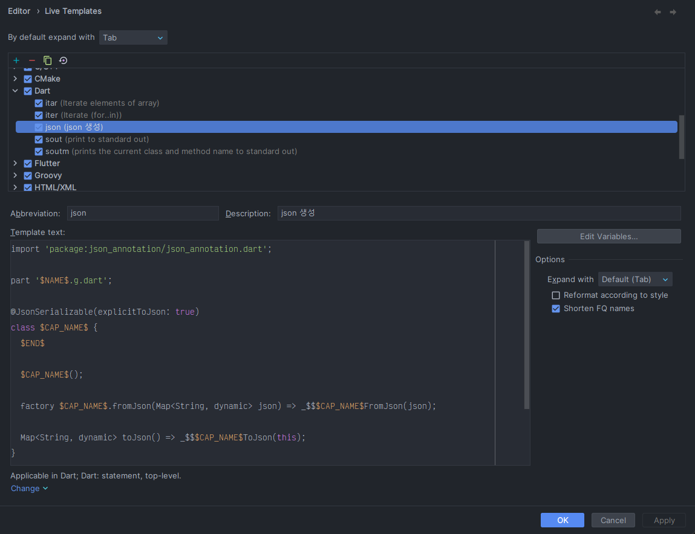

# JSON Serializable

json_serializable 패키지는 DTO 가 필요없을 때 Data Class 의 생성과 json 데이터의 key 매핑을 편하게 하기 위해서 사용하는 패키지 이다.

## 설치

```bash
flutter pub add json_annotation dev:build_runner dev:json_serializable
```

## 사용 방법

json_serializable 을 편하게 사용하기 위해서 Android Studio 에서 Live Templates 를 등록하면 손쉽게 사용가능하다.

```dart
import 'package:json_annotation/json_annotation.dart';

part '$NAME$.g.dart';

@JsonSerializable(explicitToJson: true)
class $CAP_NAME$ {
  $END$
  
  $CAP_NAME$();
  
  factory $CAP_NAME$.fromJson(Map<String, dynamic> json) => _$$$CAP_NAME$FromJson(json);
  
  Map<String, dynamic> toJson() => _$$$CAP_NAME$ToJson(this);
}
```

Andriod  Studio 설정에서 `Setting > Editor > Live Templates`  으로 이동하여 위 템플릿을 등록한다.




Live Template 를 등록한 후 빈 Dart 파일을 생성해 `json` 을 입력하면 다음과 같이 자동완성이 표시된다.


자동 완성 시켰을 때 다음과 같이 템플릿이 입력 된다.


다음으로 Data Class 명을 입력하면 다음과 같이 입력이 된다.


Data Class 이기 때문에 필드명과 Named Parameter Constructor 를 생성해 주어야 한다.


만약 실제로 가져오는 JSON 데이터와 Data Class 필드명의 차이가 있다면 `@JsonKey`  를 이용해 필드와 Json Key 를 매핑해 준다.


위와 같은 준비를 마쳤다면 아래 명령어를 실행해 실제 toJson, fromJson 코드를 자동으로 생성해야 한다.

```bash
dart run build_runner build
```


`.g.dart` 로 생성된 파일은 Data Class 에서 입력한 코드로 자동생성 되는 것이기 때문에 수정하지 않는 것이 원칙이다.

이렇게 생성된 Data Class 수동으로 생성한 Data Class 와 동일하게 사용이 가능하다.
