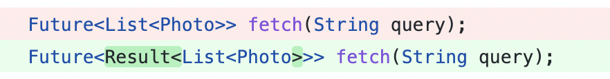

# Result 패턴

## 개요

서버에 데이터 요청 시 예상 되는 상황

- 성공 (Success)
- 실패 (Error, Failure)
  - 네트워크 미연결
  - 네트워크 불안정으로 타임아웃 발생

기존의 try - catch 를 활용한 에러처리는 런타임에러 뿐 아니라 논리적인 오류나 여러 예외상황에 대해 처리를 하기에 부족함

Result 패턴을 이용하여 성공 또는 실패 케이스와 예외 상황에 대한 처리에 유용하게 사용할 수 있음

## 문법

```dart

sealed class Result<T> {
 factory Result.success(T data) = Success;

 factory Result.error(Exception e) = Error;
}

class Success<T> implements Result<T> {
 final T data;

 Success(this.data);
}

class Error<T> implements Result<T> {
 final Exception e;

 Error(this.e);
}
```

Dart 에서 Result 패턴은 `sealed` 키워드를 이용하여 구현함.

Result  패턴은 성공 시에 반환하려는 데이터를, 실패 시에는 Exception(또는 String) 을 담는 객체를 정의한다.

성공과 실패 외에도 반환 케이스를 추가시켜 사용할 수 있음

`sealed` 클래스를 타입봉인 효과를 가짐 (enum 과 유사한 효과, 다른 객체의 참조를 가질 수 있음)

## 사용법



> Result 패턴을 도입하는 곳에서 응답객체를 Result 클래스로 래핑하여 반환값으로 사용함.

```dart
class PhotoRepositoryImpl implements PhotoRepository {  
  final PhotoApi _api;  
  
  PhotoRepositoryImpl({PhotoApi? api}) : _api = api ?? PhotoApiImpl();  
  
  @override  
  Future<PhotoResult<List<Photo>>> findPhotosByKeyword(String keyword) async {  
    final List<Photo> photos;  
    try {  
      if (keyword == '바보') {  
        return PhotoResult.error('비속어를 사용할 수 없습니다');  
      }  
  
      final photoDtoList = await _api.getPhotos(keyword);  
      photos = photoDtoList.map((e) => e.toPhoto()).toList();  
  
      return PhotoResult.success(photos);  
    } catch (e) {  
      return PhotoResult.error('알 수 없는 네트워크 에러');  
    }  
  }  
}
```

> 예외가 예상되는 지점에서 try-catch 를 사용하여 성공, 실패 케이스에 대한 기본적인 처리를 한다.

```dart
final repository = PhotoRepositoryImpl();

final photosResult = await repository.findPhotosByKeyword('horror');

switch (photosResult) {
 case Success<List<Photo>>():
  print('성공: ${photosResult.data.toString()}');
 case Error<List<Photo>>():
  print('실패: ${photosResult.message}');
}
```

> enum 과 동일하게 switch 문과 조합하여 모든 처리를 강제 할 수 있다.

# Freezed

> Freezed = json_serializable + Equatable + Immutable

- toJson / fromJson 함수를 제공해 json 으로 쉽게 serialize / deserialize 할 수 있도록 돕는다.
- equals(\==) 와 hashCode를 자동으로 작성해 준다
- 선언된 필드들의 getter 를 자동으로 만들어서 외부에서 값을 변경할 수 없게 한다.
- copy와 copyWith 을 자동으로 작성 구현 해 주고, 종속성을 가지는 하위 클래스들에 대해서도 쉽게 deepCopy 할 수 있도록 도와준다.
- sealed class 작성을 편하게 해준다.

## 설치

> 기본 설치

```bash
dart pub add freezed_annotation
dart pub add dev:build_runner
dart pub add dev:freezed
```

> fromJson(), toJson()  구현하기 위해서 추가로 설치 (옵션)

```dart
dart pub add json_annotation
dart pub add dev:json_serializable
```

## 사용법

> Freezed 를 활용한 sealed 클래스 v1

```dart
import 'package:freezed_annotation/freezed_annotatoin.dart';

part 'result.freezed.dart';

@freezed
sealed class Result<T> with _$Result<T> {
const factory Result.success(T data) = Success;
const factory Result.error(Exception e) = Error;
```

> freezed 를 사용하지 않고 구현했을 때 다음과 같음

```dart
sealed class Result<T> {  
  factory Result.success(T data) = Success;  
  
  factory Result.error(String message) = Error;  
}  
  
class Success<T> implements Result<T> {  
  final T data;  
  
  Success(this.data);  
}  
  
class Error<T> implements Result<T> {  
  final String message;  
  
  Error(this.message);  
}
```

> Freezed 를 활용한 sealed 클래스 v2

```dart
import 'package:freezed_annotation/freezed_annotatoin.dart';

part 'result.freezed.dart';

@freezed
sealed class Result<D, E> with _$Result<D, E> {
const factory Result.success(D data) = Success;
const factory Result.error(E error) = Error;
```

D: 데이터  
E: 에러

v1 : Exception 만 처리  
v2 : 원하는 에러 타입 정의 가능

## 사용예시

```dart
// 성공시 : List<Todo> 리턴
// 실패시 : String 에러메세지를 리턴
Future<Result<List<Todo>, String> getTodos();

// 성공시 : Todo 리턴
// 실패시 : Exception 객체를 리턴
Future<Result<Todo, Exception>> getTOdo(int id);
```

> Respository 에서의 에러처리

```dart
class PhotoRepositoryImpl implements PhotoRepository {  
final PhotoApi _api;  

PhotoRepositoryImpl(this._api);  

@override  
Future<Result<List<Photo>>> getPhotos() async {  
 final List<Photo> photos;  
 try {  
  final List<PhotoDto> photoDtoList =
  await _api.getPhotoList().timeout(Duration(seconds: 10));
  return Result.success(PhotoDtoList.map((e) => e.toPhoto().toList()));
 } on TimeoutException {
  return Result.error(NetworkError.requestTimeout);
 } catch (e) {  
  return Result.error(NetworkError.unknown);
 }  
  }  
}
```

> main 함수에서 에러처리

```dart
void main() async {  
  final photoRepository = PhotoRepositoryImpl(PhotoApiImpl());  
  
  final result = await photoRepository.getPhotos();  
  
  switch (result) {  
    case Success<List<Photo>, NetworkError>():  
      print(result.data);  
    case Error<List<Photo>, NetworkError>():  
      {  
        switch (result.error) {  
        case NetworkError.requestTimeout:  
        print('타임 아웃');  
        case NetworkError.unknown:  
        print('알 수 없는 네트워크 에러);  
  
        }  
      }  
  }  
}
```

---

# 정리

- enum 은 class 만큼 자유롭지 않다.
  - equals, hashCode 재정의가 불가능
- sealed class 는 서브타입을 봉인한다.
- sealed class 패턴매칭을 활용하여 모든 서브타입에 대한 처리를 하기 용이하다.
- Result 패턴은 여러가지 종류의 성공과 실패를 처리하기 용이한 패턴이다.
- 앱의 규모에 맞는 Result 패턴을 사용하면 된다.
  - 소규모 : ver1
  - 다국어 지원 : ver2
