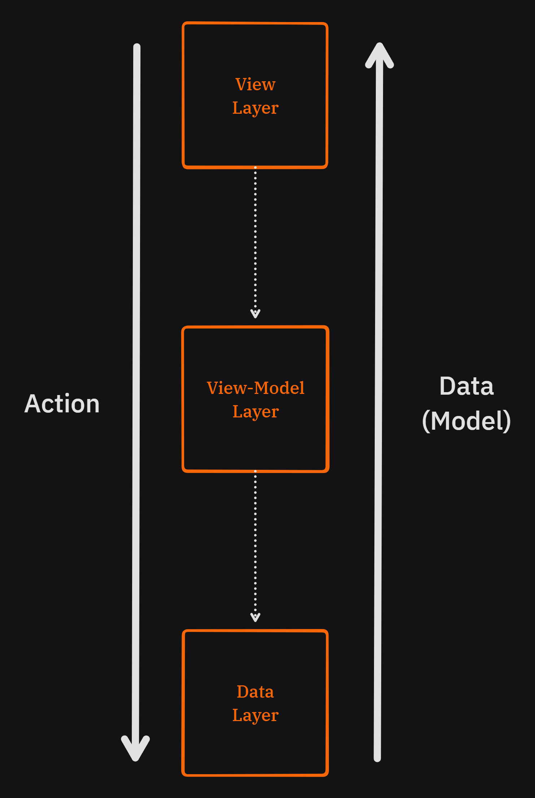

## MVVM 패턴

기존의 Model - Api - Reository 구조에서 프로그램의 규모가 커질수록 Repository 에서 수행하는 작업을 추상화 하는 비즈니스 로직 클래스가 필요함

![[240408_business_logic_class.png]]

Repository는 기본적인 CRUD (Create, Read, Update, Delete) 만 구현하고 View 에서 필요한 기능들을 실제로 구현하는 Layer 가 필요함

## MVVM 개요

flutter, Andriod, iOS 로 앱 개발을 할 때 기본적으로 필요한 구조와 기능이 있으며 앱의 확장성과 유지보수를 고려해서 아키텍쳐를 적용하는 것이 중요하다.

MVVM 패턴은 현재 모바일 앱에서 가장 적합한 아키텍쳐이다

![[240408_mvvm_introduction.png]](/03.Flutter/_resources/240408_mvvm_introduction.png)

## 각 레이어의 역할

> <https://learn.microsoft.com/ko-kr/dotnet/architecture/maui/mvvm>

![[240408_layer_role.png]](/03.Flutter/_resources/240408_layer_role.png)

MVVM 패턴에서

- **View**
  - 사용자와 가장 가까운 Layer
  - ViewModel 의 데이터를 가지고 사용자에게 표현
  - ViewModel 의 데이터가 변경될 때 화면 갱신
- **ViewModel**
  - 앱에서 필요한 비즈니스 로직이 위치한 Layer
  - 변경 가능한 데이터를 가지고 있음
  - View 가 ViewModel 가 가지고 있는 데이터(상태)를 사용 , 데이터가 변경될 때 View 에게 알림
- Model
  - 데이터와 관련된  비즈니스 로직(CRUD)이 위치한 Layer
  - DB, 파일, 서버와 통신을 담당
  - 주로 Repository 가 역할을 담당  
   (DataSource, API 도 있지만 ViewModel 에게 데이터를 전달하는 역할이기 때문에)

## Data 와 Action 의 흐름 관계



MVVM 아키텍쳐의 핵심

- 단방향 의존성
- Action 과 Data의 명확하고 일관된 흐름

## ViewModel 의 역할

모델 (일반적으로 Repository) 에서 제공한 데이터를 UI로 표시하기 쉬운 형태로 변환해주는 역할  
(복잡한 로직을 View 가 알지 못하도록 숨김)

**여러가지 상태(변수)를 캡슐화**

- 화면에 표시할 데이터
- 로딩 상태 등
- 기존에 View 에서 사용하던 상태(변수) 를 ViewModel 이 가지게 됨

**View 에서 발생하는 Action(이벤트) 처리의 캡슐화**

- 기존에 View에서 Repository 로 요청하던 흐름을 사용자 동작에 더 적합한 비즈니스 로직을 가진 ViewModel 로 변경
- View 는 비즈니스 로직을 가진 ViewModel 의 정확한 구현에 대해 몰라도 됨, ViewModel 에서 비즈니스 로직을 통해 변경한 데이터를 가지고 UI를 구성

> **ViewModel 은 한 화면에 대해 하나의 ViewModel 을 가지도록 함**  
>
> **화면 하나에 대한 비즈니스 로직을 가지는 하나의 ViewModel**
>
> **단, ViewModel 은 필요에 따라 여러개의 Repository를 사용함**

---

## ChangeNotifier

> <https://api.flutter.dev/flutter/foundation/ChangeNotifier-class.html>

Flutter 에서 제공하는 옵저버(Observer) 패턴을 구현하고 있는 상태 알림이

- notifyListener() 를 호출하여 변경사항을 알림
- 데이터 바인딩 구현의 핵심

## 사용법

### 1. ViewModel 클래스 작성

```dart
class TodoViewModel with ChnageNotifier {
 final TodoRepository _todoRepository;

 TodoViewModel(this._todoRepository);
}
```

- ChangeNotifier mixin 을 가지는 한 화면을 위한 ViewModel 을 작성
- 로직에 사용할 데이터를 요청할 Repository 들을 생성자를 통해 주입 받도록 작성

### 2. 화면에 표시할 데이터(상태) 들을 캡슐화

```dart
class TodoViewModel with ChnageNotifier {
 final TodoRepository _todoRepository;
 List<Todo> _todos = [];
 bool isLoading = false;

 TodoViewModel(this._todoRepository);

 List<Todo> get todos => List.unmodifiable(_todos);

 bool get isLoading => _isLoading;
}
```

- 화면에 표시할 데이터(상태) 는 mutable 이므로 final 을 사용하지 않음
- 대신에 private 변수로 만든 후 View에서 접근 할 수 있도록 getter 을 선언함

### 3. View에서 필요로 하는 데이터를 변경하는 비즈니스 로직 작성

```dart
class TodoViewModel with ChnageNotifier {
 ...
 void fetchTodos() async {
  _todos = await _todoRepository.getTodos();
  notifyListener();
 }
}
```

- View에서 필요한 데이터를 반환하는 비즈니스 로직을 작성
- 메소드 내부에서 async-await 을 사용하고 있지만 **View로 직접적으로 데이터를 전달하지 않기 때문**에 메소드의 반환값은 **void**
- notifyListeners() 를 통해 데이터(상태) 가 변경 되었을 때 해당 ViewModel의 데이터를 사용하는 View로 데이터의 변경을 고지, UI 갱신을 알림

### 4. View 에서 ViewModel 을 적용

```dart
class TodoScreen extends StatefulWidget {
 final TodoViewModel viewModel;

 const TodoScreen({
  super.key,
  required thsi.viewModel,
 });

 @override
 State<TodoScreen> cerateState() => _TodoScreenState();
}
```

- ViewModel 을 사용할 View 에서 생성자를  통해 ViewModel 을 주입

### 5. View 에서 View Model 의 상태를 관찰(Observe) 하도록 적용

```dart
class _TodoScreenState extends State<TodoScreen> {
 void updateUI() => setState(() => {});

 @override
 void initState() {
  super.initState();

  widget.viewModel.addListener(updateUI);
 }
}
```

- State 클래스에서 ViewModel 의 상태 변경에 따라 자동으로 setState() 가 호출되도록 적용

```dart
class _TodoScreenState extends State<TodoScreen> {
 ...
 @override
 void dispose() {
  widget.viewModel.removeListener(updateUI);
  super.dispose();
 }
}
```

- 화면이 종료 될 때 ViewModel 에 대한 observe 를 제거하도록 적용
- 메모리 Leak 이 발생될 수 있기 때문에 이 단계는 필수

### 6. View 에서 ViewModel 의 데이터(상태)를 사용

```dart
@override
Widget build(BuildContext context) {
 final viewModel = widget.viewModel;

 return Scaffold(
  body: Column(
   children: [
    ElelvatedButton(
     onPressed: () => viewModel.fetchTodos(),
     child: const Text('데이터 가져오기')
    ),
    ...viewModel.todos.map((e) => Text(e.title)),
   ]
  )
 )
}
```

- `final viewModel = widget.viewModel`
  - StatefulWidget 에서 주입된 viewModel 을 편하게 사용하기 위해 build 메소드 내부에서 변수에 담아서 사용
- `onPressed: () => viewModel.fetchTodos()`
  - 사용자 액션(onPressed)시 ViewModel 의 함수를 호출하여 ViewModel 이 가지는 데이터(상태)의 값을 변경
- `...viewModel.todos.map((e) => Text(e.title))`
  - ViewModel 에서 getter 로 제공하는 데이터(상태) 를 활용하여 UI를 작성

---

## 정리

- 모바일 앱을 개발하는데 MVVM 패턴이 가장 유연하고 알맞다.
- ViewModel 은 View에게 데이터(상태)를 제공하고, View 는 ViewModel 의 데이터(상태) 를 가지고 UI를 구성한다.
- ChangeNotifier 를 이용하여 View 가 관찰(observe) 할 수 있는 데이터(상태) 를 가진 ViewModel 를 구현한다.
- ChangeNotifier 는 notifyListener() 를 호출하여 관찰자 에게 상태의 변경을 알린다.
- ViewModel 의 상태 변경에 따라 setState() 를 자동으로 호출하도록 해 UI를 갱신하게 함
- 위와 같은 방식을 **"상태관리"** 라고 한다.

---

initStatedhk rkxdms 생명주기 함수에는 async-await 을 적용 불가능
별도의 함수를 만들어서 initState 내부에서 사용하도록 하면 가능

InkWell, GestureDetector 차이점

- Web 빌드 시 마우스 hover 이펙트, 커서 모양 변경등은 InkWell 을 사용해야한다.
