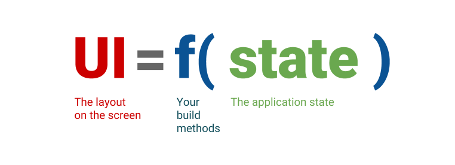

### comment summary

- 위젯은 개념적으로 build 메소드라는 함수에 상태(state)라는 입력을 통해 만드는 결과값 ex) Text('text');
- Provider 는 IngeritiedIWidget 을 더 쉽게 사용할 수 있도록 한 wrapper
- Provider 는 ChangeNotifierProvider 라는 위젯을 제공
  - create 속성으로 context 를 인자로 갖는 콜백을 작성
  - Provider.of 메소드로 기존 InheritiedWidget 방식과 유사하게 사용가능
  - context.watch 메소드로  Provider.of 메소드와 동일하게 사용 가능
  - context.read 메소드로 상태를 단발성으로 접근하여 사용, 지속적인 관찰 X
  - Comusmer를 사용하여 상태를 사용하는 위젯 전체가 아닌 실제로 상태를 사용하는 부분만 rebuild 할수 있도록 코드르 작성가능 → 성능을 극한으로 최적화 할때 사용
- Provider 를 사용함으로써 InheritiedWidget 에서 작성하던 boilerplate 코드를 제거할 수 있음
- boilerplate 코드가 사라지면서 initState, dispose, didChangeDependencies 와 같은 생명주기 메소드를 사용하지 않아도 됨 → StatelessWidget 으로 변경 가능

---

# 상태관리 (State Management)



flutter 는 선언형 UI를 가지는 프레임 워크.

어떠한 앱에서 사용자 인터렉션 등을 통해 앱의 상태가 변화하면, 이에 따라 상태(데이터)가 변화 되고 UI 가 다시 그려짐, 그리고 이러한 동작은 애플리케이션 화면 사이에 상태를 공유해서 사용할 때에도 나타날 수 있음

그렇게 앱에서 전역적 또는 부분적으로 사용되는 상태를 관리하고 UI에 그 변화를 반영 시키는 것을 "상태관리" 라고 말함.

이전 강의에서 어떤 데이터(또는 상태)를 상위 위젯에서 하위 위젯으로 전달 할 때 [[005 MVVM 패턴#ChangeNotifier|ChangeNotifier]] 와 [[006 InheritiedWIdget|InheritiedWidget]] 를 이용하여 그 데이터를 위에서부터 순차적으로 내려 줄 필요 없이 context 를 통해서 데이터를 가져오고 사용하는 방법을 배웠었다.

InheritiedWidget + ChangeNotifier 는 boilerplate 코드와 반복해야 하는 코드 작성이 매우 많음  
→ ***Provider*** 패키지를 이용하여 번거로운 코드작성을 줄여줄 수 있다.

# Provider

> Provider 는 IniheritedWidget 을 더 쉽게 사용할 수 있도록 한 wrapper

아래는 Provider 를 활용하는 예시 코드이다.

```dart
ChangeNotifierProvider(  
  create: (context) => PhotoListSearchViewModel(  
    photoSearchResultRepository: PhotoSearchResultRepositoryImpl(  
      photoDataSource: PixabayDataSource(),  
    ),  
  ),  
  child: const PhotoListScreen(),  
);
```

```dart
@override  
Widget build(BuildContext context) {  
  final viewModel = context.watch<PhotoListSearchViewModel>();
}
```

## ChangeNotifierProvider

> 예시 코드는 pixabay api 활용한 이미지 리스트 및 이미지 상세보기 예제 코드

### 1. 관찰 대상 객체 작성 (ChangeNotifier)

```dart
class PhotoListSearchViewModel with ChangeNotifier {  
  final PhotoSearchResultRepository _photoSearchResultRepository;  
  
  List<Photo> _photos = [];  
  bool _isLoading = false;  
  
  PhotoListSearchViewModel({  
    required PhotoSearchResultRepository photoSearchResultRepository,  
  }) : _photoSearchResultRepository = photoSearchResultRepository;  
  
  List<Photo> get photos => _photos;  
  
  get isLoading => _isLoading;  
  
  void _changeLoadingStatus(bool status) {  
    _isLoading = status;  
    notifyListeners();  
  }  
  
  void getPhotoList(String keywords) async {  
    _changeLoadingStatus(true);  
    _photos = await _photoSearchResultRepository.getPhotos(keywords);  
    _changeLoadingStatus(false);  
  }  
  
  void resetPhotoList() {  
    _photos = [];  
    notifyListeners();  
  }  
}
```

- 먼저 MVVM 패턴에서 ViewModel에 mixin 으로 ChangeNotifier 를  사용하는 것과 동일하게 코드를 작성한다.

### 2. ChangeNotifierProvider 위젯 배치

> ChangeNotifierProvider 코드

```dart
ChangeNotifierProvider(  
  create: (context) => PhotoListSearchViewModel(  
    photoSearchResultRepository: PhotoSearchResultRepositoryImpl(  
      photoDataSource: PixabayDataSource(),  
    ),  
  ),  
  child: const PhotoListScreen(),  
);
```

> InheritedWidget 코드

```dart
ChangeNotifierProvider<CounterViewModel>(  
  value: CounterViewModel(repository: CounterRepository()),  
  child: const CounterScreen(),  
),
```

- InheritedIWidget 과 유사한 코드 작성 방식을 갖는다

- `create: (context) => PhotoListSearchViewModel(...)`  
  - create 속성을 통해 context 를 인자로 갖는 콜백을 반환, context 를 통해 상위에서 내려주고자 하는 위젯을 명시한다. 이때 주입하고자 하는 객체들을 위젯의 생성자로 넣어주게 된다.  
- `child: const PhotoListScreen()`
  - child 속성에 명시된 위젯 내부에서 context 객체를 사용하여 ChangeNotifierProvider 이 value 로 제공하는 데이터를 사용하게 된다.  

### 3. build 메소드 내부에서 상태 접근

```dart
@override  
Widget build(BuildContext context) {  
  final viewModel = context.watch<PhotoListSearchViewModel>();  
  ...
}
```

- `final viewModel = context.watch<PhotoListSearchViewModel>()`
  - build 메소드 내부에서 `context.watch()` 를 이용하여 상태를 감지하고자 하는 데이터 또는 위젯(viewModel) 을 가져온다.
  - InheritedWidget 의 Provider.of 메소드와 유사하게 context.watch 메소드를 사용함.
  - `context.watch()` 메소드는 ==상태를 지속으로 관찰==하고 변경 시 위젯의 build() 메소드를 다시 호출함. build() 메소드 내에서 사용해야 함.

```dart
@override  
void initState() {  
  super.initState();  
  
  Future.microtask(() {  
    final viewModel = context.read<PhotoListSearchViewModel>();  
    viewModel.getPhotoList('');  
  });  
}
```

- `context.read<T>()`
  - `read()` 메소드는 `watch()` 와 같이 지속적인 관찰이 아닌 ==단발성으로 상태에 접근==하여 사용할 때 사용한다.
  - `initState()` 내부에서 사용할 때는 `Future.microtask()` 를 사용하여 일시적으로 시간 간격을 만들어 준 후 사용한다.

### 4. 접근한 상태를 사용

```dart
@override  
Widget build(BuildContext context) {
 ...
 TextFormField(  
   controller: _searchTextEditingController,  
   textInputAction: TextInputAction.search,  
   onFieldSubmitted: (value) {  
     viewModel.getPhotoList(value);  
   },
 ...
}
```

- `viewModel.getPhotoList(value)`
  - InheritedWidget 에서 state 를 사용하는 것과 동일하게 사용하면 된다.

### 기타

- 생명주기 메소드 중 `didChangeDependencies()` 메소드 에서 viewModel 을 접근가능.
- 단, ChangeNotifier 의 addListener 등과 같이 한번만 실행되는 코드를 작성하는 것을 지양해야 함.

#### Consumer

```dart
body: Center(
  child: Consumer<CounterModel<(
    builder: (context, model, child) {
      return Text(
     '${model.count}',
     style: const TextStyle(fontSize: 40),
      );
    },
  ),
),
```

- Comusmer를 사용하여 상태를 사용하는 위젯 전체가 아닌 실제로 상태를 사용하는 부분만 rebuild 할수 있도록 코드를 작성가능  → 성능을 극한으로 최적화 할때 사용

## Provider 를 사용할 때의 장점

- Provider 를 사용함으로써 InheritiedWidget 에서 작성하던 boilerplate 코드를 제거할 수 있음
- boilerplate 코드가 사라지면서 initState, dispose, didChangeDependencies 와 같은 생명주기 메소드를 사용하지 않아도 됨 → StatelessWidget 으로 변경 가능

---

# Deepdive

## ChangeNotifierProvider 와 go_router

MVVM 패턴과 ChangeNotifierProvider 를 결합해서 코드를 작성하고 공부하던 중 다음과 같은 의문이 제기 됬다.

> 전역적으로 Provider 를 사용했을 때 위젯트리에서 context 를 통해 원하는 데이터를 주입받아 사용할 수 있지만, 이는 다르게 말하면 전역에서 Provider 를 통해 계속해서 메모리 누수가 발생

> 전역 Provider 와 다른 방식으로 View 에서 Provider 를 통해 ViewModel을 주입받는 것과 생성자에서 ViewModel 을 주입하는 것, ViewModel 을 싱글톤으로 만들어서 제공하는 것에 대한 차이

이에 대한 대답은 Provider 를 사용하는 이유와 관계가 있다.

Provider 는 InheritedWidget 의 wrapper 로 InheritedWidget을 mixin 하여 작성했던 boilerplate 코드를 줄여주고 View 코드에서 반복적으로 작성했던 setState 코드와 생명주기 메서드를 작성하지 않아도 되게 만들어 준다.

사실은 Provider 의 사용이 강제되는지 않고, 생성자에서 ViewModel 을 주입받는 것과 싱글톤으로 만들어서 사용하는 것과 차이가 없다고 하더라도 Provider 를 사용함으로써 개발자가 작성해야 하는 코드의 수와 반복적인 작업이 줄어든다는 이점이 있기 때문에 Provider 를 통해 ViewModel 을 주입 받는 방식을 사용하는 것이다.
