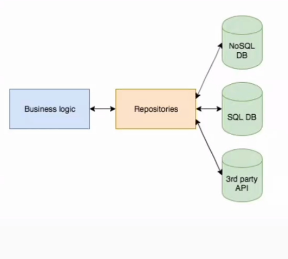

## 과제 복습... (이번주는 특히 중요함)
<hr>

- jsonplaceholder 를 이용하여 총 3장의 화면을 구현한다.
- 구현을 할 때, model, repository 패턴 또는 FutureBuilder 패턴을 사용해본다.
- jsonplaceholder의 경우, 100개의 앨범 정보와 5000개의 사진 정보를 내장
- Album list 를 GridView 로 표시한 뒤, ListView로 나열
- 리스트의 특정 정보를 클릭시, 내부 디테일 정보가 보이도록 구형
- GridView는 CrossAxisCount가 2이면 세로로 0 , 1, 2 로 선을 그어 2개의 영역을 확보
- (아마도 html / css 의 Grid와 얼추 비슷한 느낌)
- 데이터를 가져오는 방법에서는 1) StatefulWidget 일 때의 상황과, 2) FutureBuilder 상황일 떄를 고려
- 선생님의 master 브랜치 코드를 일일히 쳐보면서 연습할 것.

# MVVM
<hr>

- 레파지토리를 담당하는 클래스는 데이터와의 이동만을 주 목적으로 한다.
- 하지만 이 안에서 로직을 구현할 시, 앱의 규모가 커지면 화면도 많아지기 떄문에 나중에 관리하기도 힘들고 코드도 복잡해진다.
- 단순하게 숫자의 카운트를 올리는 로직 한개가 있는 레파지토리에도 동일하게 해당된다.


- 따라서 비지니스 로직을 따로 구현하는 모델을 만들어준다.
- 레파지토리는 데이터 제공의 역할 ( + 데이터 수정 , + 데이터 삭제)
- 화면에 보여줘야할 데이터는 getter로 제공  

```dart

  class _MyHomePageState extends State<MyHomePage> { 
      final viewModel = MainViewModel(); // 이제부터 비지니스 로직은 이곳에서 담당한다.

      void updateUI() => setState(() {});
  
      // 이하 생략
  }

```

