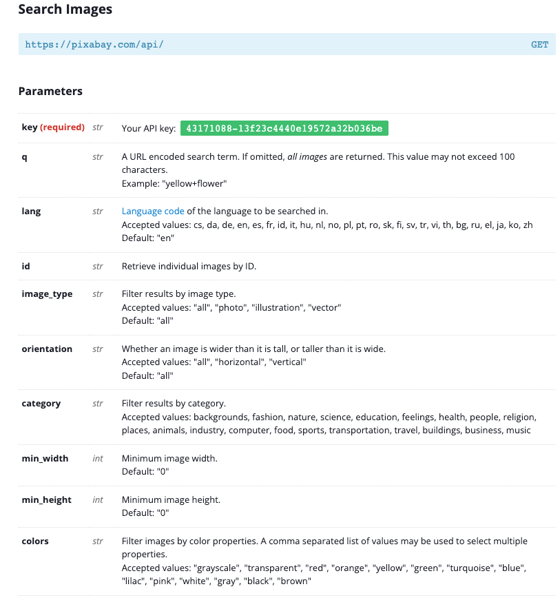
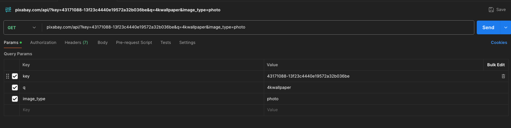
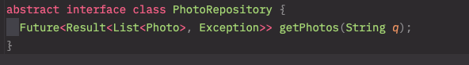

# Result 패턴
<hr>

### Pixabay API 사용법

1. https://pixabay.com/api/docs/ 접속

2. REST Api 인 것을 확인



3. Api 파라미터를 확인

4. pixabay.com/api/?key='api키 입력'&q='검색어입력'&image_typ='photo'

5. 위와 같은 방식으로 '&키워드'로 붙여나간다.



### Result 패턴

```dart
    sealed class Result<T, E> { // T 는 임의의 타입 , E 는 보통 에러타입
        factory Result.success(T data) = Success<T, E>;

        factory Result.error(E error) = Error<T, E>;
    }

    class Success<T, E> implements Result<T, E> {
        final T data;

          Success(this.data);
    }

    class Error<T, E> implements Result<T, E> {
        final E error;

        Error(this.error);
    }
```



Repository 패턴에서 너무 어렵게 생각하지 말고 Result 패턴 안에 두개의 패턴이 있다면
Result < something1, something2 > getPhotos(String q);
이런 식으로 이해

## 앞으로 해야할 일

- alias 설정을 귀찮아서 안했는데 수업 따라가려면 해놔야 할 듯
- 플러그인이 꼬였는지 몇개의 설정이 안보인다 최근에 총 3개의 플러그인을 설치한 것 같은데 다시 싹 밀고 다시 설치해봐야겠다.