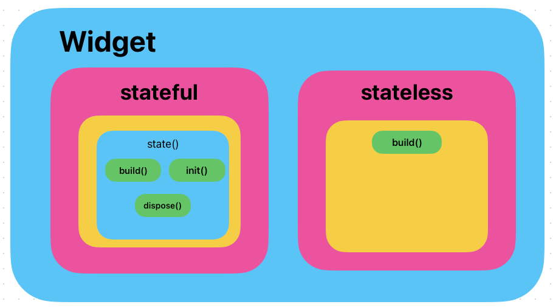
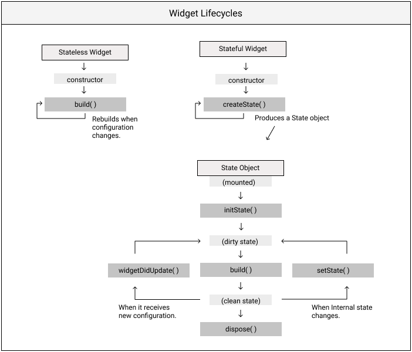
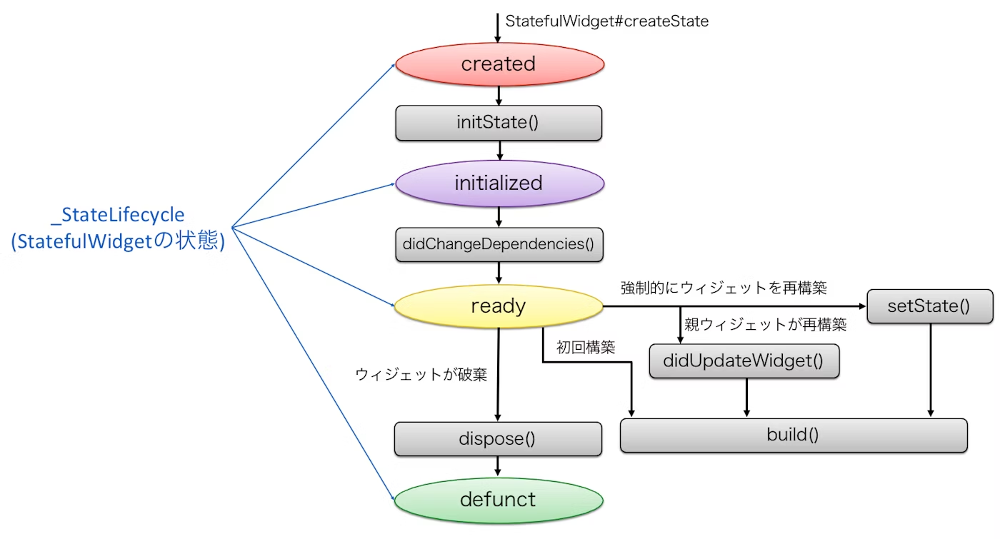

# Widget 정리

(작성중 ..)

 - 직관적으로 이해해야 위젯을 적재적소에 사용해야 할때 헷갈리지 않을 것 같다는 생각이 들었다.
 - 파일 안에서 코드가 장황하게 펼쳐져 한눈에 파악하기 힘들면, Stateful 위젯은 State() 와 Build() 를 찾은 뒤 나머지를 파악해보기
 - 위젯의 사용법을 상세하게 아는 것도 중요하지만, 큰틀에서 바라보는 것이 중요하고 순서를 매겨서 빠르게 튀어놔와야 할 사항은 암기하고 나머지는 그때마다 찾아보는 식으로 공부
 - 코드를 작성할때 위젯이 그려지는 순서나 모양을 머릿속으로 실시간으로 그려가면서 해본다.
 - 이미지와 직선화로 정리해야 기억에 오래 남는다고 어렴풋이 들었다.
 - const가 붙는 위젯은 변수가 들어가지 않아 고정된 느낌의 위젯, 생성시 메모리에 상주하기 떄문에 성능상 좋은 것 같다.
 - Future builder 패턴을 공부할 것
 - model , repository 패턴을 우리가 요즘 클론하고 있는 ui 모작에 적용시킨다 (아직 매끄럽지 않음)
 - goRouter 연습하기
 - 생명주기 이해하고 코드 내에서 save()의 위치를 바꿔가면서 테스트해보기

 - 출처 : https://livebook.manning.com/book/flutter-in-action/chapter-4/v-4/109
 - 하지만 아래 그림이 좀 더 직관적인 느낌이 들기도 하다.

 - 출처 : https://qiita.com/kurun_pan/items/116288b8ab2c409d2ee5
 - dirty state는 매끄럽지 않은 단계이고 clean state 는 위젯 구축 단계가 끝난 상황을 의미하는가? (공부가 필요)
 - build() 안에서 멍청하게 setState() 를 사용하는 불상사가 없게 하기
 - SliverAppbar 적용해보기
 - AppBar는 높이 제한이 없는 것인가?
 - 특정 위젯에 백그라운드 이미지 배경처리 연습
 - Stack으로 레이아웃을 쌓았을때 어떤 문제가 생길 수 있는가?
 - blur 처리를 해보고 싶다.(특히 BottomNavgationBar 에)
 - gorouter가 왜 필요한지 다시 정리
