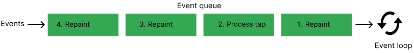
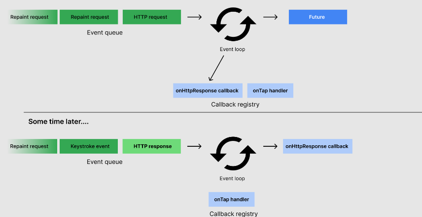

# Concurrency in Dart
[공식문서](https://dart.dev/language/concurrency) 

Dart에서 동시성 프로그래밍은 Future, Stream, isolates와 같은 프로세스를 별개의 core로 이동시켜주는 비동기 Api를 의미한다.

모든 Dart의 코드는 isolates에서 실행되고(default = main isolates), 직접 생성한 isolates으로 확장/이동시킬 수도 있다. 새롭게 생성한 isolate는 고유의 isolate 메모리와 이벤트 루프를 갖게 된다. 이벤트 loop는 Dart에서 비동기와 동시성 프로그래밍을 가능하게 해준다.

<br>

## Event Loop

Dart의 런타임 모델은 이벤트 루프를 기반으로 한다. 이벤트 루프는 프로그램 코드 실행, 이벤트 수집 및 처리 등을 책임지고 있다.

 

이벤트 루프는 아래 코드와 유사한 방식으로 동작한다.

```dart
while (eventQueue.waitForEvent()) {
  eventQueue.processNextEvent();
}
```

위 코드의 이벤트 루프는 동기식이며, 싱글 스레드에서 실행 된다. 하지만 대부분의 Dart 앱은 HTTP request를 보내는 동시에 사용자의 버튼 터치를 인식하는 등, 하나 이상의 것을 동시에 처리해야 한다. 이것을 위해 Dart는 Futures, Streams, async-await와 같은 이벤트 루프로 구축된 다양한 비동기 API를 지원한다. 

네트워크 요청을 생성하는 예시로 알아보자.

```dart
http.get('https://example.com').then((response) {
  if (response.statusCode == 200) {
    print('Success!')'
  }  
}
```
이벤트 루프에 해당 코드가 전달되면, 이벤트 루프는 즉시 http.get을 호출하고 http.get은 Future을 반환한다. 또한, http.get은 HTTP 요청이 해결되기 전까지 이벤트 루프가 then절의 콜백에서 대기하도록 요청한다. HTTP 요청이 완료되면 콜백은 실행되고, 요청의 결과는 then절의 인자로 전달된다.  

아래의 그림은 Dart에서 이벤트 루프가 Stream과 같은 모든 비동기 이벤트를 어떻게 처리하는지 보여준다.

 

이는 Dart에서 이벤트 루프가 Stream 객체와 같은 모든 다른 비동기 이벤트를 일반적으로 어떻게 처리하는지 보여준다.

<br>

## Asynchronous programming


