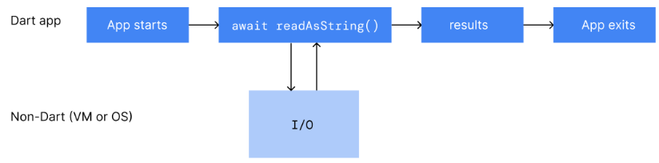

# Concurrency in Dart
[공식문서](https://dart.dev/language/concurrency) 

Dart에서 동시성 프로그래밍은 Future, Stream, isolates와 같은 프로세스를 별개의 core로 이동시켜주는 비동기 Api를 의미한다.

모든 Dart의 코드는 isolates에서 실행되고(default = main isolates), 직접 생성한 isolates으로 확장/이동시킬 수도 있다. 새롭게 생성한 isolate는 고유의 isolate 메모리와 이벤트 루프를 갖게 된다. 이벤트 loop는 Dart에서 비동기와 동시성 프로그래밍을 가능하게 해준다.

<br>

## Event Loop

Dart의 런타임 모델은 이벤트 루프를 기반으로 한다. 이벤트 루프는 프로그램 코드 실행, 이벤트 수집 및 처리 등을 책임지고 있다.

 

이벤트 루프는 아래 코드와 유사한 방식으로 동작한다.

```dart
while (eventQueue.waitForEvent()) {
  eventQueue.processNextEvent();
}
```

위 코드의 이벤트 루프는 동기식이며, 싱글 스레드에서 실행 된다. 하지만 대부분의 Dart 앱은 HTTP request를 보내는 동시에 사용자의 버튼 터치를 인식하는 등, 하나 이상의 것을 동시에 처리해야 한다. 이것을 위해 Dart는 Futures, Streams, async-await와 같은 이벤트 루프로 구축된 다양한 비동기 API를 지원한다. 

네트워크 요청을 생성하는 예시로 알아보자.

```dart
http.get('https://example.com').then((response) {
  if (response.statusCode == 200) {
    print('Success!')'
  }  
}
```
이벤트 루프에 해당 코드가 전달되면, 이벤트 루프는 즉시 http.get을 호출하고 http.get은 Future을 반환한다. 또한, http.get은 HTTP 요청이 해결되기 전까지 이벤트 루프가 then절의 콜백에서 대기하도록 요청한다. HTTP 요청이 완료되면 콜백은 실행되고, 요청의 결과는 then절의 인자로 전달된다.  

아래의 그림은 Dart에서 이벤트 루프가 Stream과 같은 모든 비동기 이벤트를 어떻게 처리하는지 보여준다.

 

이는 Dart에서 이벤트 루프가 Stream 객체와 같은 모든 다른 비동기 이벤트를 일반적으로 어떻게 처리하는지 보여준다.

<br>

## Asynchronous programming

<br>

### Future
Future은 결국 값 혹은 에러로 완료될 예정인 비동기 연산에 대한 결과를 나타낸다.  
`Future<타입>`으로 나타내며, 결국에는 타입의 객체(혹은 에러)를 반환할 것을 보장한다.  
```dart
Future<String> _readFileAsync(String filename) {
  final file = File(filename);

  // .readAsString() returns a Future.
  // .then() registers a callback to be executed when `readAsString` resolves.
  return file.readAsString().then((contents) {
    return contents.trim();
  });
}
```

<br>

### async-await 문법
async와 await 키워드는 비동기 함수와 그것의 결과값을 정의 하는 선언적 방법이다.

```dart
const String filename = 'with_keys.json';

void main() async {
  // Read some data.
  final fileData = await _readFileAsync();
  final jsonData = jsonDecode(fileData);

  // Use that data.
  print('Number of JSON keys: ${jsonData.length}');
}

Future<String> _readFileAsync() async {
  final file = File(filename);
  final contents = await file.readAsString();
  return contents.trim();
}
```
`main()`함수는 `_readFileAsync()` 앞에 await 키워드를 붙여, native 코드(file I/O)가 실행 중에도, 다른 Dart 코드로 하여금 CPU를 사용할 수 있게 한다.  
또한, await 키워드를 사용함으로써 `Future<String>`이 `String`으로 반환 되도록 하는 효과도 있다.

=> await 키워드는 오직 async 키워드가 붙은 함수 본문에서만 사용할 수 있다.

 

위의 도식에서 알 수 있듯이 Dart 코드는 `readAsString()`가 Dart가 아닌 코드(Dart 런타임 혹은 운영체제)를 실행하는 동안 중지된다. `readAsString()`이 값을 반환하면, Dart 코드는 다시 이어서 실행된다.

<br>

## Streams

Dart는 또한 스트림 형태의 비동기 코드도 지원한다. Streams는 미래의 값이나 시간이 지남에 따라 반복되는 값을 제공한다.  
다음은 `Stream.periodic`로 생성되는 Stream 예제로, 매초 새로운 int를 내보낸다.
```dart
Stream<int> stream = Stream.periodic(const Duration(seconds: 1), (i) => i * i);
```

<br>

### await-for-and yield
await-for은 반복문의 한 종류로 Stream에서 새로운 값이 제공될 때, 반복문이 실행된다.  
아래의 예제에서 `sumStream()` 함수의 인자로 넘겨받은 Stream에서 새로운 값이 제공될 때마다 새로운 sum이 생성되어 내보내어진다.  
(yield 키워드는 Stream의 값을 반환하는 함수에서 return 대신 사용한다.)
```dart
Stream<int> sumStream(Stream<int> stream) async* {
  var sum = 0;
  await for (final value in stream) {
    yield sum += value;
  }
}
```

<br>

## Isolates
Dart는 위의 비동기 Api들 외에도 Isolate를 통해 비동기를 지원한다. 대부분의 최신 기기들은 멀티 코어 CPU를 가지고 있고, 멀티 코어의 장점을 활용하기 위해서 개발자들은 종종 메모리를 공유하는 스레드들을 동시에 실행한다. 하지만 공유 상태의 동시성은 에러가 발생하기 쉽고 코드를 복잡하게 만든다.

Dart의 모든 코드는 스레드 대신 Isolate 내부에서 실행된다. Dart 코드는 Isolate를 통해 다양한 독립적인 일을 한번에 수행할 수 있다. Isolate는 스레드나 프로세스와 유사하지만, 각각의 Isolate들은 고유의 메모리와 이벤트 루프를 실행하는 스레드를 가진다.  
=> 1개의 Isolate = 1개의 고유 메모리 + 1개의 고유 스레드(이벤트 루프)

각각의 Isolate는 고유의 전역 변수를 가지고, Isolate 내부의 상태(변수)들은 다른 Isolate에서 절대 접근할 수 없다. Isolate들은 오직 messaage passing을 통해서만 서로 통신할 수 있다. Isolate 사이에 공유 되는 상태가 없다는 것은 뮤텍스나 락, 경쟁 상태와 같은 동시성 문제들이 Dart에서는 일어나지 않음을 의미한다. (하지만 Isolate가 모든 경쟁 상태를 예방하는 것은 아니다.)  

(오직 native Dart 플랫폼만 Isolate를 구현하고 있다. Web 플랫폼 X)

<br>

### main Isolate
대부분의 경우 Isolate를 고려할 필요가 없다. Dart는 프로그램이 시작되고 실행되는 스레드를 가진 main Isolate를 기본으로 실행한다.


하나의 Isolate 프로그램도 원활하게 실행된다. 이러한 앱들은 async-await를 사용하여 비동기 연산이 완료되기를 기다리고, 다음 코드를 이어서 실행한다. 잘 동작하는 앱들은 최대한 빨리 시작되어 이벤트 루프 도달하는 시간을 최소화 한다. 이후, 앱은 필요에 따라 비동기 연산을 활용하여 대기중인 이벤트에 즉시 답한다.

<br>

### Isolate 생명주기
아래의 도식은 모든 Isolate가 main 함수와 같은 Dart 코드를 실행함으로써 시작됨을 보여준다. 예를 들면, 이 Dart 코드는 사용자 입력이나 file I/O에 응답하기 위해 몇몇의 이벤트 리스너를 등록할 것이다. Isolate의 최초의 함수가 반환되면, Isolate는 이벤트 처리가 완료될 때까지 기다린다. 모든 이벤트가 처리되면 Isolate는 종료된다.

<br>

### Event handling
클라이언트의 앱에서 main Isolate의 이벤트 큐에는 repaint 요청, 탭에 대한 알림, UI 이벤트 등이 포함될 것이다. 예를 들어, 아래의 도식은 repaint 이벤트, 탭 이벤트, repaint 이벤트, repaint 이벤트로 구성된 이벤트 큐를 보여준다. 이벤트 루프는 이벤트 큐의 이벤트를 FIFO로 처리한다.


main함수가 종료되면 main Isolate에서 이벤트 핸들링이 발생한다. 아래의 도식에서 main함수가 끝난 후, main Isolate가 첫번재 repaint 이벤트를 처리한다. 이후, main Isolate가 탭 이벤트, repaint 이벤트를 처리한다.

만약 동기 연산 처리에 너무 긴 시간이 소요된다면, 앱은 응답불가 상태에 빠질 수 있다. 아래의 도식에서 탭 처리 코드가 너무 길어서 이 후의 이벤트 들은 너무 늦게 처리된다. 앱은 정지한 것처럼 보여질 것이고, 애니메이션 역시 이상할 수 있다.


클라이언트 앱에서 너무 긴 동기 처리 연산은 UI를 부드럽지 못하게 만들고, 심할 경우 완전히 반응이 없는 상태가 될 것이다.

<br>

### Background workers
만약 앱의 UI가 거대한 Json 파일 파싱등의 연산 집약 처리로 인해 응답이 없게 된다면, 해당 연산을 worker Isolate(= background worker)에게 처리하도록 하는 것을 고려해야 한다. 일반적으로 아래의 도식과 같이 단순한 worker Isolate를 생성하여 연산 집약 작업을 처리하고 종료하도록 한다. worker Isolate는 결과를 message를 통해 반환하고 종료된다.


worker Isolate는 I/O 작업, 타이머 등을 수행할 수 있다. worker Isolate는 main Isolate와 공유하지 않는 고유한 메모리를 가지고 있고 다른 Isolate에 영향을 주지않고 블락 시킬 수 있다.

<br>

### Isolate 사용
Dart에는 상황에 따라 2가지 방법으로 Isolate를 사용할 수 있다.  
1. `Isolate.run()`: 분리된 스레드에서 하나의 연산을 수행한다.
2. `Isolate.spawn()`: 여러개의 message를 처리하는 Isolate, 혹은 background worker를 생성한다. (더 길게 동작하는 Isolate)   

=> 백그라운드에서 프로셋스를 실행해야하는 대부분의 상황에서 `Isolate.run()` 메서드를 사용하는 것이 추천되는 API이다.

`Isolate.run()` 메서드는 새롭게 생성된 Isolate에서 실행될 콜백을 유일한 인자로 받는다.  
```dart
int slowFib(int n) => n <= 1 ? 1 : slowFib(n - 1) + slowFib(n - 2);

// Compute without blocking current isolate.
void fib40() async {
  var result = await Isolate.run(() => slowFib(40));
  print('Fib(40) = $result');
}
```

<br>

### 성능과 Isolate groups
Isolate가 `Isolate.spawn()`를 호출하게 되면 두개의 Isolate는 동일한 실행 가능한 코드를 갖게 되고, 하나의 Isolate group에 속하게 된다. Isolate group는 코드 공유와 같은 성능 최적화가 가능하다. (새로운 Isolate가 Isolate group이 갖고 있는 코드를 즉시 실행 가능)  또한, `Isolate.exit()`는 Isolate들이 같은 Isolate group에 속해 있을 때만 동작한다.  

몇몇의 특수한 경우, `Isolate.spawnUri()`를 통해 지정된 URI에 있는 코드 복사본을 사용하여 새로운 Isolate를 생성해야한다. 하지만, `spawnUri()`는 `spawn()`보다 훨씬 느리고 새로운 Isolate는 자신을 spawn한 Isolate와 동일한 Isolate group에 속하지 않는다. 또한, 다른 Isolate group에 속한 Isolate 끼리의 message 전달은 더 느리다.

<br>

### Isolate의 한계
Isolate는 스레드가 아니다.

멀티스레드를 지원하는 언어를 사용하다 Dart로 넘어오게 되면, Isolate가 스레드처럼 동작하길 기대하겠지만 아니다. 각각의 Isolate는 서로 접근 불가능한 고유한 상태를 가지기 때문에 자신의 메모리에만 접근할 수 있다.  

예를 들어, 전역변수를 가진 앱이 있다고 하자. spawned Isolate에서 변수를 변경해도, main Isolate에서는 값에 접근할 수 없다.

### Message 타입
SendPort를 통해 전송되는 message는 대부분의 타입이 가능하다.

아래는 message가 될 수 없는 예외이다.  
- Socket 같은 native resource의 Object
- ReceivePort  
- DynamicLibrary  
- Finalizable  
- Finalizer  
- NativeFinalizer  
- Pointer  
- UserTag  
- `@pragma('vm:isolate-unsendable')` 어노테이션이 붙은 클래스의 인스턴스  

=> `Isolate.spawn()`, `Isolate.exit()`도 동일