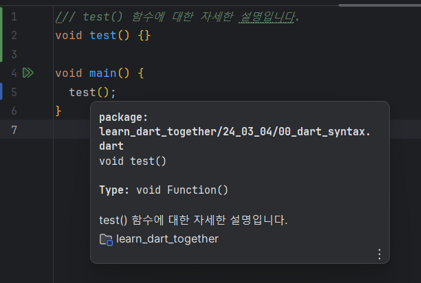

# Comments 
[공식문서](https://dart.dev/language/comments)

### 주석(comment)이란?
- 프로그래밍에 있어 내용을 메모하는 목적으로 쓰인다.
- 소스 코드를 더 쉽게 이해할 수 있게 만드는 것이 주 목적이며, 협업할 때 유용히 쓰인다.
- 일반적으로 컴파일러와 인터프리터에 의해 무시된다.

## Single-line 주석
- `//`를 통해 하나의 줄을 주석 처리할 수 있다.
- 해당 줄의 마지막까지 컴파일러에게 무시된다.
```dart
void main() {
  // print('이건 무시됩니다ㅠ');
  print('이건 출력됩니다.');
}
```
> 간단히 코드에 설명을 붙이거나, 잠시 코드의 실행을 막을 때 사용

## Multi-line 주석
- 여러 줄 주석은 `/*`로 시작하며, `*/`으로 끝이난다.
- 내부의 모든 줄은 컴파일러에게 무시된다.

```dart
/*
void printFail() {
  print('이 함수는 없는 존재입니다ㅠ');
}
*/
void main() {
  printFail(); // Error: The function 'printFail' isn't defined.
}

```

## Documentation 주석
- `///`를 통해 하나의 줄을 문서 주석 처리할 수 있다.  
    => `///`을 이어지는 여러줄에 사용하면, 하나의 문서 주석으로 처리된다.
- `/**` ~ `**/`을 통해 여러 줄을 문서 주석 처리할 수 있다.  
    => **하지만 권장되지 않음. 위의 기호를 사용할 것**
- 문서 주석은 클래스, 메서드 등의 구현부 위에 작성하여 해당 구현부에 대한 문서로 처리된다.
- 해당 문서는 IDE에서 클래스, 메서드 명에 대한 부가 설명로 제공된다.

- 문서 주식의 내부에서 `[...]`은 무시되지 않고, 문서 주석이 설명하는 대상의 클래스, 메서드, 필드, Top-level 변수, 함수, 파라미터에 대한 참조를 만든다.
```dart
/// A domesticated South American camelid (Lama glama).
///
/// Andean cultures have used llamas as meat and pack
/// animals since pre-Hispanic times.
///
/// Just like any other animal, llamas need to eat,
/// so don't forget to [feed] them some [Food].
class Llama {
  String? name;

  /// Feeds your llama [food].
  ///
  /// The typical llama eats one bale of hay per week.
  void feed(Food food) {
    // ...
  }

  /// Exercises your llama with an [activity] for
  /// [timeLimit] minutes.
  void exercise(Activity activity, int timeLimit) {
    // ...
  }
}
```
=> 주석 내부의 `[feed]`, `[Food]`를 클릭하면 해당 메서드로 이동한다.