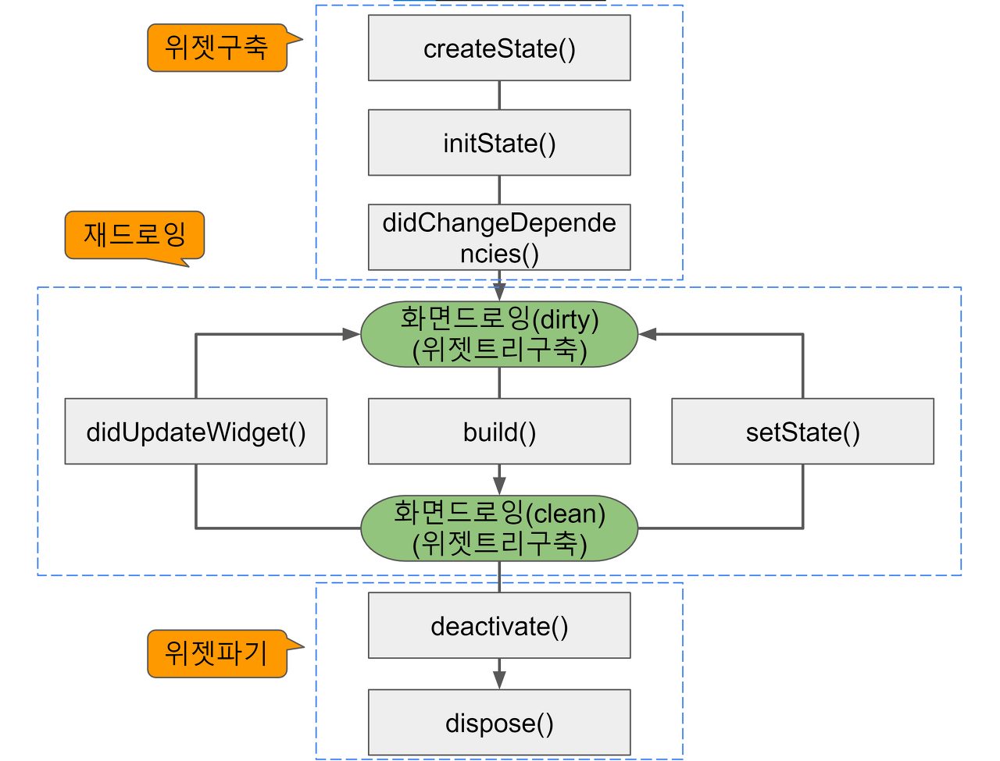

## Flutter - FutureBuilder, Navigation

- Future를 UI로 표현하는 방법은 두가지가 있다.
    - StatefulWidget + setState()
    - FutureBuilder

### StatefulWidget + setState()

- 기본적으로 데이터를 받아서 뿌리는 화면은 다 StatefulWidget이다.

    ```dart

    class FutureSetState extends StatefulWidget {
        const FutureSetState({super.key});
    }

    class _FutureSetState extends State<FutureSetState> {
        final todoRepo = TodoRepositoryImpl();
        List<Todo> _todos = [];
        
        @override
        void initState() {
            //initState는 처음 화면 생성시 한번만 호출되는 메서드이다. 
            //여기서 api를 호출해줌 
            super.initState();
        }
        
        @override
        Widget build(BuildContext context) {
            return Scaffold(
                body: Center(
                    child: Text(),
                ),
            );
        }
    }
    ```

- 기본적으로 build 메서드 안에서는 데이터 요청 로직 절대 금지. 최악의 안티패턴이라고함
- 사실 데이터는, 생성자로 받는게 제일 좋음

### FutureBuilder

[FutureBuilder class - widgets library - Dart API](https://api.flutter.dev/flutter/widgets/FutureBuilder-class.html)

- Future 함수의 결과를 Widget으로 변환하는 위젯이다.

    ```dart
    class FutureBuilder extends StatefulWidget {
        const FutureBuilder({super.key});
    }

    class _FutureBuilderState extends State<FutureSetState> {
        final todoRepo = TodoRepositoryImpl();
        List<Todo> _todos = [];
        
        @override
        Widget build(BuildContext context) {
            return Scaffold(
                body: Center(
                    child: FutureBuilder<Generic>(
                        future: getText(),
                        builder: (BuildContext context, AsyncSnapshot<Generic> snapshot) {
                            if (snapshot.connectionState == ConnectionState.wating) {
                                return const CircularProgressIndicator();
                            }
                            
                            if(snapshot.connectionState == ConnectionState.done) {
                                return snapsot.data를 가지고 위젯만들어서 뱉으면 됨. 
                            }
                        }
                    ),
                ),
            );
        }
    }

    Future<String> getText() async {
        return '호출완료';
    }
    ```

- FutureBuilder는 두개의 속성을 필수로 받는다.
    - Future
        - Future 함수를 호출하는 부분이다.
    - builder
        - Future 함수를 통해서 받아온 결과를 가지고 build를 하는 영역이다.
        - context 와 snapshot을 받아온다.
        - snapshot의 connectionState 상태에 따라서 결과를 처리해주면 된다.
        - connectionState 는 enum 타입이며 4가지 타입이 있다.
            - none
                - 실패한거같은데?
            - wating
                - 보통 로딩중 뭐 이런걸 넣어줌
            - active
            - done
                - [snapshot.data](http://snapshot.data) 를 통해서 결과값을 가져올수있음
        - enum 타입이라 switch 문으로 처리해줘도 된다.
- 레이아웃 그리는 부분에서 로직을 다 작성하고 하면 복잡하니까 helper 메소드로 FutureBuilder를 만들어서 그려주는게 편할것 같다.
- FutureBuilder는 콜백 지옥이 될 수 도 있다. FutureBuilder 안에서 또 FutureBuilder를 호출하고 호출하고 하는 상황..

### Navigation&Route

[Navigation and routing](https://docs.flutter.dev/ui/navigation)

- 화면전환
- push, pop Stack 구조로 관리됨
- 화면 전환할때 다음 화면의 생성자에서 그냥 넘겨주면 된다.
- 데이터 돌려받는것도 가능함.
    - pop 메소드에서 가능함
    
    [Return data from a screen](https://docs.flutter.dev/cookbook/navigation/returning-data)
    

- Router
    - go_router 라이브러리 사용
    
    [go_router | Flutter package](https://pub.dev/packages/go_router)
    
    - 이건 필수적으로 사용해야되는 기능이니까 문서를 보고 꼭 써보기
    - 현재 프로젝트가 Navigation으로 되어있는데 Router로 리팩토링 해보는게 좋을듯.

### Widget tree란?

- Flutter의 UI 렌더링 기법? 같은 것이다.
- 코드로 작성한 위젯들을 트리형태로 표현한것.
- 위젯 트리는 immutable한 특성을 가지고 있어서, 트리가 변경되면 파기되었다가 다시 재생성 된다.
- 3개의 트리가 존재한다.
    - Widget tree
        - 일종의 설명서이다. ‘color가 무엇이고 padding이 얼마인 컨테이너를 그리고싶다’ 라는 내용을 담은 주문서이다.
        - 플러터는 위젯이라는 주문서를 보고 실제 그려질 인스턴스를 만드는데 그게 바로 Element 이다.
    - Element tree
        - Widget tree의 주문서를 읽어서 실제로 동작하는 트리이다.
        - 위젯 트리와 1:1로 대응이 된다.
        - 모든 위젯들은 `widget.buildContext` 를 통해서 자신과 연결된 엘리먼트에 접근할 수 있다. 이게 바로 build 메서드에서 넘겨주는 `BuildContext context` 이다.
        - lifecycle을 관리하는 트리이다.
    - Render tree
        - Element tree를 보고 만들어지는 트리이다. 이 트리에는 렌더링에 반드시 필요한 내용만 담는다.
        - 그래서 노드의 개수가, 위젯트리나 엘리먼트 트리의 개수보다 작다.
        - 모든 노드는 추상 클래스인 RenderObject 클래스를 구현한 클래스로 이루어 진다.
        - RenderObject 클래스는 parentData, constraints 등의 멤버변수와 visitChildren, layout 등의 메소드가 존재한다.

- 트리를 3개를 사용하는 이유는, 렌더링 성능을 보장하기 위해서임. 한 번 화면을 그린 다음에는 전체 화면을 계속해서 재랜더링 하는게 아니라 꼭 필요한 부분만 다시 그리기 위해서이다.
- Build 메소드에서 return 하는 위젯은 Widget tree로 들어간다. → 만들어진 Widget 트리를 보고 Element tree가 만들어진다 → Element tree를 보고 Render tree가 렌더링에 필요한 정보만을 가지고 tree를 구성한다.

- 대충의 개념과 렌더링 동작방식은 이해했지만, 정확하게 이 정보를 가지고 개발에 어떻게 활용할 수 있는지는 차근차근 알아봐야 할 것 같다.

### StatefulWidget 생명주기

- Widget lifecycle
    - 위젯이 생성되는 순간부터 메모리에서 해제되는 순간까지의 과정을 의미한다.
    - 위젯은 생성부터 해제까지 여러 단계가 있으며, 각 단계별로 특정 메소드들이 실행되거나 상태값이 변경되는데, 개발자는 이 메소드들이나 상태값을 이용해서 원하는 시점에 내가 원하는 코드를 실행시킬 수 있다.

    

1. **createState()**
    - 위젯이 생성되자마자 호출되는 메서드
    - 위젯 트리에 상태를 만들기위해 호출된다고 한다.
2. **mounted == true**
    - createState가 호출된 후 변경되는 상태값이다.
    - bool 값을 가진다.
3. **initState()**
    - 위젯을 초기화 시키는 메서드
    - 위젯이 생성될때 단 한번만 실행된다.
4. **didChangeDependencies()**
    - state 객체의 종속성이 변경될 때 호출된다.
    - initState 다음에 바로 호출된다.
    - API 호출과 같은 비용이 큰 액션이 필요한 경우에 유용하다고 함.
5. **build()**
    - stateful 위젯이 UI를 그릴때 호출되는 메서드이다.
    - 여러번 반복해서 호출되고 변경된 부분을 수정한다.
6. **didUpdateWidget()**
    - 위젯의 구성이 변경될때마다 호출된다.
    - 부모 위젯이 변경되고 다시 그려져야 할 때 호출된다.
7. **setStat()**
    - 상태가 변경되었을때 상태가 변경됨을 알리는 메소드
    - 사용자와 상호작용을 통해 상태가 변경될 때 해당 상태를 업데이트하고 화면을 다시 그린다.
8. **deactivate()**
    - state 객체가 트리로부터 삭제될 때마다 호출된다.
    - 다른 화면으로 이동할 때 호출됨
9. **dispose()**
    - 위젯이 트리에서 완전히 삭제되었을때 호출된다.

10. **mounted == false**

### Widget

- **CircularProgressIndicator()**
    - 로딩중 애니메이션을 보여주는 위젯
- **ListTile()**
    - ListView의 자식요소로 쓰이는 친구인데 오늘 ListView랑 이거 알아보면될듯
- **ShaderMask()**
    - 위젯에서 그라데이션을 주는 효과인데 사용법이 굉장히 난해하다. 조사하다가 시간다갈거같아서 안하는데 다음에 해보기