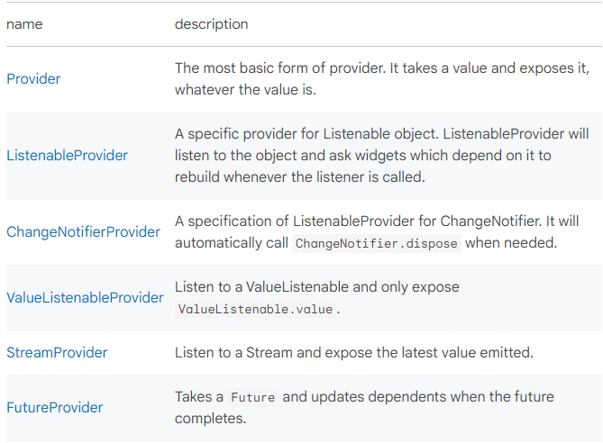

# Provider (package)
[공식 문서](https://pub.dev/packages/provider)

## Exposing a value
### 새로운 객체 인스턴스 expose
- 새로운 객체 생성은 `create`에서 한다.
    => `Provider.value`에서 생성하지 말 것
    => 시간의 흐름에 따라 변경될 수 있는 변수를 포함하는 객체를 `create`에서 생성하지 말 것  
    (변수가 변경되어도 업데이트되지 않는다)
    ```dart
    Provider(
    create: (_) => MyModel(),
    // value: MyModel(), X
    // create: (_) => MyModel(count), X
    child: ...
    )
    ```
- 변경되는 변수에 따라 객체가 업데이트되길 바란다면, ProxyProvider를 사용하면 된다.
    ```dart
    int count;

    ProxyProvider0(
    update: (_, __) => MyModel(count),
    child: ...
    )
    ```
- `create`와 `update` 콜백은 기본적으로 지연 호출된다.  
    => 이를 막으려면 `lazy = false`

### 이미 존재하는 객체 인스턴스 재사용

- provider의 `.value` 생성자를 사용하면 이미 생성된 인스턴스를 expose할 수 있다.  
    => 인스턴스 사용중에 `dispose` 메서드가 호출되는 것을 방지하는 듯
    ```dart
    MyChangeNotifier variable;

    ChangeNotifierProvider.value(
    value: variable,
    child: ...
    )
    ```
 <br>

## 객체 인스턴스의 값 읽기

### watch/read/select
값을 읽는 가장 쉬운 방법은 BuildContext의 확장함수를 이용하는 것이다.  
아래의 메서드들은 Widget tree에서 가장 호출부에서 가장 가까운 T타입의 변수를 찾는다.  
=> T를 nullable한 타입(T?)으로 하면 값을 못 찾을 경우, 에러가 아닌 null을 반환  
=> 시간복잡도는 O(1) (단, widget tree를 탐색하는 것은 제외)  
- `context.watch<T>()` T에 대한 변경을 구독하게 한다.  
    (값 읽기 및 변경 반영)  
    => `Provider.of<T>(context)`와 비슷하게 동작
- `context.read<T>()` T에 대한 구독없이 T를 반환한다.  
    (1회성 읽기)  
    => `Provider.of<T>(context, listen: false)`와 비슷하게 동작  
    => `StatelessWidget.build/State.build`에서 호출 불가 (다르게 말하면, build메서드 밖에서도 호출 가능)
- `context.select<T, R>(R cb(T.value))` T의 일부분에 대해서만 구독하도록 한다.    
    (T의 내부 속성에 대한 값 읽기 및 변경 반영)

provider의 BuildContext를 얻기 힘들거나, 성능 최적화가 필요한 경우 [Consumer](#consumer)나 [Selector](#selector)를 사용하면 좋다.

### MultiProvider
거대한 어플리케이션에서 다양한 값을 주입해야하는 경우, Provider를 중첩해서 사용하기 보단, MultiProvider를 사용하는 것이 좋다.  
(동작은 완전히 동일하고 코드의 모습만 다름)
```dart
Provider<Something>(
  create: (_) => Something(),
  child: Provider<SomethingElse>(
    create: (_) => SomethingElse(),
    child: Provider<AnotherThing>(
      create: (_) => AnotherThing(),
      child: someWidget,
    ),
  ),
),
```
위의 코드처럼 중첩하지 말고, 아래처럼 MultiProvider를 사용할 것  
```dart
MultiProvider(
  providers: [
    Provider<Something>(create: (_) => Something()),
    Provider<SomethingElse>(create: (_) => SomethingElse()),
    Provider<AnotherThing>(create: (_) => AnotherThing()),
  ],
  child: someWidget,
)
```

### ProxyProvider
다른 Provider에서 값을 얻어서, 새로운 객체를 생성하는 Provider를 구현해야하고, 새로운 객체는 주입받은 값이 변경될 때마다 업데이트되어야 한다면, ProxyProvider를 사용하면 된다.
- ProxyProvider, ProxyProvider2, ProxyProvider3: 그냥 주입되는 Provider의 숫자만 다름
- ProxyProvider, ChangeNotifierProxyProvider, ListenableProxyProvider..: 생성한 값을 주입하는 대상 Provider만 다름
```dart
Widget build(BuildContext context) {
  return MultiProvider(
    providers: [
      ChangeNotifierProvider(create: (_) => Counter()),
      ProxyProvider<Counter, Translations>(
        update: (_, counter, __) => Translations(counter.value),
      ),
    ],
    child: Foo(),
  );
}

class Translations {
  const Translations(this._value);

  final int _value;

  String get title => 'You clicked $_value times';
}
```

## Provider의 종류


<br>

# Consumer

조상(tree에서 자신의 상위의 위젯)으로 부터 Provider\<T\>를 얻고, 그 값을 builder에게 전달한다.

내부 동작은 특별할 것이 없고, 단지 새로운 위젯에서 Provider.of를 호출할 뿐 build는 builder에게 위임.

builder는 null이 될 수 없고 전달 받은 값이 변경될 때마다 다시 호출된다.

### 사용하는 목적
1. BuildContext가 없어서 Provider.of를 쓸 수 없는 상황에서, Provider가 제공하는 값을 얻을 수 있다.  
=> 즉, Provider를 생성한 위젯에서도 Provider가 생성하는 값을 써야하는 상황에서 유용
    ``` dart 
    @override
    Widget build(BuildContext context) {
    return ChangeNotifierProvider(
        create: (_) => Foo(),
        child: Text(Provider.of<Foo>(context).value),
    );
    }
    ```
    위의 코드에서 Provider.of는 에러를 일으킨다. (인자의 context가 Provider의 외부의 context이기 때문)
    ```dart
    @override
    Widget build(BuildContext context) {
    return ChangeNotifierProvider(
        create: (_) => Foo(),
        child: Consumer<Foo>(
        builder: (_, foo, __) => Text(foo.value),
        },
    );
    }
    ```
    위의 코드는 에러를 일으키지도 않고, Foo가 변경될 때마다 업데이트된다.

2. Consumer의 builder만 다시 build되기 때문에, 세분화된 rebuild를 통한 성능 최적화가 가능하다.
    ```dart
    @override
    Widget build(BuildContext context) {
    return FooWidget(
        child: Consumer<Bar>(
        builder: (_, bar, __) => BarWidget(bar: bar),
        ),
    );
    }
    ```
    Consumer의 builder 내부에 사용되는 위젯이 매변 build될 필요가 없다면, child로 분리하면 된다.
    ```dart
    @override
    Widget build(BuildContext context) {
    return Consumer<Foo>(
        builder: (_, foo, child) => FooWidget(foo: foo, child: child),
        child: BarWidget(),
    );
    }
    ```

### Inheritance
Object > DiagnosticableTree > Widget > StatelessWidget > SingleChildStatelessWidget > Consumer

<br>

# Selector

Consumer과 비슷하지만, value의 일부 변경에 대해서만 업데이트 되도록하여, 불필요한 rebuild를 방지할 수 있다.  
`Selector<Foo, Bar>` => Foo객체의 Bar의 값의 변경에 대해서만 rebuild

Seletor는 Provider.of를 통해서 값을 얻은 후, selector에게 값을 전달한다.  
selector는 builder에 필요한 정보만 포함한 객체를 반환하는 콜백이다.

기본적으로 Selector는 DeepCollectionEquality를 사용해서 selector 콜백의 결과를 이전 결과와 비교하고, builder를 다시 실행할지 결정한다.

shouldRebuild 콜백을 지정하면 해당 콜백이 기본 비교 로직을 덮어쓴다(overriding).

selector가 참조하는 값은 반드시 불변이어야 하며, 그렇지 않을 경우 Selector는 값이 변하지 않았다고 판단하여 builder를 다시 호출하지 않는다.  
=> 아니면 selector 컬렉션을 리턴하거나(컬렉션에 대한 deep equallity를 기본 지원하므로), `==` 연산자를 오버라이드 하면 된다.

Record를 적절히 활용하면 여러가지 값을 비교하도록 할 수 있다.
```dart
Selector<Foo, ({String item1, String item2})>(
  selector: (_, foo) => (item1: foo.item1, item2: foo.item2),
  builder: (_, data, __) {
    return Text('${data.item1}  ${data.item2}');
  },
);
```

### Inheritance
Object > DiagnosticableTree > Widget > StatefulWidget > SingleChildStatefulWidget > Selector0\<S\> > Selector