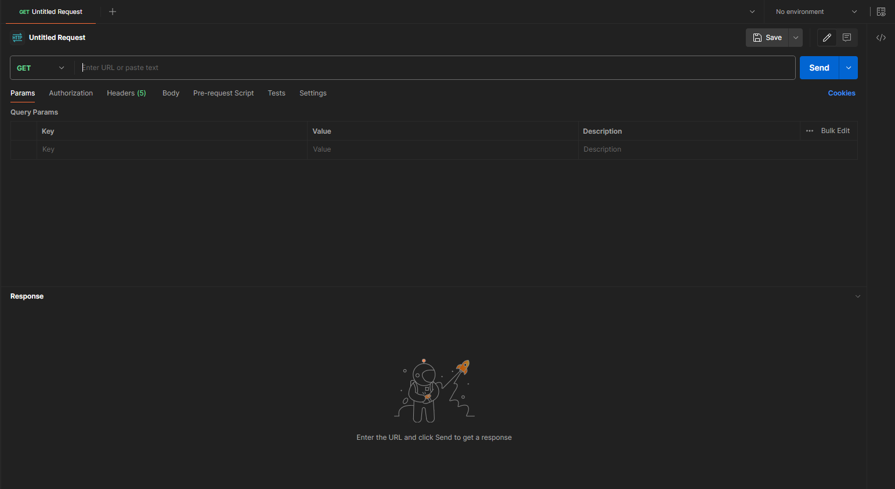
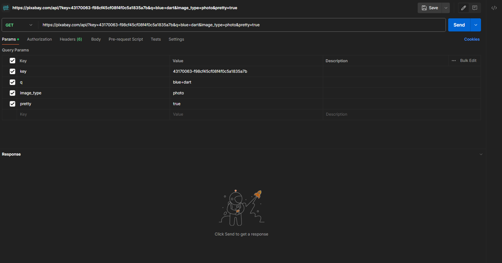
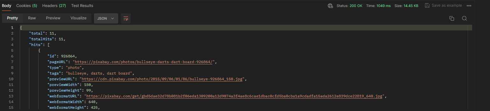

# Flutter TIL

Today I Learned about Flutter

오늘 학습한 내용을 정리하는 것

## Github

github와 IDE 연동

IDE에서 github로 커밋하기

## Dart

dart.dev 공식 문서로 기본 문법 학습

dart
-2011년 공개
-자바 대체어
-플러터 활용
-객체지향 + 함수형

기본 자료형

int(정수) - double(실수) - String(문자) - bool(논리)

문자열 포멧 = '문자열'

숫자
정수(int)
실수(double)
숫자(num)

형변환
자료형(int형, double형, String형 등)간의 변환

var 활용 타입 추론

final name = '정지원';
name <- 수정 불가

증감 연산자
뒤에++ -> num = 1
++앞에 -> num = 2

비교 연산자

형변환 as 위험

컴파일 = 사람 -> 기계어 번역

## 클래스

오브젝트 (object) : 현실 세계의 모든 객체

클래스 (class) : 오브젝트 -> 가상 구체화 (붕어빵 틀)

인스턴스 (instance) : 클래스를 -> 메모리 (붕어빵)

클래스명 : 명사 / 단어 맨 처음 대문자

필드명 : 명사 / 최초이외 단어 대문자 시작

메서드명 : 동사 / 최초이외 단어 대문자 시작

함수 : 단독 동작

메서드 : 클래스의 기능 

## 클래스 정의 효과

인스턴스 생성 가능

새로운 변수 타입 이용 가능

이용가능 타입의 종류 증가

인스턴스-클래스

인스턴스 =/= 클래스

가상 활동 = 인스턴스(=오브젝트)

인스턴스 생성 틀 = 클래스

## 필드-메서드

클래스 속성 = 필드
      동작 = 메서드
	 
final = 상수, 변경불가

## 레퍼런스? 참조 ?

Dart 에서는 타입 = 레퍼런스

ex.) int, double, String 등등 = 레퍼런스

## BSS vs Data

초기화 안된거 = BSS

초기화된 전역변수 & static 변수 할당 영역

##Heap

동적 할당 메모리 저장 <- 인스턴스가 여기에

## Stack

지역 & 매개 변수 저장소

## 캡슐화

캡슐화를 하여 멤버나 클래스로의 접근을 제어할 수 있음

특히, 필드에 “현실세계에서 불가능한 값"이 들어가지 않도록 제어

멤버에 대한 접근 지정

private 멤버는, 동일 파일내에서만 접근 가능

public 멤버는, 모든 클래스에서 접근 가능

클래스에 대한 접근 지정

함수, 변수와 동일한 규칙

## 컬렉션

List : 순서 대로 쌓여있는 구조 (아이템의 중복 허용)

Map : 키(key)와 값(value)의 쌍으로 저장 (키의 중복 불가)

Set : 순서가 없는 집합 (중복 불가)

## 상속의 기초

extends를 사용하여 기존 클래스를 기초로 하는 새로운 클래스를 정의 할 수 있다

부모 클래스의 멤버는 자동적으로 자식 클래스에 상속되므로, 자식 클래스에는 추가 된 부분만 기술 하면 된다

부모 클래스에 있는 메소드를, 자식 클래스에서 재작성 할 경우 이것을 오버라이드 한다고 한다

올바른 상속이란 “자식 클래스 is-a 부모 클래스"

상속에는 “추상적, 구체적" 관계에 있다는 것을 정의하는 역할도 있음

## 인스턴스

인스턴스는 내부에 부모클래스의 인스턴스를 가지는 다중구조를 가진다

보다 외측의 인스턴스에 속하는 메소드가 우선적으로 동작한다

외측의 인스턴스에 속하는 메소드는 super 을 사용하여 내측 인스턴스의 멤버에 접근할 수 있다

## 생성자 동작

다중구조의 인스턴스가 생성되는데, 자동적으로 가장 외측 인스턴스의 생성자가 호출 됨

모든 생성자는, “부모 인스턴스의 생성자"를 호출 할 필요가 있다

## 상속의 재료를 작성하는 개발자의 입장과 역할

다른 사람이 상속의 재료로 사용할 부모 클래스를 만드는 입장의 개발자도 존재 한다

미래의 개발자가 효율 좋게 안심하고 이용할 수 있는 상속의 재료를 작성하는 것이 그의 사명

## 추상 클래스

내용이 정의되지 않고 상세정의 미정인 메소드가 있는 클래스는 abstract 를 붙여서 추상메소드로 한다

추상 클래스는 인스턴스화 할 수 없다

추상 클래스와 추상 메소드를 활용한 상속의 재료로서의 부모클래스를 개발하면, 예기치 않은 인스턴스화나 오버라이드의 미 구현의 걱정이 없다

## 인터페이스

추상 클래스 중에, 기본적으로 추상메소드만 가지고 있는 것을 인터페이스 로서 특별 취급 한다

복수의 인터페이스를 부모로 두는 다중상속 효과가 가능

인터페이스를 부모로 두는 자식 클래스 정의에 implements 를 사용

interface 키워드는 Dart 3에 추가되었음

## 인스턴스를 애매하게 퉁치기

상속에 의한 is-a 관계가 성립한다면, 인스턴스를 부모 클래스 타입의 변수에 대입할 수 있다

부모 클래스 타입 변수에 대입하는 것으로, 퉁 칠 수 있음

## 상자의 타입 과 내용의 타입 의 역할

어떤 멤버를 이용할 수 있는가는 상자의 타입이 결정한다

멤버가 어떻게 움직이는지는 내용의 타입이 결정한다

## 취급 변경

as 키워드를 사용하여 타입 캐스팅을 수행한다

is 키워드를 사용하여 타입을 검사할 수 있다

## 다형성

같은 부모를 가지는 다른 인스턴스를 동일시하여, 부모 클래스 타입의 에 담을 수 있다

마찬가지로, 부모 클래스 타입의 인수나 리턴 값을 이용하여, 다른 클래스를 모아서 처리 가능

동일시 취급 해도, 각각의 인스턴스는 각 클래스의 정의를 따르고 다른 동작을 한다.

## Object 클래스의 기본 기능

모든 클래스는 Object 클래스의 메서드와 프로퍼티를 가지고 있다

Object 타입 변수에는 모든 인스턴스를 대입할 수 있다

## Object 클래스의 대표 메서드 및 프로퍼티

toString() : 문자열 표현을 얻음

operator == : 비교

hashCode : 해시값을 얻음

## toString()

오버라이드하여 원하는 결과를 얻도록 수정할 수 있음

## == 연산자 재정의 

== : 참조의 비교

== 연산자를 재정의 하여 나만의 동등성 규칙을 정의할 수 있다

## Set, Map 의 동작 원리

Set, Map 계열은 요소를 검색할 때 hashCode 를 사용하여 빠르다

List는 순차검색이라 느림

모든 객체는 해시값을 가진다

동일한 객체는 항상 같은 해시값을 가진다

## sort( ) 제약

정렬 대상이 Comparable 인터페이스를 구현

sort 함수가 직접 정렬 대상의 정렬 규칙을 Comparator 함수로 구현

## deep copy

Dart에서는 깊은 복사를 위한 별도의 기능 X

직접 작성해서 사용

## 타입이 없을 때 문제

1. 런타임 에러 발생 확률 상승
2. IDE가 컴파일 에러 확인 불가능

## 제네릭

타입을 나중에 원하는 형태로 정의 가능 = 타입 안저(type safe) 효과

## 열거형

정해 둔 값만 넣을 수 있는 타입

## 문자열 처리(검색)

1. contains() : 포함 관계
2. endsWith() : 끝나는 단어가 맞는지
3. indexOf() : 단어가 몇 번째에 있는지
4. lastIndexOf() : 뒤에서 몇 번째에 단어가 있는지

## 문자열 결합 방법

1. +연산
2. Srting interpolation
3. StringBuffer

## +연산자가 느린 이유

String 인스턴스는 불변 객체(immutable) 라서 느림

## 에러의 종류와 대응책

1. 문법(syntax) 에러
2. 실행(runtime) 시 에러
3. 논리(logic) 에러

## 문법(syntax) 에러

원인 : 코드의 형식적 오류

확인 : 컴파일

해결 : 컴파일러 지적사항 수정

## 실행(runtime) 시 에러

원인 : 실행 중 예상외의 사태 발생

확인 : 실행 도중 강제종료

해결 : 에러

## 논리(logic) 에러

원인 : 기술한 처리 내용의 논리 오류

확인 : 실행하면 예상외의 값 출력

해결 : 알아서

## 예외 처리

실행(runtime) 시 에러 대처법

1. try-catch 문을 사용 -> catch 블록에서 처리
2. finally 블록으로 나중에 꼭 해야하는 처리 실행
3. throw 문을 사용 -> 임의로 예외를 발생

## 파일 조작의 기본 순서

열기 -> 읽기/쓰기 -> 닫기

## 직렬화

1. 데이터 구조나 객체 상태를 저장하고 나중에 재구성할 수 있는 포맷으로 변환하는 과정

2. 객체를 파일의 형태 등으로 저장하거나, 통신하기 쉬운 포맷으로 변환하는 과정

3. 클래스 내부의 필드에 다른 클래스가 있다면 모두 직렬화 처리

## 디버깅

소프트웨어의 오류를 식별하고 수정하는 과정

SW가 올바르게 작동하는지 확인하는 데 필수

디버깅이 없으면 오류발생 확률 및 설계대로 작동하지 않을 가능성 상승

## 디버깅 기술

1. 로깅 = 코드가 실행되는 동안 발생하는 이벤트 기록

2. 브레이크 포인트 = 코드의 특정 지점에서 실행을 중지한는 데 사용

3. 디버거 = 디버깅을 쉽게 만들어주는 도구

4. 스택 추적 = 호출 스택을 추적해서 코드가 실행중인 위치 확인

## 디버깅 Tip

1. 작게 시작 = 작은 문제부터 한 가지 씩 집중

2. 단순하게 = 코드가 단순해야 오류의 원인 파악이 쉬움

3. 인내심 = 디버깅은 많은 시간이 소모되므로 인내심이 필요

## 함수형 프로그래밍

자료 처리를 수학적 함수의 계산으로 취급

가변 데이터를 멀리하는 특징

Dart는 객체지향(OOP)와 함수형(FP)의 특징을 모두 제공

## 고계 함수

함수를 파라미터로 받는 함수

1. where : 조건 필터링

2. map : 변환

3. forEach : 전체 뺑뺑이

4. reduce : 하나씩 줄이기

5. fold : 하나씩 접기

6. any : 있는지 없는지

## Named Parameters

{ } <- 를 사용하여 파라미터에 이름 붙이기 강제

## 파라미터 기본값 지정

= <- 를 사용하여 기본값 지정

## Optional positional parameter

[ ] <- 를 사용하여 위치를 지정하는 옵션 파라미터 사용

반드시 세번째에 device 설정/미설정 가능

default값 지정 가능

## 동기(sync) 프로그래밍

1. 순차적 코드 실행.
2. 작업이 완료될 때까지 프로그램이 중단될 수 없다.
3. 모든 작업은 이전 작업의 실행이 완료될 때까지 기다려야 한다.

## 비동기(async) 프로그래밍

1. 임의 순서 또는 동시 작업 실행이 가능.
2. 콜백, Future, async - await 방식이 있다.

## 콜백

실행 가능한 함수를 인자로 전달하여, 특정 상황이 발생할 때 호출

## Future

1. 미래에 완료되는 객체

2. Javascript 의 Promise와 동일

3. Future 는 ‘미래'에 받아올 값을 의미

## then( ) 사용의 문제점

1. 동기식 코드 보다는 결과 예측이 어렵다.
2. 단계가 많아지면 사용 어렵다.
3. 로직이 복잡해 지면 예외처리가 힘들다.

## async - await 문법

1. 비동기 코드 작성 시 유용.
2. await 키워드는 해당 Future 가 끝날 때까지 함수 실행을 대기.

## 데이터 소스

데이터의 근본

프로그램이 사용하는 원천 데이터 전부

## 데이터 소스 변환

1. 데이터 소스에서 추출
2. 추출한 데이터(미가공 상태) 사용 가능한 데이터로 변환

변환 : 문자열 형태의 Json to Dart Map 

## 데이터 소스 종류

1. Text
2. File
3. JSON
4. XML
5. CSV
6. RDBMS
7. NoSQL

등등

## 데이터 클래스 6개

1. final
2. fromJson
3. toString()
4. ==
5. hashCode
6. copyWith

## Model Class

1. 모델 객체 클래스의 속성에 대한 데이터 조회
2. 기능 X
3. 데이터 소스 응용 시 사용

## 모델링 방법

1. DDD (Domain Driven Design)

유사한 업무의 집합

특정 상황 or 특정 객체가 중심이 될 수 있다

도메인을 클래스로 작성

2. ORM (Object-relational mapping)

데이터 소스 = DB => DB - 모델 상호 변환

## 패턴

1. Factory 패턴

인스턴스를 만드는 패턴

2. Singleton 패턴

1개의 인스턴스만 생성되는 것을 보증하기 위한 패턴

3. Repository 패턴

DB에 접근하는 객체를 추상화

데이터소스 통신을 담당 객체를 캡슐화

데이터를 추가, 조회, 수정, 삭제(CRUD)하는 역할을 담당

## 테스트

1. 수동 테스트 : 인간이 하는 테스트 (print)
2. 단위 테스트 : 1개의 함수를 테스트 (test 코드)
3. 여러개 연관된 클래스나 함수를 함께 테스트 (UI test, Integration test)

## 테스트 방법론

1.  화이트 박스 테스트

내부 구조와 동작에 중점을 두고 테스트하는 방법

코드의 내부 로직, 제어 흐름, 데이터 흐름 등을 이해하고 검증하는 데에 사용

테스트 케이스를 설계할 때 코드의 특정 부분을 직접 확인

주요 기법으로는 구문 검사, 경로 검사, 조건/분기 검사 등이 있다

2. 블랙박스 테스트

소프트웨어의 내부 구조를 무시하고 기능을 테스트하는 방법

시스템이 어떻게 동작하는지에 대한 내부 정보를 알 필요 없이 사용자 관점에서 테스트

테스트 케이스는 입력 값과 예상 출력 값에 기반하여 설계

요구 사항을 충족하는지 확인하고, 시스템의 기능적 및 비기능적 요구 사항을 테스트

주요 기법으로는 등가 분할, 경계 값 분석, 상태 전이 테스트 등이 있다

## 단위(Unit) 테스트

특정 모듈(모듈 = 메서드, 기능)이 의도한 대로 잘 작동하는가를 테스트

가장 작은 단위의 테스트

## 필수 단위 테스트 케이스

1. DB

스키마가 변경되는 경우

모델 클래스가 변경되는 경우

2. Network

예측한 데이터가 제대로 들어오는지

3. 데이터 검증

예측한 데이터를 제대로 처리하고 있는지

## 테스트 케이스

1. 동등 분할
2. 경계값 분석

## 좋은 테스트 6가지 조건

1. Fast (빠르고)
2. Reliable (믿을 수 있고)
3. Independent (독립적인)
4. Ease of Maintenance (유지 관리가 쉽고)
5. Nearly compacted code (거의 압축적인 코드)
6. Dependencies should be less (의존성이 적어야 한다)

## DTO? Mapper?

1. DTO (Data Transfer Object): 서버로부터 받은 데이터(JSON)를 앱에서 사용할 모델 클래스로 변환하기 전의 중간 단계로 사용되는 객체. 

주로 JSON 데이터를 담기 위한 목적으로 사용됩니다.

서버로부터 받는 JSON 데이터는 동적이며, 때로는 예상치 못한 null값 또는 잘못된 형식의 데이터를 포함할 수 있습니다. 이러한 문제를 해결하기 위해 DTO를 도입하여, 데이터의 안정성을 보장하고, 앱에서 사용하기 쉬운 형태로 데이터를 전처리할 수 있습니다.

모든 필드가 Nullable 변수로 선언되어 있으며, 직렬화 및 역직렬화를 지원합니다.

JSON 데이터를 그대로 받아들여, 클라이언트 개발자가 서버로부터의 잘못된 데이터에 대해 방어할 수 있는 수단을 제공합니다.

2. Mapper: DTO 객체를 앱의 비즈니스 로직에 맞는 모델 클래스로 변환하는 역할을 합니다.

Mapper를 사용함으로써, DTO와 모델 클래스 간의 변환 로직을 구현하여, 데이터 처리 과정에서의 복잡성을 줄이고, 유지보수성을 향상시킬 수 있습니다.

Mapper는 DTO의 모든 부분을 변환하지 않고, 필요한 부분만 모델 클래스로 변환하는 역할을 합니다.

## 네트워크 통신

URL을 사용한 고수준 액세스

고수준 언어 = 사람이 파악하기 좋은 언어

## JSON

1. 서버 - 클라이언트 통신에서 표준처럼 사용되는 데이터 교환 형식이다.
2. 가볍고 사람이 읽기 쉽다
3. Map과 같은은 간단한 구조
4. 직렬화 하여 문자열로 나타내기 쉽다
5. 대부분의 언어가 이를 파싱할 수 있기 때문에 상호 운용성은 걱정할 것이 없다

## HTTP 개념

1. HTTP hyper text transfer protocol
2. 원래 문서 전송용으로 설계된 상태 비저장용 프로토콜
3. 브라우저가 GET 요청으로 웹 서버의 문서를 읽어오는 용도였다.
4. 지금은 서버와 클라이언트가 텍스트, 이미지, 동영상 등의 데이터를 주고 받을 때 사용하는 프로토콜로 확장됨
5. 웹 상에서 보는 이미지 영상 파일과 같은 바이너리 데이터도 http 멀티파트나 base64 인코딩하여 사용

##무상태성

1. HTTP는 상태 비저장 프로토콜
2. HTTP는 요청 메세지를 보내기 직전까지 대상 컴퓨터가 응답 가능한지 알 방법이 없음
3. Stateless 프로토콜, 즉 상태가 없는 프로토콜이라고 한다.
4. Stateful 프로토콜로는 TCP가 있다.

##HTTP 요청과 응답

1. 클라이언트는 항상 자신이 보낸 요청에 대한 응답을 알 수 있어서 로직이 단순해지는 장점
2. 클라이언트는 서버로 HTTP 요청을 보내기 직전까지 실제로 서버가 동작하는지 알 방법이 없는 단점

## Stateful 프로토콜

1. 연결되면 연결을 끊기 전까지 계속 메세지를 주고 받는 프로토콜
2. 한쪽에 문제가 생기면 다른쪽에서 감지 가능
3. 텍스트가 아닌 바이너리 데이터를 전송
4.패킷 크기가 HTTP에 비해 작음→ 속도 빠름
5.각 요청이 소켓 1개를 공유
6.따라서 요청르 식별할  식별자가 필요
7.응답을 알 수 있는 방법이 없기 때문에 타임아웃에 대해 직접 구현해야 함

## Socket을 사용한 저수준 액세스

저수준: 컴퓨터가 이해하기 쉽게 작성된 프로그램 또는 API

## TCP/IP

신뢰성 있는 연결지향성 앱에서 사용(이메일 , 파일 전송, 웹브라우저)

## UDP

1. 신속한 데이터 전송이나 손실 가능성이 있는 상황에 주로 사용
2. 비연결형 프로토콜
3. 데이터 전달 보장이 안되어 신뢰성 낮음
4. 흐름 제어 없음
5. 단순성
6. 멀티캐스팅 및 브로트캐스팅

## Result pattern

1. 함수의 실행 결과를 표현하기 위해 사용되는 디자인패턴
2. 성공적으로 실행될 경우 결과값을, 실패할경우 에러를 반환

## 에러처리의 기본 try-catch

- 기본적으로 예외처리는 try - catcy 활용

- Result Pattern을 사용하여 다양한 상황에서 성공, 실패시 처리

- Result 클래스는 성공시에는 데이터를, 실패시에는 Exception(또는 String)을 담는 객체를 정의

## sealed 클래스

- 타입 봉인 효과 

- enum 과 비슷 + 다른 객체 참조

## freezed

- 불변성 지원, 복사기능, 유니온,sealed 클래스, JSON 직렬화, 커스텀 메소드와 게터 지원

- 불변성(immutability) + json_serializable + Equatable

- toJson / fromJson 함수를 제공해 json으로 쉽게 serialize / deserialize

- equals (==)와 hashCode를 자동 생성

- 선언된 필드들의 getter를 만들어서 외부에서 값을 변경할 수 없도록 한다

- copy와 copyWith를 자동으로 구현해주고, 종속성을 가지는 하위 클래스들에 대해서도 쉽게 deepCopy할 수 있도록 해준다

- sealed class 작성을 편하게 해준다

## freezed를 활용한 Data Class (모델) 작성

빌드 명령: dart run build_runner build --delete-conflicting-outputs

## 정리
1. enum 은 클래스만큼 자유롭지 않다
2. equals, hashcode 재정의가 불가능하다
3. sealed class 는 서브타입을 봉인한다.
4. sealed class 는 패턴매칭을 활용하여 모든 서브타입에 대한 처리를 하기 용이하다.
5. Result 패턴은 여러가지 종류의 성공과 실패를 처리하기 용이한 패턴이다.
6. 앱의 규모에 맞는 Result패턴을 사용하자
7. 소규모: ver1으로 충분
8. 다국어 지원: ver2

## API 이미지 검색

1. https://pixabay.com/?page=2 에 회원가입을 하여 API key가 있는 링크를 얻는다.
2. postman에 해당 링크를 붙여넣기 한다.
3. q 파라미터에 값을 입력하여 API 사용 방법을 학습한다.

## 좋은 설계 원칙

1. 응집도와 결합도: 응집도는 모듈 내 요소들간의 연관성을, 결합도는 모듈 간 의존도를 나타냅니다.

2. 코드 작성의 6가지 원칙:

-DRY (Don't Repeat Yourself): 중복 코드 방지
-PIE (Program Intently and Expressively): 명확하고 표현력 있는 코드 작성
-SRP (Single Responsibility Principle): 한 클래스는 하나의 책임만 가짐
-OCP (Open Closed Principle): 확장에는 열려 있고, 변경에는 닫혀 있어야 함
-SDP (Stable Dependencies Principle): 안정적인 것에 의존
-ADP (Acyclic Dependencies Principle): 의존성 사이클 방지

## 디자인 패턴

- 디자인 패턴의 정의: 특정 문맥에서 재사용 가능한 해결책을 제공하는 소프트웨어 디자인의 형식화된 관행입니다.

- 디자인 패턴의 장점: 개발자 간 커뮤니케이션 개선, 객체지향 설계 원칙 이해도 향상

- GoF의 23가지 디자인 패턴: 소프트웨어 공학에서 중요한 23가지 디자인 패턴

- 초보자에게 권장되는 패턴: Factory 패턴, Singleton 패턴, Decorator 패턴

- 다양한 디자인 패턴 예시:

1. Iterator 패턴: 반복 구조의 추상화
2. Facade 패턴: 복잡한 시스템을 단순한 인터페이스로 제공
3. Strategy 패턴: 동일 계열의 알고리즘을 정의하고 상호 교체 가능하게 함
4. Observer 패턴: 객체의 상태 변화를 관찰하고 변경 시 통지

## 아키텍처 디자인 패턴

- MVC, MVP, MVVM 등: 소프트웨어의 전체적인 구조에 대한 패턴

- Repository 패턴: 데이터 소스에 접근하는 객체를 추상화하고 캡슐화

## Flutter의 기본 구성 요소인 Widget

Flutter에서 화면을 그리는 데 사용되는 기본 단위.

## 필수 위젯 목록:

Scaffold, AppBar, Container, Text, Center, Column, Row, ElevatedButton, Navigator.push (화면 전환), Image.network, Image.asset, TextField, ListView, SizedBox, Stack, Form, Padding, SingleChildScrollView, FloatingActionButton

## StatefulWidget

상태를 가지고 있는 위젯으로, 화면에 변경사항이 있으면 다시 그려야 하는 경우 사용

initState(), dispose() 등의 생명주기 함수를 포함

## StatelessWidget

상태가 없는 위젯으로, 정적인 화면을 나타낼 때 사용

## MaterialApp

Android 스타일의 앱 개발 시 사용되는 최상위 위젯

iOS 스타일은 CupertinoApp을 사용

## Sccafold

- 앱의 기본적인 구조와 레이아웃을 정의

- 앱의 기본 틀을 설정하고, 다음과 같은 요소들을 제공

## AppBar

- 앱 상단에 위치하는 타이틀 바

- 앱의 제목, 로고, 아이콘 등을 표시

## Body

- 앱의 주요 내용을 표시하는 영역

- 텍스트, 이미지, 버튼 등 다양한 위젯을 포함

## FloatingActionButton

- 앱의 주요 기능을 실행하는 버튼

- 일반적으로 화면 오른쪽 하단에 위치

## BottomNavigationBar

- 앱의 주요 페이지로 이동하는 데 사용되는 탭 바

## 기타 TIP

1. Expanded: 상대적으로 공간을 차지할때 필요
2. Container안에 Padding이 들어있다
3. Size가 없어서 에러가 날때는 SizedBox로 감싸서 보여줄 수 있다
4. ShrinkWrap: Grid.View에서 스크롤을 상실하고 데이터를 사이즈에 맞게 조절

## StatefulWidget의 생명주기

1. 생성(Create): StatefulWidget 인스턴스가 생성될 때 호출됩니다. 이 단계에서는 아직 State 객체가 생성되지 않았습니다.

2. 초기화(Initialization): StatefulWidget이 생성된 후, Flutter 프레임워크는 createState() 메서드를 호출하여 State 객체를 생성합니다. 이 단계에서는 State 객체의 initState() 메서드가 호출되어 초기 상태를 설정할 수 있습니다. initState() 메서드는 State 객체의 생명주기 동안 단 한 번만 호출되며, 여기서 리스너 등록, 초기 데이터 로드와 같은 작업을 수행할 수 있습니다.

3. 위젯 트리에 추가(DidChangeDependencies): initState() 다음으로 State 객체가 위젯 트리에 처음으로 추가될 때 didChangeDependencies() 메서드가 호출됩니다. 이 메서드는 BuildContext에서 의존성이 변경될 때마다 호출되며, 여기서는 InheritedWidget의 데이터를 읽는 등의 작업을 수행할 수 있습니다.

4. 빌드(Build): State 객체가 준비되면, Flutter는 build() 메서드를 호출하여 위젯을 빌드합니다. build() 메서드는 위젯의 UI를 구성하는 데 사용되며, 상태 변경이 발생할 때마다 호출됩니다. setState() 메서드를 호출하여 상태를 변경하면, Flutter는 build() 메서드를 다시 호출하여 UI를 업데이트합니다.

5. 업데이트(Update): 위젯의 구성이 변경되거나 부모 위젯이 이를 재구성할 때, didUpdateWidget() 메서드가 호출됩니다. 이 메서드는 위젯이 업데이트될 때마다 호출되며, 이전 위젯 인스턴스를 인자로 받아 변경 사항을 비교할 수 있습니다.

6. 위젯 트리에서 제거(Deactivate): 위젯이 위젯 트리에서 제거될 때 deactivate() 메서드가 호출됩니다. 위젯이 일시적으로 트리에서 제거되고 나중에 다시 추가될 가능성이 있습니다.

7. 소멸(Destroy): 위젯이 영구적으로 제거될 때 dispose() 메서드가 호출됩니다. 이 메서드는 리소스 해제, 리스너 해제 등의 정리 작업을 수행하는 데 사용됩니다. dispose() 메서드 호출 후, State 객체는 더 이상 사용할 수 없습니다.

## initState

1. 초기 데이터 로드: 앱이 시작할 때 필요한 데이터를 미리 로드합니다. 예를 들어, 네트워크 요청을 통해 데이터를 가져오거나, 로컬 데이터베이스에서 데이터를 읽는 작업을 수행할 수 있습니다.

2. 리스너 등록: 외부 이벤트나 데이터 스트림에 대한 리스너를 등록합니다. 예를 들어, Firebase와 같은 실시간 데이터베이스의 변경사항을 감지하거나, 사용자의 위치 정보를 추적하는 리스너를 설정할 수 있습니다.

3. 애니메이션 컨트롤러 초기화: 애니메이션을 사용하는 경우, initState()에서 애니메이션 컨트롤러를 초기화하고 설정할 수 있습니다. 애니메이션의 기간, 반복 여부 등을 설정하고, 애니메이션 시작을 준비합니다.

4. 상태 변수 초기화: 위젯의 초기 상태를 설정합니다. 예를 들어, 사용자 인터페이스의 특정 요소가 처음에 보이거나 숨겨져야 하는 경우, 해당 상태를 initState()에서 초기화할 수 있습니다.

## MVVM(Model-View-ViewModel) 패턴

소프트웨어 엔지니어링에서 사용자 인터페이스를 설계하기 위한 아키텍처 패턴

특히 모바일 애플리케이션 개발에서 자주 사용

## MVVM의 구성요소

1. View
사용자에게 보여지는 UI 화면
View는 사용자의 입력을 받아 ViewModel에 전달
ViewModel로부터 데이터 변화를 수신하여 화면을 갱신
View는 수동적이며, 오직 화면을 표시하는 역할만 담당

2. ViewModel
View를 위한 모델
View에 표시될 데이터와 명령을 포함
ViewModel은 비즈니스 로직을 처리
View로부터의 사용자 입력을 Model로 전달하고, Model로부터의 데이터 변경을 수신하여 View에 전송
ViewModel은 데이터의 상태 관리 및 모든 변수는 ViewModel에만 존재
오류 발생 시나 수정 필요 시 ViewModel만 검토
ViewModel은 Model에 데이터를 반환하지 않으며, 데이터 조작만 담당

3. Model
애플리케이션의 데이터 비즈니스 로직을 담당
데이터베이스, 파일, 서버와의 통신을 포함하여 데이터를 관리하고 처리하는 역할
Model은 주로 데이터의 저장소(repository) 역할을 하며, 비즈니스 로직의 구현을 담당

## ViewModel 사용 이유

ViewModel은 비즈니스 로직과 UI의 분리를 가능하게 하여, 코드의 가독성과 유지보수성을 향상

데이터 처리와 UI 갱신의 분리로 인해 테스트가 용이해지며, 다양한 UI 구성요소와의 재사용성 향상

## 사용 주의 사항

ViewModel은 특정 View에 대한 로직만을 담당

하나의 View에는 하나의 ViewModel이 대응

각 View와 ViewModel 간의 결합도를 낮추어 유지보수성을 향상시키는 것이 목적

## 팁

1. 리스트 크기 관리하기
- Column 안에 리스트를 넣을 때 크기를 정확히 모르는 경우가 있을 때는 다음과 같은 방법을 사용 가능
    - 리스트를 `Expanded`로 감싸거나,
    - `shrinkWrap` 속성 값을 주어 크기를 조절

2. 수정 불가능한 리스트 만들기
- `List.unmodifiable(_users)`는 리스트 안에 있는 객체를 수정할 수 없도록 만들어주는 named 생성자

3. 뷰모델에서 Repository 사용 시
- Repository를 뷰모델에서 불러올 때는 보안을 위해 private으로 선언해
- 이렇게 하면 화면에서 마음대로 조작 불가

4. 뷰모델 생성 순서
- 뷰모델은 화면보다 먼저 생성

## InheritedWidget

1. 필요한 데이터 받기
- 변화가 필요한 위젯에 필요한 데이터를 전달하기 위해서는 해당 데이터를 트리의 Top에서 Bottom까지 생성자를 통해 전달

2. 의존성 주입
- 의존성 주입은 한 객체가 다른 객체에서 사용되도록 하는 것
- 생성자를 통해 필요한 객체를 전달하는 것이 일반적이나, 의존성 트리가 깊어질수록 단점
- InheritedWidget은 이러한 단점을 해소 가능

3. BuildContext와 covariant
- BuildContext는 위젯의 위치와 상태를 파악
- covariant는 자식 클래스에서 부모 클래스의 타입을 더 구체적으로 설정

4. Context 조작
- Context를 조작하는 로직은 `initState()`에서는 안되고, `didChangeDependencies()`에서 조작

## 앱 배포하기

1. 안드로이드 네이티브 방식
- 앱 배포를 위해 안드로이드 네이티브 방식을 사용하는 것이 더 편리
- 이를 위해서는 안드로이드 폴더로 프로젝트 오픈

2. 권한 설정
- 권한 설정을 해놓지 않으면 네트워크 등의 문제가 발생

3. 주의할 점
- 앱을 배포할 때는 반드시 개인정보처리방침을 작성

4. 버전 관리
- 앱의 버전을 올리는 것은 수동으로 진행해야 하는 경우도 있는데 보통 버전이 꼬여서 수동으로 수행

## 상태관리 라이브러리

1. 앱에서 화면에 필요한 변수를 관리
2. UI와 상호작용하는 데이터를 효율적으로 관리하여 앱의 상태를 관리
3. 화면이나 위젯의 상태 변화에 따라 UI를 업데이트하기 위해 상태를 관리
4. 다양한 라이브러리와 패턴 사용

## 상태 관리의 개념

1. 상태는 데이터, 변수를 의미
2. 효율적으로 관리하여 변수가 변경되면 UI도 자동으로 업데이트되도록 하는 것이 상태 관리의 목적

## InheritedWidget + (ValueNotifier 또는 ChangeNotifier)

1. InheritedWidget은 위젯 트리의 부모에서 자식 위젯으로 데이터를 전달하는 방식
2. ValueNotifier 또는 ChangeNotifier와 결합하여 상태를 관리
3. 복잡하지만 효과적인 상태 관리

## Provider

1. Provider는 InheritedWidget과 유사한 방식으로 상태를 관리하는 라이브러리
2. 제약이 있을 수 있지만, 올바르게 사용하면 효율적인 상태 관리 가능

## Riverpod

1. 런타임 에러를 없애는 등 다양한 기능을 제공
2. MVVM, 클린 아키텍처와는 별개의 리버팟만의 아키텍처 사용

## ChangeNotifierProvider

1. ChangeNotifierProvider는 Provider의 일종
2. `watch`와 `read`를 사용하여 상태를 관찰하고 사용
3. Consumer를 사용하여 모델을 제공하고 UI를 업데이트
4. StreamBuilder, ListenableBuilder와 유사한 느낌으로 사용하여 UI 향상

## UI 상태 홀더 클래스란?

1. UI 상태 홀더 클래스는 UI의 상태를 저장하고 관리하기 위한 클래스
2. ViewModel 내부에 존재하며, 애플리케이션의 상태를 직접적으로 표현하는 변수들로 구성
3. 주로 State 클래스 또는 UI State 클래스로 생성
4. 사용자의 입력이나 애플리케이션의 내부 이벤트에 의해 변경될 수 있는 동적인 데이터를 관리

## 사용 이유 및 이점

1. 코드의 간소화 및 유지보수
2. 상태 홀더 클래스를 사용하면 상태 관련 로직을 한 곳에 모아 관리
3. 전체적인 코드의 복잡성을 줄이고, 수정 및 업데이트가 필요할 때 쉽게 접근하고 변경
4. 크고 복잡한 애플리케이션에서 유지보수의 효율성을 크게 향상

## 테스트의 용이성

1. 상태 홀더 클래스를 독립적으로 구현함으로써, UI 코드와 상태 관리 코드를 분리
2. 각 기능을 독립적으로 테스트할 수 있는 가능성을 제공
3. 오류를 줄이고 애플리케이션의 안정성을 높이는 데 용이

## 가독성과 재사용성 향상

1. 명확하게 정의된 상태 홀더 클래스를 사용함으로써 코드의 가독성이 향상
2. 재사용 가능한 구성 요소로 상태 관리 로직을 분리하면, 다른 프로젝트나 애플리케이션의 다른 부분에서도 동일한 상태 관리 클래스를 재사용
3. 개발 시간을 단축하고, 프로젝트의 일관성을 유지

## 필수성에 대한 고려

1. 간단한 UI 또는 상태가 거의 변하지 않는 화면에서는 별도의 상태 홀더 클래스 없이 구현 가능
2. 사용자의 상호작용에 따라 동적으로 변하는 복잡한 상태를 관리해야 하는 경우 코드의 명확성과 효율성 위해 사용

## Provider

1. Provider: 데이터 또는 객체를 생성하고, 이를 하위 위젯에게 제공하는 역할다.
2. Consumer: Provider가 제공하는 데이터를 사용하는 위젯
2.1 Provider에서 제공3. 하는 데이터에 의존하며, 데이터가 변경될 때마다 자동으로 리빌드됩니다.
4. ChangeNotifier: 데이터의 변경을 감지하는 클래스
4.1 이 클래스를 상속받은 모5. 델은 데이터가 변경될 때마다 리스너들에게 알릴 수 있습니다.
5. ChangeNotifierProvider: ChangeNotifier를 상속받은 모델을 Provider로 제공할 때 사용

## Provider 사용법

1. 모델 정의: ChangeNotifier를 상속받아 모델을 정의하고, 내부 데이터가 변경될 때 notifyListeners()를 호출
2. Provider로 데이터 제공: 앱의 상단 레벨에 Provider를 배치하여 모델을 제공
3. Consumer로 데이터 사용: Consumer 위젯을 사용하여 Provider로부터 데이터를 받고, 데이터가 변경될 때마다 UI를 업데이트

## Provider 장점

1. 중앙 집중식 관리: 앱의 전체 상태를 한 곳에서 관리할 수 있어 코드의 유지 관리 용이
2. 성능 최적화: Consumer 위젯은 필요한 데이터가 변경될 때만 리빌드되므로, 불필요한 리빌드를 줄여 성능을 최적화
3. 유연성: 다양한 종류의 Provider를 조합하여 사용할 수 있어, 복잡한 상태 관리 요구사항도 충족 가능

## 디바운스란?

1. 디바운스는 짧은 시간 동안 반복되는 이벤트에 대해 마지막 이벤트만을 처리하도록 지연시키는 기능

2. 검색창에 사용자가 입력하는 동안, 입력이 끝난 후 일정 시간이 지나서야 실제로 검색을 수행하는 것

3. 불필요한 네트워크 요청이나 계산을 감소

## Flutter에서 디바운스 구현하기

1. Flutter에서 디바운스를 구현하기 위해서는 일반적으로 Timer 클래스를 사용

2. Duration을 설정하여 사용자의 마지막 입력 이후 일정 시간 동안 추가 입력이 없을 경우에만 함수나 로직을 실행

## Flutter Use Case

Use Case는 애플리케이션의 기능을 정의하고 설명하는 데 사용되는 개념

플러터에서 Use Case는 Dart 언어의 call 메서드를 활용하여 구현

call 메서드는 암시적으로 생성자처럼 동작하므로, 이를 오버라이드하여 Use Case를 정의

## Flutter 클린 아키텍처

클린 아키텍처는 프레젠테이션, 도메인, 데이터 레이어로 구성

각 레이어는 서로 독립적이고 낮은 의존성 소유

프레젠테이션 레이어는 UI 로직을 담당

도메인 레이어는 비즈니스 로직 담당

데이터 레이어는 데이터 액세스 및 제어를 담당

클린 아키텍처를 적용하면 코드의 유지보수성과 확장성이 높아지며, 테스트 및 디버깅이 용이

플러터에서는 get_it과 injectable 패키지를 활용하여 클린 아키텍처를 구현

이를 통해 의존성 주입, API 요청 처리, 예외 처리 등을 체계적으로 관리

## 클린 아키텍처의 장점

코드의 유지보수성과 확장성 향상

테스트 및 디버깅 용이성 증가

각 레이어의 독립성으로 인한 유연성 확보

비즈니스 로직과 UI 로직의 분리로 인한 코드 가독성 향상

## 1. 팀 편성 및 초기 설정

- 팀 편성: 프로젝트를 시작하기 전에 팀원을 편성

- 커뮤니케이션 도구 선택: 팀원 간의 원활한 소통을 위해 디스코드, 노션, 피그마 등의 도구를 선택

- GitHub 조직 생성: 프로젝트를 관리할 GitHub 조직을 생성

- GitHub 위키 사용: 코드 컨벤션 가이드 등을 작성할 수 있는 GitHub 위키를 설정

## 2. GitHub 저장소 및 프로젝트 관리

- GitHub 저장소 생성: 협업을 위한 중앙 저장소를 GitHub에 생성

- 프로젝트 생성: GitHub에서 프로젝트를 생성하여 이슈와 브랜치 관리

- 접근 설정 변경: 기본적으로 프로젝트가 비공개로 설정되어 있으므로, 필요시 공개 설정으로 변경

## 3. 개발 프로세스

- 이슈 생성: 작업을 구체적인 단위로 나누어 이슈를 생성

- 브랜치 전략: 개발을 위한 브랜치를 생성하고, 기본 브랜치를 `dev`로 설정

- 작업 진행: 각 이슈에 대해 브랜치를 생성하고, 해당 브랜치에서 작업을 진행

- 커밋 및 푸시: 작업이 끝난 후 변경사항을 커밋하고 푸시

- 풀 리퀘스트와 머지: 작업이 완료되면 풀 리퀘스트를 생성하고, 검토 후 `dev` 브랜치로 머지

- 브랜치 삭제 및 이슈 닫기: 머지가 완료되면 사용한 브랜치를 삭제하고, 관련 이슈를 닫기

## 4. 반복적인 작업 흐름

- 반복 프로세스: 위의 단계들은 프로젝트 진행 중 지속적으로 반복

## Riverpod의 기본 개념

Riverpod는 'Provider'라는 개념을 기반

기존의 Provider 패키지와 비슷하게, Riverpod도 앱 전체에 걸쳐 데이터를 공유하고, UI가 데이터의 변화에 반응

Riverpod는 컴파일 타임 안전성을 제공하며, Provider에 비해 더 유연

## 주요 특징과 장점

컴파일 타임 안전성: Riverpod는 컴파일 시점에 오류를 잡아내어 런타임 오류의 가능성 감소

테스트 용이성: 상태 관리 코드를 단위 테스트 용이

유연성과 확장성: 다양한 상태 관리 방법론을 지원하며, 사용자가 필요에 따라 쉽게 확장

Context-free: Riverpod는 Flutter의 BuildContext에 의존하지 않으므로, 어떤 위치에서든 프로바이더에 접근 가능

## 주요 구성 요소

Provider: 가장 기본적인 상태 관리 단위로, 어떤 값이나 객체를 제공

StateProvider: 상태를 가지는 Provider로, 상태 변경이 필요할 때 사용

StreamProvider와 FutureProvider: 비동기 작업의 결과를 반영하기 위해 사용되며, Stream과 Future를 각각 사용

ChangeNotifierProvider: 복잡한 상태 관리에 적합하며, ChangeNotifier를 사용하여 상태 변화 알림

## 파이어베이스

1. 실시간 데이터베이스 (Realtime Database): 실시간으로 데이터를 동기화하여 모든 연결된 클라이언트 간에 데이터를 즉시 공유할 수 있는 NoSQL 데이터베이스입니다.

2. 파이어스토어 (Firestore): 클라우드 네이티브 NoSQL 데이터베이스로, 구조화된 쿼리 및 실시간 업데이트를 지원하여 사용자 경험을 개선합니다.

3. 인증 (Authentication): 사용자 인증을 위한 간편한 API를 제공하여 이메일/비밀번호, 소셜 로그인 (구글, 페이스북, 트위터 등), SMS 인증 등 다양한 방법으로 사용자를 인증할 수 있습니다.

4. 스토리지 (Storage): 클라우드에 파일을 안전하게 저장하고 엑세스할 수 있는 기능으로, 이미지, 동영상, 문서 등을 저장할 수 있습니다.

6. 호스팅 (Hosting): 정적 및 동적 웹 애플리케이션을 배포하고 웹 호스팅을 관리할 수 있습니다.

7. 클라우드 함수 (Cloud Functions): 서버리스 백엔드로, 이벤트 기반으로 코드를 실행하여 애플리케이션을 확장할 수 있습니다.

8. 분석 (Analytics): 애플리케이션 사용 통계를 수집하고 분석하여 사용자 행동을 이해하고 개선할 수 있는 도구를 제공합니다.

9.성장 (Growth): 사용자 획득 및 유지를 위한 마케팅 및 애널리틱스 도구를 제공하여 애플리케이션의 성장을 촉진합니다.

-------------------
알고리즘 학습 필요

## 샘플
- https://github.com/namjunemy/TIL
- https://github.com/milooy/TIL
- https://github.com/YutoMizutani/til
