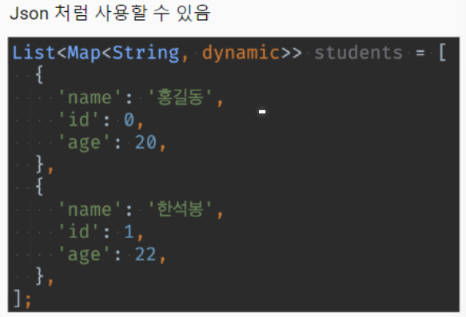
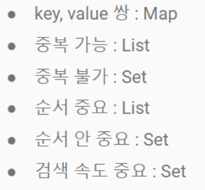

# 20240308 플러터 과정 4일차   

### 1. 꼭 기억할 것! 🏅
#### 생성자와 파라미터
**ㅁ Named Parameter**

    ㅇ {} (중괄호) 씌우면 -> named & optional parameter

    여기서,  
    1) required 붙임 -> named & required parameter 
    2) 변수에 기본값을 주거나 nullable 만듬 -> named & optional parameter

    💡Tip. 생성자 작성 시 고려할 점
    1. 인수가 필수냐 선택이냐를 결정
    2. 순서가 바뀔 수 있는지 없는지 결정

     
**ㅁ 정적 필드**

    ㅇ 정적 필드 (<> 동적 필드 (변수))
    ㅇ 정적 필드 선언 방법
        1. static 사용
        2. 클래스 최상위에 선언
        - 이 방법으로 사용

    ㅇ 정적 필드에의 접근
        1. 다른 클래스에서도 import, 인스턴스 생성없이 사용 가능

        2. 특정 클래스에서 생성한 경우, 그 클래스의 멤버가 아니므로 
            final hero1 = Hero(name: '홍길동', hp: 100); 
        인 경우 hero1.money가 아니라 Hero.money로 접근해야함.

        3. 정적 메소드 안에서 액세스 할 수 있는 것은 정적 멤버만 가능

**ㅁ 파라미터로 넘어온 값은 불변**

* 위의 경우 넘어온 second를 쓸 수 없음.
* 만약 넘어온 인수값을 변경하여 쓰고 싶다면 새로운 변수에 담아서 사용해야 함.

### 2. 아리까리 😒
생성자 오버로드
메서드 오버로드

### 3. 한줄 정리
- 생성자를 1개도 작성하지 않으면 기본 생성자가 있다고 본다.
- 객체를 final로 선언한 경우에도 안의 멤버변수는 변경 가능함.
- import는 상대경로로 할 것(일관성 유지!).
- required parameter와 named parameter를 동시에 사용할 경우 required parameter가 앞에 와야함.
- final cleric2 = Cleric('홍길동2'); 은 아래와 동일함(Cleric만 생략된 것).  
  final Cleric cleric2 = Cleric('홍길동2');

### 4. 좋은 코딩을 위한 습관
1) 상수 /변수 / 타입별로 나눠서 선언
2) if, for문 한줄짜리여도 중괄호 써서 처리
3) 변경 가능성 없는 변수는 상수(final)로 선언
4) 노란불 뜨면(warning) 찾아보고 해결해 볼 것!
5) commit은 자주 할 것!

### 5. 용어 정리
- 안티 패턴 : 에러는 안나지만 써서는 안되는 것

 