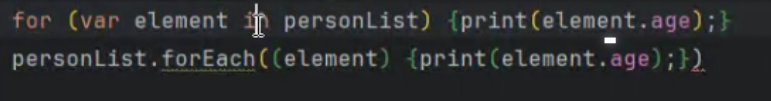

# <span style="color:lime">20240311 플러터 과정 2주차 월요일</span>   

### 1. 꼭 기억할 것! 🏅
#### 컬렉션
**1. List** : 순서대로 쌓여있는 구조 (중복 허용).

**2. Set** : 순서가 없는 집합 (중복 불가).

**3. Mapt** : Key와 Value의 쌍으로 저장(키의 중복 불가)

#### List

> * List를 final로 선언해도 안의 요소는 바꿀 수 있음
> * List 출력->Map 입력->Map 출력
```dart
List<Person> personList = [];
personList.add(person1);
personList.add(person2);
// Map에 입력
Map<String, int> ageByName = {};
for (var element in personList){ageByName[element.name] = element.age;}
// Map 출력
for (var element in ageByName.entries) {
	print('${element.key}의 나이는 ${element.value}살');
}

```

#### Set
> * List보다 속도가 훨씬 빠름
> * 순서가 없어서 get 메소드를 지원하지 않음
> * 요소를 탐색할 수 있는 iterator(반복자)를 제공한다.
#### Map
> * 리스트로 감싸면 List로도 표현 가능함


> * forEach함수를 제공하지만 순서를 보장하지 않기 때문에 
보는 사람에 따라서 순서가 다르게 표시될 수 있음

#### 컬렉션의 선택 기준


### 2. 아리까리 😒
생성자 문법
> * 이니셜라이저 리스트 쓰는 경우
> * 생성자 문서 읽어볼 것 ( https://dart-ko.dev/language/constructors )
> * 변수 중 굳이 외부에 노출시킬 필요가 없는 변수라도 다른 변수와 마찬가지로 private으로 설정해주는 것이 낫다.
	<br> Q. private으로 선언하는 데 주의점이라든지, 자원이 더 많이 할당되는 등의 문제는 없는지
> * 효율성 비교
```dart
// 1번
 for (var name in ageByName.keys){
	print(ageByName[name]);
 }
 // 2번
 for (var element in ageByName.entries) {
	print('${element.key}의 나이는 ${element.value}살');
 }

```
> * Map 출력에 있어서 forEach와 for in 함수를 비교할 때, 
	forEach는 주로 Map의 단순출력
	그렇지 않은 경우 for in 함수를 사용? (IDE에서 권고)




### 3. 한줄 정리
- 인스턴스를 생성할 때나 setter에서 검증을 하는 경우는 거의 없다..
- Map 생성할 때도 value 부분에 dynamic보단 Object 사용하여 최소 null은 아니라는 것을 표시해주는 것이 낫다.
- test code 작성은 Given/When/Then의 순서.
- test code는 group으로 분리 가능하다.

### 4. 좋은 코딩을 위한 습관
1) 반복을 줄이자.
2) private으로 선언하는 것을 습관화
3) 시간 날 때마다 doc을 읽자.

### 5. 용어 정리
- 

 
