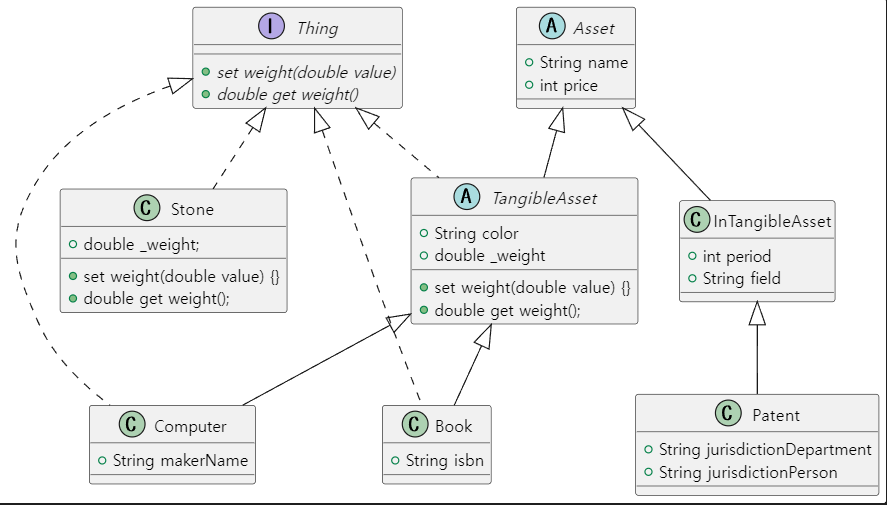
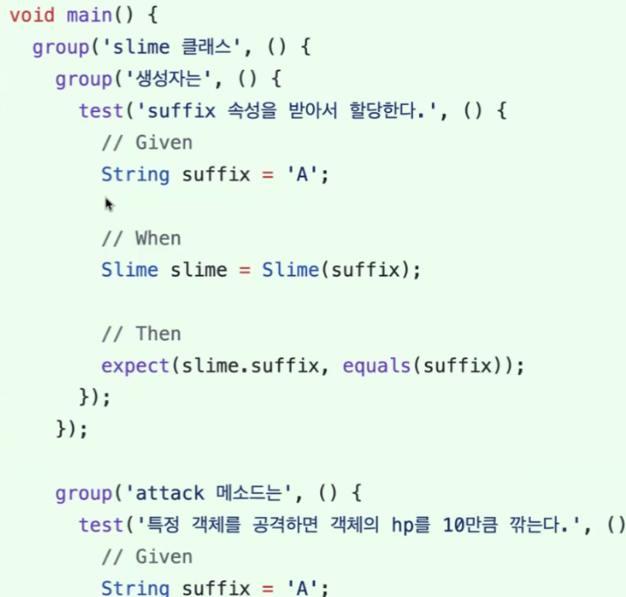

# <span style="color:lime">20240311 플러터 과정 2주차 수요일</span>   

### 1. 꼭 기억할 것! 🏅
### 추상클래스
#### 추상클래스를 왜 쓰는가
* 향후 개발자에 알려야
* Character는 너무 추상화 정도가 큰 클래스+비어있는 클래스(즉 모든 직업 클래스에 제공할 필드와 메소드를 모은 '상속의 재료'일 뿐)라서 인스턴스화를 하지 않아야 한다.
#### 추상 클래스란
* 상속의 재료로 사용되는 클래스
* 상세 부분이 미정의된 클래스
* function 내용이 없어도 된다. (추상 클래스가 아니면 에러남)
* 하나라도 추상메소드가 있으면 추상클래스
    * Monster < Walking Monster < Goblin 에서 Walking Monster도 추상메소드 있으면 추상클래스

* overrid하면서 빈 내용으로 둘 수는 없음. + 상속한 클래스에 있는 함수를? override안하면 에러남
	따라서 abstract class로 써야 에러나지 않음
### 과제리뷰
#### Interface구현1
```dart
// 인터페이스는 변수를 가질 수 없음
abstract interface class Thing {
// get/setter 틀만 선언해놓고
  double get weight;

  set weight(double value) {}
}
///////////////////////////////////////////////////
class Book extends TangibleAsset implements Thing {

  String isbn;
  // getter를 사용(불가, 이름이 같아서), 변수 재정의가 아니라
  // 추상클래스에서 _붙인거는 어차피 접근 안됨

  final double _weight;

  Book({
    required super.name,
    required super.price,
    required super.color,
    required this.isbn,
    required double weight,
  }) : _weight = weight;

  @override
  set weight(double value) {} 

  @override
  double get weight => _weight;
  // Book 등 하위 클래스에서 구현
```
#### Interface구현2(상속도 동시에 하는 경우)



>TangibleAsset는 Asset을 상속함과 동시에 Thing을 구현하고 있음.
또한 TangibleAsset을 Computer와 Book이 상속하고 있고 Computer와 Book도 각각 TangibleAsset을 구현하고 있음

* TangibleAsset
	* Thing 구현을 위해서는 private weight 변수를 선언 하고, set/get을 override로 구현해야함.
*  Book, Computer
	* Thing 구현을 위해서는 weight, set/get 구현해야하지만, Super Class인 TangibleAsset에 이미 구현이 되어있으므로 super로 해서 가져다 쓰고 따로 구현하진 않는다.

### Test Code 작성법
* group 생성할 수 있음
* Given/ When/ Then
* expect함수의 활용
```dart
		expect(() => wand.name = '김씨', throwsException); // 터지는 거
		expect(() => wand.name = '김씨', equlas());// 오른쪽엔 matcher
		expect(() => wand.name = '김씨2', returnsNormally); // 안터지는 거

```
#### Test code에서 group 활용법



### 2. 아리까리 😒
ㅁ Operator (List) 
* operator +
> (List<E> other) → List<E><br>
> Returns the concatenation of this list and other.

* operator ==
> (Object other) → bool<br>
Whether this list is equal to other.
(override)

* operator []
> (int index) → E<br>
The object at the given index in the list.

* operator []=
> (int index, E value) → void<br>
Sets the value at the given index in the list to value.
(https://api.dart.dev/stable/3.3.1/dart-core/List/operator_put.html)

cf) map에서도 사용됨
```dart
  var gifts = {'first': 'partridge'};
  gifts['fourth'] = 'calling birds'; 
  
  print(gifts['fourth']);
```

ㅁ Conditional Expression (https://dart.dev/language/operators#conditional-expressions)

>Dart에는 if-else 문 이 필요할 수 있는 표현식을 간결하게 평가할 수 있는 두 가지 연산자가 있습니다.<br>
* `condition ? expr1 : expr2` <br>
condition이 true 이면 expr1을 평가 하고 해당 값을 반환합니다. 그렇지 않으면 expr2 값을 평가하고 반환합니다.
* `expr1 ?? expr2`<br>
expr1 이 null이 아니면 해당 값을 반환합니다 . 그렇지 않으면 expr2 값을 평가하고 반환합니다 .


### 3. 한줄 정리 🧹
1. getter는 읽기 전용 필드처럼 사용할 수 있다.
2. car클래스에서 tire를 클래스로 해서 사용할 수 있었다.
3. 상속받은 SubClass에서 변수를 override해서 쓸 일은 없다.
4. 자바에서는 인터페이스가 추상적인 클래스가 아니지만, Dart에서는 인터페이스가 클래스이다.
5. 인터페이스를 구현하는 클래스는 인터페이스에서 선언된 메소드를 반드시 구현해야 한다.
6. 인터페이스는 변수를 갖지 않는다.

### 4. 좋은 코딩을 위한 습관
1) 코드정렬 필수!
2) Annotate git -> 코드정리 안한 사람 찾아서 comment날림
3) int i = 0, j = 0;
	>- 이런 식으로 쓰지 말 것
	>- i에 에러 있어도 한줄 단위로 보이기 때문에 어디서 에러나는지 확인 어려움
4) 삼항연산자(ternary로 검색) 쓸때 아래와 같은 경우는 에러도 안나지만 일반적인 용법은 아니라서 if문으로 쓰는 것이 나을 것.
```dart
void read(bool readNow){
	readNow ? print('책을 읽고 있습니다.') : print('책을 그만 읽습니다.');
}
```
 >* 조건분기에 따른 값 반환 -> 삼항연산자 
 >* 조건분기 처리 -> if 문
 >* Conditional Expression
 