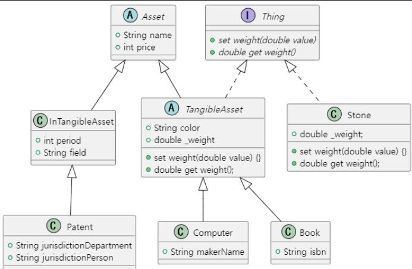

# <span style="color:lime">20240311 플러터 과정 2주차 목요일</span>   

### 1. 꼭 기억할 것! 🏅
### 과제리뷰


* Thing -> Computer / Book implements 할 필요없음 (TangibleAsset에서 이미 구현)

### 다형성
#### 왜 Interface를 쓰는가
공통 메소드를 통합(강제성)
(house.draw(), dog.draw(), car.draw())

#### 왜 다형성을 쓰는가

>하나의 타입으로 묶어서 처리할 수 있다.

```dart
Drawable house2 = House();
Drawable car2 = Car();
Drawable dog = Dog();

List<Drawable> items = [
	house2,
	car2,
	dog,
]

items.add(house);
```

### 개념확인
1.  attack()은 가능하고 fireball은 아닌 이유 - Character클래스에 attack()는 있으나 fireball은 Wizard에만 있다.

2. 출력값 예상

 

 

> 출력값 :  <br>
 슬라임 A가 도망쳤다.<br> 
 슬라임 B가 도망쳤다.

* 이유 : Monster monster = Slime(); -> Compiler 기준으로는 Monster지만, 실제 객체 생성된 건 new가 앞에 붙은 Slime이다.

3. type casting
* 사용자정의 클래스는 toInt와 같은 메소드 없으므로 사용자정의 클래스 간 type cating은 as로 해야한다.

```dart
Drawable dog = Dog();
dog.draw(); // move는 여기서 못씀
// 다운캐스팅
Dog dog2 = dog as Dog;
dog2.move(10);
// dog과 dog2가 주소가 같은가
// 생성자(new)가 하나밖에 없으므로 주소가 같

Character character = Dancer('name', 100);
// 클래스 간 다운캐스팅도 됨
Dancer dancer = character as Dancer;
// 업캐스팅
Character character2 = dancer; //캐스팅 필요없음
// 이미 위에서 했기 때문에
```
4. 스마트 캐스팅


> 위 경우에도 Drawble 타입 dog이 (Movable을 구현하는)Dog타입으로 강제형변환을 했으면(주석부분) <br>
> 에러나지 않고 Movable 타입에 들어갈 수 있음<br>
> Movable과 Drawable 클래스 간에는 관계가 없지만 하위 클래스인 Car나 Dog 타입으로 바꿔서 각 클래스 타입으로 사용은 가능하다.

5. 형변환 검사


* as로 형변환하는 건
검사해서 넣어야 안전하다
* if (dog is Dog) 이 부분 있으면 
dog as Dog로 변경 안해도 들어감
(즉, dog4.move(10)도 가능함)

6. 다형성의 메리트를 활용하지 못한 코드


* character로 묶어서 출력 가능
```
characters.forEach((character){
	character.hp += 50;
});
```
7. 메소드 오버로딩(지원하지 않음)하지 않고 다형성을 활용하는 방법

```
class Hero extends Character {
	Hero(super.name, super.hp);

	@override
	void attack(Slime slime) {
		print('$name이 $slime을 공격했다.');
		print('10의 데미지');
		slime.hp -= 10;
	}

	// 위에서 void attack(Gobline gobline/slime){}을 추가해야하는 경우
}
```
* Slime, Goblin가 상속하는 Monster 클래스를 생성하여 attack(Monster monster)로 변경한다.


### 2. 한줄 정리 🧹
1. abstract class의 변수,메소드 / interface 메소드는 하위 class에서 반드시 구현해야한다.
2. 그 하위 class도 abstract class인 경우에는 구현하지 않아도 된다.
3. 상속에 의한 is-a 관계가 성립한다면, 인스턴스를 부모 클래스 타입의 변수에 대입할 수 있다.
4. is 키워드를 사용하여 타입을 검사할 수 있다.
5. Dart는 메소드 오버로딩을 지원하지 않는다.
6. 같은 부모를 가지는 다른 인스턴스를 동일시하여, 부모 클래스 타입에 담을 수 있다.
7. 동일시 취급해도, 각각의 인스턴스는 각 클래스의 정의를 따르고 다른 동작을 한다.
8. 리스트 선언
```
List<String> names = [];
var names = <String> [];
```

### 3. 단축키
* Ctrl + e /shift 3번 누르면 최근 열었던 파일 목록 보임
* Ctrl + alt + 화살표(맥은 Cmd +[ / Cmd +  ])로 전환
