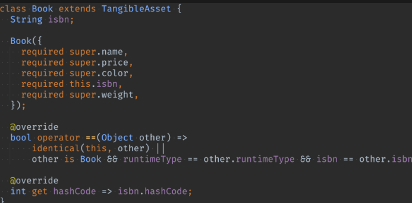
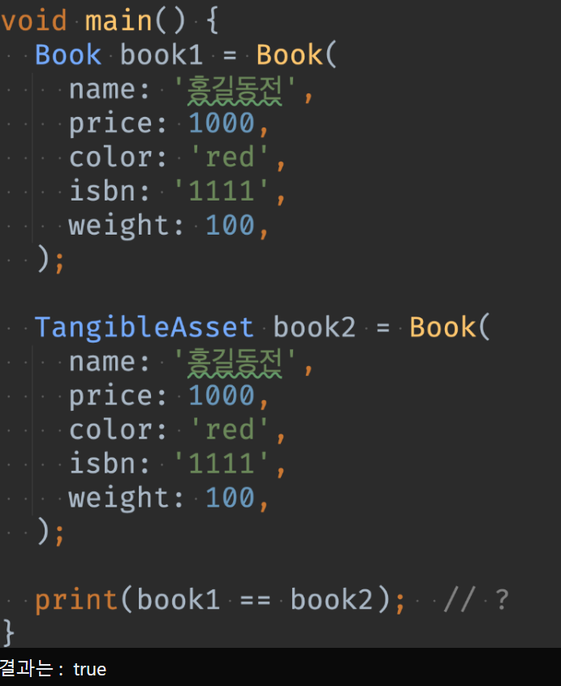

# <span style="color:lime">20240311 플러터 과정 2주차 수요일</span>   

### 1. 꼭 기억할 것! 🏅
### 과제리뷰
#### 상속과 인터페이스의 선택
> 상속과 인터페이스가 모두 가능한 경우에는 인터페이스를 사용하는 것이 낫다✨
* 상속과 달리 인터페이스는 무한으로 확장할 수 있기 때문에
* 다만 강제해야하는 필드가 없고, 클래스 간 관련성이 없는 method를 강제하는 경우에만 인터페이스 사용할 수 있음 


### 인스턴스 기본 조작
#### dynamic과 Object의 차이 (dynamic보단 Object를 써야하는 이유)
* object는 object 클래스 안에 있는 걸로 한정되는데 dynamic 타입은 아무거나 됨
* object는 검사하고 쓰면 되는데 dynamic은 검사 자체도 불가
* dynamic엔 null도 포함됨

#### var와 dynamic의 차이
* var는 추론된 타입이 한번 입력되고 나면 다른 타입을 저장할 수 없음
* dynamic은 어떤 형식이라도 항상 입력이 가능함(타입 변경 가능)

#### Set과 List의 차이
- Set은 List보다 검색이 빠름(hash code로 검색)<br>
  List는 순차검색이라 느리다.
- Set은 중복X / List는 중복O<br>
 아래의 경우에도 List라서 동일한 클래스의 객체가 2개 들어감.
```dart
final heroes = <Hero>[];

final h1 = Hero('슈퍼맨', 100);
final h2 = Hero('슈퍼맨', 100);

heroes.add(h1);
print(heroes.length); // 1개

heroes.add(h2);
print(heroes.length); // 2개
```

#### 연산자 재정의
* operator -> 자동완성으로 operator 연산자 재정의 할 수 있음
```dart
  @override
  operator ==(Object other) => runtimeType == other.runtimeType && name == (other as Hero).name;  
```
```dart
final heros = <Hero>[];

final h1 = Hero(name: 'name', hp: 100);
final h2 = Hero(name: 'name', hp: 200);

print(h1 == h2);
// 재정의 전에는 false (모든 파라미터 동일성 여부까지 확인)
// 재정의 후에는 true
```
* 연산자를 재정의 할 때 보통 hashcode도 재정의함

#### 동등성 비교
* isbn으로 동등성 비교 규칙을 정의한 Book



### 정렬
>List.sort() 메소드는 컬렉션 내부를 정렬해 줌
```dart
	numbers.sort((a, b)){
		if (a < b) {
			return -1
		} else if ( a > b) {
			return 10033;
		}
		return 0;
	};
	// 뒤집으면 반대로 sort됨
	dart
	numbers.sort((a,b) => a.compareTo(b) * -1)
```
* 다만, sort() 메소드를 사용하기 위해서는 다음과 같은 제약이 따름
1. 정렬 대상이 Comparable 인터페이스를 구현하거나
2. sort 함수가 직접 정렬 대상의 정렬 규칙을 Comparator 함수로 구현해야 함 (주로 쓰는 방법)
#### [Comparable](https://api.dart.dev/stable/3.3.1/dart-core/Comparable-class.html)과 Comparator

```dart
typedef Comparator<T> = int Function(T a, T b);
```
* 1번 방법의 경우에는 Comparable 인터페이스를 구현해야하므로 클래스 설계에 관여하는 부분이 있게 되는데 비해<br>
2번 방법은 리스트에 규칙만을 설정하는 정도라서 2번 방법이 바람직함

* 정렬 대상의 정렬 규칙을 구현한 Comparator 함수
	>a, b 두 개의 인자를 받고 다음 규칙대로 리턴하는 함수를 작성
	* a가 b보다 작으면 음수 (-1)
	* 같으면 0
	* a가 b보다 크면 양수 (+1)
	

#### sort와 reversed
* sort는 메소드 / reversed는 property
* sort하면 순서가 다 정렬되지만, property는 값을 돌려주기만 하므로 위의 뒤집은 데에 다시 reversed를 해도 값이 변하지 않는다.

### deep copy와 shallow copy
* Shallow Copy (얕은 복사)
> 객체의 복사본을 생성할 때 원본 객체와 같은 메모리 주소를 공유하는 경우.<br>
> 즉, 객체 내의 참조형 필드는 복사되지 않고 참조만 복사되어 원복 객체와 복사본 객체가 동일한 하위 객체를 참조하게 된다.<br>
* 하나의 객체를 변경하면 다른 객체도 변경됨
```
Person person1 = Person('Jack', 23);
Person person2 = person1;

print(person1 == person2); // true
```
* Deep Copy (깊은 복사)
> 객체의 복사본을 생성할 때 원본 객체와 별개의 메모리 주소를 가지도록 모든 필드와 하위 객체를 재귀적으로 보사하는 것 <br>
이로 인해 원본 객체와 복사본 객체가 완전히 독립적인 개체가 되므로, 하나의 객체를 변경해도 다른 객체에 영향 없음.

>Dart에서는 깊은 복사를 위한 별도의 기능을 지원하지 않으므로 직접 작성해서 사용해야 한다.
```
Person copyWith({
	String? name,
	int? age,
}) {
	return Person (
		name: name ?? this.name, 
		age: age ?? this.age,
	);
}
```

### 2. 한줄 정리 🧹
1. final 클래스는 상속이 불가함 (int, String 등의 클래스)
2. toString은 nullable에서도 쓸 수 있다. 
3. identical(a, b)함수는 주소를 비교한다.
4. 
5. 
5. static메소드는 그 클래스 내의 메소드로 보지 않는다.


### 3. 단축키
* Ctrl + e /shift 3번 누르면 최근 열었던 파일 목록 보임
* Ctrl + alt + 화살표(맥은 Cmd +[ / Cmd +  ])로 전환
