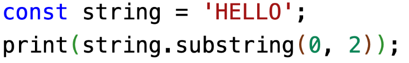
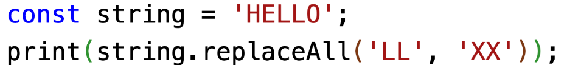
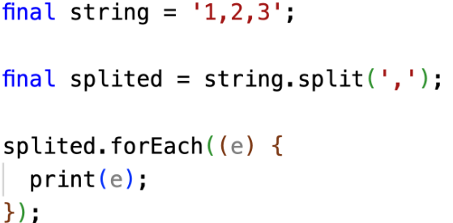
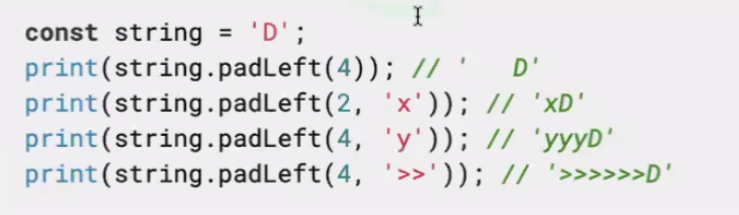

# <span style="color:lime">20240311 플러터 과정 2주차 월요일</span>   

## 1. 꼭 기억할 것! 🏅
### 과제리뷰
#### 문제 1번 동등성 비교
1. 수정 전 main 함수에서 확인 

```dart
	final now1 = DateTime.now();
	final now2 = DateTime.now();
	
	print(now1.toString());
	print(now == now2); // false(초단위로 실행되므로)
```
2. DateTime 처리
* default로 연월일+micro sec까지 나옴
* 2024-03-15 형태로 변환하는 방법
    * case 1
    ```dart
    	@override
		bool operator ==(Object object) => 
		identical(this, object) ||
		object is Book 
		&& runtimeType == other.runtimeType
		&& title == other.title
		&& publishDate.year == object.publishDate.year 
		&& publishDate.month == object.publishDate.month 
		&& publishDate.dayy == object.publishDate.day;
	;
    ```
    * case 2 함수를 만들어서 사용
    ```dart
    String _getFormattedDate(DateTime dateTime) {
		return '${dateTime.year}-${dateTime.month}-${dateTime.day}';
	}
    
    ```
    * case 3 생성자에서 변환
    >* 이렇게 쓰면 test에서 단순 비교(==)만으로도 가능함
    >* 받을 때와 null일 때 둘 다 변환 해줘야 함
    ```dart
    Book({
        ...
        DateTime? publishDate,
    }): publishDate = publishDate(
            publishDate.year,
            publishDate.month,
            publishDate.day,            
    ) ?? 
        DateTime(
            DateTime.now().year,
            DateTime.now().month,
            DateTime.now().day,
        );

    ```
3. test code
```dart
void main() {
	test('제목과 출간일(2024-01-01)이 같으면 같은 책으로 판단'), (){
		Book book1 = Book(title: 'title', commenet, 'comment');
		Book book2 = Book(title: 'title', commenet, 'comment');
		
		// Datetime.now() 2개는 다른 거다 
		//expect(book1 != book2, true); // 수정전

		// case1 연월일까지만 체크를 한 사람이 많다
		//	book1.publishDate = DateTime(2024, 10, 10);
		//	book2.publishDate = DateTime(2024, 10, 10);

		// case2 연월일+초까지 비교를 해야한다.
		book1.publishDate = DateTime(2024, 10, 10, 1);
		book2.publishDate = DateTime(2024, 10, 10, 2);
		// default가 들어가는 상황까지 확인해야하므로
		// (default가 들어가면 마이크로 단위로 달라짐)

		// case3 잘못 비교한 거(2004년으로 됐을 것(빼기))
		//book1.publishDate = DateTime(2024 - 10 - 10);
		
		// title과 연월일만 비교
		expect(book1 == book2, true);

		// Set으로 테스트 => 문제발생(hash 코드를 안고쳐서) -> hash코드 수정
		final Set<Book> books = {
			book1, book2
		};

		print(books.length);		
	}
}
```    
#### 문제 2번 출간일 신상순서대로(내림차순) 정렬
1. testcode
```dart
test('Book인스턴스를 담고 있는 컬렉션에 대해 sort() 를 수행하여 출간일이 오래된 순서대로 정렬')(){
// 위에서 micro S은 체크했으므로 일 까지만 체크
	Book book1 = Book(title: 'title', commenet: 'comment', DateTime(2024, 10, 10));
	Book book2 = Book(title: 'title', commenet: 'comment', DateTime(2024, 10, 10));
		
	final books = [book1, book2];
	final sortedBooks = [book2, book1];
	
	books.sort();
	
	// 내용을 비교해야 함
	// first나 last가 property로 제공됨
	expect(books.first.title == sortedBooks[0].title, true);
	// 처음엔 틀리다고 나옴
	// comparable 구현하러 감
}
```

```dart
class Book implements Comparable<Book>
	
	@override
	int compareTo(Book other) {
		// toString을 쓰거나 아래와 같이 쓴 사람도 있지만
		//return publishDate.year.compareTo...
		// 간단하게 이렇게 쓸 수 있음
		// comparable에서도 toString지원하므로로
		return publishDate.compareTo(other.publishDate);
		
}

```
#### 문제 3번 Deep Copy
```dart
  Book copyWith({
    String? title,
    String? comment,
    DateTime? publishDate,
  }) {
    return Book(
      title: title ?? this.title,
      comment: comment ?? this.comment,
      publishDate: publishDate ?? this.publishDate,
    );
  }
  // 아래와 같이 생성자처럼 만들 수도 있음	
  Book.copyWith(Book origin, {String? title, DateTime? publishDate, String? comment}):
    title = title ?? origin.title,
    publishDate = publishDate ?? origin.publishDate,
    comment = comment ?? origin.comment;

```

```dart
	test('deep copy가 잘 되는지 테스트'), (){
		// 그냥 복사test
		final book1 = Book(title: 'title', comment: 'comment');
		final book2 = book1.copyWith();
	
		expect(book1 == book2, true);

		// 변경 테스트
		final book3 = book.copyWith(title: 'change');
		// title만 아니라 바꾸지 않은 다른 것도 동일한지 전체 test
		expect(book3.title == 'change', true);
		expect(book3.publishDate == book.publishDate, true);
		expect(book3.comment == book.comment, true)
		// 아래와 같이 써도 됨. 가독성 좋은 걸로 알아서 선택.
		/*
		expect(book3.title, equals('change'));
		expect(book3.title, isNot(equals('change')));
		*/
	};	

```
### 제네릭, 열거형
#### 제네릭
##### 타입이 없을 때의 문제점 (dynamic)
1) 런타임 에러가 나기 쉽다
2) IDE가 컴파일 에러를 미리 찾을 수 없다.

#### 제네릭 사용
>* 타입을 나중에 원하는 형태로 정의할 수 있어서 type safe 효과
>* 나중에 지정한 타입에 따라서 알아서 지정됨

#### 예시
```dart
final pocket = Pocket(); //  이렇게 쓰면 안됨(dynamic)
no.pub(true);
no.pub('aa');
no.pub(111);

// 이렇게 타입 써줄 수 있음
final pocket = Pocket<int>();
pocket.pub(10);

// 이렇게 쓰면 안됨
List items = [1, 2, 3];
print(item.first.runtimeType); // int라고 나옴
// 제네릭 쓰진 않았지만 int라고 나오긴 함 하지만
items.add('value');
// 이렇게 하면 또 들어감
List items = <int>[1, 2, 3];
// 이렇게 써야함

//D(date) , E(error)

```
#### [E, T, R 차이](https://dart.dev/effective-dart/design#do-follow-existing-mnemonic-conventions-when-naming-type-parameters)

#### 열거형
>정해둔 값만 넣어둘 수 있는 타입

### enum을 정의하여 세 가지 상태로 제약을 검
* 휴먼 에러 방지
* Switch문을 쓰고 enum 객체 넣으면 자동완성으로 하나씩 만들어줌
```dart
AuthState authState = AuthState.unknown;

switch (authState) {
	case AuthState.authenticated;
		print('authenticated');
		break; 
		// 다른 언어는 break반드시 써야하지만 dart는 안써도 되긴 함
}
```

### 문자열 조작
#### substring
문자열 자르기 숫자 잘 써야



#### replaceAll
문자열 일부 치환



#### split(',')
문자열 분리



#### toLowerCase/ toUpperCase
대소문자 변경

#### 검색
>* contains() : 포함 관계
>* startWith()/ endsWith() : 시작/끝나는 단어가 맞는지
>* indexOf() : 문자열이 단어의 몇 번째 있는지
>* lastIndexOf()
* string.indexOf('E');
	* first, last는 있는데 여러 개 찾는 것, 중간에 있는 건 생각 좀 해봐야 함
p
### 내용 비교(`==`)
### 길이 (length)
bool isEmpty
int length
프로퍼티는 다 getter임

#### padLeft


```dart
// 예전
DateTime dateTime = DateTime.now();
print('${dateTime.year}-${dateTime.month}-${dateTime.day}');

if (dateTime.month < 10) {
	print('${dateTime.year}-${dateTime.month}-${dateTime.day}');
} else {
	print('${dateTime.year}-${dateTime.month}-${dateTime.day}');
}
// 지금(padLefty쓰면)
print('${dateTime.year}-${dateTime.month.toString().padLeft(2,'0')}-${dateTime.daytoString().padLeft(2,'0')}');
```

#### trim
>좌우공백 제거<br>
ex. 출력할 때 좌우에 공백 붙이다가 마지막엔 공백없어야 할 때(알고리즘)

### 문자열 결합 방법
1)  `+` 연산
2)  String interpolation
3)  StringBuffer

#### StringBuffer

.. (cascade) 연산자 : void 리턴인 함수의 앞에 사용하면 해당 객체의 레퍼런스를 반환하여 `메서드 체인`을 사용할 수 있음

```dart
buffer
	.. write('and')
	// ..은 void

void main() {
	final items = [2, 1, 3];
	
	final List<int> sortedItems = items.sort(); // 안됨(에러남)
	// sort가 void라서?
	final List<int> sortedItems = items..sort(); // 됨(items를 반환하는 것으로 바뀜)
}
```
```dart

void main() {
	// case 1
	var text = 'Dart';
	print(text.hashCode);	
	
	text = '$text and';
	print(text.hashCode);	
	
	text = '$text Flutter';
	print(text.hashCode);	

}

	// case 2
	final buffer = StringBuffer('Dart');

	buffer
		..write(' and ')
		..write('Flutter');
	print(buffer.toString());
```

#### 코드 성능 측정

```dart
Stopwatch stopwatch = Stopwatch()..start();//시간체크
for(int i = 0; i < 100; i++) {
	string += string + i.toString();
}
stopwatch.stop();
print(stopwatch.elapsed);
// Hello0
// Hello1 ... Hello01234
// 

#### String가 StringBuffer보다 느린 이유
String 인스턴스는 불변 객체(immutable)
(string.dart에 주석으로 되어있음)
```dart
const string = 'Dart is fun';
//String string = 'Dart is fun'; // 이렇게 해도 동일함
print(string.substring(0, 4)); // 'Dart'

print(string); // 'Dart is fun'
// string은 불변 객체이므로

string = 'Hello';
// 'Dart is fun'이 바뀌었는지? No
// 'Hello'라는 인스턴스를 만들어서 string에 대입함
// String string = new 'Dart is fun'; 이런 느낌
// 레퍼런스는 바뀌지만 가리키는 값 자체는 바뀌지 않은 것

```

* String buffer는 미리 메모리를 확보를 해놓고(list처럼 만들어 놓고) 거기에 붙이는 것
* new를 하는 것에 비용이 발생함
* final, const 사용하는 것도 이러한 비용을 줄이려고 하는 것
* StringBuffer의 경우 (위보다 1000배 빠름)
```dart
void main() {
	StringBuffer string = StringBuffer('Dart is fun'); 
	Stopwatch stopwatch = Stopwatch()..start();//시간체크
	// start()가 void라서 ..
	// .을 쓰면 elapsed를 못씀
	// Stopwatch stopwatch = Stopwatch();
	// stopwatch.start(); 
	// 이렇게 써도 동일
	
	for(int i = 0; i < 100; i++) {
		string += string + i.toString();
	}
	stopwatch.stop();
}
```
**String, StingBuilder, StringBuffer의 차이**
- String이 느리고 Buffer가 빠름
- String이 불변이라서 느림. 
- String은 new로 새로운 것을 만들기 때문에
- 알고리즘에서 쓸 일은 있어도 앱만들면서 StringBuffer 쓸 일은 없다.


## Accessor, Mutator
```dart
String uppercased = river.toUpperCase();
pic.translate(15,25); // 둘의 차이는?
// accessor (getter) : 인자가 없고, 객체의 상태를 변경하지 않음

String greeting = 'Hello';

print(greeting.replaceAll('H', 'J')); // Jello (변경된 것을 리턴해줌)
print(greeting); // Hello (불변이니까)

```

### 2. 한줄 정리 🧹
1. (testcode) import할 때 lib는 뺄 것
2. flutter 동등성 비교(operator override 따로 안해도 되는) 기능 올해안에 들어오거나 포기할 예정이다.
3. 2024 flutter roadmap 확인
4. extension이란? 
5. [String class](https://api.dart.dev/stable/3.0.2/dart-core/String-class.html)
6. string이 제공하는 모든 메소드는 accessor다(안의 값을 바꾸지 않음)
7. [switch문 문법](https://dart.dev/language/branches#switch-expressions)

### 3. 단축키
* cmd + n : operation, hashCode 생성(휴먼 에러 방지)