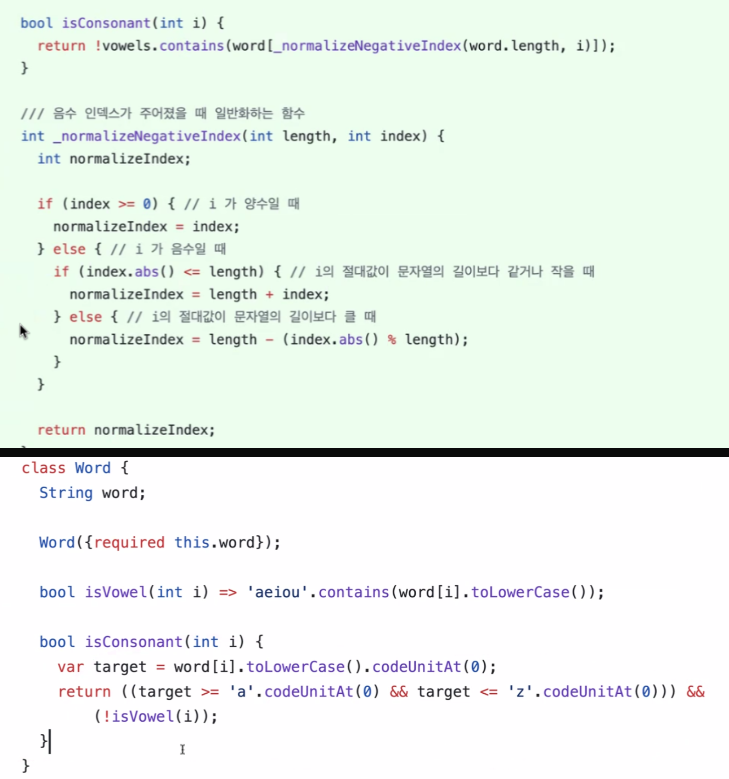
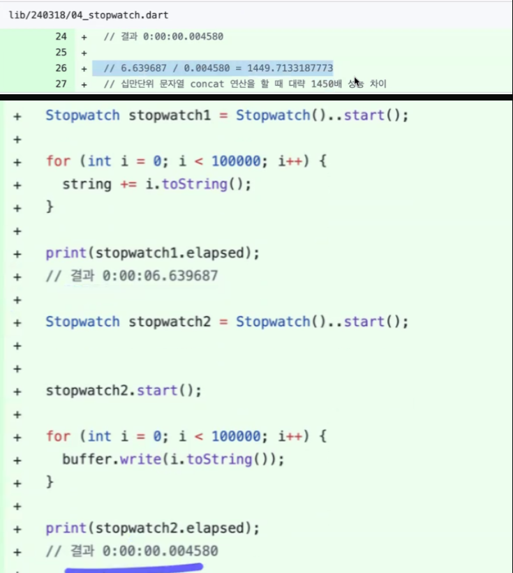
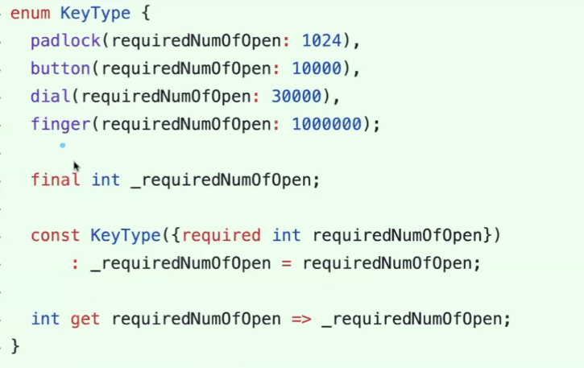
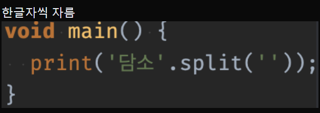
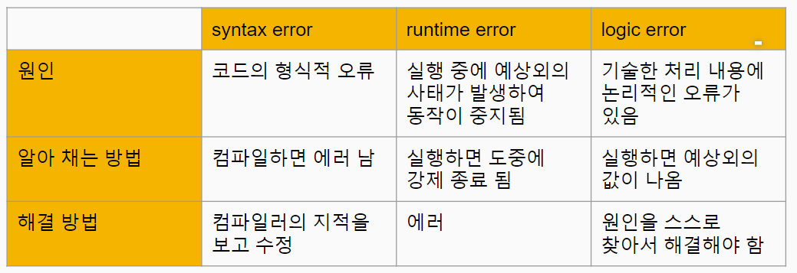
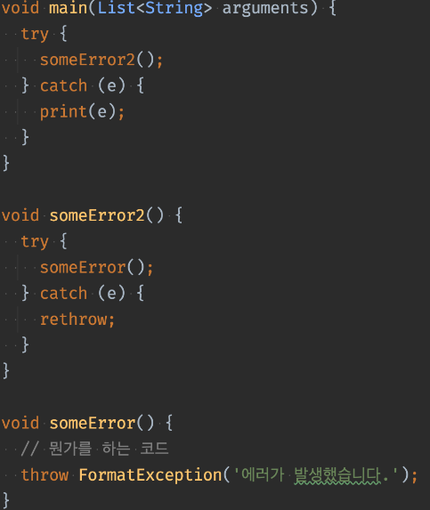
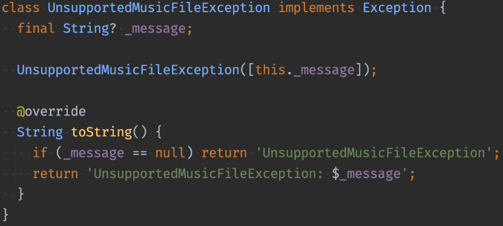
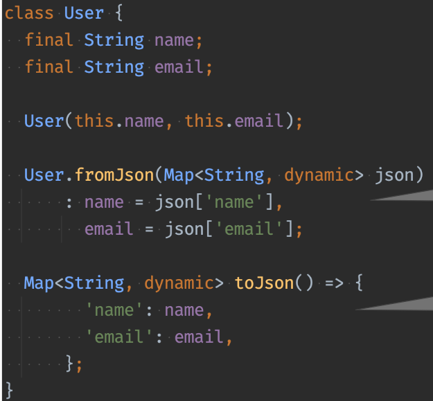

# <span style="color:lime">20240311 플러터 과정 3주차 화요일</span>   

## 1. 꼭 기억할 것! 🏅
### 과제리뷰
#### 과제1) StrongBox 클래스 정의

* 제네릭 사용할 때는 Tool에서 제네릭인 것만 인식되면 자유롭게 쓸 수 있음
* 클래스와 헷갈리지 않게
	```dart
	// 예시
	StrongBox <T>
	StrongBox <Item>
	```

* Enum은 보통 대문자로 만듬

* KeyType

* case 1 switch문으로 return받기
	```dart
	bool get isOpen =>
		_count <
		switch (_keyType) {
			KeyType.padlock => 1024,
			KeyType.button => 10000,
			KeyType.dial => 30000,
			KeyType.finger => 1000000,
		};
	```

* case 2 get에 만들기
	>get 함수 실행할 때마다 돈다는 단점은 있음
	```dart
	T? get() {    
		final keyCount = switch (_keyType) {
		KeyType.padlock => 1024,
		KeyType.button => 10000,
		KeyType.dial => 30000,
		KeyType.finger => 1000000,
		}
	}
	```
#### 과제2) 문자조작 
* substring (a, b) 
	> b는 불포함, 총(b-a)글자임

* 소문자 처리했어야함
	```dart
	return word.substring(i, i + 1).toLowerCase() == 'a' ||
		word.substring(i, i + 1).toLowerCase() == 'e' ||
		word.substring(i, i + 1).toLowerCase() == 'i' ||
		word.substring(i, i + 1).toLowerCase() == 'o' ||
		word.substring(i, i + 1).toLowerCase() == 'u';

	```

* test code
	>aeiou/bcdfghjklmnpqrstvwxyz 도 넣었어야..


* **재사용성**💥
	```dart
	bool isConsonant(int i) => !isVowel(i);
	```
* 추가
	>* 특수문자, 유니코 등 처리하는 로직도 있음
	>* a부터 z까지 순서대로(아스키코)
	>* C언어에는 contain() 함수 없어서 이렇게 써야만 할 수도 있음
	
	

	

	>* 코드 성능 비교


	

	>* Enum을 클래스처럼 사용할 수도 있음
	>* getter도 쓸 수 있음

	

### Switch expressions
- switch문 문법과는 다름
- 
```dart
 bool get isOpen =>
       _count <
       switch (_keyType) {
         KeyType.padlock => 1024,
         KeyType.button => 10000,
         KeyType.dial => 30000,
         KeyType.finger => 1000000,
       };
```

### 정규표현식 (Regular Expression)

* 정규식 = regexr
* 특정한 규칙을 가진 문자열의 집합을 표현하는 데 사용하는 형식 언어
* AI나 사이트에서 가져다 쓸 수 있으므로 정규식 만드는 것을 연습할 필요는 없음

* split() : 문자열 분리
>* split => Pattern임
>* pattern은 Regexr/ String을 받음




	> ,과: 로 나누고 싶을 경우

### 예외(Exception)
#### 예외 종류
1. 문법 에러(syntax error)
2. 실행 시 에러(runtime error)
	* index, parsing...
3. 논리 에러(logic error)
	* 제일 잡기 힘듬

	

#### 예외 처리
1. try catch
```dart
try {
	// 에러날 것 같은 코드 작성
	someError();
} catch (e) {
	// e : 에러의 정보를 담고 있는 객체
}

void someError() {
	// 뭔가를 하는 코드
	throw FormatException('에러가 발생했습니다');
}
```
2. rethrow 로 에러 처리를 미룸
> someError2()에서 에러를 미뤄서 main()의 try catch에서 에러 처리



3. 특정 예외를 캐치
```dart
try {
	someError2();
} on FormatException {
	print('FormatException이 발생했습니다.');
}
```

4. finally
> 무조건 실행되는 코드


5. 오리지날 예외 클래스 정의
> Exception 구현 + toString(){} <br>
> 많이 쓰진 않으나 있어보일 때 씀(잘 안씀)





#### 파일 조작
1. 파일 열기 / 내용 쓰기
```dart
import 'dart:io';
// html import는 쓸 일 없음

void main() {
	// 파일 열기
	final myFile = File('save.txt');// ''안에 파일 경로
	
	// 내용 쓰기 (알아서 닫힘)
	myFile.writeAsStringSync('Hello, world!');
	}
	// 새로고침하면 파일 생성되어 있음
	// 앞에꺼 없어지고 새로씀
	// 추가하려면
	myFile.writeAsStringSync('\nHello World 2222', mode: FileMode.append);
	// \n은 개행 (\n, \\, \', \"), \t 
```

2. 파일 읽기
```dart
final file = File('save.txt');

final text = file.readAsStringSync();
print(text);
// 파일 내용이 console에 출력됨

```

### 여러가지 데이터 형식
1. CSV (Comma Seprated Value) 
>*  콤마로 나눈 형식
>* 엑셀과 호환되는 형식이라 편리함
>* csv 라이브러리 도 있음

2. 프로퍼티 형식의 파일
>* key = value 
>* [Properties라이브러리 활용](https://pub.dev/packages/properties)

3. XML 형식
>* 파싱하는 방식 2 가지 (DOM parser, SAX Parser)
>* [라이브러리](https://pub.dev/packages/xml_parser
)가 있긴 하지만, parser를 따로 만들어야 해서 피곤함

4. JSON(JavaScript Object Notation)
>* 네트워크 통신에서 가장 많이 사용
>* Dart의 Map<String, dynamic>과 똑같이 생김
>* XML에 비해 적은 용량
>* 인간이 봤을 때는 JSON형식이 보기 쉬움 + 컴퓨터가 봤을 때도 JSON형식이 보기 쉬움

**서버가 주는 대로 쓸 수 있어야!**

* Dart의 직렬화
>* 직렬화 : 클래스 -> JSon
>* 역직렬화 : Json -> 클래스

데이터 구조나 객체 상태를 저장하고 나중에 재구성할 수 있는 포맷으로 변환하는 과정

예시)
Hero 정보를 다른 컴퓨터에 보낼 때 다른 컴퓨터에서 dart를 쓰지 않는 경우, 공통된 규칙에 따라 변환 (직렬화) = encoding(암호화) = serialization
반대로 다시 상대방 컴퓨터에서 쓸 수 있게 복원(역직렬화) = decoding(복호화) = deserialization

```dart
final json = {
	'name': 'John',
	'email': "john@example.com"
};
print(json.runtimeType); // Map

// encoding
// map에서는 dynamic 어쩔 수 없이 쓸 것
// object를 쓰면 ?도 써줘야함 => 주로 dynamic씀
fromJson(Map<String, dynamic> json)

Map<String, dynamic> toJson() => {
	'name': name,
	'email': email,
}
```

* jsonDecode()
>* Sring -> Map
>* 실제로는 String으로 들어와서 Map으로 변환을 해줘야하는데
>* jsonDecode() 함수 사용 (JSON으로 Decode를 하는 것)

* jsonEncode()
>* Map -> String
>* toJson() 과의 차이는??

* toJson/fromJson

	

### 2. 한줄 정리 🧹
1. [정규표현식 참고사이트](regexr.com)
2. [test code 작성 참고 사이트](https://yozm.wishket.com/magazine/detail/2483/)
3. [Properties라이브러리](https://pub.dev/packages/properties)
4. jsonEncode()와 toJson()과의 차이
5. [공공포털](https://www.data.go.kr/tcs/dss/selectDataSetList.do?dType=API&keyword=%EC%A3%BC%EC%B0%A8%EC%9E%A5&operator=AND&detailKeyword=&publicDataPk=&recmSe=N&detailText=&relatedKeyword=&commaNotInData=&commaAndData=&commaOrData=&must_not=&tabId=&dataSetCoreTf=&coreDataNm=&sort=&relRadio=&orgFullName=&orgFilter=&org=&orgSearch=&currentPage=1&perPage=10&brm=&instt=&svcType=&kwrdArray=&extsn=&coreDataNmArray=&pblonsipScopeCode=)
