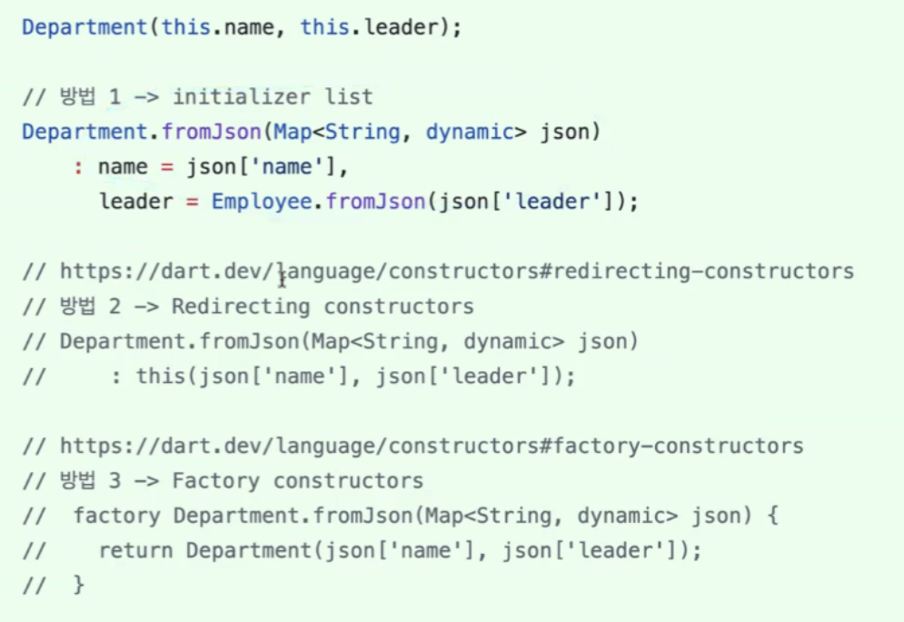
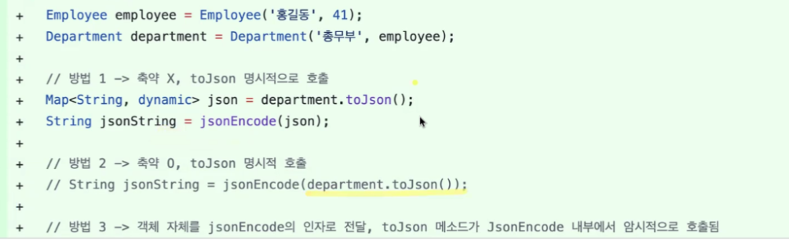
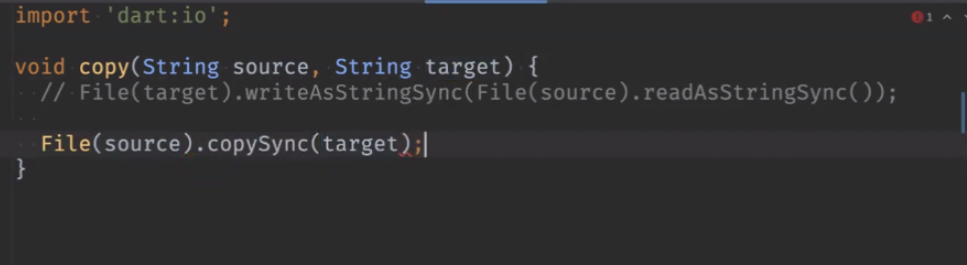
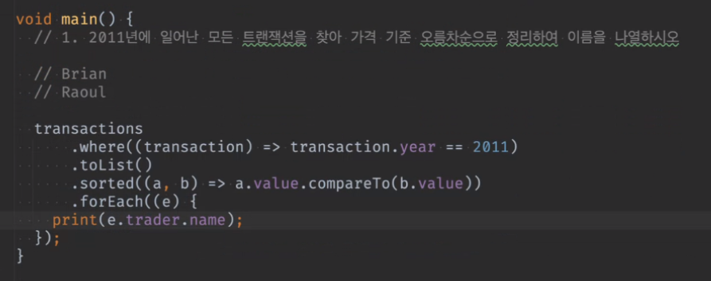
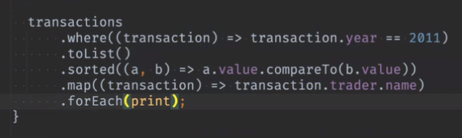

# <span style="color:lime">20240311 플러터 과정 3주차 수요일</span>   

## 1. 꼭 기억할 것! 🏅
### 과제리뷰
#### 과제1) 예외처리

```dart
void main() {
    // test
	int number;
	try {
		number = int.parse('10.5');
	} catch(e) {
		number = 0;
	}	
	expect(number, 0);

	int number;
	try {
		number = int.parse('10');
	} catch(e) {
		number = 0;
	}	
	expect(number, 10);
	// 글자도 넣어야봐야
}
```

#### 과제2) 직렬화
##### 직렬화
* 직렬화는 규칙을 정하기 나름이지만 역직렬화(복호화)가 되어야함
* JSON and serializaion 문서(https://flutter-ko.dev/development/data-and-backend/json
)

##### department 문제
> Department에 leader에서 그냥 'leader': leader라고 쓰면 암묵적으로 leader.toString() 을 호출한다.<br>
Emploee에 먼저 toJson()을 만들고 leader.toJson쓰면 직렬화가 됨

```dart
void main() {
	final department = Department('총무부', Emploee('홍길동', 14));
	// 직렬화 결과를 String으로 바꿔줌(jsonEncode)
	String jsonString = jsonEncode(department.toJson());

}
```
* **잘못된 Json**

>* key에 ""가 들어가야함
>* department.toJson().toString()으로 하면 ""가 안들어감
>* {}뒤에 comma찍어도 안됨(map은 됨)
>* jsonDecode() 쓰면 comma 있어도 알아서 json으로 만들어 주긴 함

* Test Code

역직렬화 때문에 fromJson만들어야함

```dart
void main() {
	test('employee test', (){
		final department = Department('총무부', Employee('홍길동', 41));
		String jsonString = department.toJson().toString();
		// 이렇게 하면 쌍따옴표가 날아감
		// jsonEncode()를 해야함
		File('company.txt').writeAsStringSync(jsonString);

		jsonString = File('cmopany.txt').readAsStringSync();
		final Map<String, dynamic> json = jsonDecode(jsonString) //as Map<String, dynamic> 타입 이렇게 써도 됨
		// 타입 잊지말것

		Department decodeDepartment = Department.fromJson(json);

		expect(decodedDepartment.name, '총무부');
		expect(decodedDepartment.leader.name, '홍길동');
		expect(decodedDepartment.leader.age, 41)	

	});
}
```

* Data Class

> 기능들만 있는 클래스가 아닌 등장인물들이 있는 클래스
>* 변수는 전부 final로 선언하고 copyWith로 수정.
>* 동등성 비교 (==operator, hashCode 재정의)
>* toString() 재정의
>* fromJson, toJson
>* copyWith


* json.decode()/encode()
>* import 'dart:convert' 이 안에 json 들어있음
>* jsonEncode 안에 json.encode()가 있는데, 예전에는 이걸 썼었음
>* 지금은 jsonEncode(탑레벨 함수)를 쓴다.     

* copy with는 왜 쓰나
>* 객체지향에서는 모든 변수를 기본적으로 숨기는 게 맞음 => 즉, final로 수정 막는 것
>* 변수는 수정 못하고 copy with로 하는 것
>* 새로 객체를 만들어서 비용은 많이 들지만, 성능에 문제없고 안전한 코드로 가는 방법이다.

##### 참고



>방법 2에서 this가 의미하는 것은(생성자 안에서 this는) 맨 위의 Department() 생성자를 호출하는 것임




> 방법3 객체 자체를 jsonEncode에 인자로 전달하면 알아서 toJson이 호출한 것
jsonEncode(department.toJson)으로 할 필요없이 department전달하면 되는 것

* try catch
> try catch 쓴 것과 동일함 (섹시한 코드)
```dart
print(int.tryParse('10.5') ?? 0);
```

#### 과제3) 파일조작
* 이렇게도 쓸 수 있음 (copySync())



* Test Code
```dart
import 'dart:io';

void copy(String source, String target) {
	final sourceFile = File(source);
	final targetFile = File(target);

File(target).writeAsStringSync(File(sourceFile.readAsStringSync());
}
```
```dart
// test code
// 매 test 시작시 실행할 부분
setup((){
	File('save.txt').writeAsStringSync('Hello World');
});

// 매 test 끝날때 실행할 부분
tearDown(() {
	File('save.txt').deleteSync();
	File('save2.txt').deleteSync();
});

test('copy test', () {
	copy('save.txt', 'save2.txt');

	expect(File('save2.txt').readAsStringSync(), 'Hello World');
});
```
>* test전체를 돌리면서 프로젝트가 문제가 없는지 확인할 수 있음
>* 만약 setUp() 부분 없고 + save.txt에 이상한 내용 있으면 test 실패할 수 있음
>* 이런 외부요인과 상관없이 테스트 결과를 확인하려면 setUp() 이나 deleteSync() 하는 부분 넣어야 함!

### 디버깅
>오류를 식별하고 수정하는 과정

#### 디버깅 기술
1. 로깅
>* print(), flutter 들어가면 print() 대신 debugPrint()
2. 브레이크포인트
	실행을 중지하는 특정 지점 지정
3. 디버거
	IDE에 내장됨
4. 스택추적
	스택 : 자료구조 유형
	어디서부터 에러 발생했는지 추적하는 것

#### 디버깅의 팁
1. 작게 시작
2. 단순하게 유지
3. 인내심이 필요

#### 디버깅 실습

```dart
void main() {
	// set hashcode를 기반으로 동등성 비교
	// 이름 기반으로 재정의함
	final heroes = <Hero>{}; // set

	final h1 = Hero(name: 'name', hp: 100);
	final h2 = Hero(name: 'name', hp: 100);
	// 이름으로 재정의 해서 hashcode가 동일함
	
	heroes.add(h1);
	heroes.remove(h2); // print대신 여기에 break point

	print(heroes.length); // 0이 나옴
	// 같은 애를 넣었다가 뺀 것이므로
	
}
```
- break point는 그 부분이 실행되기 전에 서는 것
- resume program : 다음 break point까지 가는 것
- 가면서 메모리 상태를 보여줌(heroes: {} -> 비어있는 것)
- toString() 재정의 하면 객체 h1: Hero(name: name ..)이런 식으로 toString() 보여줌
- 단위실행(step over) : 한 칸씩 가기
- step into : 메소드 안으로 들어가서 보는 것 
- step out : 메소드 밖으로 나가는 것

### 람다식과 함수
* 변수에 대입 가능한 객체를 1급 객체(first class object)라고 한다.
* 대표적인 1급 객체: 값, 인스턴스, 함수
* 함수도 함수에 담을 수 있고, 변수에 함수 담을 수 있다.
	(자바는 함수가 변수에 담기지 않음)

#### forEach

```dart
final nums = [1, 2, 3];

nums.forEach(print);
nums.forEach((e));

final myFunc = (e) {
	print(e);
}

nums.forEach((e) {
	print(e);
});

nums.forEach((e) {
	myFunc(e);
});

```
>* 함수가 void고 return이 없는 건 안의 내용이 동일한데
>* 변수가 함수 이름이고, 함수 자체는 이름 없는 함수이다.
>* 타입과 안의 내용이 중요하고, 함수 이름은 중요하지 않음
>* method reference 라고 함

### 고계 함수(higher-order function)
> 함수를 인자로 받는 함수(forEach()등)<br>
> List가 제공하는 고계 함수
ex) sort, forEach

* where 함수
```dart
final items = [1, 2, 3, 4, 5];

items.where((e) => e%2 == 0).forEach(print); // 2, 4

// 참고
1.isEven // 홀수
2.isOdd // 짝수
```

* map 함수
```dart
final items = [1, 2, 3, 4, 5];

items.where((e) => e%2 == 0).map((e) => '숫자 $e').forEach(print);
```

```dart
void main() {
	List<int> nums = [1, 2, 3, 4, 5];

	// List가 아니라
	// Iterable 타입
	final results = nums.where((e) => e.isEven);
}
Iterable<int> iterable = nums; // 이렇게 쓸 수도 있음

// Iterable
final results = nums.where((e) => e.isEven);
List<int> numList = results as List<int>; // 안들어가서 강제 캐스팅
// result. => toString() 이 있으면 강제 캐스팅
// List나 Set은 원할 때 Iterable로도, List나 Set은 각 서로 변환 가능함

class OrderedHashSet implements Set
// Set 다른 언어에서는 순서없는 게 사용
// dart에서는 순서가 있다?
```
Iterable이란 
> '반복 가능한'
> 반복할 수 있는 자료구조들은 Iterable을 구현함
> 
> LIst가 Iterable interface 구현
> add 등은 List에서 추가한 것
> 
> first, last, length 전부 Iterable에서 온 것

* toSet()
>* 중복제거
>* List와 Set은 서로 변환 가능(Iterable)

* any
>* 특정 조건을 충족하는 요소가 있는지 검사
>* 찾으면 break;로 나옴

* reduce
>* 반복 요소를 줄여가면서 결과를 만들 때 사용하는 함수


* reduce()
>* 많이 쓰진 않지만 알고는 있어야.
>* 함수형 프로그램 설명에서 많이 나옴
>* reduce의 타입은 ?에 따라 결정됨 
```dart
final result = items.reduce(max);
```

* fold
```dart
print(nums.fold(10, (p, e) => p + e));
//fold는 제네릭이라 타입을 몰라서 안써주면 터짐
// reduce와 다름
```

### 연습문제 (쿼리)
#### 1번
**1. 2011년에 일어난 모든 트랜잭션을 찾아 가격 기준 오름차순으로 정리하여 이름을 나열하시오**
brian > Raoul순
```dart
void main() {
	transactions.where((transaction) => transaction.year == 2011).toList().sort((a,b) => a.value.comparableTo(b.value)))
	.froEach((element) { ... 해설
	})
}
```
>* where가 Iterable일 때 구현, 
>* sort는 List로 해야함. void로 끝난다.
>* sort를 하면 안의 정렬이 다 바꿔줌

```dart
final sorted = transaction sord = tanscation.where(transcatio) = trancsaction.year == 2011
```

>* dart:collectio => colectio 추가된 기능 확인 (pub.dev > collection)
>* collection depency 무조건 추가함
>* sortedBy 등 함수 새로 생김

```dart
List<Transaction> sorted = transactions.where((transaction) => transaction.year == 2011)
    .toList()
    .sortedBy((e) => e.value);

sorted = // .toList().sorted((a,b) => a.value.compareTo(b.value));
```
>* sortedBy는 Comparable을 구현한 클래스만 되고 sorted을 써야함



이렇게 쓰거나



map 함수를 써서 forEach로 출력할 수 있다. (한줄 코드)

* sorted를 알아야 계속 점 찍으면서 나갈 수 있음
* debuging이 어렵다는 단점이 있음

### 2. 한줄 정리 🧹
1. 인자에서 [](대괄호)로 감싸있으면 optional parameter
2. 입출력만 같다면 같은 함수로 볼 수 있다.
3. dart는 객체지향 프로그래밍(OOP)과 함수형 프로그래밍(FP) 특징을 모두 제공하는 멀티 패러다임 언어이다.
4. 함수형 프로그래밍은 자료 처리를 수학적 함수의 계산으로 취급하는 프로그래밍 패러다임이고 가변 데이터를 멀리하는 특징을 갖는다.
5. forEach()는 void만 리턴하기 때문에 끝에밖에 못쓴다.
6. mixin이란.. 일단은 interface라고 봐도 됨
7. interface 간에도 구현도 가능하고 상속도 된다.
8. max()는 dart:math를 import하면 쓸 수 있음
9. flutter는 웹 만들어도 광고를 못붙임
10. assert() : 디버깅용으로 쓰는 함수 (throw exception와 다름)