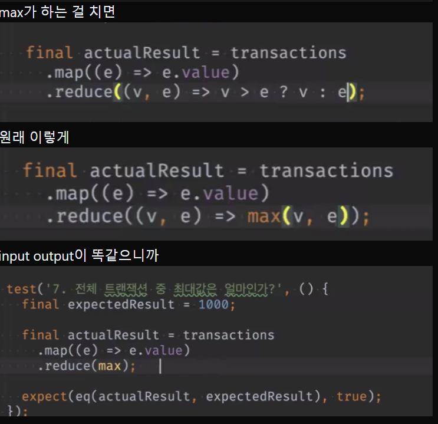
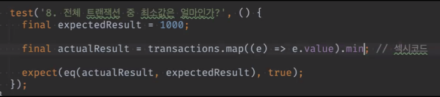
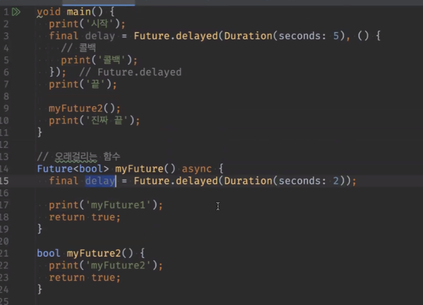
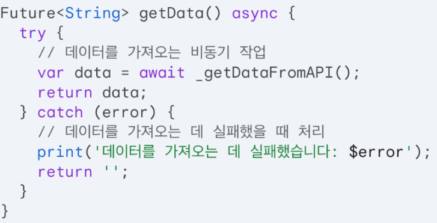

# <span style="color:lime">20240311 플러터 과정 3주차 목요일</span>   

## 1. 꼭 기억할 것! 🏅
### 과제리뷰 (쿼리)

```dart
List<Transaction> transactions? // nullable 보단
List<Transaction> transactions = [] // 이게 낫다
```

```dart
// List 비교 func
//Function eq = ListEquality().equals; // not deep
Function eq = DeepCollectionEquality().equals; // deep
// 선언해놓고
expect(eq(acualResult, expectedResult), true);
// 이렇게 가져다 쓸 수 있음
```

* sort와 sorted
sort() 원본 섞음 (mutator)
sorted 복사본을 만들어서 return함 (accessor)







이렇게만 쓰면 되고 reduce 함수를 쓸 필요도 없었음


### 한줄 vs. 함수형 어떤 게 더 좋은가

* 그 때 그 때 다르지만, 일반적으로는 함수형이 더 느림
* 어떤 걸 먼저 쓰느냐에도 성능이 달라질 수 있음
* where나 set, list가 내부적으로 반복하는데, 많이 돌릴 수록 느릴 것(한줄이 for문 쓰는 것보다 많이 돌림)
* 그래도 글자수, 보기 편해서 한줄로 많이 씀 

* `부수효과`줄일 수 있음. 즉, for문에서의 실수를 하지 않게 할 수 있음

* 변수가 있으면 에러가 남. => 변수가 없이 전부 상수고, 결과도 final이면 에러날 여지가 줄어듬
* **변수 없는 코드를 지향한다.**
* 성능을 버리고 안전을 추구함(그래도 하드웨어 때문에 거의 차이 없음)


#### 참고

* 운세방 어플
* 나이 50이 넘어도 앱 개발+수익화 가능

### 비동기 프로그래밍
#### Future
> Jaascript의 Promise에 대응<br>
> 미래에 받아올 값을 의미

#### Future 함수


- myFuture2를 지연시키는 건 불가능
- myFuture1을 Future로 해도
- myFuture1이 바로 찍히지만
- await를 쓰면 기다림 (2초)

#### then
* Future함수들끼리 연결할 수 있음
* 콜백함수가 따로 없어도 콜백을 받을 수 있음
* 결과  예측이 어렵다 + 체이닝 방식 복잡 + 디버깅도 어려움
* 따라서 async await 쓰는 것이 낫다.

#### async await

* 예외처리



#### 병렬 처리
- 병렬 처리는 동시에 여러가지 일을 진행
- Future함수는 await없이 사용하면 동시에 여러개 실행할 수 있다.

* 병렬 vs. 동시성(Concurrency)과 비교
>* 병렬은 동시실행, 동시성은 동시에 실행하는 것처럼 보임
>* 동시성은 시분할 실행.
>* OS가 여러 프로그램을 실행하는 경우, CPU가 분배해서 주는 것(동시성)
>* ex) 음악을 들으면서 웹서핑

* 멀티 스레드
>* 여러 일을 동시에 하게 하려면 스레드가 여러 개여야 함
>* 그러나 dart에서는 스레드를 조작할 수도 없고 할 필요도 없음
>* await를 붙이면 따로 실행, 떼면 동시에 실행됨
>* (await 떼고 쓰는)병렬처리는 하지말자

* 병렬 처리가 유용한 경우
>* 한 화면에서 데이터를 합쳐서 가공할 때
>* 제일 오래걸리는 데이터에 맞춰서 끝
>* 나중에 과제로 할 것


### 2. 한줄 정리 🧹
1. 중요한 것, 다시 봐야할 건 리스트업 해놓고 다시 볼 것
2. where, map, toList() 중요함
3. await는 async 써야 쓸 수 있고,  async는 Future함수에서만 쓸 수 있지만 void 함수의 경우에는 Future생략할 수 있다.
