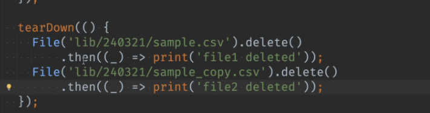

# <span style="color:lime">20240311 플러터 과정 3주차 금요일</span>   

## 1. 꼭 기억할 것! 🏅
### 과제리뷰 (쿼리)

#### copyWith
copyWith 를 생성자로 만들 수도, 메소드로 만들 수도 있음

```dart
Future<String> // : 미래에 String리턴이 된다.

String sss = await sourceFile.readAsString();
// await 붙여야 String으로 나옴

Future<dynamic> // Future 다음 타입 안쓰면 기본적으로 dynamic이라 써야함
```
main()은 시작점이라 이거 갖고 뭘 할일이 없어서 Future는 안붙여도 되지만 await는 못씀

delayed 코드 -> 변수에 받을 필요없이 await Future.delayed... 쓰면 됨

#### Timeout
```dart
String result = timeoutFuture().timeout(Duration(seconds: 5), onTimeout () {
	return 'timeout';
});

print(result);
// timeoutException 써야

```

#### Debuging 
dartformat 문서
[https://pub.dev/documentation/intl/latest/intl/DateFormat-class.html](https://pub.dev/documentation/intl/latest/intl/DateFormat-class.html "https://pub.dev/documentation/intl/latest/intl/DateFormat-class.html")

Evaluate Express 메뉴 -> 함수 value 검사가능

#### 데이터 클래스
* 데이터 클래스 만들때 private할 필요없음
    * final 붙이면 어차피 수정 안되므로

* 경로의 파일 없는 경우 에러처리 필요함

* Future타입은 같이 출발하므로 누가 먼저 끝날지 모름
    * await를 하면 순서대로 가는 것
    * async써야함

* 순서가 필요없을 때는 await 안 써도 됨
* 일단은 무조건 await 쓸 것

* await 안쓴 함수 둘 중 어떤 것이 먼저 끝나는지 확인하고 싶을 때는
    * whenComplete
    * then



* async await 해놓으면 tearDown()이 다음 테스트 전에 끝나는 게 보장이 됨

#### 깃
* reset current branch here
    * 이건 현재 에러 나서 이전으로 돌려서 확인해보고 싶을 때
    * 푸시안하면 다 날아감


### 2. 한줄 정리 🧹
1. // TODO: 이렇게 주석 달면 따로 모아서 볼 수 있음
2. [목업 데이터 생성 사이트](https://www.mockaroo.com/)
3. [isolate](https://www.youtube.com/watch?v=vl_AaCgudcY)
4. [Single Thread][Part1](https://medium.com/globant/single-thread-dart-what-ccbca2543ae9)
5. [Part2](https://medium.com/globant/single-thread-dart-what-part-2-a5592bef5213)
6. [Future](https://www.youtube.com/watch?v=OTS-ap9_aXc)
7. [Async/Await](https://www.youtube.com/watch?v=SmTCmDMi4BY)
8. [미드저니](https://www.youtube.com/watch?v=d6w5vxWc0Ok)

### 3. 단축키
1. ctrl + G => 같은 거 잡힘
2. ctrl(cmd) + R => 바꾸기
3. ctrl alt O -> 안쓰는 import 지워짐