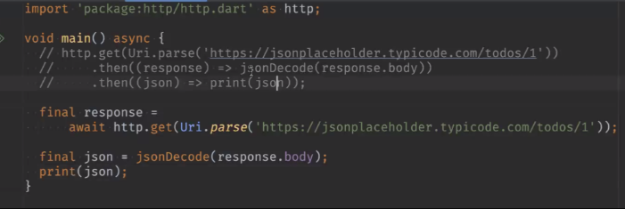
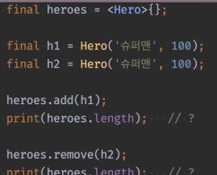

# <span style="color:lime">20240311 플러터 과정 4주차 월요일</span>   

## 1. 꼭 기억할 것! 🏅
### DataSource
데이터의 근간이 되는 원천 재료

가공되지 않은 데이터를 사용 가능한 데이터로 변환

### DataSource의 종류
- Text
- File
- [JSON](https://docs.flutter.dev/data-and-backend/serialization/json)
- XML
- CSV
- RDBMS
- NoSQL
- 등등

#### fromJson을 만드는 건 
데이터 변환하는 로직을 재사용하는 것 

기본적으로 fromJson은 dynamic을 리턴하기 떄문에
타입 확실한 건 아래처럼 타입 전환해서 리턴함 
```dart
  User.fromJson(Map<String, dynamic> json)
      : name = json['name'] as String,
        email = json['email'] as String;
```

```dart
final jsonList = jsonDecode(jsonListString) as List<String>;
List<User> users = jsonList.map((e) => User.fromJson(jsonList)).toList();
// as List<String>이 아니라 as List로 해야
// <String>으로 하면 fromJson에 안들어감?
```


## pub.dev
- 사용한 라이브러리는 로그인해서 좋아요 눌러놓을 것

- Dart, Flutter에서 사용여부, 플랫폼 확인해야함

- pubspec.yaml 파일에 추가됨

- environment:
	sdk: 3.3.0 -> 3.3.0 버전만 사용하겠다.
	sdk: ^3.3.0 -> 3.3.0보다 높은 버전을 취하겠다.
	
- dev_dependencies:
    - Test에서 사용하는 라이브러리들
    - app 출시할 때는 빠짐

- External Libraries
    * 라이브러리들이 참조하는 라이브러리들 들어가있음


## http
- import
    - import 'package:http/http.dart' as http;

- get('url')은 Top level Function이라 원래 그냥 쓰면 되는데 <br>
import에 별명을 붙이면 http.get() 이렇게 쓰는 것
(get은 너무 추상적이라서 -> 가독성)
- [Json Mockup 사이트](https://jsonplaceholder.typicode.com/)
-> 처음 타입은 StringJson


- 

    - 위 아래 같은 코드임

    - response.body 안dms List


- https://jsonplaceholder.typicode.com/todos (전체)
- https://jsonplaceholder.typicode.com/todos/1 (하나만 나옴(id) )


```dart
final http.Response response =
// Response 타입임. 
// as http 있어서 http. 이 들어감

print(response.statusCode)
//200은 성공/ 400은 실패
```


### 2. 한줄 정리 🧹
1. 스태틱인 경우 클래스명.메서드()로 사용가능, 스태틱 아니면 클래스명().메서드()
2. input과 output이 같으면 같은 함수로 본다. (사용례 확인)
3. fakehttp란?
4. **json 처리할 때 key값이 null인 경우의 처리방법**

### 3. Quiz
1. == 연산자 재정의를 하면 Set에서 동등성 체크에 사용된다. <br>
    => False (Set은 HashCode 기반)
2. Runtime에 타입이 결정되는 건 dynamic밖에 없고, 나머지는 전부 compile 시에 결정된다.
3. List의 sort() 메서드가 동작하기 위한 조건
    * Comparable 인터페이스를 구현. (o)
    * compareTo() 메서드를 구현한다. (x)
    (comparable인터페이스 구현해서 compareTo를 오버라이드해야 하고 메서드만 있으면 안됨)


4. 

  


heroes.length는? => 0개
