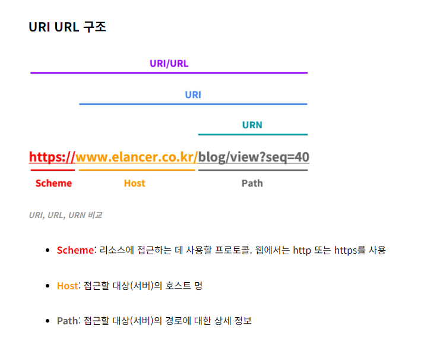
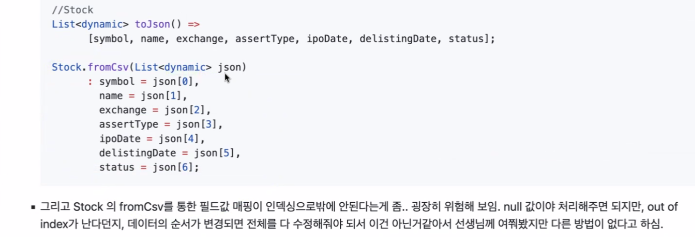
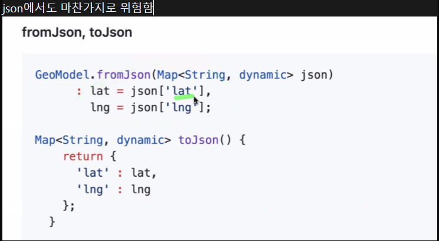
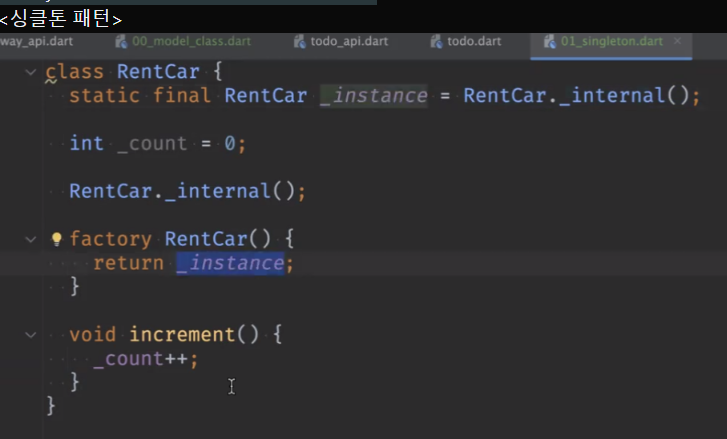
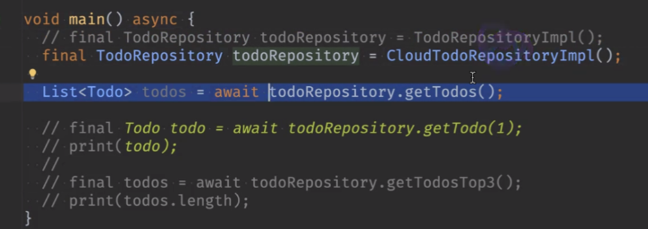

# <span style="color:lime">20240311 플러터 과정 4주차 화요일</span>   

## 1. 꼭 기억할 것! 🏅
### 과제리뷰
#### 과제1

* URI, URL

    

    출처 https://www.elancer.co.kr/blog/view?seq=74

* 동일성 비교

    >* expect()로는 동등성 비교 안됨
    >* List는 list.equals() 함수 쓰면 됨
    >* test쪽에 쓰려면 dev_dependency에 추가해야함

    ```dart
    DeepCollectionEquality().equals(todo.toJson(), expected), true
    // 이걸로 해서 검사
    ```
#### 과제2
TestCode
```dart
final expected = expectedTodos.map(Todo.fromJson).toList;

expect(DeepCollectionEquality().equals(todos, expectedTodos), true)
//hobby.equals(other.hobby);
```

#### 과제4
* subwayList 등을 List로 받았을 때 역이름 parameter 받는 걸로 바꿔볼 것
* 한글변환(utf8)은 한중일에서만 문제됨
    ```dart
        
        // euc-kr -> unicode
        // utf8.decode()쓸 땐 response.bodyBytes로 받아야함
        final xml = utf8.decode(response.bodyBytes);
        final myTransformer = Xml2Json();
        //Uint8List (unsignedInt 8bytes)
        
    ```





### Model, Repository
#### Model클래스

- 모델 객체 클래스의 속성에 대한 데이터를 조회할 수 있는 클래스
    
- 별도의 기능을 가지지 않는 순수한 클래스
    
- 데이터 소스를 앱에 필요한 형태로 변환하여 앱 개발을 편리하게 해 주는 역할
    
- 데이터 클래스와 다른 점은?? 비슷..

- View에 보여질 데이터를 담는 객체

- 비슷한 용어들
	- 도메인 모델
	- Entity
	- DTO
	- POJO
	- 데이터 클래스 (6종 세트 포함)
    
- Domain이란
	- 유사한 업무의 집합
	- 특정상황(주문,결재,로그인)이나 특정 객체(유저,손님)가 중심이 될 수 있음
	- ex) 앱개발 - flutter 개발


- 왜 클래스로 작성해야하냐
	- 맵으로 해도됨
	- 활용할 때 불편해서 하는 것


- 불변 객체의 생성자에는 const를 쓸 수 있다.
```dart
class User {
	final String name;
	final int age;

	const User(this.name, this.age);
}

void main() {
	final user1 = const User('name', 10);
	final user2 = const User('name', 10);

	print(user1.hashCode);
	print(user2.hashCode);
	// hash코드 재정의를 해서 hash코드는 동일함
	// const 붙은 생성자는 const를 붙여서 객체를 생성할 수 있다.
	print(identical(user1, user2));
	// 메모리 주소 실제로 비교하여 리턴
	// const를 붙이면 메모리까지 동일하게 됨
	// 안 붙이면 hash코드는 같지만, 메모리는 다름
	// 즉, const를 붙이면 메모리 절약 가능

	final name1 = '홍길동';
	final name2 = '홍길동';

	print(identical(name1, name2));
	// 메모리 주소 비교하면?
	// 같다
	// String은 똑같은 글씨 나오면 메모리에 올라간 걸 재사용함

	final num1 = 10; // 값 : value
	final num2 = 10;
	print(identical(num1, num2));
	// int, double, bool, String 등 값의 경우에는 그대로 씀
	// dart 외 다른 언어도 마찬가지
	// flutter는 const를 써서 최적화함
	
}
```

```dart
String hobby = '농구';

final user2 = const User('name', 10, hobby);
// 안 들어감
// Compile 시에 불변이라는 것이 확정이 되어야 넣을 수 있음
```

- 싱글톤	패턴
	- 한개의 인스턴스만 생성하는 것을 보증하기 위한 패턴
	- const로 생성한 애들이 동일한 것과 유사함
	- 캐시나 공유 데이터, 처리의 효율화 등에 사용되는 기술

- 내부에서만 사용할 private 생성자 만들면 기본 생성자 없어지고
외부에서 저 생성자를 호출도 못하므로 객체를 못만듬
- 이때 factory 생성자에서 객체를 만들어서 return할 수 있음



```dart
 void main() {
	 final car1 = RentCar();
	 //final car2 = RentCat();
	 final car2 = RentCar.getInstance(); 
	 // 이러면 가독성에 더 좋음
	 // 저게 없으면 객체 만든 거라고 생각을 못하니까
	
	 car1.increment();
	 
	 print(identical(car1, car2));
	// const를 안썼는데도 동일한 객체
	// 만들어서 return 하므로
	
 }
```

#### Repository 패턴
- Repository 
    - 데이터 추가, 조회, 수정, 삭제
    - 테이터 캡슐화
    - 데이터 추상화
    - 데이터 접근 제어
    - 예외 처리

    - cf) @immutable -> flutter에 있음

##### api와 차이
- TodoApi의 메서드 하나뿐 아니라 여러개 갖고 있는 캡슐화를 한번 더 감싼 것

- main에서 가져와서 갖다 쓰는 것이 아니라 api에서 return할 거를 받아서 쓰는 것
- 예를 들면 toDo로 여러 가지를 만들 수 있으므로 repository 내에서 어떤 로직으로 데이터를 가져올 지 따로 담아놓는 것
- 수정할 때 main함수를 건들지 않고 수정이 가능하고, 수정도 더 수월하게 가능함

- 인터페이스 정의를 통한 추상화 -> implements 강제해서 사용 가능함
 
- 네이밍 규칙 : xxImpl -> 인터페이스를 구현한 클래스

- ex) UserRepository 추상화 -> cloud/local/db (저장소) 별로 구현

    

    main의 로직 (하이라이트)은 건드리지 않고 RepositoryImpl 변경만으로 하는 것

## 2. 한줄 정리 🧹
1. factory 생성자와 싱글톤 정리
2. 디자인 패턴 추가로 확인해볼 것
3. **json 처리할 때 key값이 null인 경우의 처리방법** -> 목요일에 배울 예정

