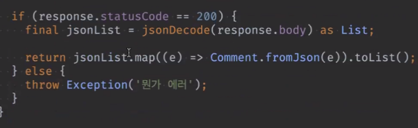
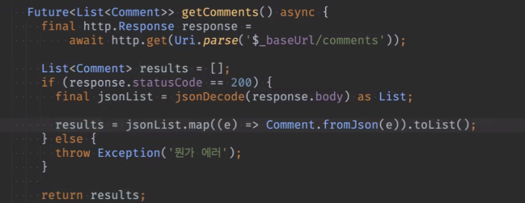
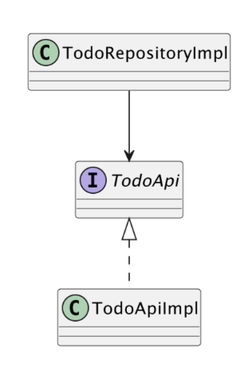
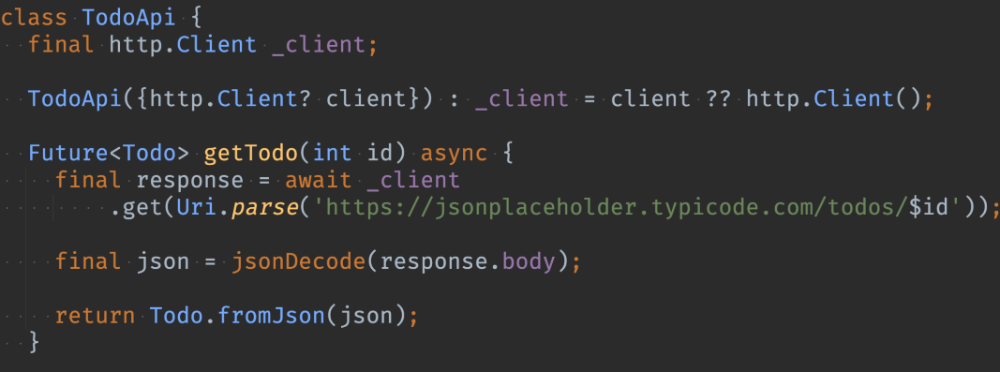
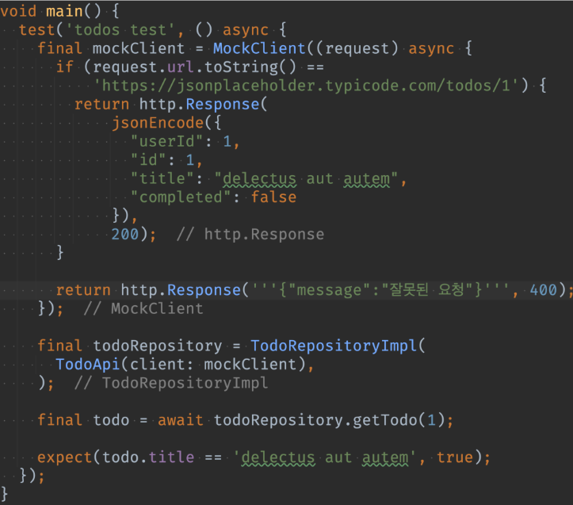
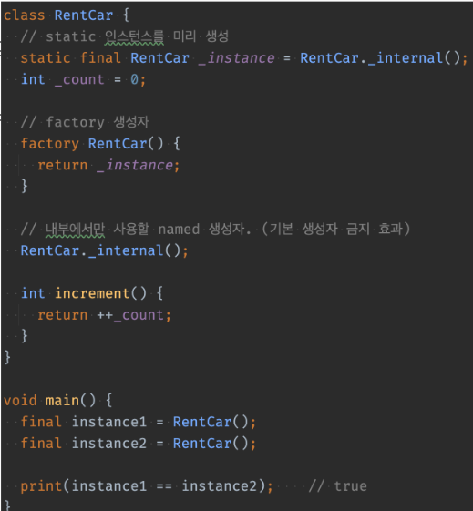

# <span style="color:lime">20240311 플러터 과정 4주차 수요일</span>   

## 1. 꼭 기억할 것! 🏅
### 과제리뷰
#### 폴더 구조 (예시)
* [data_source]
	* ㄴsubway_api.dart
	* ㄴtodo_api.dart
* [model]
	* ㄴtodo.dart
	* ㄴsubway.dart
* [repository]
	* ㄴsubway_repository (abstract interface)
	* ㄴsubway_repository_impl (implement)  
	* ㄴtodo_repository (abstract interface)
	* ㄴtodo_repository_impl (implement)

#### List<dynamic> -> List<Todo>
```dart
@override
Future<List<Todo>> getCompletedTodos() async {
	final results = await _api.getTodos(); // results는 List<dynamic>
	return results.where((e) => e.completed == true).toList();	
}

```
#### 이름 순 10번째까지, take(int)함수
```dart
Future<List<User>> getUsersTop10ByUserName() async {
	final results = await _api.getUsers(); 
	return results
		.sorted((a, b) => a.userName.compareTo(b.userName))
		.take(10) // 앞에서부터 10개만 가져옴
		.toList();
}

```
#### 이름 순 10번째까지, test code
```dart
	final repository = AlbumRepositoryImpl()
	// repository의 함수로 가져온 데이터
	final result = await repository.getAlbumsTop10();
	// map이나 Str 등으로 가져온 결과 -> Comment 객체로 변환하여 비교
	final expected = expectedComments.map((e) => Comment.fromJson(e)).toList()

	expect(results.equals(expected), true);
```
* list, set의 경우 list.equals() 함수로 비교
* Map의 경우에는 DeepCollectionEquality().equals()를 써야함


#### baseUrl 
```dart
// 은닉화, final, 최상위 static 변수로 선언
final _baseUrl = 'https:// ...';

Future<List<Comment>> getComments() async {
	final response = await http.get(Uri.parse('$_baseUrl/comments'));
}
Future<List<Album>> getAlbums() async {
	final response = await http.get(Uri.parse('$_baseUrl/albums'));

}

```
#### Post
```dart
Future<List<Post>> getPosts({int? page, int? limit})
// optional parameter로 받아서 받는 값 없으면 findAll
```

#### Status Code와 에러처리
- 예외 처리는 repository의 책임 중 하나임
	- 즉, repository에서 데이터 받을 때 에러처리해야 함
	- abstrac로 나눈 경우에는 impl에서 처리
	- 다만 현재 배운 바로는 에러발생 시 빈 list 반환 등 할 수 있는 게 별로 없긴 함
	(실제로는 어떤 처리를?)
- 네트워크가 끊어져있는 경우에는 Exception은 아니지만 의도적으로 Exception으로 처리해야함
- [정리] 
	1. api에서는 statusCode 검사 (삼항연산자)
	2. repository에서는 try catch로 에러처리

#### 좋은 코드

보단


처럼 return은 메서드 마지막에서만

#### [extension](https://dart.dev/language/extension-methods)
>기능을 만들려면 보통 클래스를 만들고, 기능을 확장하려면 상속하지만<br>
>Extension은 상속을 안해도 기능을 확장할 수 있게 해줌

```dart
class MyString extends String{
	int parseInt() {}
}	
// String 등의 경우에는 final로 선언되어 있어서 상속이 막혀있음
```
```dart
// List<dynamic>-> List<T> 타입 전환하는 extension도 만들 수 있음
extension ListMapToListObject<T> on List<T> {
	List<T> toListObject(){ // T도 들어가서 Generic도 넣어야 함
		this.map((e) => T.fromJson(e)).toList();
	}
}
```
cf) list.equals()도 extension임 (기능 확장 무한히 가능함)

### Test Code
#### Test Double
**[https://tecoble.techcourse.co.kr/post/2020-09-19-what-is-test-double/](https://tecoble.techcourse.co.kr/post/2020-09-19-what-is-test-double/)**

테스트 더블의 종류
- Dummy
- Fake
- Stub
- Spy
- Mock

Test 경계가 모호하므로 용어에 집착하지 말 것 


#### Mock 객체 활용
JsonPlaceHolderApi 등

#### 테스트 용이성💥
- 테스트를 편하게 하려면 인터페이스를 잘 써야함<br><br>
- 즉, 의존하지 않게, 교체할 수 있게 만들어야 함
- 방법1) 의존하는 클래스를 Interface로 변경

	

	참고) https://dart.dev/language#interfaces-and-abstract-classes

- 방법2) 의존하는 클래스가 Mock데이터를 주게 함	

[예시]
```dart
case1

* main()
* ㄴ PostRepositoryImpl (의존)
	* ㄴ JsonPlaceHolderApi (의존)

case2.
* main() (사용)
	* ㄴPostRepositry(I) (교체가능)
	* ㄴPostRepositoryImpl ㄴMockPostRepositoryImpl (구현)
	* ㄴJsonPlaceHolderApi

case3.
// test가 어려운 구조를 개선
class TodoRepositoryImpl implements TodoRepository {
	final TodoApi _api = TodoApi();
}

class TodoRepositoryImpl implements TodoRepository {
	final TodoApi _api;
	TodoRepositoryImpl(this._api);
}
```
case4.
http Client를 교체할 수 있도록 수정한 TodoApi



* http 라이브러리는 client()를 기본으로 사용하고, 교체도 가능하다.

case5.
Mock 객체를 활용
http 라이브러리에서는 테스트용 MockClient 객체를 제공한다.



- 방법3. 클래스를 구현 (변칙) 
	- Dart의 느슨한 규칙을 응용
	```dart
	class MockTodoApi implements TodoApi{}
	```

* [mockito (객체 작성 Test용 라이브러리)](https://github.com/dart-lang/mockito/blob/master/NULL_SAFETY_README.md)

#### 싱글톤, factory 생성자


#### 좋은 Unit Test의 6가지 조건(FRIEND)
1. Fase
2. Reliable
3. Independent
4. Ease of Maintenance
5. Nearly compacted code
6. Dependencies should be less


## 2. 한줄 정리 🧹
1. final 변수에 대한 생성자에는 const 붙일 것
2. 기능 클래스 객체 생성 코드는 최상단에(static) 두고 final(+ private)로 함
3. impl에서 api받아 데이터 요청하는 함수(ex. getAlbums()등)는 async 있어도, 없어도 됨..
4. return은 메서드 마지막에서만 하자.

