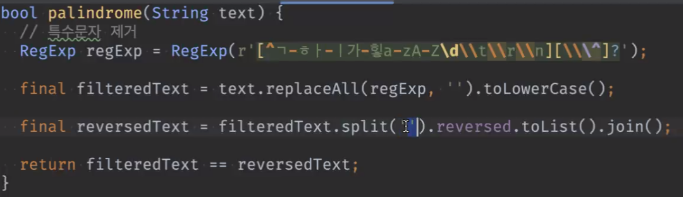

# 20240311 플러터 과정 4주차 목요일   

## 1. 꼭 기억할 것! 🏅
### 데이터 흐름 ✨✨✨
<h3>Data(Json) -> Api -> DTO -> (Mapper) -> Model -> Repository -> print</h3>

### 과제리뷰
#### 회문

성능은 좋지만 휴먼에러가 발생할 수 있는 코드

이게 성능은 느리지만 안전한 코드
앱만들 떄는 안전한 게 우선

#### 가장 큰 두 수의 합

구조분해

재귀함수 
알고리즘 문제에서 쓰도록 하고(간단한 수로), 
복잡한 수로 던져서 던지게 함
다트는 꼬리재귀 최적화를 지원 안해줌(대부분 언어에서 안해줌)

#### 한글변환

이런식으로 맵으로 넣어서 바로 fromJson에 넣으면
한글 변환 없이 들어옴

이런식으로 Str으로 넣을 때 문제되는 것

이렇게 앞에 r을 넣으면 raw data로 인식함
map으로 담는 것이 제일 편함

header에서 설정해서 받는 방법

#### DTO(Data Transfer Object)

- 데이터 소스를 모델 클래스로 변환하는 과정에서 순수하게 클래스에 담기 위한 중간 전달 객체

- 기존 모델 클래스를 Dto가 대체하는 것

- Dto 전체를 변환하는 것이 아니라 필요한 부분만 변환하는 것이다.

- 만드는 방법
	- final 아니고,
	- 모든 필드가 Nullable 변수
	- 직렬화, 역직렬화 제공
	- (from/toJson만 있으면 됨)

- 참고)
from/toJson as 다 떼야함(null 들어옴 터짐)

- todo.dart(모델)은
		- final 변수
		- const 생성자
	- 이 두개만 있으면 됨. 

- DTO가 필요한 이유
	- Model Class 는 non-nullable 한 값만 가지고 있도록 한다    
	- Json 데이터는 null 값을 포함할 수 있음 (문서에 명시되어 있지 않더라도…)
	- Map -> Model Class 변환시 null 값 등의 예외를 사전에 걸러내기 용이함
	- 불완전한 코드가 포함될 것 같다면 Dto를 도입하자
	- Json 값에 예외가 없다면 반드시 Dto를 도입할 필요는 없다

- DTO와 Data Class 역할분담
	- Dto : fromJson(), toJson()
	- Data Class(Model) : 불변 객체(+4개는 필요할 때 만들 것)

	- Dto는 사실상 서버 개발에서 필요한 개념인데 서버를 믿을 수 없는 경우 Dto를 쓰는 것

## 2. 한줄 정리 🧹
1. Data(Json) -> Api -> DTO -> (Mapper) -> Model -> Repository -> print
2. Mock 객체(Unit Test p35), Mockito 활용해볼 것

