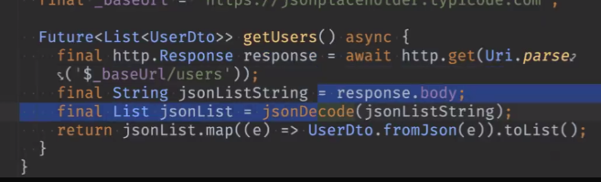
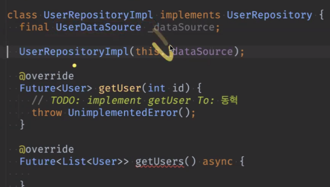
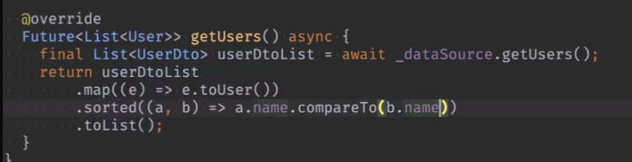
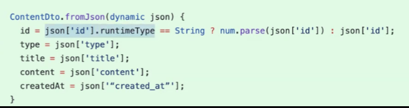
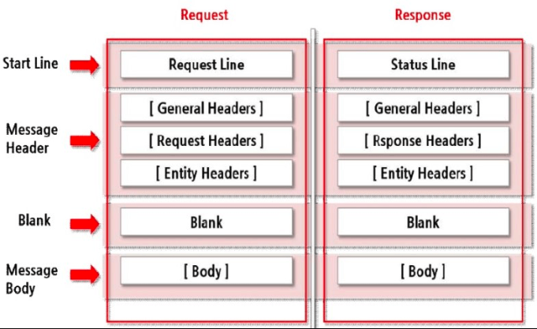
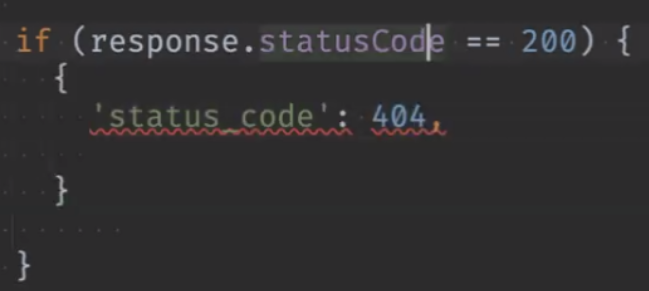

# <span style="color:lime">20240311 플러터 과정 4주차 목요일</span>   

## 1. 꼭 기억할 것! 🏅
### 데이터 흐름 ✨✨✨
<h3>Data(Json) -> Api -> DTO -> (Mapper) -> Model -> Repository -> print</h3>
<hr>

### 과제리뷰
#### Dto
기획단계에서 어떤 데이터가 필요한지 확인해서
Model에 필요한 것만 필드로 만듬

#### Model
델에 4종 필요에 따라 만들어줌

모델에 nullable은 안넣는게 좋음

#### Mapper
받는 필드만 매핑
기본적으로 null처리만 해줌
null처리 부분 일단 비움
(일본어로 할지 뭐로 할지 아직 모르니까)

### Repository
null처리 -> null일 경우 빈 리스크만 넣어주고
(이건 store가 null일 경우)

기존 코드를 수정하지 않으려고 extension을 쓰는 것(on StoreDT)

#### 불완전한 데이터 제외
어디서 처리할 것인가
Dto는 변환만 하는 거고
레파지토리에서 데이터를 거르는 것

```dart
return maskDto.stores!
.where((e) => e.remainStat != null && e.stockAt != null)
.map((e) => e.toStore()).toList();
// storeDto(maskDto.stores)에서 remainStat, stockAt이 null이 아닌 것만
// toStore로 Store타입으로 변환, List로 변환

### User

#### mapper

```dart
latitude: double.tryParse(address?.geo?.lat ?? '0.0') ?? 0.0,

```

class로 만든 경우에는 address.geo.. 
map으로 하면 ['address']
변수를 단순화 시키는 것이 처리하기 좋음

#### api
utf8 디코딩 들어가면 더 느리므로 확인하고 안써도 됨

http를 알아보기 위해서 써서 Response 앞에도 붙임



한줄로 쓸 수도 있음
ㄴ 해볼 것

#### userRepositoryImpl



테스트 편하게 하려고
갈아 치우기 편하게 하려고 UserDataSource를 따로 뺀 것



정렬이나 where조건은 repository에서
map하고 나서 nullable 아닐때? 즉, map 먼저하고 그 다음에 정렬이나 map할 것

### 3번

#### Mapper
```dart
extension ToPhoto on PhotoDto {
	Photo toPhoto() { // 이름 동일하게
		return Photo(
			url: url ?? '',
			title: title ?? '',
			type: switch(type?.toLowerCase() ?? '') {
				'article' => PhotoType.article,
				'image' => PhotoType.article,
				'video' => PhotoType.article,
				_ => PhotoType.unknown,	
			},
			createAt: DateTime.tryParse.tryParse(createAt ?? '') ?? DateTime(1981, 12, 19), // 뒷부분은 어떻게 할지 몰라서 넣음
			// switch문을 식으로 쓰는 것
			// 대소문자도 넣음
			createdAt:
		);
	}
}

#### repository
```dart
abstract interface class PhotoRepository {
	Future<List<Photo>> getPhotos();
	
}
```

```dart
class PhotoRepositoryImpl implements PhotoRepository {
	final PhotoApi _api;

	PhotoRepositoryImpl(this._api);
	// 이걸 갈아끼울 수 있게 만든 것
	
	@override
	Future<List<Photo>> getPhotos() {
		final List<PhotoDto> photoDtoList = await _api.getPhotoDtoList();
		return photoDtoList.map((e) => )
	}
}
```

```dart
abstract interface class PhotoApi {
	Future<List<PhotoDto>> getPhotoDtoList() async{
		final List<PhotoDto> photoDtoList = await _api.getPhotoDtoList();
		return photoDtoList.map((e) => e.toPhoto()).toList();
	}
	
}

```

```dart
class PhotoApiImpl implem
//여기에 http
```

### int와 String 혼합해서 내려오는 경우

case1)



2) int.tryParse
3) 변수 is Type

Dto에서 처리함

DTO를 dynamic으로 둬야하는 경우가 있음(DTO에서 받을 때)
mapper에서 고민하면 됨
안쓰면 상관없는 거고 만약 쓴다고 하면 mapper에서 처리?

## 네트워크 통신
바이너리 데이터: 2진 데이터
Base64: 이미지, 영상, 파일 등을 보낼 때 쓰는 인코딩?종류

Https: Http에 전송 계층 보안(TLS: Transport Layer Security)을 더해 만든 것

### 타임아웃

- Android의 경우 10초 이내에 응답이 없으면 타임아웃으로 간주함
- iOS 의 경우 60초

### Socket
	저수준의 API
	http는 요청보내면 응답이 오는 거라면
	socket은 서로 빨대꽂고 통신하는 것
TCP
	WebSocket을 쓸 때가 있음

1. Socket 을 사용하여 TCP/IP 통신을 할 수 있음
2. 접속하기 위해 IP 주소와 포트 번호가 필요
3. 프로토콜(통신시 사용되는 데이터 형식이나 순서 등)은 [RFC](https://tools.ietf.org/html/rfc1180) 문서에 정해둔 것을 따른다
    웹페이지 접속, 메일 전송, 게임 등은 모두 TCP/IP 를 통한 통신에 의해 이루어 진다.

### UDP	
여러 명이 몹 하나 잡을 경우는 UDP를 사용
한명 인터넷이 느리다고 다른 애들한테 영향이 가면 안되므로
스트리밍, 줌

줌은 나가면 나간 걸 아니까 그 부분은 TCP
섞어서 쓰는 것

정확하게 해야할 거는 TCP 방식

### 요청 메서드
https://developer.mozilla.org/en-US/docs/Web/HTTP/Methods

GET: 서버로 부터 데이터를 취득
POST: 서버에 데이터를 추가, 작성 등
PUT: 서버의 데이터를 갱신, 작성 등
DELETE: 서버의 데이터를 삭제
HEAD: 서버 리소스의 헤더(메타 데이터의 취득)
OPTIONS: 리소스가 지원하고 있는 메소드의 취득
PATCH: 리소스의 일부분을 수정
CONNECT: 프록시 동작의 터널 접속을 변경

### http




## 상태코드

- 200 OK
    
- 400 Bad Request(요청잘못했을때)
    
- 404 Not Found(요청자 잘못)
    
- 500 Internal Server Error(요청자와 상관없음)

https://developer.mozilla.org/en-US/docs/Web/HTTP/Status

메세지를 서버개발자가 정해줌

- 404로 들어오면서 데이터가 들어오는 경우



## 세션과 쿠키
 세션은 서버에 저장
 쿠키는 브라우저에 저장(파일)

앱은 쿠키가 없음?
파일로 하든, DB로 하든

## RESTful API
- 서버와 클라이언트가 메시지를 주고받을 때 가장 많이 사용하는 통신 규격 (암묵적인 룰)
- REST (representational state transfer)

- REST: 분산 시스템을 위한 소프트웨어 아키텍처의 한 형태
    
- RESTful 이란 REST 조건을 만족한다는 뜻
    
- 요청 주소(URL)과 메서드(GET, POST 등), JSON 규격을 이용하여 API를 정의
    
- 오늘날 가장 범용적으로 사용

## RESTful API란 무엇인가
https://aws.amazon.com/ko/what-is/restful-api/

프레임웤을 쓰면 그래도 좀 표준을 지킴
아니면 잘 안지킬 수도 있음

## Json 직렬화 코드 제네레이션 기법
https://docs.flutter.dev/data-and-backend/serialization/json#serializing-json-using-code-generation-libraries
직렬화 라이브러리

필드를 쓰고,
생성자를 만들고
명령어를 실행하면
자동으로 만들어짐

```
dart pub add json_annotation dev:build_runner dev:json_serializable  
  
dart run build_runner build  (watch)  
dart run build_runner build --delete-conflicting-outputs (충돌 해결)
```

장점
	(DTO를 안쓸때)
	Json에서는 addr로 들어올 때 address로 쓸 수
	(내가 쓰고 싶은 필드명을 쓰면서 매핑을 해줌)
	이건 서버를 100프로 믿을 때 쓰는 것

단점
	동등성 비교 등은 수동으로 추가
	null은 못 거름

## 데코레이터 패턴
래퍼 객체들 내에 넣어서 행동들을 해당 객체들에 연결시키는 구조적 패턴


## 2. 한줄 정리 🧹
1. TCP는 HTTP보다 빠르지만 개발자가 할 일이 많다
2. HTTP는 로직이 간단하지만 TCP보다는 느리다
3. 모바일에서는 거의 HTTP를 쓴다.
4. TCP처럼 계속 연결해 있으면 배터리 빨리 닳기 때문에
5. http header content-type에 대문자가 아니라 소문자로 넣어야함
