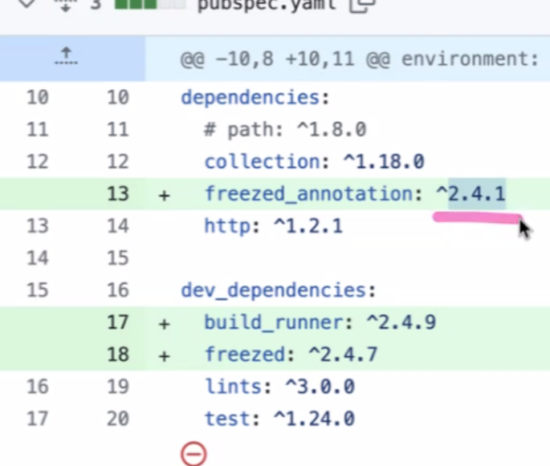
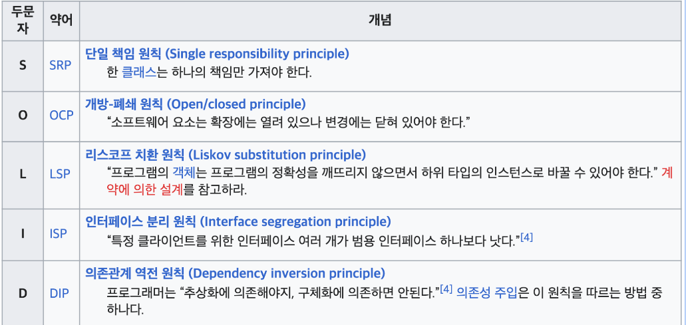
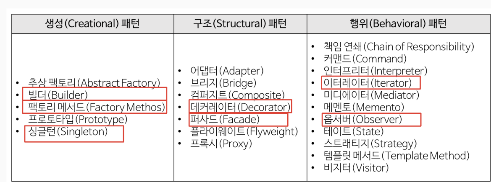
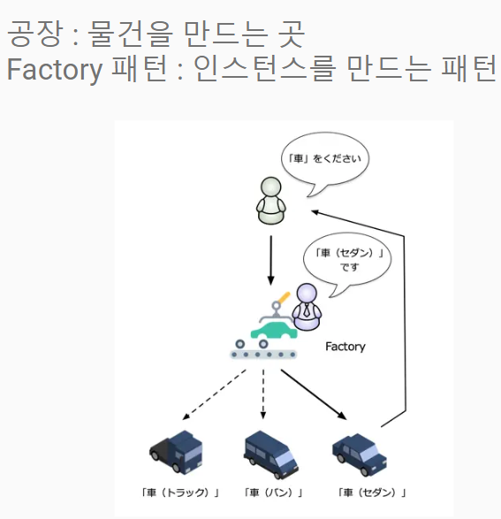
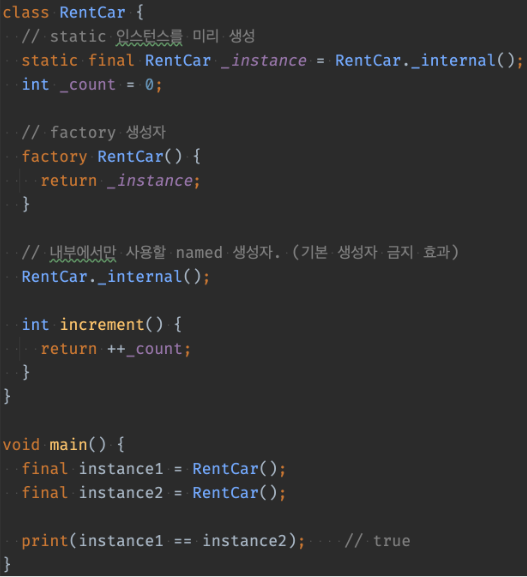
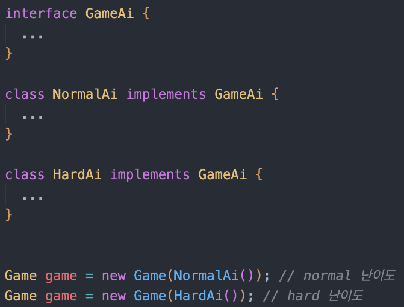
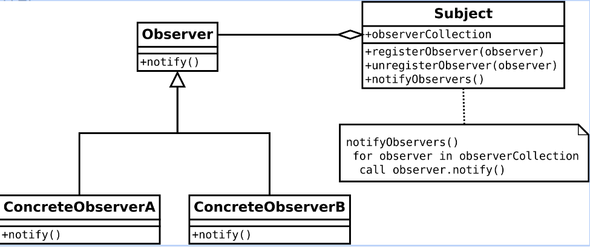
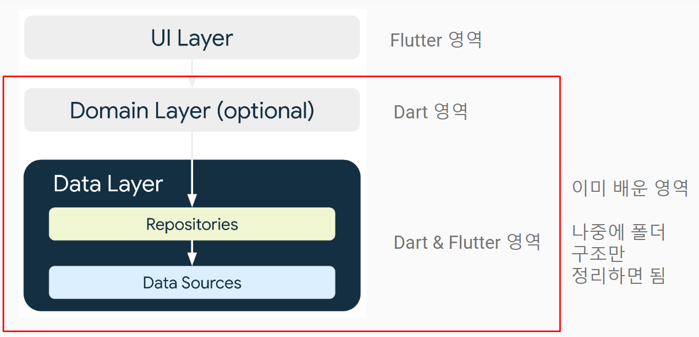

# 20240402 플러터 과정 5주차 화요일   

## 1. 꼭 기억할 것! 🏅
### dependency

- ^ 의미 : 2.4.2, 2.5.0 등을 받겠다는 의미
- lock쪽과 버전이 다를 수 있어 팀으로 작업할 때는 이렇게 쓰지 말 것
- lock이 공유가 되면 괜찮음

### 6가지 코드 작성의 원칙

1. DRY - Don’t Repeat Yourself : 같은 것을 몇번씩 반복하지 말라
2. PIE - Program Intently and Expressively : 명확하고 표현력 있게 기술하자
- 애매한 이름은 쓰지 말자
- 누가 봐도 알기 쉬운 이름을 쓰자(주석 안써도 알 정도로)
- 컨벤션을 따르자
- 매직 넘버에 이름을 붙이자
3. SRP - Single Responsibility Principle : 클래스에 주어진 책임은 1개뿐
- 단일 책임 원칙
- 하지만 클래스 분리가 심해지면 오히려 관리가 어렵기도 하다.
4. Open Closed Principle : 개방 폐쇄 원칙
- 수정 없이 확장 가능하도록 하자.
- Iterable, Comparator 등이 좋은 예
- String 의 경우는 상속 금지이므로 OCP에 반하는 클래스의 대표적인 예.
- 인터페이스를 적극 활용하여 확장 가능하게 하자.
- 생성자를 통해 테스트 가능한 종속 항목 삽입 (dependency injection)
5. SDP - Stable Dependencies Principle : 안전한 것에 의존하라
- ATM 시스템을 예를 들면 암호 처리 같이 한번 완성되면 수정될 가능성이 없는 클래스에 의존할 만 하다
- 하지만 가장 좋은 것은 특정 클래스가 아니라 인터페이스에 의존하는 것이다
- 클래스는 생성자가 변하거나 할 수 있으나 인터페이스는 거의 그대로이니까.
6. ADP - Acyclic Dependencies Principl
- 의존성 비순환 원칙
- 의존 관계에 사이클이 발생되지 않게 한다

### SOLID 원칙

1. 단일 책임 원칙
- 외부 객체는 생성자로 주입 받아라
2. 개방 폐쇄 원칙
- 원본 코드를 수정없이 새로운 기능을 추가할 수 있다
- Slime, Goblin 각각 때리지 말고 Monster를 때려라
3. 리스코프 치환 원칙
- is a 원칙을 지켜라
4. 인터페이스 분리 원칙
- 인터페이스 하나에 다 때려 넣지 말고 여러개로 쪼개라
- Bionic 만 구현하지 말고 Attackable, Moveable, Healable 처럼 기능별로 쪼개라
5. 의존 관계 역전 원칙
- 메딕이 특정 객체를 받지 않고 Healable 인터페이스 구현체를 받도록 하는 것

### 디자인 패턴
- 소프트웨어 디자인 패턴(software design pattern)은 소프트웨어 공학의 소프트웨어 디자인에서 특정 문맥에서 공통적으로 발생하는 문제에 대해 재사용 가능한 해결책이다.
- 디자인 패턴은 프로그래머가 어플리케이션이나 시스템을 디자인할 때 공통된 문제들을 해결하는데에 쓰이는 형식화 된 가장 좋은 관행이다.

#### Factory패턴

#### Singleton패턴
- 1개의 인스턴스만 생성되는 것을 보증하기 위한 패턴
- 인스턴스 생성을 여러번 시도해도 1개의 인스턴스가 공유됨
- 캐시나 공유 데이터, 처리의 효율화 등에 사용되는 테크닉
- 주로 빈번히 사용하는 Database 등의 인스턴스 생성을 제한할 때 많이 사용한다.

#### Decorator 패턴
- 플러터 위젯

#### Iterator - 반복 구조
Iterable -> Iterator

#### Facade - 내부를 감추고 심플하게
- 이사를 가면 주소를 변경할 때, 주민센터, 카드회사, 학교 등에 알려야 한다. 
- 이를 하나하나 일일이 하는 것은 매우 귀찮기 때문에 한번에 해 주는 서비스가 있다면 그것을 이용하면 된다는 이론
- Repository 패턴이 Facade 패턴이다

#### Strategy (전략 패턴) - 갈아 끼우기 쉽게

여러가지 중에서 고를 수 있도록

#### Observer 패턴 (발행/구독 모델)

- 옵저버 패턴(observer pattern)은 객체의 상태 변화를 관찰하는 관찰자들, 
즉 옵저버들의 목록을 객체에 등록하여 상태 변화가 있을 때마다 메서드 등을 통해 객체가 직접 목록의 각 옵저버에게 통지하도록 하는 디자인 패턴이다. 
- 주로 분산 이벤트 핸들링 시스템을 구현하는 데 사용된다. 
- 옵저버 패턴의 예 : 콜백 함수

#### 아키텍처 디자인 패턴

MVC
MVC2
MVP
MVI
MVVM

#### Repository 패턴

- Repository 패턴은 소프트웨어 개발에서 데이터 저장소에 접근하는 객체를 추상화하고, 
데이터소스(DB, File 등)와의 통신을 담당하는 객체를 캡슐화하는 디자인 패턴입니다.
- Repository는 저장소라는 의미이므로 User 데이터의 제공과 조작을 제공한다
- Impl 클래스의 내부는 자유롭게 작성한다 (DB를 쓰든 File을 쓰든 메모리에서 하든)
- 이를 활용하는 클래스 (주로 Service, Manager, ViewModel, Controller 등으로 불리우는) 에서는 Impl 객체가 아닌 UserRepository 인터페이스 타입을 조작할 것.

#### Repository 패턴 특징

- 데이터 액세스 레이어를 추상화합니다.
- 비즈니스 로직과 데이터 액세스 로직의 분리
- 코드의 재사용성을 높입니다.
- 도메인 객체와 데이터베이스 스키마의 매핑을 담당합니다.
- 보안성을 향상시킵니다.

## 2. 한줄 정리 🧹
1. whenOrNull => freezed에서 자동으로 만들어주는 메소드로 선택적으로 인자를 넘겨줄 수 있음
2. 레거시 코드 : 옛날 코드, 쓰면 안되는 것
3. 데이터 접근은 Repository만 활용한다
4. Repository 를 활용하여 
앱의 기능을 제공하는 클래스가 제공하는 기능이 비즈니스 로직이라고 할 수 있다.
5. Dto에서는 final 붙이지 않음(수정가능)
6. Dto 만들고는 건드리지 말 것. repo나, mapper에서 수정