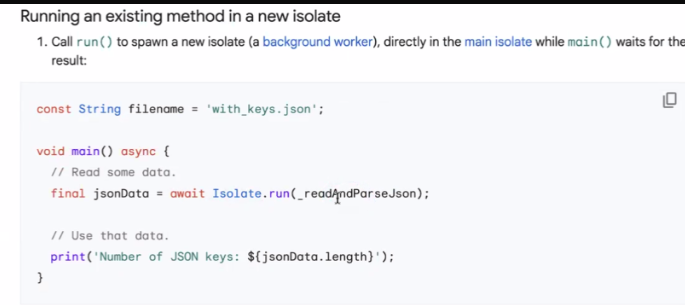
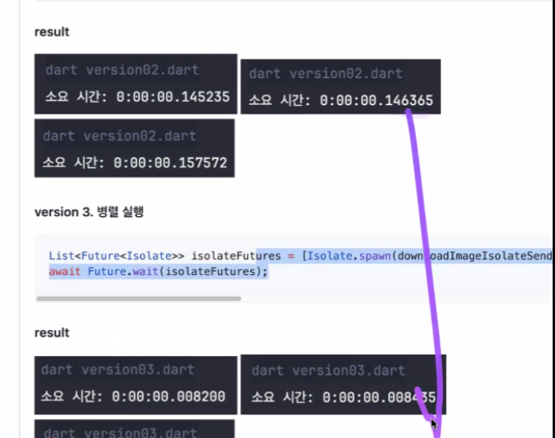
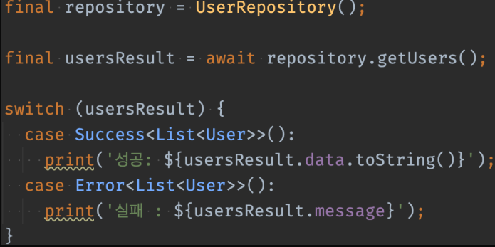
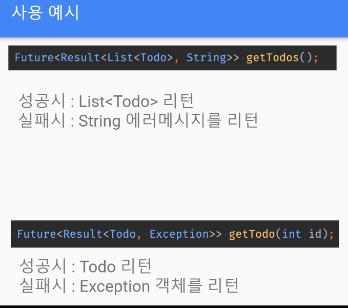
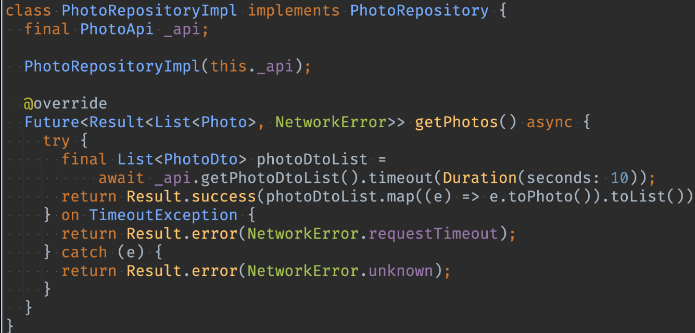

# <span style="color:lime">20240311 플러터 과정 5주차 월요일</span>   

## 1. 꼭 기억할 것! 🏅
### pixabay api
```
### search yellow + flower
GET https://pixabay.com/api/?key=36206009-fe028570b3c99a317c543088c&q=yellow+flowers&image_type=photo HTTP/1.1
Content-Type: application/jsonGET 

### 전체
###  "total": 1834965,
GET https://pixabay.com/api/?key=36206009-fe028570b3c99a317c543088c HTTP/1.1
Content-Type: application/json

### photo
### "total": 1448443,
GET https://pixabay.com/api/?key=36206009-fe028570b3c99a317c543088c&image_type=photo
Content-type: application/json; charset=UTF-8

### illustration
### "total": 386522,
GET https://pixabay.com/api/?key=36206009-fe028570b3c99a317c543088c&image_type=illustration
Content-type: application/json; charset=UTF-8

### vector
### "total": 386522,
GET https://pixabay.com/api/?key=36206009-fe028570b3c99a317c543088c&image_type=vector
Content-type: application/json; charset=UTF-8

```

### Git
#### 임시저장
#### stash Changes
- 하던 거 확인도 되고
- Unstash -> Apply 하면 하던 게 적용도 됨

#### shelv 
- stash와 유사한 기능

#### switch vs. checkout

#### branch
- dev brach / feat branch 등

- 기능 개발 끝난 branch는 삭제해야함 

#### fetch
- 이력만 들어옴

- 예를들어 내 local이 한참 update 안된 경우에 이력만 한번 살펴보려고 할 때

#### Beyond compare 
- 유료 merge tool
- 수동 merge임

### Isolate
동시성 (Concurrency)

Future로 비동기 코드를 쓰는데,



화면에 지장을 줄 정도로 무거운 작업일 경우
화면에 지장 없도록 따로 돌리는 것

서로 port를 통해서 통신을 주고 받아야 



병렬 처리보다 처리 시간이 더 빠르다

### Result 패턴
- enum은 동등성 비교도 안되고, hash 코드 비교도 안되어서 한계가 있음

- try catch는 런타임에 터질 오류 잡는 거 
- 논리적인 오류나 예외 상황에 대한 처리를 하기에는 부족하다.

- Result 패턴이 성공 실패 처리에 유용한 패턴이다.

```dart
sealed class Result<T> {

 factory Result.success(T data) = Success;
// => 가 아니라 =을 씀
  
 factory Result.error(Exception e) = Error;
}
class Success<T> implements Result<T> {
// 구현=>성공할 때 반환할 데이터 등을 정의해서 쓸 수 있음
// sealed는 타입 봉인 효과 -> enum처럼 쓸 수 있다.
// Generic을 써야 범용적으로 쓸 수 있음
 final T data;

 Success(this.data);

}
 

class Error<T> implements Result<T> {

 final Exception e;

 Error(this.e);

}

```


result.으로 성공/실패 나눠서 return

```dart
// 오늘 한 과제 예시
abstract interface class MovieRepository{
	Future<Result<MovieDetail>> getMovieDetail(int id)
	// MovieDetail을 한번 더 감쌈
	if ( id < 0 ) {
		return Result.error('id 에러');
	}

	// 정상적인 값 리턴은 
	return Result.success ...
	// 실패에 대한 부분도 error 던지지 않고 값을 던질 수 있음
	return const Result.error('네트워크에러');
}
```



- enum처럼 switch문과 결합하여 모든 상황에 대한 return값 보낼 수 있음

- enum은 못하는 원하는 객체를 넣어서 던질 수 있다.





- enum을 한번 더 써서 패턴화

- 에러메세지를 균일화 하면 국제화 등 문제 있는데 Result 패턴 쓰면 enum으로 해서 다국어화 등 편하게 할 수 있다.
- 제네릭이 두 개 들어가서 어려울 수 있음
- 소규모에서는 ver1(제네릭 하나)도 충분
- 다국어에서는 ver2 (10페이지)

### freezed 라이브러리

- boilderplate를 방지해준다.

**freezed = json_serializable + Equatable + Immutable 합친 느낌**

- When. 은 옛날 코드

- switch로 하는 게 맞음


- equatable
	- 4종 세트만 만들어줌
	- 협업에서 두 개 (freezed+Equatable)를 쓰는 데가 있음
	


## 2. 한줄 정리 🧹
1. .emv 파일로 api 키 등을 숨겨보자
2. freezed vscode에서 사용법
3. Result 이용한 testcode 
