# <span style="color:lime">20240402 플러터 과정 5주차 화요일</span>   

## 1. 꼭 기억할 것! 🏅
### 과제 리뷰
- Facade 클래스

    - 값을 받아서 UI에 전달함
    - 의존도를 낮추려면 어떤 방식으로 구현해야 할까
    
    
    
    

- Repository를 User와 Book으로 나눔
    -Repo는 model말고 다른 기준으로 나누는 경우는 없을까

- id sequence처럼 생성
    - `Set<int>`static선언하고 function 하나에서 Set에 1씩 증가하는 int를 넣는 방식으로 해보자

- Dto vs. copyWith
    - 데이터를 변경하는 경우에는 Dto를 쓰는 것이 맞다.

- dart 파일 cmd에서 실행 가능

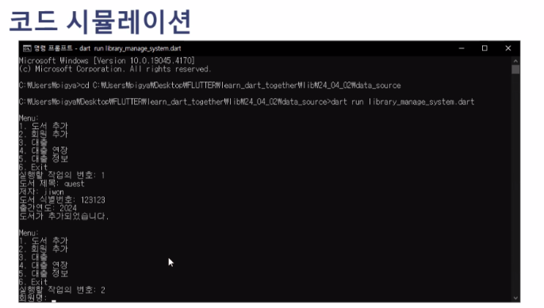

- 메멘토 패턴 (삭제 후 복구 가능)


- 설계 잘함

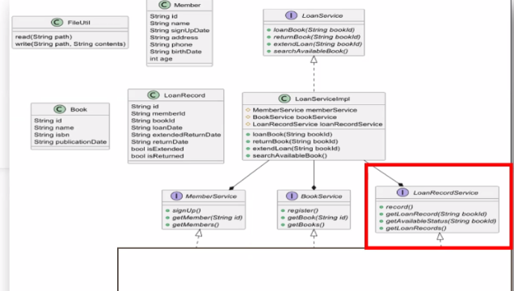

### flutter 시작!

#### stateful vs. stateless
- statelessWidget -> 변수가 없다는 것

- stateless에서 변수 선언하면 노란불 나옴. 
 따라서 final 아니면 const를 써야함

- stful의 상태는 getter라서 매번 생성해서 성능이 좋지 않음
- 우선 stless로 먼저 만들다가필요하면 full로 바꿀 것

#### docs
flutter 문서 많이 없다
전체 한번 봐보자!

특히 Widget catalog, Layout부터
https://docs.flutter.dev/ui/widgets

#### youtube
유투브 flutter > 재생 목록> 이주의 위젯 Widget of the Week
무조건 보자!
길어야 1분이다.

[https://youtube.com/playlist?list=PLjxrf2q8roU23XGwz3Km7sQZFTdB996iG&si=Ejp09A7rpBAoaJ0H](https://youtube.com/playlist?list=PLjxrf2q8roU23XGwz3Km7sQZFTdB996iG&si=Ejp09A7rpBAoaJ0H "https://youtube.com/playlist?list=PLjxrf2q8roU23XGwz3Km7sQZFTdB996iG&si=Ejp09A7rpBAoaJ0H")

#### 에뮬레이터
에뮬레이터 가상 device 글자 들어가 있으면 아직 시험중
숫자 들어가 있는 것으로 만들어 쓸 것

#### main 클래스

state쪽에서 위에는
widget.title로 접근함

regular expression으로 지울 수 있다.

변수가 있으면  const 못 붙임

( ) => 써도 되는데
함수 이름만 쓴 것. input, output이 동일하니까
ㄴ 정리 필요!

#### layout_samle.dart
stless 로 시작

placehold -> X표시
scaffold로 (하얀색)
	ㄴ Scaffold가 뼈대 시작 
Container하면 글씨가 형편없이 써짐

#### Scaffold
- appbar에 컬러넣기

```dart
    @ovveride
    Widget build(BuildContext context) {
        return Scffold(
            appBar: AppBar(
                backgroundColor: Theme.of(context).colorScheme.inversePrimary,
                title: Text(widget.title), // class로 만들어서 사용
            )
        )
    }
```

안드로이드는 보통 만들면 왼쪽에 붙고
ios는 가운데 만들어짐

Scaffold body에 만들기 시작


#### InfoCard
Scaffold에 틀 만들고 안에 내용 분리하는 것이 중요!!!
==추상화된 이름== 으로 만듬

#### Column
아래로 여러 개 붙이려고 사용
children은 Widget list임
==Widget을 아래서만 쓰는 거면 은닉화==

#### image
재사용이 가능하다면 class로 빼서 따로 만들 것!
```dart
final String imageUrl;
final String title;
final String subTitle;
final String description;

// 생성자 만듬
// 필드가 너무 많아짐
// -> 클래스로 만듬

Column(
	children: <Widget>[
		_image(),
		_second(),	
	],
), 
Widget _image(){
	return Image.network(''); // 이걸 생성자로 받아야함
}
Widget _text(){
	return Text('1');
}
```

#### model생성

- freezed 에 필요한 dependency

    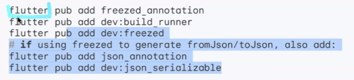

    UI에서 Model을 받아서 써야하므로 처음에 설계할 때 Model을 먼저 만들어야함

#### image 넣기
값을 안주면 꽉차는 애가 있고, 값을 안주면 작은 애가 있음

AspectRatio : 가로, 세로 비율을 줌

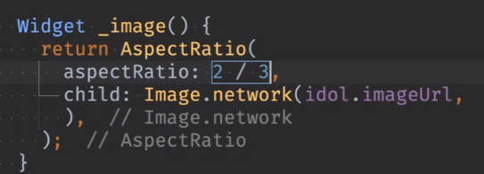

사진별로 크기에 따라 빈부분 생김


이미지 꽉 채우기

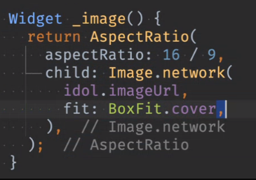

default로 보통 이렇게 함
9/8이 비율 적절햇음
잘리는 부분 생기는 걸 비율 조정

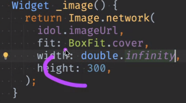

width 강제로

#### layer

#### Row
- Column
	ㄴ 컬럼은 기본적으로 중앙으로 정렬됨
- 왼쪽정렬
	crossAxisAlignment: Cross... 
	
- 양 item간 간격 벌이기
	1번 방법
	Expanded 
	기본으로 1:1 속성인데
	배열 하려는 두 속성 왼쪽에 씌워야함
	둘 다 쓰면 절반을 써서 반씩 먹음
	Expanded 안에 flex라는 옵션 써서 비율

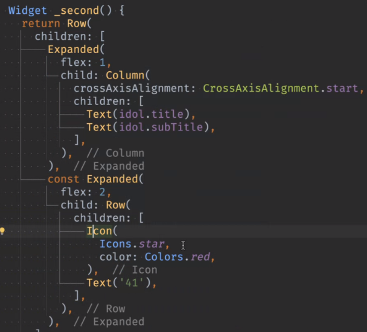

- 2번 :	Flex는 어떻게 쓰는지?
- 3번 :	빈 공간에 Spacer()를 쓰면 양쪽으로 밀어버림
- 4번 :	sizedbox는 쓰면 안됨(sizedbox에 width : double.infinity)
	- 실제 사이즈 들어가는 부분에 써야지 이럴 때 쓰면 날아갈 수 있음

#### padding
EdgeInsets.all(8) 기본 8이 들어감
왜 8부터 시작하는 가
8의 배수를 선호함
8의 배수가 나누기 편함(소수점 안나오게)

#### text
text fontSize: 14가 default임

비워놓을 때
	SizedBox(
        height:30,
        child: Placeholder()
    )

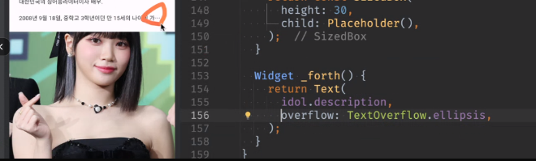

- TextOverFlow
    - ....으로 줄여줌
    - MaxLines 있음


#### infocard

    클래스로 분리함

#### 클릭되도록 + 상태 변경
    default false

   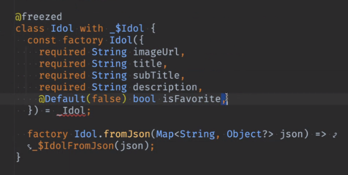

- 삼항 연산 들어가도 const를 못씀
- 옵저버 패턴, 콜백 활용해야
ㄴ 안이 아니라 밖(상태 class 밖)에서 바꿔줘야함

- 각 id를 추가하고 Idol을 넘김

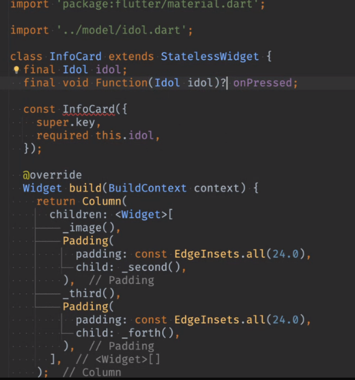

옵션으로 안넘겨도 되도록 함

#### 클릭되도록
idol의 다른 것도 쓸 수 있게 idol을 던짐
```dart
GestureDetector
	onTap: () {
		onPressed?.call(idoll),	
	}
//또는
onTap => onPressed?.call(idoll)
```

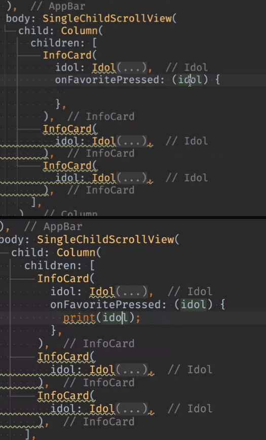

콜백함수 찍어봄
toString은 생략가능


상태관리(정리!)


Set추가


들어있으면 favorite, 없으면 x

변수 부분은 hotrestart해야함(reload로 안됨)

상태는 위와 같이 (Set 등으로) 바깥에서 갖고 있어야

onPressed하면 
```dart
if (_favoriteIdolIds.contains(idol.id)) {
	_favoriteIdols.remove(idol.id);
} else {
	_favoriteIdols.add(idol.id);
}
```

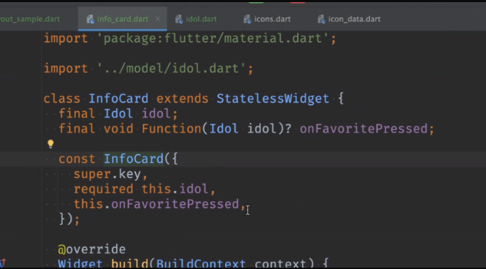

이렇게 만들어야 범용적으로 쓸 수 있음
InfoCard 내에 각각 GuestureDetector 등 붙일 게 아니라
Dart에서 하던 거 그대로

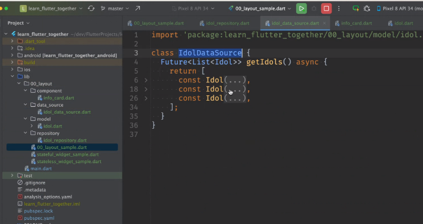

Dto는 일단 생략함. 필요할 때만 만들 것.

Data_source, repository

위에서 받아서 밑에서 활용
widget.idolRepository.get

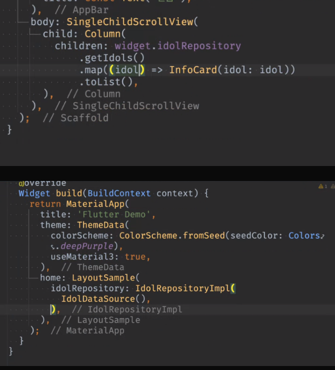

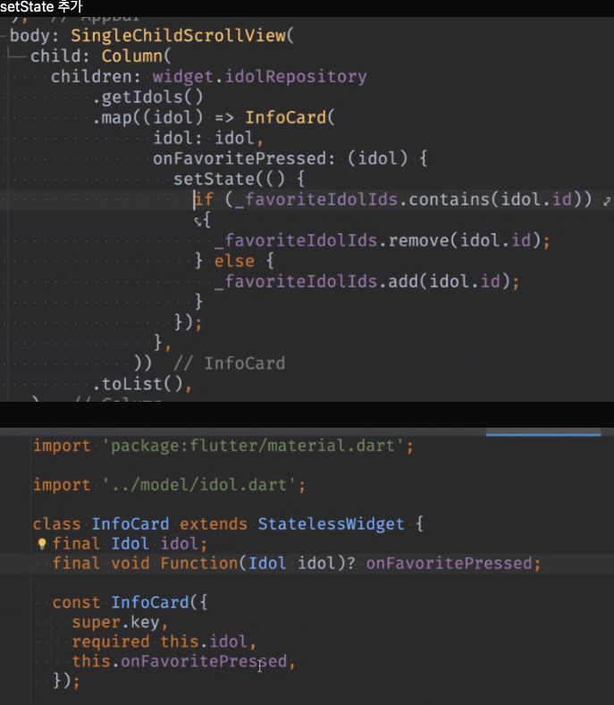

favorite을 InfoCard에 넣었어야 했음

date_source로 보지 않는다고 하면
(저장 따로 해야)

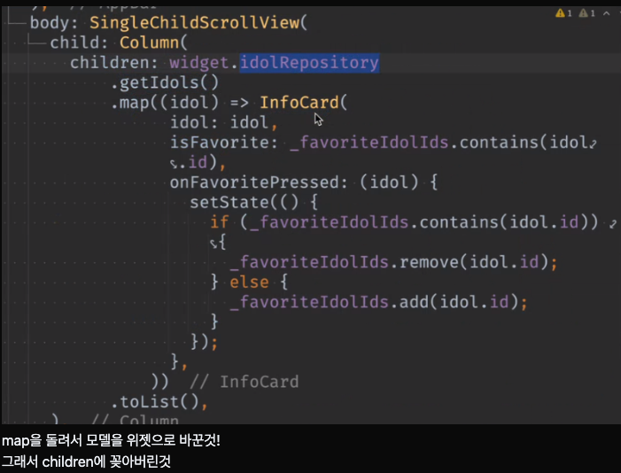

#### InfoCard 클래스로 빼서 사용

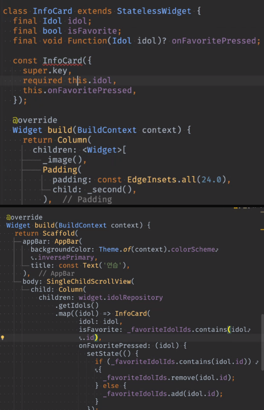

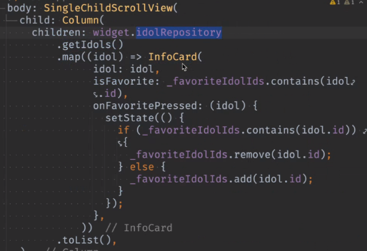

map을 돌려서 모델을 위젯으로 바꾼것!
그래서 children에 꽂아버린것

#### lottie

https://pub.dev/packages/lottie

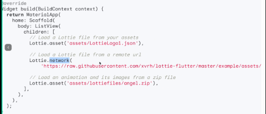


https://lottiefiles.com/

json으로 다운받거나 링크 복사해서 쓸 수 있음

flutter_birthday_card_ui
flutter_business_card_ui

## 2. 한줄 정리 🧹

1. 에러가 발생하면 시스템 재시작하거나 특정 단계에서 시작하도록 하는 등 에러날 때 시스템을 어떻게 할 것인지도 고려해야함
2. 어플을 그냥 만드는 건 어떻게든 하지만, 설계를 하고 만드는 것이 어렵고 중요함
3. 시스템 구동 -> `while(true)`로 구현
4. flutter 공식 유툽에 boring show 심심할 때 볼 것
5. git에서 .누르면 vscode처럼 나옴
6. alt enter로 stateless -> stateful로 바꿔줄 수 있음

+ 추가 할일
1. freezed 사용법!!!
2. input output 같을 경우 함수 처리 확인
3. Pacad, Memento pattern 구현방법 확인


## 3. 유용한 어플 
    - canva : ppt보다 깔끔하게 발표자료 정리 가능
    - [감마](https://gamma.app/docs/-wk03gjwjcl2ucno?mode=doc) : 
    - copilot 인공지능
## 4. mac 단축키
1. cmd + j : 하단바 올리기/내리기
2. 

## 5. 삽질로 얻은 keytool에 대한 얕은 지식
- 상황 : google login 구현 목표로 이전에 mac에서 한 것대로 windows에서 시도
- 문제 : 
    1. keystore가 컴퓨터마다 달라서 로그인 요청을 보내면 PlatformException(sign_in_failed, com.google.android.gms.common.api.ApiException: 10: , null, null.. ) 발생
    2. gradle 빌드 관련 에러 발생 (keystore와 관련된건지 빌드 캐시를 지우려다가 잘못해서 gradle 폴더를 날려먹어서인지는 아직 모름)

- 삽질로 알게 된 keytool 관련 정보
    - keytool은 Keytool은 Java Key Store(이하 JKS)를 생성 및 관리를 하는 응용 프로그램이다. 키 쌍(공개키, 개인키)를 생성할 수 있고 인증서 발급도 가능하다. JKS는 Java서 사용하는 키 저장소 방식이며, 내용을 추출할 라이브러리를 제공한다.
    - 즉, google login 등 인증이 필요할 때, 사용하는 암호키 생성 관리 프로그램이다.
    - 자바를 깔아야 사용할 수 있으며, 환경변수를 등록하면 keytool이라는 명령어를 다른 폴더에서도 사용할 수 있다.

    - 개발할 때 사용하는 debug.keystore와 배포시 사용하는 release.keystore가 있는데, 잃어버리면 골치아파지므로 잘 간수해야하고,<br>
    만약 안드로이드 시스템을 인수받는 경우에는 선임자에게 키스토어 파일도 같이 받아야 한다고 함
    - 기존 꺼를 지우고 새로 다운받으면 그만인거 아닌가 싶지만, 이번 경우를 통해 그렇게 단순한 것이 아닐 수도 있다는 사실만 배웠음
    - 이 key에도 hash가 따로 있다고 해서 앱이 바라보는 hash와 실제 google cloud/ firebase에 등록된 hash와 차이가 나서 문제가 생길 것 아닐까 하고 짐작도 해봤지만,<br>
    그러면 아예 키를 삭제하고 다시 받으면 문제가 해결되어야 하는 것이 아닌가 해서 원인은 결국 모름.
    - 여러 컴퓨터에서 사용할 때에는 keystore 파일을 따로 보관하면서 옮기는 것이 마음 편할 것 같음.
    <hr>
    - keytool의 위치는 windows 의 경우 c:/user/계정/.android에 있고, 안드로이드 스튜디오를 설치하고 안드로이드 sdk를 설치할 때 깔림.
    - keystore 파일을 지우고 sdk를 지우고 다시 깔면 다시 깔리긴 함
    - 원래 google cloud 쪽 oauth에서만 관리가 되다가 firebase가 생기면서 그 쪽으로 아예 인증 관련된 것들은 옮겨지다가 만건지,
    현재는 google cloud와 firebase에 모두 앱 관련 프로젝트를 추가하고 인증 관련하여 SHA 키를 등록하는 부분도 둘 다 남아있음
    - 검색한 바로는, google cloud, local pc, firebase의 keystore가 모두 일치해야 firebase를 이용한 인증을 할 수 있다고 함.. 일원화 + 간편화 해줬으면...
    
    #### google login 구현 순서
    [공식문서](https://firebase.google.com/docs/auth/flutter/start?hl=ko)

    0. 사전 작업
    - firebase cli 설치
        >dart pub global activate flutterfire_cli
        그래도 flutterfire 명령어 안먹히면 환경변수 설정
        -> C:\Users\[계정]\AppData\Local\Pub\Cache\bin
    - firebase 가입/로그인/프로젝트 생성
    - terminal > firebase login
    
    1. flutter project 생성
    2. git ignore에 들어가면 안 될 파일들 추가
    3. dependency 추가
        - google_sign_in
        - firebase_auth
        - firebase_core 
    4. terminal > flutterfire configure
        - configure를 하면서 flutter project와 연결할 firebase project를 결정, platform을 결정한다.
        - 그러면 firebase_option.dart라는 파일이 lib 폴더에 만들어짐
        - 이 파일을 import해서 firebase initialize를 하는 부분 등에 사용한다.(dependency가 아니다!)
    
    >명령어를 다시 실행하면 Flutter 앱의 Firebase 구성이 최신 상태로 유지되고 Android의 경우 필요한 Gradle 플러그인이 앱에 자동으로 추가됩니다.
    이런 설명이 있었는데, flutterfire configure할 때도 gradle이 다시 빌드되는 건지는 모르겠음

    5. 추가제공업체 google 선택
        - 프로젝트 이름, 이메일만 넣으면 됨

    6. 앱 등록, SHA 등록 (firebase console)
        - 패키지 이름 : 프로젝트/ app/ build.gradle의 defaultConfig의 applicationid
        - firebase console > 프로젝트 설정 > 하단 부분
        - 이게 keytool로 조회?할 수 있는 key인데,
        - SHA-1, ?? 두 가지 타입이 있음
        - keytool 명령어로 조회하는 저 두 가지 종류가 다 나와서 등록해주면됨

    7. 등록을 하면서 firebase console에서 google-services.json 파일을 다운 받아서 flutter 프로젝트에 넣어줌
        - 만약 초반에 등록을 했는데, key를 변경했다면 변경할 때마다 위 json 파일을 다시 다운받아서(계속 다운받을 수 있음) 프로젝트/android/app 에 넣어줘야함
    8. firebase에서 sdk추가 부분이 있어서 build.gradle 파일에 소스를 일부 추가하라는 게 있는데, 추가 안해도 실행되고, 오히려 추가하면 에러남.
    
    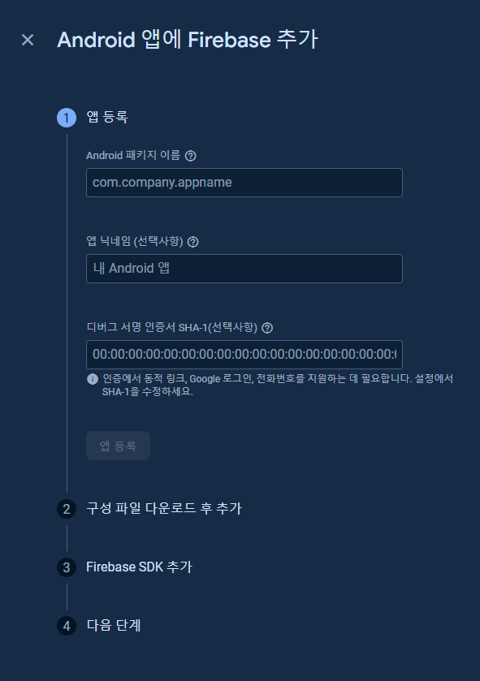

    9. 메인 함수 부분 추가 소스
    ```dart
    Future<void> main() async {WidgetsFlutterBinding.ensureInitialized();await Firebase.initializeApp();// Ideal time to initializeawait FirebaseAuth.instance.useAuthEmulator('localhost', 9099);//...}
    ```

    10. login class
        - 생략
    
    11. xcode 추가
        and에는 필요없고 xcode엔 추가해야 (ios의 경우)
        [공식문서](https://firebase.google.com/docs/auth/flutter/federated-auth?hl=ko)

        ### 추가방법(Mac)
        프로젝트 > ios> Runner.xcworkspace(하얀색)
        
        ![[Pasted image 20240331185839.png]]

        ![[Pasted image 20240331185929.png]]

        하얀색을 눌러서 xcode를 켠다 

        ![[Pasted image 20240331190015.png]]

        Runner를 누르고


        ![[Pasted image 20240331190106.png]]

        Info > URL Types 여기에 넣어줄 건데 내용은 google-service.plist에 있음

        ![[Pasted image 20240331190211.png]]
        plist의 위치는

        프로젝트 > ios > Runner 아래 있음

        ![[Pasted image 20240331190447.png]]
        
        plist의 Reversed_Client_id 태그 부분 복사해서

        ![[Pasted image 20240331190514.png]]

        URL Schemes에 붙여넣기

    12. Plist없을 때 생성방법
        1. 파이어베이스 콘솔 설정부부에서 운영체제에 맞게 다운
        2. Flutterfire configure 명령어를 터미널에 타이핑하면 됨

    ###	명령어 예시
    #### 참고 블로그
    https://m.blog.naver.com/ssuyastory/220631650892

    #### 삭제
	keytool -delete -alias AndroidDebugKey -keystore debug.keystore
	
	#### 생성
	keytool -genkey -v -keystore debug.keystore -alias AndroidDebugKey -storepass android -keypass android -keyalg RSA -keysize 2048 -validity 999999 -dname "CN=Android Debug,O=Android,C=US"

    keytool -genkey -v -keystore path-to-debug-or-production-keystore

    keytool -genkey -v -keystore ~/upload-keystore.jks -keyalg RSA -keysize 2048 -validity 10000 -alias androiddebugkey -storetype JKS

    keytool -genkey -v -keystore C:/Users/User/.android/debug.keystore -alias androiddebugkey -storepass android -keypass android -keyalg RSA -keysize 2048 -validity 10000 -dname "CN=Android Debug,O=Android,C=US"

	#### 조회 ver1
    'alias'는 대소문자 구별 있음
	keytool -list -v -alias androiddebugkey -keystore debug.keystore
	keytool -list -v -alias AndroidDebugKey -keystore debug.keystore
	keytool -list -v -alias androidreleasekey -keystore release.keystore

    keytool -list -v -alias androiddebugkey -keystore %USERPROFILE%\.android\debug.keystore
    keytool -list -v -keystore C:/Users/User/.android/debug.keystore -alias androiddebugkey -storepass android -keypass android

	#### 조회 ver2 (google cloud console 문서에서 제공)
	keytool -keystore path-to-debug-or-production-keystore -list -v
    ㄴ path-to-debug-or-prouduction-keystore가 어떤 의미인지 정확히는 모르겠음
    ㄴ debug, release키를 모두 찾는 명령어인가?
	
	keytool -list -v -alias androiddebugkey -keystore C:\Users\User\.android\debug.keystore

    #### export??
    keytool -exportcert -alias androiddebugkey -keystore C:\Users\User\.android\debug.keystore
    keytool -exportcert -alias androiddebugkey -keystore C:/Users/User/.android/debug.keystore

    ### 시도한 방법
    - 가장 큰 문제는 로그인 요청을 보내면 PlatformException(sign_in_failed, com.google.android.gms.common.api.ApiException: 10: , null, null.. ) 발생하는 것
    - 검색해보면 key가 일치하지 않아서 발생하는 거라는 의견이 대부분이었음

    1. 각 alias별로 삭제/추가하면서 google-service.json 교체 + emulator 삭제 후 재설치(cache)
    2. google cloud와 firebase, 로컬에 저장됨 sha키 일치시킴 + emulator 삭제 후 재설치(cache)
    3. keystore 파일을 아예 삭제하고 android sdk를 다시 설치 + emulator 삭제 후 재설치(cache)
    4. export? 정확히 어떤 건지는 모르겠음
    5. 최종적으로 mac에서 windows와 동일하게 cloud, firebase, local 키 맞춰주고 나서 정상 로그인됨

    ### 의문점??
    1. mac에서 일단 google login 실행이 됐는데 google-services.json파일이 안들어가 있음... android 시뮬레이터로 실행한건데 필요가 없는건지
    2. 아직 안해본 방법으로는 mac에 있는 keystore파일을 windows에 그대로 복붙하고 실행해볼 예정..
