# <span style="color:lime">202404 플러터 과정 6주차 금요일</span>   

## 1. 꼭 기억할 것! 🏅

## Layout
### SliverAppBar
appBar 숨기고, 스크롤해도 필요한 부분만(주문 메뉴 등) 상단에 고정할 수 있음

## FutureBuilder
- 로딩 로직

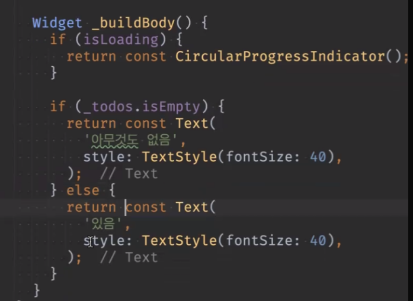

- return const CircularProgressIndicator();
- lottie를 넣을 수도 있음


### Antipattern
build부분엔 async 넣으면 안됨
build 부분에 then() 넣어가지고 setState() 하면 안됨
build가 엄청 여러 번 되므로

build에서 데이터 요청 절대 금지!

### initState() 함수
생성자와 비슷하게 빌드 할 때 최초 한번만 수행됨
initState -> Stateful에만 있음

### 위젯으로 바꿔서 데이터 넣기
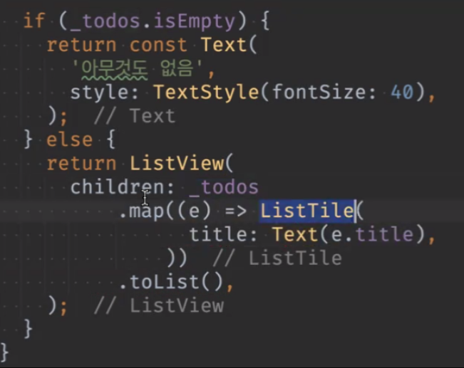

### 라이브템플릿

- vscode 기준 (freezed 예시)
	- make file ->  .vscode/project.code-snippets

```JSNO
{
  "Serializable freezed model": {
    "prefix": "fmodel",
    "description": "Declare a serializable freezed model",
    "body": [
      "import 'package:freezed_annotation/freezed_annotation.dart';",
      "",
      "part '${TM_FILENAME_BASE}.freezed.dart';",
      "part '${TM_FILENAME_BASE}.g.dart';",
      "",
      "@freezed",
      "class ${TM_FILENAME_BASE/(.*)/${1:/pascalcase}/g} with _$${TM_FILENAME_BASE/(.*)/${1:/pascalcase}/g} {",
      "  const factory ${TM_FILENAME_BASE/(.*)/${1:/pascalcase}/g}({",
      "    ${0}",
      "  }) = _${TM_FILENAME_BASE/(.*)/${1:/pascalcase}/g};",
      "",
      "  factory ${TM_FILENAME_BASE/(.*)/${1:/pascalcase}/g}.fromJson(Map<String, dynamic> json) => ",
      "      _$${TM_FILENAME_BASE/(.*)/${1:/pascalcase}/g}FromJson(json);",
      "}"
    ]
  }
}
```
- and Studio
	- mac과 windows 호환 안됨
	- jar 파일로 export됨
	- 단축키만 가져오는 것도 가능함
## FutureBuilder Refactoring (FutureBuilderSample)

- 통신을해서 snapshot에 데이터가 들어오고 그 데이터를 가지고 AwesomeData를 그리라는 것

- http get뿐 아니라 어떤 Future함수가 들어와도 동작함

- Builder pattern은

	- builder: ConnectionState.waiting은 로딩중
	- ConnectionState.done은 끝났다는 것
	- switch로 전부 받을 필요는 없음
	- enum이라 switch로 다 받긴 하는것

- 타입 생략(에러 귀찮으므로)

	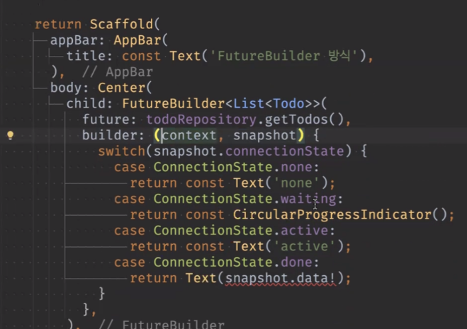

- 마지막 return 에 ListView()에 넣고
	
	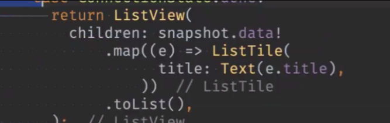

- data는 무조건 들어올테니까 ! 넣고

	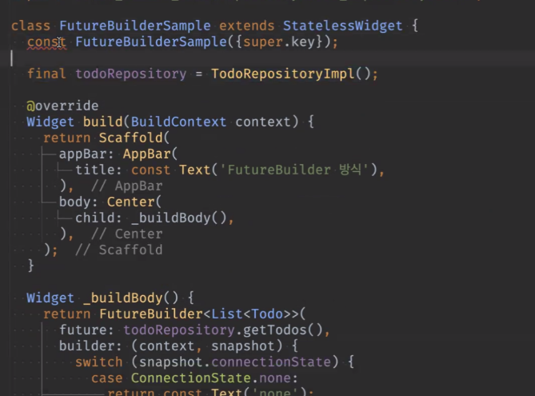

	- 변수가 없어져서 stateless로 바꿈

-	간단하게 이렇게 바꿈
	
	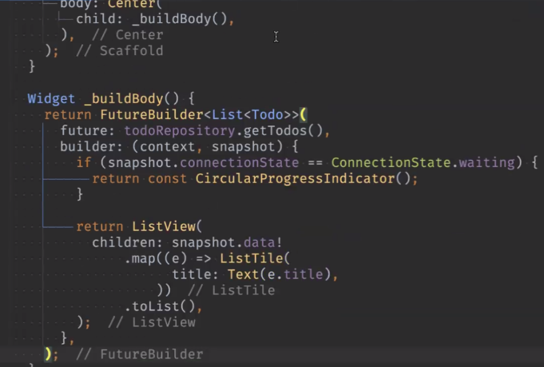

- const 생성자로 바꾸려면 변수값을 외부에서 받아야함
- 안에서 생성하면 compile이 아니라 runtime에 결정되는 거라 const가 될 수 없어서 외부에서 받아서 하는 것 
- FutureBuilder가 stateful이고, const를 붙여놓는 게 성능상 효율성 유지하는 방법임	
- stateful은 변수가 있어서 휴먼 에러 가능성 있음 / stateless는 휴먼 에러가 없어서 장점이 더 많음
- 다만, Stateless의 경우에는 FutureBuilder를 이어  return하는 경우가 생기는데
너무 길어지면 관리 힘들 수도 있음
	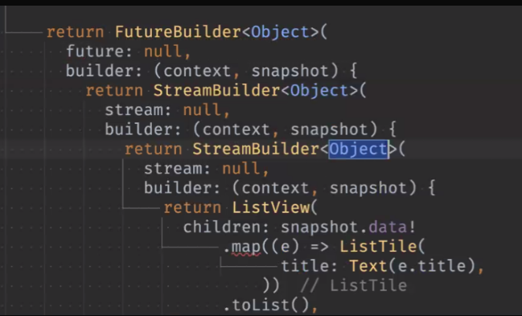

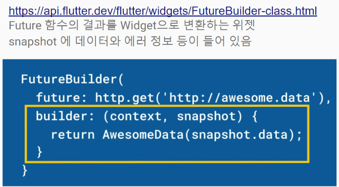

에러 체크도 가능함

## Stateful Widget 생명주기

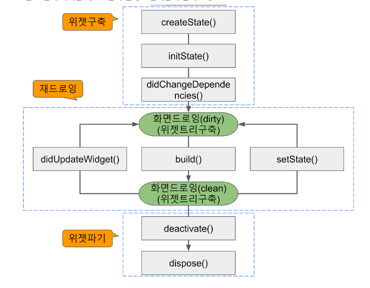

출처 : https://fronquarry.tistory.com/16


## Navigation

* 뒤로 가기 Navigator.pop(context)
ㄴ Future함수에서는 context 쓰지 말라고 함.. 

- push 자체가 future라서 주거니 받거니 됨
- 뒤로 가기 하면 true가 반환됨

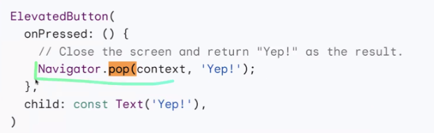

```dart
onPressed(): () async {
bool? result = await Navigator.push( // null처리해줘야
// 타입 자체는 T로 되어있음
	context,
	MatetialPageRout(...)
	print(result);
)

```

## go_router 패키지

- 라우터는 화면 이동을 미리 정해놓는 것
- go 라우터 패키지
	- 플러터가 직접 관리하는 직접 패키지
	- Webpage의 주소체계 표현할 수 있음 (거의 Web처럼 사용하는 것)
	- 주소체계(direct되는)를 쓰는 것이 go_router임

- 처음 시작은 '/'로 시작하고 그 이후엔 restful하게 설계하려면
	- '/albums'
	- '/photos'

	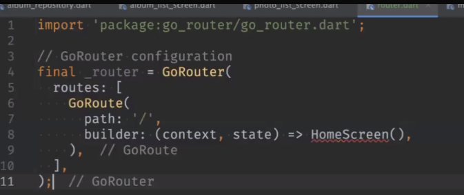

	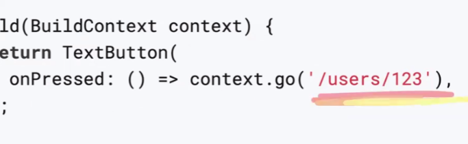

- slash가 없으면 터지는데 intialLocation 세팅할 수 있음
(계속 붙일 수 있게 됨)

- MaterialApp.router 생김

	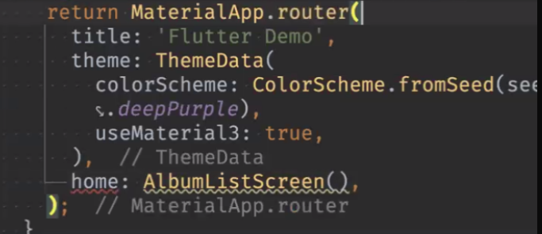

- routerConfig 설정

	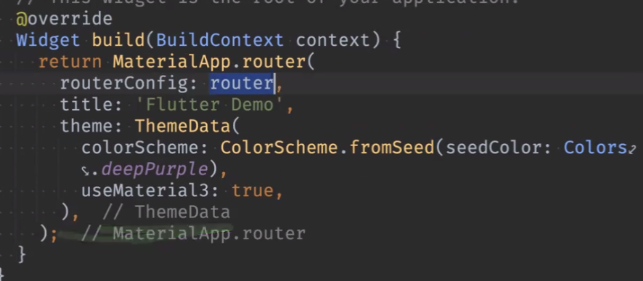

- context.push(라우터 이름)써서 줄일 수 있음 

	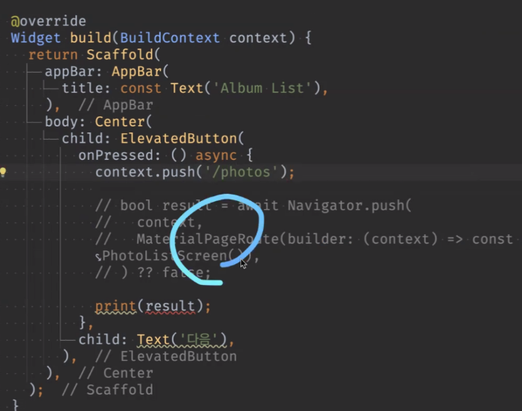

- 데이터도 받을 수 있음

	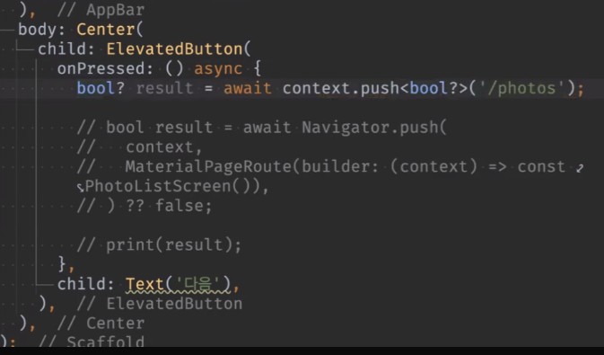

- 웹사이트는 쌓는 게 아니라 완전 교체(pop/push가 아니라)
- Go는 완전 교체고 주고 받기가 안됨(쌓아놓질 않아서) <> Navigator

### 파라미터 전달

- RESTful하게 웹에서 지원하는 방식을 지원하는 것

	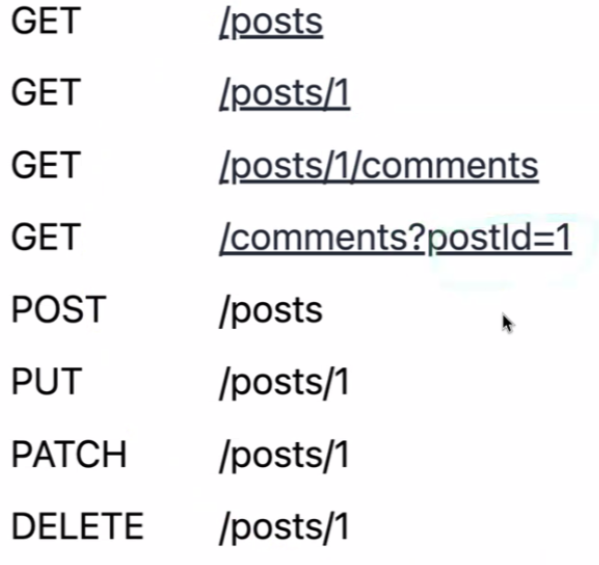


- 표시된 걸 쿼리 라고 함 (1은 path)

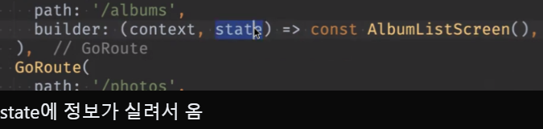

- state.fullpath 주소에 ?찍고 풀 주소 올 것
- fullpath 외에도 여러가지 있음

- 받을 때 queryParams로 받음

	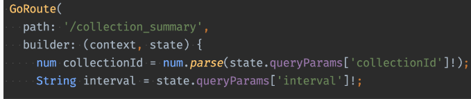

- 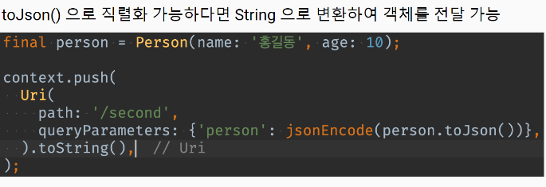

 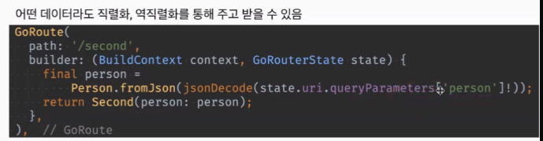

- 중요

- 꺼낼 때 터짐

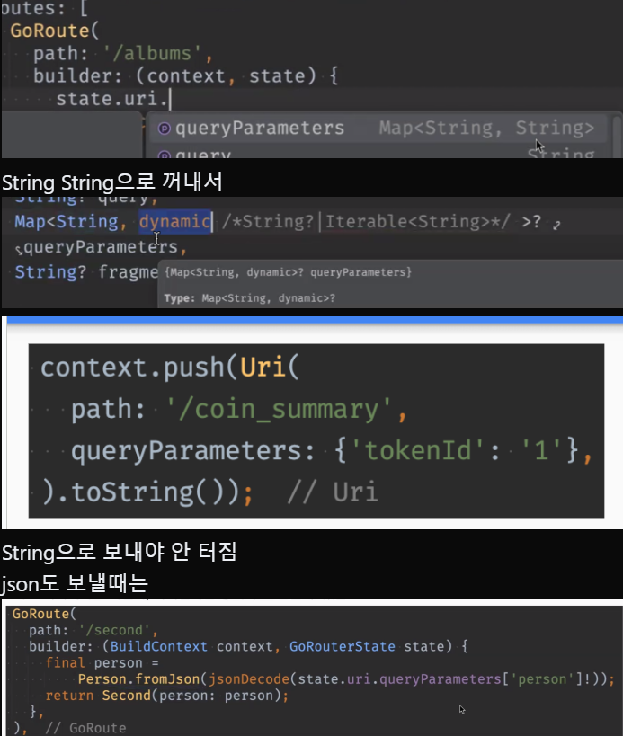

- 없는 쿼리를 쓰면 없는 페이지라고 해서 특정 페이지로 보내는 기능도 있음

	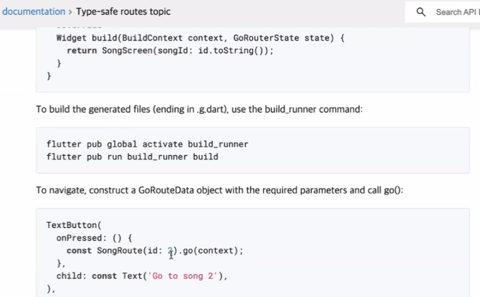

- 애니메이션 기능도 있음

### 객체전달방식

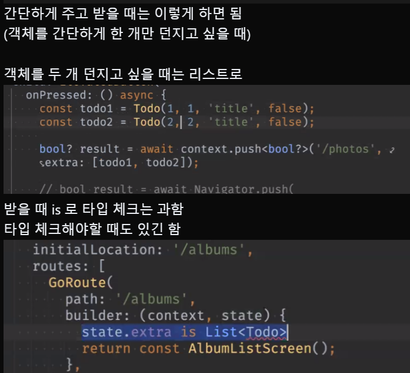

### Nested Route


### Hero
화면 넘어갈 때 쓰면 있어보임

## 왕초보 강의
### 스톱워치
- spacer()를 써서 나머지 아이템들을 밑으로 내릴 수 있음

- timer
	- 자신이 객체로 들어옴

	```dart
	Timer.periodic(const Duration(seconds: 1), (timer) {

	    print('!!!');

	  });
	```

	```dart
	  @override

	  void dispose() {

	    _timer?.cancel();
		// null이 아닐 떈 동작
		// null이면 아무것도 안함
	    super.dispose();

	  }

	  
	String hundredth = '${_time % 100}'.padLeft(2, '0');
	// milie sec 2자리 수로 맞추기(안움직이게)


	  void reset() {

	    _isRunning = false;
		// timer 있으면 취소시킴
	    _timer?.cancel();
		// list내용 지움
	    _lapTimes.clear();

	    _time = 0;

	  }
	  
	  void _recordLapTime(String time) {

	    _lapTimes.insert(0, '${_lapTimes.length + 1}등 $_time');

	  }


	 SizedBox(

	            width: 100,

	            height: 200,

	            child: ListView(

	              children: _lapTimes.map((time) => Center(child: Text(time))).toList(),

	            ),
	            // 이런식으로 정렬도 가능
	```

### 웹 브라우저

- 안드로이드 버전 체계 확인
	- android/app/build.gradle

	- minSdkVersion flutter.minSdkVersion => 16버전

	- minSdkVersion 21 => 안드로이드 5.0버전

	- web view 쓰려면 19이상이어야 함

- flutter_my_web_browser\android\app\src\main\AndroidManifest.xml
	- 안드로이드 앱의 전체적인 구성을 담당함
	- 외부 패키지 관련해서 수정할 때 여기 
	- debug 폴더 에도 동일한 파일 있는데
	```
	<uses-permission android:name="android.permission.INTERNET"/>
	```
	- 이 부분 복사해서 넣어줌 (인터넷 사용 권한 부여함)
	- ios는 따로 안해도 됨 
	- debug폴더는 개발용이고, 출시하려면 방금 이 경로 파일에 넣어줘야함

#### 오류 ClearText_not_permitted

- naver접속할 때 나옴
- android쪽 이슈
- and/app/main/AndroidManifest.xml에 붙여넣기


#### 오류 카카오 홈페이지에서 '자바스크립트를 사용야합니다'

자바스크립트 사용하는 페이지에서 자바스크립트 기능이 허용이 안되었을 때 나오는 오류 (현재는 문제없는듯)

#### WillPopScope deprecated

### PopScope
PopScope는 안드로이드 14부터 지원되는 Predictive Back Feature를 지원하기 위해 새롭게 등장한 ahead-of-time API로, 기존에 back press action을 관리하기 위해 사용되던 WillPopScope와 Navigator.willPop을 대체합니다.

`canPop`

- 뒤로가기 동작을 제어하는 boolean 타입 파라미터입니다.
- default value는 true이며, true일 경우 뒤로가기 동작이 평소처럼 실행된다는 것을 의미하며 false일 경우 뒤로가기 동작이 비활성화됩니다.

공식 문서를 보며 유추해본 내용은 WillScopePop에서 onWillPop으로 화면을 바로 pop 하는게 아니라, canPop의 인자로 boolean 값을 보내면서 pop 될지 말지의 여부를 미리 정하라는 것 같습니다.

`onPopInvoked`

- 성공 여부에 관계 없이 뒤로가기 동작이 발생했을 때 호출되는 콜백 함수입니다.
- canPop이 false여도 onPopInvoked는 여전히 호출되며, didPop은 false입니다(PopScope와 관련되지 않은 이유로 Pop에 실패했을 때도 false입니다). 반면 canPop이 true면 didPop도 true입니다.

#### Migrating from WillPopScope to PopScope

WillPopScope에서 PopScope로 마이그레이션 하고 싶다면 공식 사이트를 참고해주세요.  
[https://docs.flutter.dev/release/breaking-changes/android-predictive-back#migration-guide](https://docs.flutter.dev/release/breaking-changes/android-predictive-back#migration-guide)

출처 : https://velog.io/@jeongminji4490/Flutter-WillPopScope-Deprecated


## 2. 한줄 정리 🧹
1. badge library -> 알람 표시 등
2. stateful + 변수 있는 방법 + 내부에서 생성 vs. stateless + 변수없는 방법 + 외부에서 변수값 받는 방법


