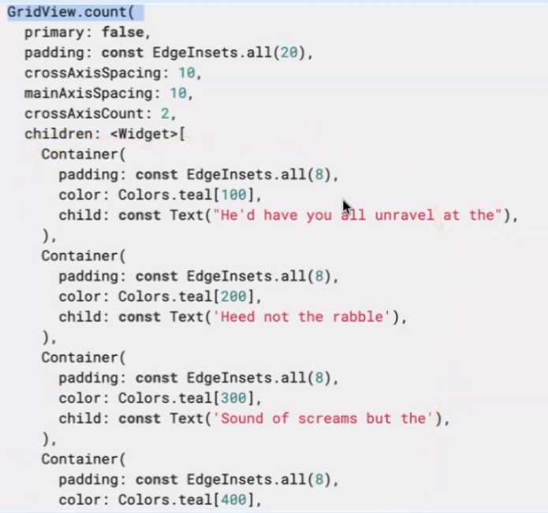
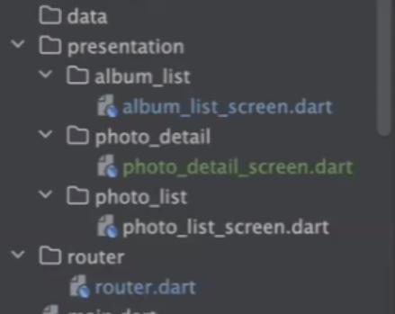
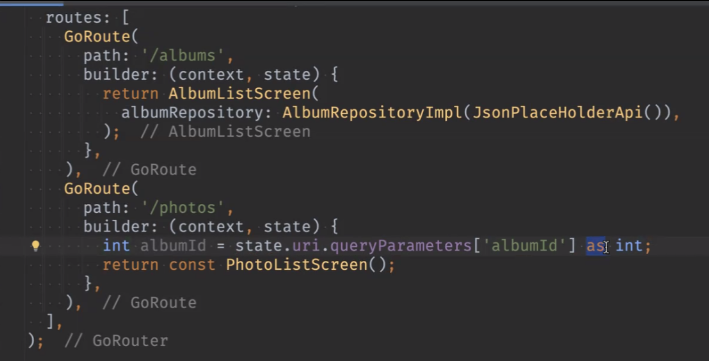
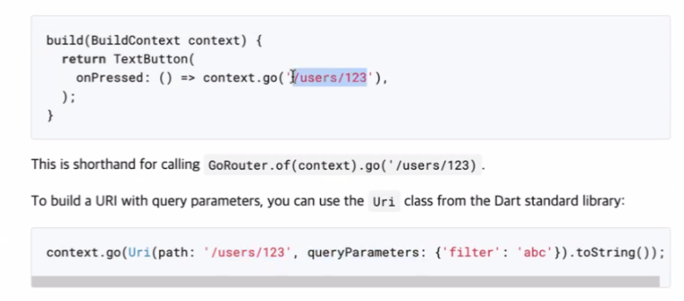
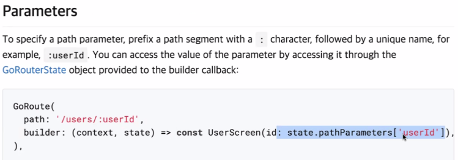
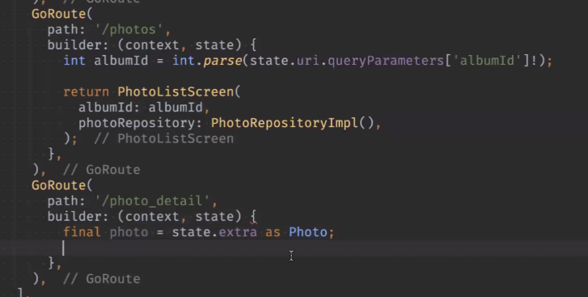
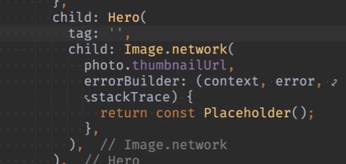
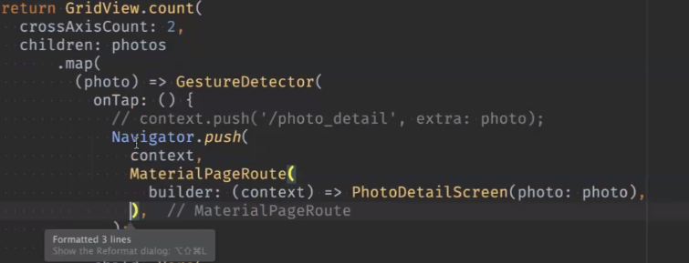
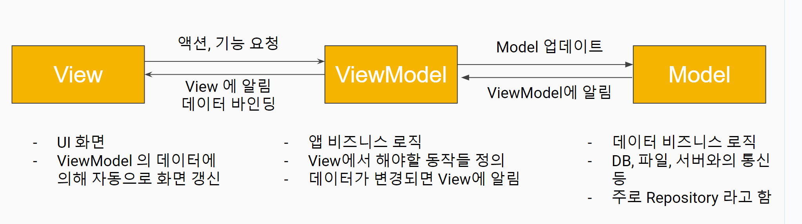

# <span style="color:lime">202404 플러터 과정 7주차 월요일</span>   

## 1. 꼭 기억할 것! 🏅

## 복습
### grid view
사진 뿌릴 때 많이 씀
https://api.flutter.dev/flutter/widgets/GridView-class.html




### FutureBuilder
```dart
FutureBuilder<List<Photo>>
	future: 어떤 값 받을 건지 (repository)
	builder: (BuildContext context, AsyncSnapshot<List<Photo> snapshot) {
		if (snapshot.connectionState == ConnectionState.waiting){
			return const Center(
				child: CircularProgressIndicator(),
			);
		}
		final photos = snapshot.data ?? [];

		return GridView.
	}
```

에러 났을 때 기본이미지 보여주는 코드
시간이 좀 걸림
```dart
erroBuild: (context, error, statckTrace) {
	//return Image.network(src);
	return const PlaceHolder();
}

```

### go_router
router.dart 설정하고





#### 화면 이동





```dart
photo => GestureDetector(
	onTap: () {
	context.push('/photo_detail', extra:photo);
}, // 웹처럼 id만 넘기는 것이 아니라 전체 다 넘김

```




* as나 ! 써서 터지는 건 데이터 넘기는 중에, 개발중에 터지는 거라
당사자(개발자)끼리 알아서 할 부분


### 모서리 굴리기

1. 카드에 넣기
	그림자도 넣고 할 수는 있지만
	카드와 그림과 따로 놈(카드가 밑에 깔려있고 그림이 위에 떠있는 느낌)
2. clipRRect 

### Hero



- tag값을 uniq한게 잘 주면 개체별로 애니메이션을 잘 먹음

- Hero 애니메이션이 안먹는 문제



- goRouter 쓰면 애니메이션이 안먹어서 Navi push로 보냄
- clipRRect와 같이 쓰니까 효과도 좀 이상함

- go router를 지울 필요는 없는 것이 용도에 따라서 한번에 detail까지 들어오려면 go router 필요할 수도 있으므로

- 애니메이션 들어가야하는 부분만 go router 안쓰면 될 것

### 공간 띄기

- Spacer는 남는 공간 다 밀어버릴 때 주로 쓰고

- 원하는 만큼 띄려면 sizedbox 쓰는 것

### Inkwell과 GuestureDetector 차이
- Inkwell은 
	- 글씨 표시
	- 손가락으로 커서 변경됨
- GuestureDetector는 안됨

### controller
- page controller
- 특정 페이지로 갔을 때 조작할 수 있음

## MVVM



- repo에는 data 주고 받는 데만 집중하고 하나를 더 매핑해서 business 로직을 처리하도록함

- 7페이지의 Model은 원래 만들던 Model이 아니라 repo 쪽을 말하는 것
- View Model은 View의 Model (데이터) 

- View에 ViewModel에서 Data binding하는 것 (View <- ViewModel)

- Mvvm에서는 ViewModel이 View에게 알려줘야함 
- 데이터 변경하면 view에 알아서 알려주는 것

- flutter에서는 알려주지는 않고  요청을 하는 것(원래 MvVM과 차이)
아직 저렇게 구현은 못하고 있음

### 데이터와 액션의 흐름 관계
- 단방향 의존성
- View가 Data Layer는 모르고 ViewModel을 통해서만 데이터 주고 받고

- ViewModel의 역할
	- 모델(repo)에서 제공한 데이터를 UI로 표시하기 쉬운 형태로 변환해주는 역할도 함(복잡한 로직을 숨겨줌) 
	- 즉, dart로 짠 부분은 안 건드리고, Viewmodel에서 변경해서 화면에 보여주는 것

	- 여러 가지 상태(변수)를 캡슐화
	- View에서 발생하는 액션(이벤트)
	- 처리의 캡슐화

**ViewModel은 화면 하나에 대하여 하나만(1:1매칭) 하는 것이 일반적이다**

- 탭이 있는 경우 탭마다 하나씩 ViewModel이 하나씩 있어야 하고
- 전체에 대해서 따로 하나씩 있어야 함
- 예를 들면 메뉴버튼 붙고 하는 경우에

- 예외적으로 화면 여러 개에서 데이터를 공유하는 경우 등은 View Model을 여러 화면에서 하나로 가야할 수도 있음

- 원칙적으로 ViewModel에서는  field를 통해서 데이터가 나간다


- ViewModel에서 return을 한다면?? 일단 원칙적으로는 그렇게 안함

**ViewModel에서 데이터를 갖고 있는게 맞음**

- View에서 갖고 있던 변수나 데이터를 ViewModel로 내리고 View에서는 UI만 짠다.

- Business 로직을 갖고 있다. Repository가지고 View에 전달

- Model은 데이터 다 때려박는거고 Repository는 그거에 대한 걸 돌려주는 거

- ViewModel은 Repository로 받은 데이터를 가공 ex) top10, 정렬 등 data를 조작하는 기능

- Model은 Business 로직을 말하는데 ViewModel은 Model클래스에서 View에 맞게 뿌려주는 역할임
- 원래는 UI단에서 그걸 로직을 짜서 해야하는 걸 ViewModel 단에서 하는 것

- Repository는 한 화면당 한 개가 아님. ViewModel은 한 화면당 한 개

- setState은 Stf에만 있는데, 기존에는 상태변경을 view에서 했다.
- ViewModel을 구독하고 있으면 데이터가 바뀔 때마다 알려줄 수 있음

- Spring에서의 service와 비슷함. 즉, 여러 개 Repo를 가져와서 화면별 가공하는 것

**상태 = 변수**

- 뭐 잘못되면 ViewModel을 보면됨. 변수도 로직도 ViewModel에 있는 것

- 화면에서 갱신이 안돼도 Notifier Listener 호출 안한거고 데이터 안와도 그 쪽 로직이 잘못된 거고, View는 그냥 뿌려줄 뿐

### ChangeNotifier

- ChangeNotifier mixin 형태임.
- override없이 있는 기능 그대로 갖다가 쓰는 것
- mixin은 아이스크림에서 유래
- extension과도 유사함
- 기존 것을 안 건드리고 추가해서 쓰는 것

- 데이터가 바뀌면 새로고침 해주는 것

```dart
MainViewModel with ChangeNotifier

void increment() {
	_count +=1;
	notifyListeners();
	// 상태 변경될 때마다 call하는 것
}

ListenableBuilder(
	listenable: counterNotifier,
	builder: (BuildContetx context, Widget?),
)
```

- ChangeNotifier의 내용이 들어간다고 보면 됨. 다른 데에 상태를 알려줄 준비가 된 것

- setState를 자동으로 쓰기 위해서 ChangeNotifier를 사용할 것

- Listenable을 받아서 화면을 그리는 위젯들이 있음
- 관찰 가능한 객체라고 보면 됨. 관찰이 가능하도록 하는 메서드들이 있는 것

### addListner method

```dart
void initState() {
	viewModel.addListerner((){
		setState((){});
		// 함수 실행할 때마다 setState하는 것이 아니라
		// 상태 바뀔 때마 실행됨
	});
}

void dispose() {
	viewModel.removeListener(updateUI); // 함수
	super.dispose();
}

void _incrementCounter() {
	viewModel.incrementCounter();
}
```

- 반드시 dispose 해줘야함 (remove listener)

- 화면 갱신의 타이밍도 ViewModel에서 결정할 수 있음

- 상태관리 -> 옵저버 패턴을 이용해도 됨


https://docs.flutter.dev/data-and-backend/state-mgmt/intro
flutter 공식 문서에서는 상태관리에 대하여 알아서 하라는 입장임


### Mixin

dart외의 다른 언어에서는 잘 지원하지 않는 기능임

복붙보다는 더 좋음
복사할 덩어리를 따로 빼놓고 걔들을 붙이는 용도라고 보면 됨
코드 재활용

상속과 다른 점은??

deep dive하고 싶으면 따로 할 것 


## 2. 한줄 정리 🧹
1. class 가 숨겨져 있으면 그 안에 있는 필드 등은 안붙여도 됨

2. View모델에서 조작 -> View모델 변수에 저장 -> View에서 가져다가 쓰면 됨

 


## UI challenges

[https://pro.codewithandrea.com/flutter-ui-challenges](https://pro.codewithandrea.com/flutter-ui-challenges "https://pro.codewithandrea.com/flutter-ui-challenges")


## flutter UI 끝판왕
[https://github.com/gskinnerTeam/flutter-wonderous-app](https://github.com/gskinnerTeam/flutter-wonderous-app "https://github.com/gskinnerTeam/flutter-wonderous-app")