# <span style="color:lime">202404 플러터 과정 7주차 화요일</span>   

## 1. 꼭 기억할 것! 🏅

## 복습
### View Model
- ViewModel은 테스트 가능함 -> 테스트코드 작성하자

### Todo로 ViewModel 연습 (06_user_todo)

#### ㅁ UnmodifiableListView
- ViewModel에 선언된 필드들에 대해서 View에서 직접 수정은 안되지만<br>

	viewModel.users.add/ user.remove/ user.clear()와 같이 그 안의 개체들에 대해서는 조작이 가능할 수 있음

```dart

List<User>_users = [];

// 1번
List<User> get users => List.unmodifiable(_users);
// 2번
List<User> get users => UnmodifiableListView;
// 1, 2번 방법 동일하지만, 1번 코드를 더 많이 씀

Mixin Unnmodifiable.. 
// 이렇게 해서 다른 것들도 다 터뜨림 => mixin으로 필드 전체를 변경금지로 만드는 것? 

```
- 만약 저렇게 못 바꾸게 해놓고 users.clear()하면 runtime에서 터짐

#### ㅁ ViewModel 활용 순서
1. ViewModel에서 ChangeNotifier을 mixin
```dart
class TodoMainViewModel with ChangeNotifier {}

```
2. View에서 initState() 선언 -> data를 최초 끌어 가져감

	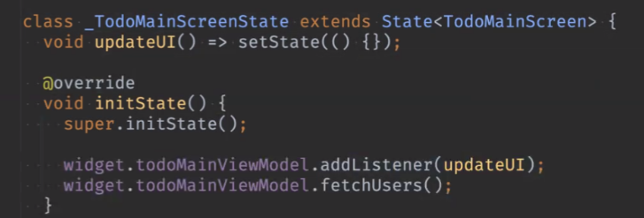

	- addListener는 ViewModel에서 mixin한 ChangeNotifier에서 제공하는 메서드임


3. View에서 ViewModel의 data를 가져다가 씀
	- user.name, todo.title 등

4. data가 변경되면 ViewModel -> View에 알려줌

5. View에서 화면을 다시 그림 (View는 Stateless여도 됨)


#### ㅁ ViewModel 초기화

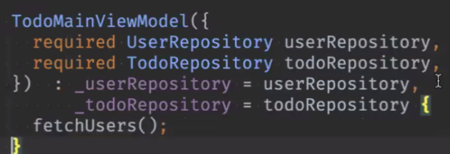

	- 이렇게 생성자에서 선언을 해도 됨
	(View의 initState에서 fetchUsers()를 call하는 대신??)
	- 다만 저렇게 생성자에서 선언을 하면 View모델 화면 그려지기 전에 먼저 생성되어서 타이밍 이슈가 생길 수도 있음
	- 즉, notifyListen하고 나서 화면이 그려지면 데이터가 안나올 수도 있는 것

#### ㅁ ViewModel의 데이터를 가져다 쓰는 방법

1. View 위에다 선언 하고 widget.todoMainViewModel.users의 형식으로 가져다 씀
```dart
class TodoMainScreen extends StatefulWidget {
  final TodoMainViewModel todoMainViewModel;
...

```
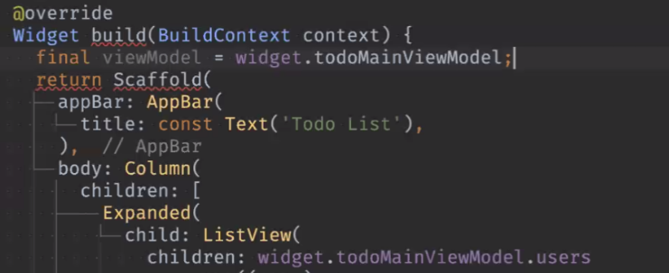

2. build 위젯 위에다가 getter를 만들어서 viewModel.users의 형식으로 쓸 수도 있음

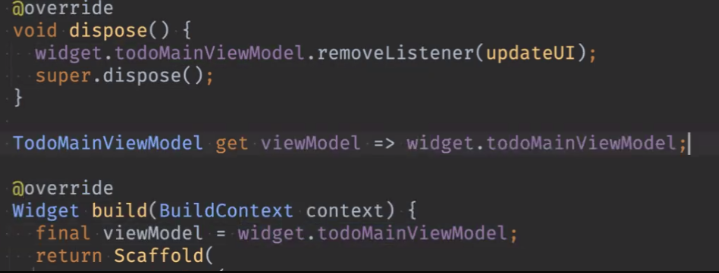


#### ㅁ 메서드의 작명

- 보통 사용자의 action에 focusing을 둬서 함
	- ex. onSelectUser(user) (o), fetch(o)
	- save, load(x)

#### ㅁ 기능추가1 : 로딩 상태 표시 

1. ViewModel에 bool 변수 2개, 그에 대한 getter 2개 만들고

	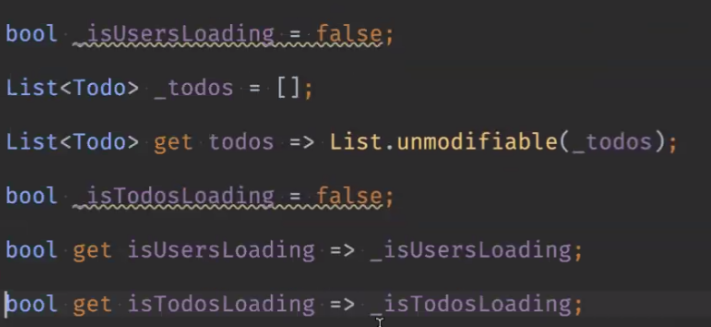

2. ViewModel의 데이터 가져오는 함수(fetchUsers() 등) 시작할 때 true 넣어주고 notifyListeners()로 View에 데이터 변경 알려줌

	``` dart
	// ViewModel
	void fetchUsers() async {
		_isUsersLoading = true; // 로딩 상태라고
		notifyListeners(); // View에 알려줌

		_users = await _userRepository.getUsers(); // repo에서 data 받아옴
		_filteredUsers = _users; 
		_isUsersLoading = false; // 로딩 끝났다고
		notifyListeners(); // View에 알려줌
	}
	```
	```dart
	// View
	Expanded(
				child: viewModel.isUsersLoading // 3항 연산자로 Loading 체크해서 상태를 보여줌
					? const Center(child: CircularProgressIndicator())
					: ListView(
						children: viewModel.users
							.map((user) => ListTile(
								onTap: () => viewModel.onSelectUser(user),
								title: Text(user.name),
								subtitle: Text(user.userName),
								))
							.toList(),
					),
			),
	```		  
	- 보통 로딩 위젯을 따로 만듬

#### ㅁ 기능추가 2 : 완료/미완료만 보기
- appBar에 icon 추가 

```dart
// View
      appBar: AppBar(
        title: const Text('Todo List'),
        actions: [
          TextButton(
            onPressed: () => viewModel.fetchUsers(),
            child: const Text('새로고침'),
          ),
          TextButton(
            onPressed: () => viewModel.onClickFinish(),
            child: const Text('완료'),
          ),
          TextButton(
            onPressed: () => viewModel.onClickUnfinished(),
            child: const Text('미완료'),
          ),
        ],
	  )
```
```dart
// ViewModel

  void onClickFinish() {
    _filteredTodos = _todos.where((e) => e.completed).toList(); // todos객체의 completed필드가 true인 것만 _filteredTodos에 담음
	// flag(completed)의 활용 이런 식으로!
    notifyListeners();
  }

  void onClickUnfinished() {
    _filteredTodos = _todos.where((e) => !e.completed).toList(); // 위와 반대
    notifyListeners();
  }

```

#### ㅁ ViewModel에서 filter를 걸때 원본과의 분리 문제

- ViewModel에서 filter를 건 데이터를 View에서 가져가는 경우 <br>
원본 데이터(repo에서 가져오는)와 따로 변수를 선언해 놓지 않으면 원본이 날아가는 문제 발생

```dart
  List<User> _users = [];

  List<User> _filteredUsers = [];

  List<User> get users => List.unmodifiable(_filteredUsers);

  List<Todo> _todos = [];

  List<Todo> _filteredTodos = [];
```
- 해결 (user의 경우)
1. ViewModel에서 _users와 _filterdUsers 별개의 변수로 선언
2. 최초 View에서 화면 그릴 때 데이터를 가져가는 fetchUsers()에서는 _filterdUsers에 _users(원본 데이터)를 넣어줌
3. 기능추가
```dart
// VIewModel
// 이름 검색
  void onSearchName(String name) {
    _filteredUsers = _users.where((e) {
      return e.userName.toLowerCase().contains(name.toLowerCase()) ||
          e.name.toLowerCase().contains(name.toLowerCase());
    }).toList(); // 검색 조건으로 던진 이름을 포함한 이름이 있는 user 객체만을 _filteredUsers에 넣음
    notifyListeners(); // 데이터 변경을 알림 -> 변경된 데이터로 화면을 다시 그릴 것
  }
```

4. 정리 : 최초에는 원본 데이터를 _filterdUsers에 담아서 보내고, 정렬 기능(filter) 등을 사용한 경우에는 filter된 데이터가 _filteredUsers 변수에 저장되고, 그것을 fetchUsers()를 통해서 View에서 filter된 상태로 가져가게 됨

#### ㅁ 기능추가 3 : 이름 검색 (추후 보충)

## go router
### ㅁ 쓴 버전

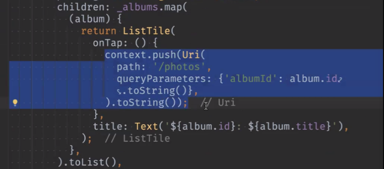

### ㅁ 안 쓴 버전

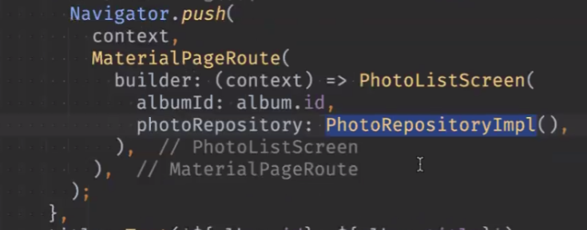


## InheritedWidget
### ㅁ 문제점
- 위 go router를 안 쓴 버전을 볼 때 AlbumListScreen에서 Photo리스트를 눌러서 PhotoListScreen으로 이동할 때
	- PhotoListScreen에 주입된 PhotoRepositoryImpl()도 넣어줘야 해서 AlbumListScreen에 PhotoRepositoryImpl 객체도 생성해야하는(Api도?) 문제가 발생함
	- 즉, 생성자를 통한 의존성 주입은 의존성 트리가 깊어질 수록 단계를 많이 타야한다는 단점 
	- InheritedWidget이 이런 단점을 해소할 수 있음

### ㅁ 사용 방법 (p12)
1. InheritedWidget을 상속한 클래스에서 필드 선언
	```dart
	class MyColor extends InheritedWidget{
		final Color color;

	}
	```

2. BuildContext 받는 static 메서드 생성

	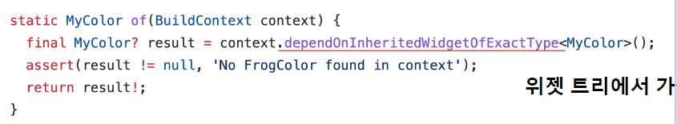
	- context를 통해 현재 위치, tree를 알 수 있음

3. 수정되었는지 알려주는 규칙을 정의하는 메서드
	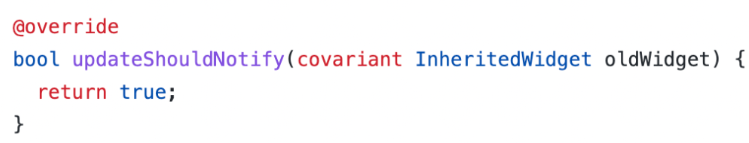

4. covariant xx -> 타입 수정을 허용함 (MyColor를 넣을 수 있음)

	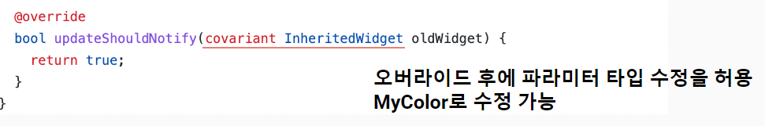

5. 화면에서 가져다 씀

## IngeritedWidget 관련 Live coding
1-1. CounterScreen클래스에 ViewModel 객체 생성 -> widget. 으로 사용

1-2. 아님 그냥 getter로 받아올 것

2. ViewModel에서
	- repository생성
	- 만약 repository 여러 개를 사용한다면, (View하나당 ViewModel은 하나지만, repo는 여러 개일 수 있음)
	
		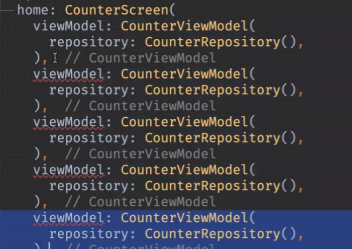
	
	- 이런 경우도 발생할 수 있음

3. lib/core/change_notifier_provider.dart 생성
	```dart
	class ChangeNotifierProvider<T extends ChangeNotifier> extends InheritedWidget {
	    final T value;

		const ChangeNotifierProvider({
			super.key,
			required super.child,
			required this.value,
		});	
	```
	- T 부분은 모든 ViewModel을 여기에 담아 나를 거라서 Generic으로 만듬
	- value 값도 하나 선언함

4. 위 파일에 BuildContext를 받아서 context 리턴하는 메서드를 static으로 선언

	```dart
	  static ChangeNotifierProvider<T> of<T extends ChangeNotifier>(BuildContext context) {
		return context
			.dependOnInheritedWidgetOfExactType<ChangeNotifierProvider<T>>()!;
  	}
  	```

5. 그 밑에 수정이 되었는지를 알려주는 메서드 생성(override)

	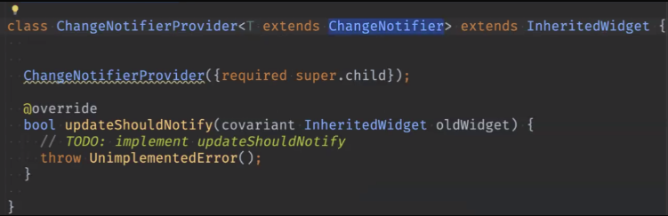

	- InheritedWidget-> ChangeNotifierProvider로 바꿈

	```dart
	    @override
		bool updateShouldNotify(ChangeNotifierProvider oldWidget) {
			return value != oldWidget.value;
		}

	```
6. 3~5 만든 거 복붙해서 쓰면 됨

7. 화면에서 가져다 쓰는 방법
	```dart
	@override
	Widget build(BuildContext context) {
	
		final viewModel =
			ChangeNotifierProvider.of<CounterViewModel>(context).value;

		... 
	}
	```
	- 트리구조에 상관없이 ViewModel을 가져다 쓸 수 있음

	- getter로 만들어 쓰면 더 보기가 좋음

	```dart
	class _CounterScreenState extends State<CounterScreen> {
		CounterViewModel get viewModel =>
			ChangeNotifierProvider.of<CounterViewModel>(context).value;

		... 
		    @override
			void dispose() {
				viewModel.removeListener(updateUI);
				super.dispose();
			}

			void _incrementCounter() {
				viewModel.incrementCounter();
			}
	}

	```
### didChageDependencies()
- initState() 다음에 빌드됨
- initState()에서 MediaQuery 등 쓰면 안됨
- initState()에서 inheritedwidget도 안됨(view모델에 addlistener 걸어야해서 context 접근이 안돼서??)
- 이 때 didChageDependencies()에서는 context 접근이 되니까 addListener 걸어줄 것

8. 사용예

	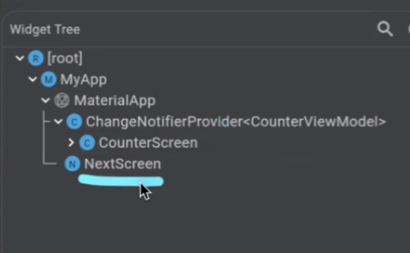

	- 위와 같은 구조에서
	- CounterScreen -> NextScreen 가려고 하면 터짐

	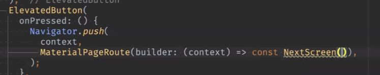

	- 원래는 더 위의 트리구조로 가야하지만
	- 이렇게 하면 터지지 않음

	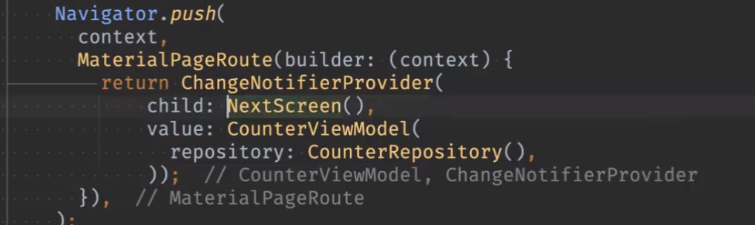

	- 즉, 화면 넘길 때마다 꽂아주겠다고 하면 괜찮음(고유의 view model이 생기니까?)
	- 그런데 이렇게 하면 코드가 복잡하고, 공유를 할 게 없을 때만 이렇게 쓸 수 있음
	- 예를 들어 장바구니를 만들어서 어느 화면에서나 왔다갔다 해야할 때

	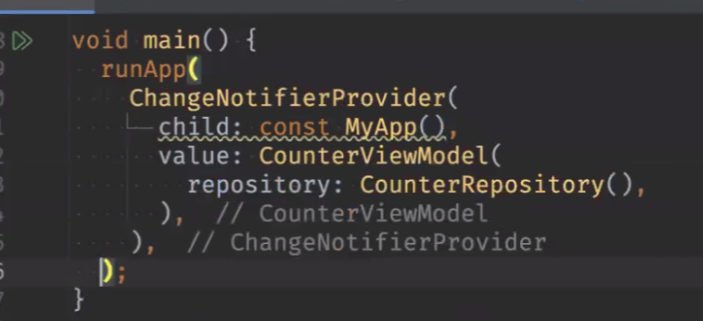
	
	- MyApp에다가 아예 들어가면서 NextScreen이나  CounterScreen에 모두 들어가게 됨  

	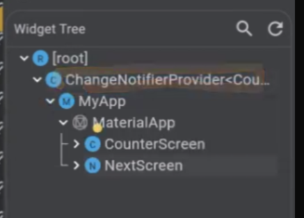

	- 이렇게 하면 생성자를 따로 뚫지 않고 화면 이동도 되고, 데이터도 공유됨

	- 이렇게 쓸 일은 많이 없지만, ViewModel이 아니더라도 이런 로직을 쓸 일이 있다.  

	- 예를 들어 여기 저기서 데이터를 바꿀 수 있어야 하는 경우  

	- 여기서는 ViewModel을 공유 하는 경우  

	- 일반적인 케이스는 화면 하나당 하나의 ViewModel이므로 이렇게는 안쓸 것  

	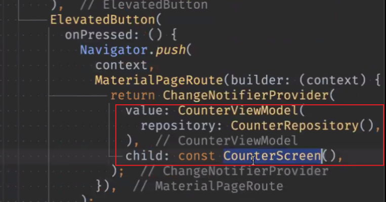

	- 이렇게 쓰는 게 복잡하니까 router을 쓰자

	- router 설정하고

	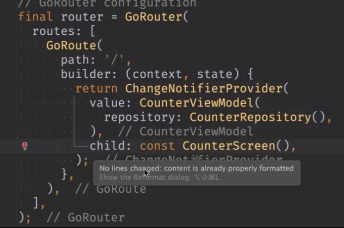

	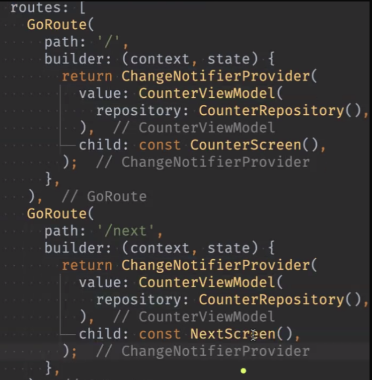

	- 화면에서는   

	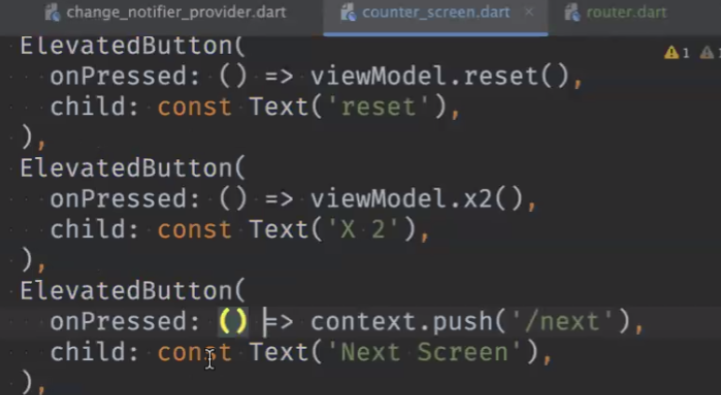

	- main에서는

	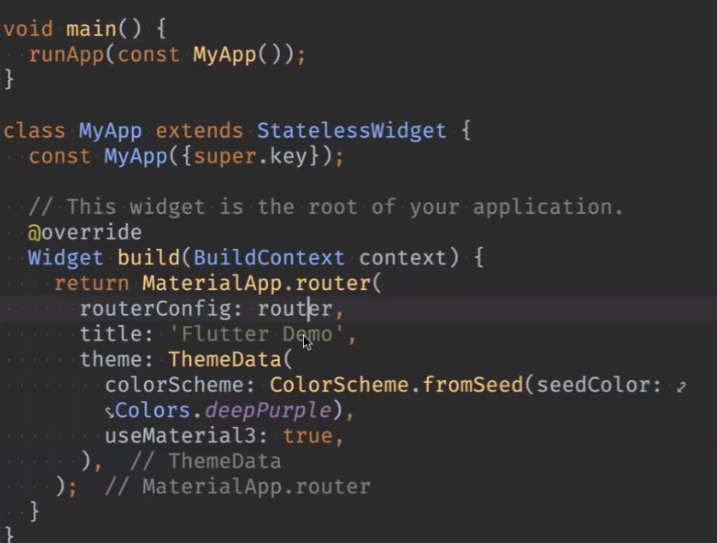

	- 즉, inheritage widget을 화면에서 숨기고 router로 보낼 수 있다는 것.. .

	- inheritage widget
		https://youtu.be/1t-8rBCGBYw

		https://api.flutter.dev/flutter/widgets/InheritedWidget-class.html
		
		[https://youtu.be/og-vJqLzg2c?si=YK5SVoPdpzOcLMaA](https://youtu.be/og-vJqLzg2c?si=YK5SVoPdpzOcLMaA "https://youtu.be/og-vJqLzg2c?si=YK5SVoPdpzOcLMaA")

		- 결론 : inheritage 원리를 알고  `Provider`를 써라!!

## 앱 배포 (추후 추가)
- dubug 개발
- release 배포

## 2. 한줄 정리 🧹
1. Column안에 ListView를 넣으면 안나온다 -> 나오게 하려면 shrink를 넣어서 컬럼으로 만들든가, SizedBox씌워야함
2. Divider() : 선 분리
3. double width = MediaQuery.of(context).size.width; (기기별 화면 길이)
 
## 3. 참고
1. Boring show에 라이브러리 올리는 게 있음.. 라이브러리 만들기도 도전해보자
2. 네이버, 카카오맵 등 Flutter 지원 안되는 부분은 웹뷰 -> 자바스크립트로 통신을 해서 자바스크립트 코드로 구현할 수 있음
3. 우편 api
	- 카카오 우편 api 필요하다면 이것도 웹뷰로 감싸서 자바스크립트로 통신을 할 수 있음
	- 지금은 kpostal package 쓰면 될 것 (https://pub.dev/packages/kpostal)
4. 올해 안에 6종 세트를 자동으로 만들어줄 것인지? dart팀에서 결정한다고 함(생성자 포함).<br>
5. 체크박스 아이콘

	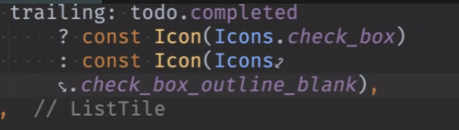
	
	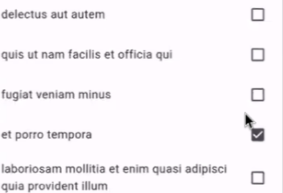

6. ListTile
	```dart
	ListTile(
		leading:  // title? 앞쪽
		trailing: // title 뒤쪽 
	)

	```

7. git push한 거 ide에서 쉽게 돌리는 방법은?
	- ide에서 뭔가하고
	- terminal에서 force push