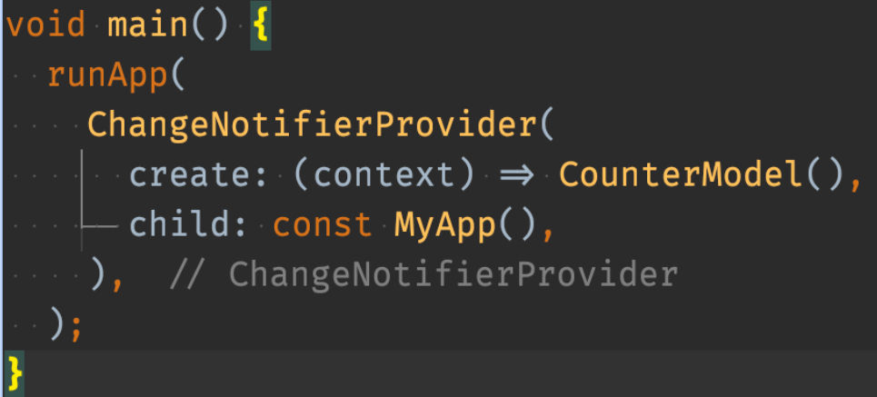
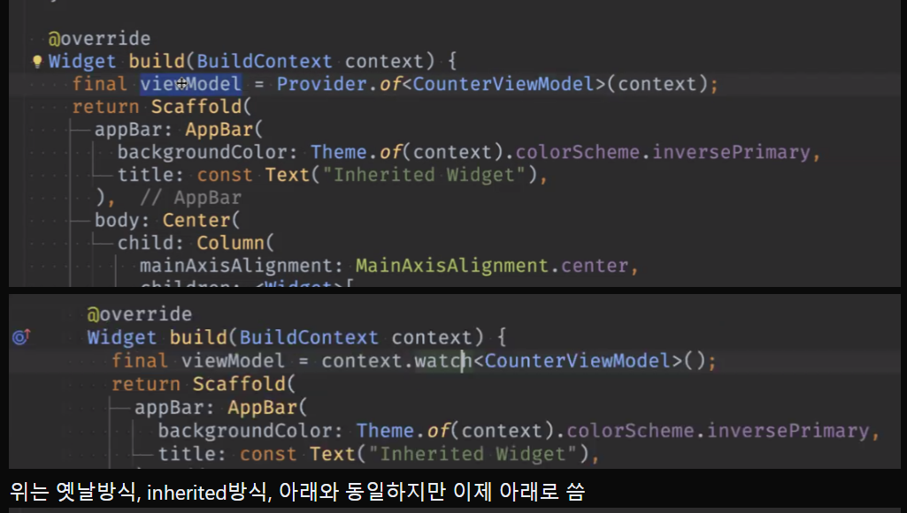
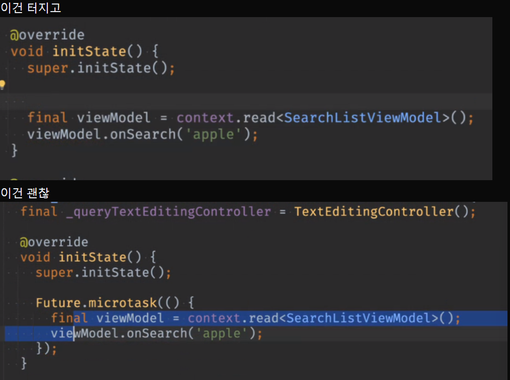
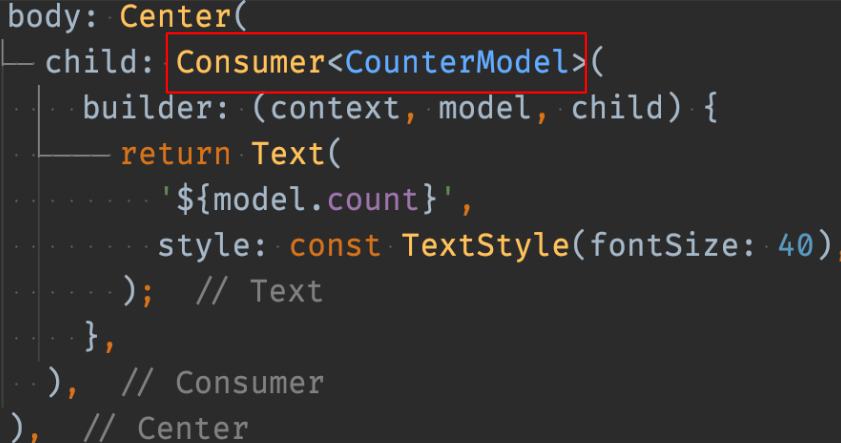

# <span style="color:lime">202404 플러터 과정 7주차 목요일</span>   

## 1. 꼭 기억할 것! 🏅
element tree가 object

widget이 변경하게 하면


### 상태관리
- 상태관리 = 변수, 데이터의 관리

- 변수를 수정하면 알아서 UI도 바뀌게 할 것

### 상태관리 지원 패키지
- 대부분의 경우에는 setState() 만으로 충분하지만, 대규모 프로젝트에서는 관리가 어렵다.
- 4대장
	- Provider
	- Bloc
	- Riverpod
	- GetX
- GetX는 줄어드는 추세, RiverPod의 점유율이 좀 높아짐
- 나머지는 큰 변화 없음

- Provider 추천 이유
	- InheritedWidget과 가장 흡사함 -> 근본
	- 제약이 많음(에러 내기 어려움)
	- 구글에서 여전히 공식적으로 밀고 잇음

- Bloc
	- 러닝커브가 있음
	- 매니아층 있고 대형 프로젝트 위주로 사용함

- GetX 
	- 최근까지도 가장 많이 사용하지만, 여러 단점이 있어서 비추천
	- 테스트 어려움
	- 유지보수 어려움
	- 제약이 없음(bug 발생률 높음)

- Riverpod
	- 현재 가장 인기있음
	- 코드 제네레이션 기법을 사용하여 런타임 에러를 없앴음
	- 근본과 많이 멀어져서 Riverpod 자체를 공부해야함
	- 기능 위주로 top level에 모두 정의해놓고 어디서든 가져다가 쓰는 개념
	- 리버팟만의 아키텍처 공부가 필요함

### ChangeNotifierProvider
	-  [ViewModel]  ChangeNotifier => notifyListeners() [View]에 변경 통지
	- ChangeNotifierProvier : 위젯 트리의 최상위에 설정, ChangeNotifier를 감시
		- 변경이 필요한 위젯만 자동 갱신
		- ChangeNotifier 객체를 제공


### Provider 기본 사용 방법
- ChangeNotifier를 제공할 부분에 ChangeNotifierProvider 위젯 배치
		
	

- watch() 는 지속적인 관찰을 하고 변경시 build() 를 리빌드 함. build() 메서드 내에서 사용	

	```dart
	@override
	Widget build(BuildContext context) {
		final model = context.watch<CounterModel>();
	}
	```
	

- 단발성 이벤트 처리(read())
	- initState() 사용, 버튼 클릭 등

	```dart
	floatingActionButton: FloatingActionButton(
		child: const Icon(Icons.add),
		onPressed: () {
			context.read<CounterModel>().increase();
		},
	),
	```
	- `Provider.of<CounterModel>(context, listen: false).increase();`와 동일한 코드

### initState()
- initState()에서 사용 불가

	


	- read()의 경우에도 initState()에서 Future.microtask() 안에 넣어서 실행해야

### didChangeDependencies()
- viewModel 접근 가능함
- 매번 실행하는 코드는 여기에 두면 안됨

### Consumer
- 모델을 제공할 곳에 Consumer 배치 -> Consumer부분만 리빌드 됨
- StreamBuilder, listenableBuilder 같은 역할
- UI 성능을 극한으로 끌어올려야 할 때 검토

	

## 2. 한줄 정리 🧹
1. setState()는 didChangeDependencies()가 아니라 initState()에서 최초 한번만 실행되도록 하자
2. 위 최초 실행할 때에도 미세하게 딜레이를 주도록 함
	```dart
	Future.microtask(() => viewModel.addListener(updateUI));
	```
3. Provider 적용 코드랩 (https://codelabs.developers.google.com/codelabs/flutter-codelab-first?hl=ko#0)


## 3. 이미지 검색 앱 Live Coding
ㅁ 앱 생성
>Organization
 image search app1

ㅁ 필수라이브러리 추가
>flutter pub add http provider build_runner freezed 
 선택 go_router

ㅁ 폴더 구조
>data
>ㄴ data_source
>ㄴ mapper
>ㄴ model
>ㄴ repository
>
>presentation
>ㄴ search_list
>	search_list_screen.dart
>	search_list_view_model.dart
>ㄴ photo_detail
>	phto_detail_screen.dart
 
ㅁ git 연결
>git init / git add . / git push
  git publish (vscode)

ㅁ data부터
ㅇ model class
> required int id ,
> required String url,
> required String tags,

build

ㅇ repository
abstract interface class PhotoRepository
**스니펫 만들자**
```dart
Future<List<Photo>> getPhotos(String query)
```

ㅇ dto
json 긁어서 Json to dto

ㅇ data_source
PhotoDataSource
final `_baseRul` = 'https://pixabay. com/api';

```dart
Future<PhotoResultDto> getPhotoResult(String query) async {
	final response = http.get(Uri.parse('$_baseUrl?key=36206009-fe028570b3c99a317c543088c&q=%$query$&image_type=photo'));

	return PhotoResultDto.fromJson(jsonDecode(response.body));
	
}
```

ㅇ mapper
```
extension ToPhoto on Hits {
	Photo toPhoto() {
		return Photo(
			id: id?.toInt(), // 잘못들어온 건 터뜨린다는 것 // ?? 0 안씀
			url: previewURL ?? '',
			tags: tags ?? '',
		)
	} 
}
```


ㅇ PhotoRepositoryImpl
```dart
PhotoDataSource
named constructor

@override
Future<list<Photo>> getPhotos(String query) async{
	final dto = `_photoDataSource.getPhotoResult(query);

	if (dto.hits == null) {
		return [];
	}
	return dto.hits!.map((e) => e.toPhoto()).toList();
}
```

ㅁ ViewModel
ㅇ SearchListViewModel with ChangeNotifier
```dart

final PhotoRepository _photoRepository;_

SearchListViewModel({ required ..}) : _photoRepository = photoRepository;

List<Photo> _photo = []; // 숨김

List<Photo> get photo => List.unmodifiable(_photo); // 변경못하게

void onSearch(String query) async {
	_photos = await _photoRepository.getphotos(query);
	notifyListeners();
}

```


ㅁ main

home: const SearchListScreen();


ㅁ View
ㅇ SearchList (StateFul) -> 검색하면 다시 띄워줘야하므로

**Snippet -> TextField**

```dart

// 가짜데이터 provider연결하고 지우면 됨
final potos = [
	Photo(id: 1, url: 'https://....;'),
	Photo(....),

];

State

final  _queryTextEditingController = TextEditingController();

@override
vodi dispose() {
	_query ... controller.dispose();
	super.dispose();
}

@override
Widget build(BuildContext context){
	// final viewModel = context.watch<SearchListViewModel>();
	// 세팅 안되기 전에 provider 쓰면 안됨
	// 가짜 데이터 가지고 만들고 마지막에 연결
	// setState()대신 관찰해서 

	return Scaffold(
	appBar: AppBar(
		title: const Text('이미지 검색 1'),
	),
	body: Column(
		children: [
			TextField(
				decoration: InputDecoration(
					border: OutlineInputBorder(),
					hintText: '검색어',
					suffixIcon: IconButton(
						icon: Icon(Icons.search),
						onPressed: () {
							final query = _queryTextEditingController.text;
							viewModel.onSearch(query);
							// await 쓰지 않는 것은 view에서 로직에는 개입하지 않겠단 
						},
					
					),	
				),				
			),
			GridView.count( // Column 안에 GridView 넣으면 안됨 -> Expanded로 감
				padding: ..
				crossAxixSpacing: 10,
				crossAxisCount: 2,
				children: viewModel.photos.map((e) => Image.network(e.url, fit: BoxFit.cover, // Image를 감싸서 ClipRRect(
					borderRadius: BorderRadius.cicular(20),
					child: Image(가짜데이터 -> ViewModel.photo)
				)
				),).toList(),
			),
		]	
	)
	
	
}

```
ㅁ main
**Snippet** 
cnp로 등록
![[Pasted image 20240411233420.png]]
```dart
	home: ChangeNotifierProvider(
		create: (BuildContext conetxt) {
			return SearchListViewModel(photoRepository: PhotoRepositoryImpl(photoDataSource: PhotoDataSource(),),);			
		},
		child: SearchListScreen(),
	),
// 원래 이건데?

craete: (_) => SearchListViewModel(
	photoRepository: PhotoRepositoryImpl(
		photoDataSource: PhotoDataSource(),
	),
),
child: SearchListScreen(),
...

``` 

ㅁ ViewModel (loading 처리)
```dart

final PhotoRepository _photoRepository;_

SearchListViewModel({ required ..}) : _photoRepository = photoRepository;

List<Photo> _photo = []; // 숨김

List<Photo> get photo => List.unmodifiable(_photo); // 변경못하게

bool _isLoading = false;

bool get isLoading => _isLoading;

void onSearch(String query) async {
// 여기에다가 일부러 Future를 안넣어서 view에서 await 없이 호출할 수 있도록 함 
	_isLoading = true;
	notifyListeners();

	_photos = await _photoRepository.getphotos(query);
	_isLoading = false;
	notifyListeners();
}

```

ㅁ View
Expanded(

	child: viewModel.isLoading ? Center(child: CircularProgressIndicator()) : GridView.count(...)
)

ㅁ 인터넷 권한 코드 (debug -> src/AndroidManifest.xml에 복사해야함)
![[Pasted image 20240411235930.png]]
