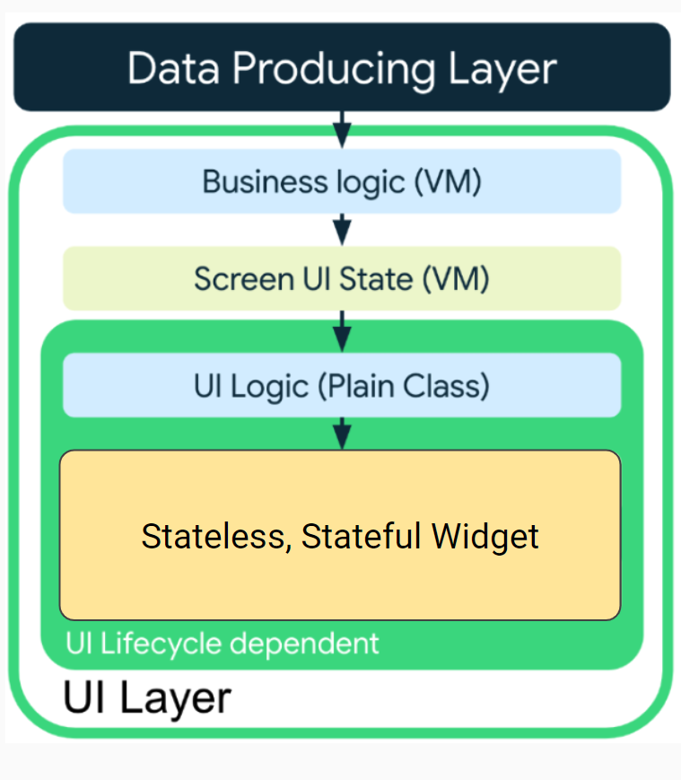
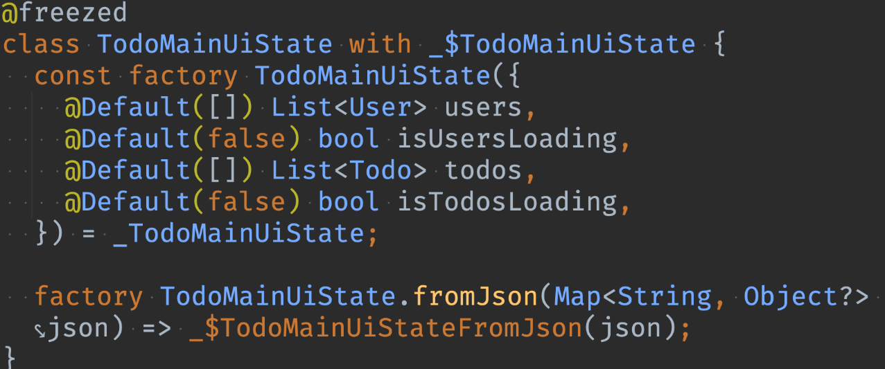
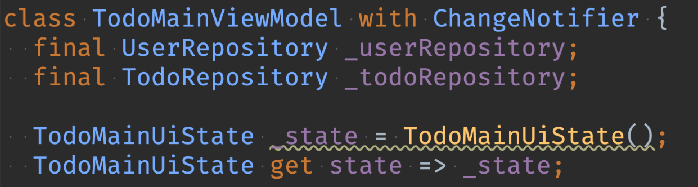

# 202404 플러터 과정 7주차 금요일   

## 1. 꼭 기억할 것! 🏅
## 복습
### admob 광고 추가 방법
https://codelabs.developers.google.com/codelabs/admob-ads-in-flutter?hl=ko#0

### Consumer, Selector
- 성능 최적화를 위해 사용
- 선생님은 안쓰신다고 함

### 배포 관련
- pubspec.yaml 파일에서 버전 관리
- ex. 1.0.0+2 (max값이 있으므로 한번에 너무 많이 올리진 말 것)
- IOS는 TestFlight라는 앱 설치하고 테스터만 넣어놓으면 알아서 테스트됨

## ViewModel 개선(상태 모으기)
### UI 상태 홀더
> UI 상태란..
- UI를 설명하는 속성이다
> UI 상태의 2가지 유형
- Screen UI State
	- UI를 표시하기 위한 데이터들(ViewModel의 변수들)
- UI element State
	- Widget들의 상태를 관리하는 요소들(TextEditing Controller 등)

- UI 상태는 정적인 속성이 아닌 변수다
- 그 로직은 ViewModel이 담당한다. (화면당 하나의 ViewModel)

> 로직의 종류
- UI 수명 주기와 무관함
	- 비즈니스 로직 = ViewModel 메서드
	- 화면 UI 상태 = ViewModel 변수
- UI 수명 주기에 종속
	- UI 로직 = Widget 내부의 로직

- 즉, UI 수명 주기와 관련있는 경우에만 View에 남기고, 나머지는 ViewModel로 분리할 것
- UI 수명 주기와 관련있는 경우
	- BottomNavi 탭 했을 때의 로직
	- 로딩 상태 등
- setState의 경우에는 최대한 안하는 방향으로 하되, 무조건 ViewModel에서 모두 처리하려고 할 필요는 없음
- 예를 들어 BottomNavi index 등은 setState로 해결하면 됨

### UI 레이어의 로직 흐름

### UI 상태 홀더의 책임(만드는 이유)
- 유지관리 편의성
- 테스트 편의성
- 가독성 등

### 만드는 방법
> freezed로 UI 상태 클래스를 만든다(data class)
- 불변 객체 + 6종 세트 + unmodifiable하게 만들어 줌

- 라이브 템플릿

	https://gravel-pike-705.notion.site/Flutter-Live-Templeate-579bac3070754bdf8fa10afe4ebe8c92

- vscode의 경우
	- .vscode/project.code-snippets파일에 json형태로 만듬

- 예시
	

- 결과 
	- ViewModel은 UI 상태를 하나씩 가진다
	- 즉, 변수가 하나만 남는다
	- UI 구현할 때는 state만 보면 됨
	- 불변 객체로 변경되었으므로 copyWith()를 적극 활용함
	- state는 읽기 전용/ _state는 쓰기 전용

## 2. 한줄 정리 🧹
1. 화면 하나에 하나의 UI 상태 홀더를 가진다.
2. ViewModel은 전체 화면에서만 사용해야 한다.
	- ViewModel의 인스턴스를 하위 UI요소에 전파하지 않음
	- UI재사용성, 테스트편의성, 디버깅

## 3. 참고
> Git api
- https://api.github.com/
- authorization 없이 사용할 수 있는 api도 있음
- user별 repository
	- "https://api.github.com/users/{user}/repos"
	- public이라도 모든 repository가 다 조회되진 않는듯... 이유는??

- repository_url
	- "https://api.github.com/repos/{owner}/{repo}"
	 
- repoisitory contents
	- https://api.github.com/repos/itbebop/TIL/contents/

- current_user_authorizations_html_url
	- "https://github.com/settings/connections/applications{/client_id}"
	- 앱에서 권한 요청할 때 사용
	- token 발급 받으면 인증 필요한 api 들 사용 가능함
	- https://api.github.com/user -H "Authorization: Bearer $TOKEN" 
