2# <span style="color:lime">202404 플러터 과정 8주차 월요일</span>   

## 1. 꼭 기억할 것! 🏅
### Use Case

### 의미
- 비지니스 로직을 모아놓은 ViewModel이 어떤 기능을 하는지 직관적으로 파악 가능
- 겹치는 기능 발생, 의존성 발생 -> 캡슐화 필요성 
- 클린 아키텍처의 목적 중 하나인 변경의 최소화를 만족하기 위해
- Use case를 사용하여 repository가 아니라 `기능별로` Use case를 주입받음
- 결과적으로 하나의 클래스가 하나의 동작만 수행함 -> 단일 책임의 원칙

### call vs. excute
- call을 쓰면 

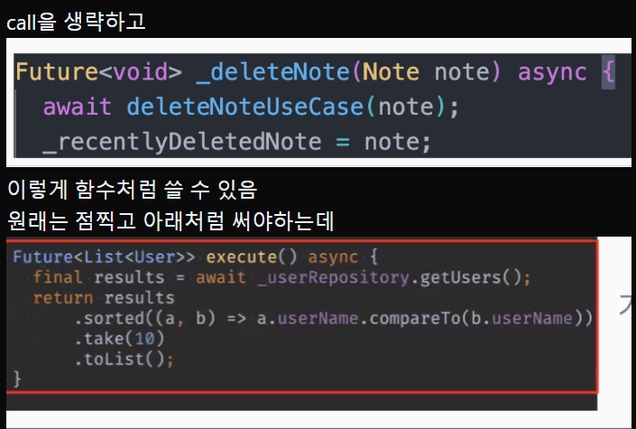

https://dart.dev/language/callable-objects

- call 대신 execute를 쓰는 이유는 타고 들어갈 때 call은 두 번에 걸쳐서 가야, execute는 한번에 가능
- execute를 쓰는 것도 인터페이스 등으로 강제할 수 있음
- void를 제네릭으로 쓸 수 있음?

### 2개 이상의 Repository, 기능 클래스를 사용하는 Usecase의 예

- 뷰모델 state를 변경해도 state는 Viewmodel에 갖고 있음
- 함수만 Usecase로 옮기는 것
- 리턴이 있는 건 Viewmodel로 리턴하고 없으면 그냥 void로 처리

- Viewmodel에는 Future는 안씀 -> 그냥 notify하면 알아서 보내주고 view에서 빌드해주니까

### 여러 Repo가 복합된 로직이 있는 Usecase

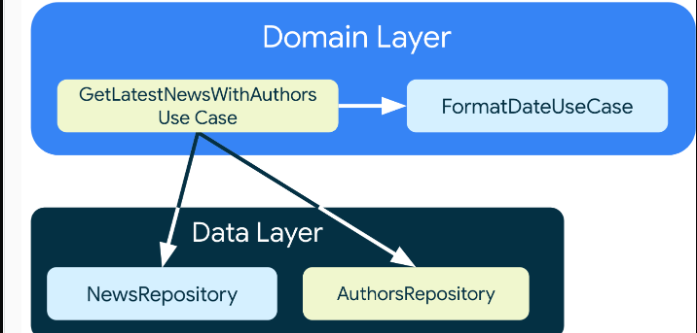

- GetLatestNewsWithAuthors에 FormatDateUsecase도 주입 
아래의 DataLayer 주입받아서 3개를 복합적으로 받아서 할 수 있음 

- 예를 들어 홀수 분의 사진만을 가져오는 경우
  - getPhotosTop3
  - getPhotosTop5

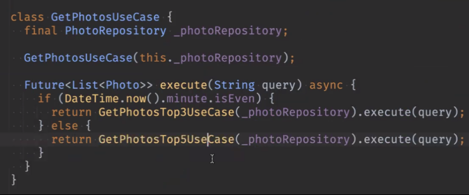


usecase를 이렇게 하면 ViewModel 수정 안해도 됨
생성자로 받아야함 

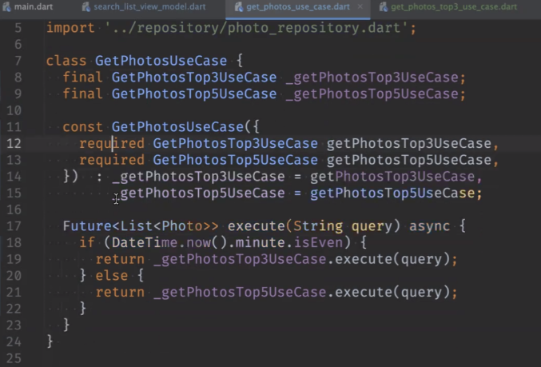

main 쪽

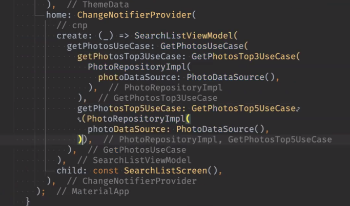

이렇게 정리할 수 있음 

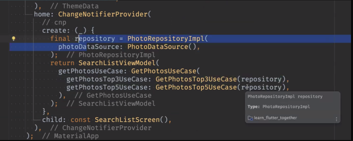

- 생성자 세팅은 main에서 하는 거고, 실제 쓸 값은 파라미터로 넘기는 것
- usecase가 여러 개면 그냥 전부 하나씩 받는 게 나을 것, list로 받는 거보다
- 차라리 usecase를 모아서 특정 화면에서 쓰는 Usecase들만 모으는 것이 나을 것

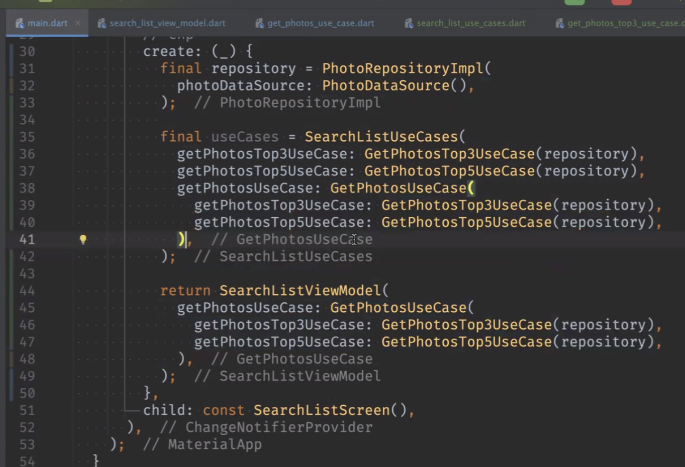

이런 식으로 세팅을 하고 viewmodel에는 하나만 던지면 될 것

### Usecase 이름 규칙

- 동사로 시작, 동사 + 목적어
- Viewmodel 함수와는 또 다름 

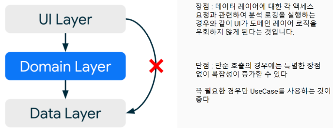

- 꼭 필요한 경우에만 Usecase 사용하면 된다.


### 클린 아키텍처

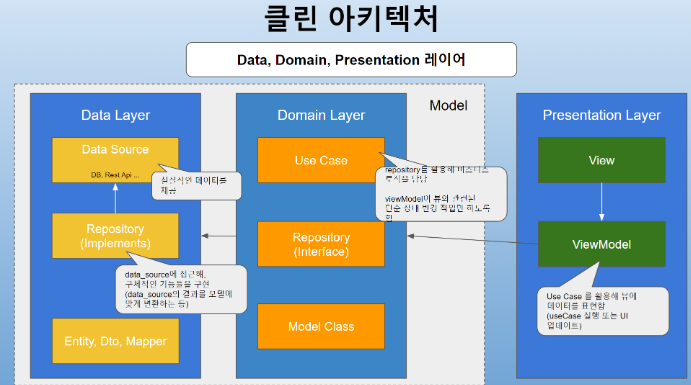

### 장점
1. 확장 가능한 앱
2. 쉬운 테스트
3. 다른 사람도 이해하기 쉬운 구조


### 도메인 별로 클릭 아키텍처 구조를 갖도록 함

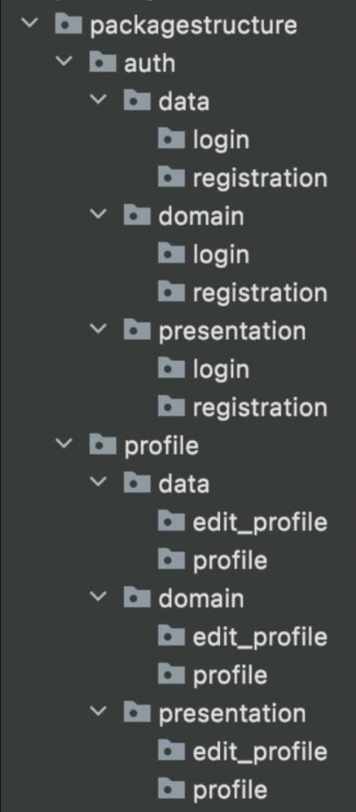

- 협업 시 도메인별로 분담을 하기도 쉬움
- 각자 스타일대로 개발 가능함
- 앱이 커져도 기존 기능에 영향을 덜 줌

### 소규모 앱에 적합한 구조

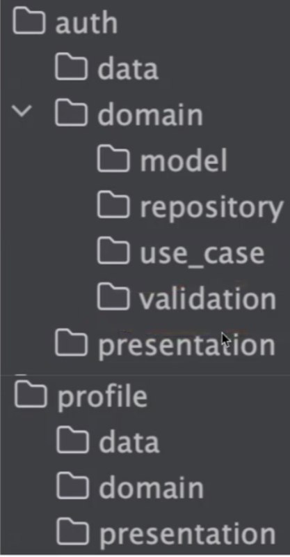

- 확장 용이하고 객체별 기능 찾기 수월하나 모델 많으면 폴더 찾기 여려움

### 대규모 앱의 경우

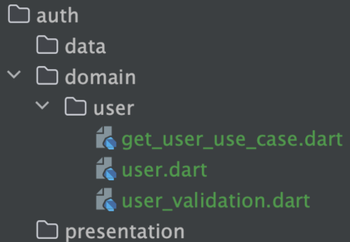

- 객체별로 정리

### 모든 모듈이 참조해야하는 공통 기능

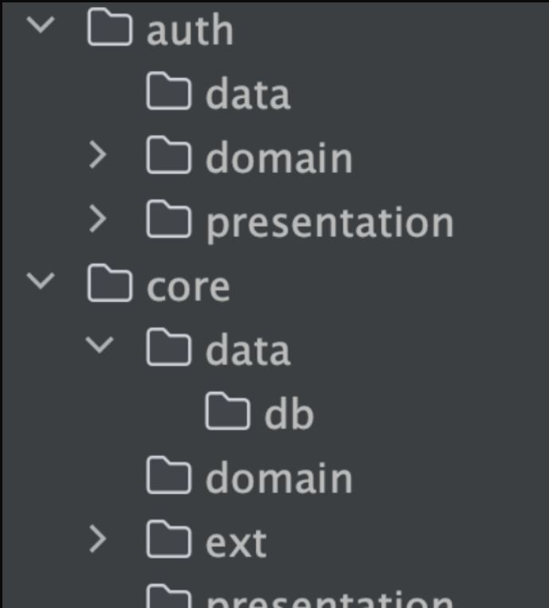

- 클린 아키텍처만 맹신하지 말고, 도구에 불과하므로 아키텍처를 좋게 만드는 요소에 집중할 것

### 좋은 아키텍처란..
    
	- 관심사 분리 (앱을 별개의 레이어로 나누기)
    
	- 모듈식 (낮은 결합도, 높은 응집력)
    
	- 프로젝트의 조건에 맞는 (친구랑 둘이 할 때와, 10명이서 할 때는 다른 방식이 필요)

### 기존에 만든 프로젝트(state모으기)의 경우

- 도메인 만들고
- 모델, 레파지토리 옮기고 
- usecase는 필요할 때 만들어서 넣으면 됨

### 제네릭으로 void 넘길 수 있는지

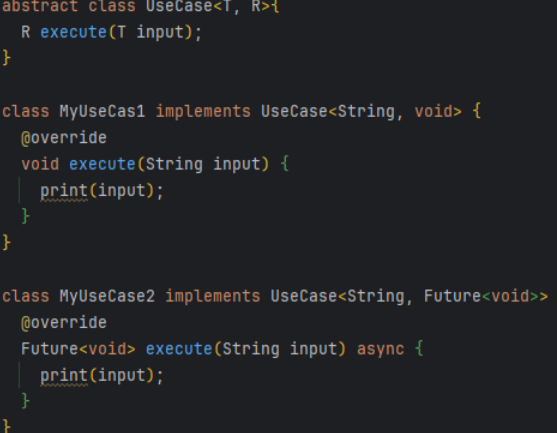


### 도메인이 핵심
- 핵심에 패키지가 들어오지 못하도록 해야한다.
  - freezed 예외
	- 순수 Dart로만 작성해야

- 데이터는 외부 라이브러리를 쓰는 구간

- presentation이 flutter 영역

## 2. 환율 계산기

- 데이터에 따라서 꼭 model 안 만들고 바로 map으로 받아오는 게 더 편할 수 있음

- MediaQuery.of(context).size.width * 0.4

- TextFormField

  - 숫자판 키보드

  ```dart
  keyboardType: const TextInputType.numberWithOptions(decimal: true),
  ```

  - 숫자만 입력

  ```dart
  inputFormatters: <TextInputFormatter>[FilteringTextInputFormatter.allow(RegExp("(\\d+[,.]?[\\d]*)"))], //dot + number
  ```

  - 다른 Textfield의 조작(onchanged될 때)
  ```dart
    onChanged: (value) {
                              relativeTextEditingController.value = relativeTextEditingController.value
                                  .copyWith(text: (double.parse(value.isNotEmpty ? value : '0') * (viewModel.rate ?? 0)).toString(), selection: const TextSelection.collapsed(offset: 5));
                            },
```
- DropdownButton
  - menuMaxHeight: 500,
  - 안의 리스트 높이, offset은 어떻게 맞출까????
                              

## 3. 참고

- 클린 아키텍처에 대한 정리
https://ve-a-developer.notion.site/db9c2e7b31b242dcbf74d729eed67ffd?pvs=4

- timer_builder package -> 시계 쉽게 만들어줌

```dart
              TimerBuilder.periodic(const Duration(seconds: 1), builder: (context) {
                return Text(
                  formatDate(DateTime.now(), [hh, ':', nn, ':', ss, ' ', am]),
                  style: const TextStyle(fontSize: 20),
                );
              })
```

- date_format package -> 시간 포맷 