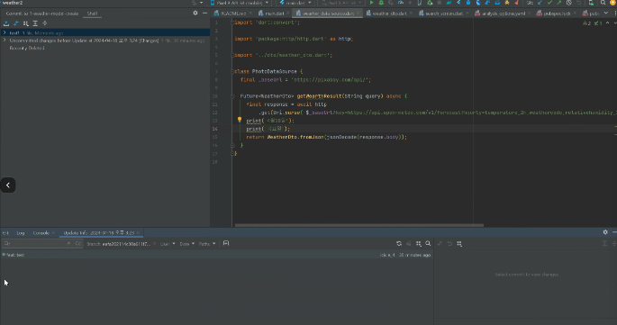

2# 202404 플러터 과정 8주차 목요일   

## 1. 꼭 기억할 것! 🏅
### http 통신 패키지
#### Dio package
- Uri.parse() 안씀
- jsonDecode 되어서 들어온다
- http는 body값이 dynamic으로 들어가서 map으로 보내면 터지는데
(jsonEncode해서 보내야함)
Dio는 보낼 때도 맵으로 보낼 수 있음
- post방식으로 통신할 때 더 편할 것 

#### retrofit
- 코드 제네리이터 기법을 쓴다.
- 내부적으로 dio가 필요함
- baseUrl 넣으면 Factory생성자에서 제네이트하면 `_RestClieng`가 생성됨
- 쿼리도 만들어줌
- json placeholder와 같이 list면 list가 들어오는 등의 정제된 data 받을 때 좋고, 
정제 안된 거 들어올 때는 대응이 어려움 (pixarbay)

### Github 협업 연습
#### 순서
0. 옵션 
  - 오거나이제이션 만들기
    - 모두 Owner로 만들 수 있음
  - Github 위키(코드 컨벤션 가이드 작성)

1. Repository 생성

2. 모든 팀원을 Collaborator로 추가 
3. 클론
4. 프로젝트 생성
5. Team Planning
6. Create Project
7. setting 가서 public으로 변경해야함

  

8. branch 쓸지말지 결정
9. 개발 브런치 만들기

  

10. default로 dev로 변경
11. 개발루틴 (이슈 생성 이후)

  

  1. 담당자 지정
  - 각 이슈를 해당 프로젝트로 등록하도록 함

  

  

  2. 이슈 브랜치 생성
    
    

  3. 브랜치 정보 가져오고 브랜치 변경하는 명령어 복사

    

  4. 작업 진행 -> push -> pr
      
    
  5. Merge
    - 작성자 본인이 merge
    - pr창에 가서 충돌나면 merge하는 사람이 해결해야하므로 각자 본인이 발생시킨 충돌 해결

  

    
  6. 브랜치 삭제
    - 진행 완료된 이슈의 브랜치 삭제
    - 결국 삭제할 거라서 Branch이름은 중요하지 않음
    - progress는 알아서 done으로 진행됨

    

  7. 반복

## 2. Git 추가 상식

- Merge vs. rebase

  - merge는 내가 한거 우선 
  - rebase는 remote우선 - 노드가 일직선으로 모양이 더 좋음
  - 결과는 동일함

- Conflict

  

  ㅇ 참고사이트
  [https://nulab.com/ko/learn/software-development/git-tutorial/how-to-use-git/git-on-command-line/resolve-conflict/](https://nulab.com/ko/learn/software-development/git-tutorial/how-to-use-git/git-on-command-line/resolve-conflict/)

- branch
  
  - 브랜치 연습해볼 수 있는 사이트!
  [https://learngitbranching.js.org/?locale=ko](https://learngitbranching.js.org/?locale=ko)

  - 체리피크 -> branch간 commit을 복사(copy with 하는 것)
    - 예를들어 핫픽스 했는데, 여기만 아니고 여기저기 다 넣어야 할 때 사용

  - Stash

    - 작업하던 도중 서버가 변해서 내려받아야 할 때 shelves라고 git 메뉴에 있다. (스튜디오만 있음)
    - unshelf하면 다시 복구됨
    - CLI에는  git stash
    - git status하면 변경 없는 상태로 돌아감
    - 그래서 풀도 받을 수 있고
    - 이게 사실 rebse란 같은 건데 rebase는 커밋을 하나 만들어버리는 것
    - 백업 대신 쓰면 좋음
    - 사용 방법
    1. 올리기 전에 git pull

      

    2. 뭐하던 거다고 쓰고 (임시커밋)

      

      

    3. 여기 작업하던 게 저장되어있음

      

    4. 왼쪽 빼는 아이콘 (맨 왼쪽)으로 뺴서 작업하면 됨

      

  ## 문제 상황

  - git branch -a 했을 때 지운 remote branch나옴

  - git remote update

  - git fetch --prune

  - 리모트만 지워지면 되고 로컬은 내가 지워야함

    

    - 여기서 지울 수 있음
    