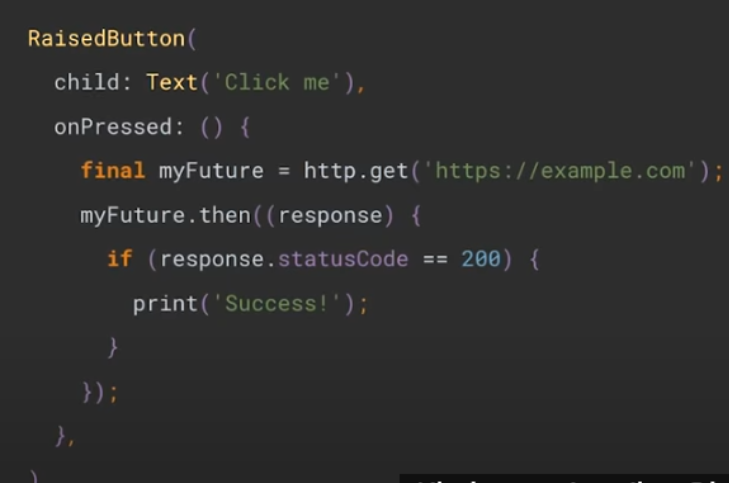
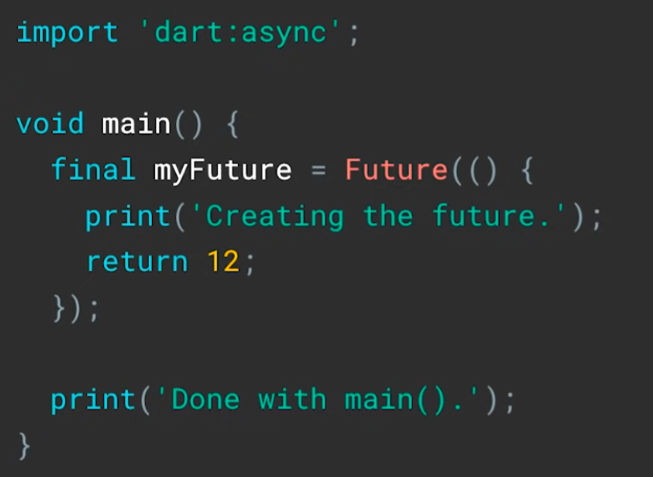

# isolate 적용 코드
https://velog.io/@ximya_hf/flutter-isolate


[Flutter 집중하기](https://www.youtube.com/watch?v=vl_AaCgudcY)
# episode1
Isolates and Event Loops - Flutter in Focus

## Isolate의 개념

### 타언어와 비교

C++ 등 다른 언어에서는 같은 메모리를 공유하는 다중 스레드를 가질 수 있고 이 스레드들은 어떤 코드라도 처리할 수 있다.

그러나 Dart에서는 스레드가 메모리를 가진 채로 Isolate에 있고 Event만 처리한다.

### Isolate 간 관계

기존 Isolate(old)는 새로 만들어진 Isolate(new)의 상위 요소이지만 새 Isolate(new)에 접근할 수 없다. 서로 분리되어 있다.

두 Isolate는 메시지를 서로 전달할 뿐인데, new는 이벤트를 사용하여? old에게 받은 메세지를 처리한다.

### Isolate 사용의 장점(다중 스레드와 비교)

다중 스레드를 사용하는 다른 언어와 비교하여 메모리를 공유하지 않음으로써 발생하는 Dart만의 장점이 있다.

Isolate에서 메모리 할당 및 가비지 콜렉션은 잠금이 필요없다. 단일 스레드만 있기 때문에 메모리 변경 여지 없음

## Isolate가 필요한 경우

* back에서 실행해야 할 계산이 있거나
- 계산할 양이 너무 많아서 프레임을 낮추는 경우 등
- futures, streams, async and await

## 사용 방법
Isolate.spawn이나 Flutter 계산 함수를 사용.
둘 다 개별 Isolate를 만들어서 수 처리를 하고 그 동안 메인에 부담을 주지 않으면서 위젯 트리를 다시 만들고 렌더링을 한다.
![[Pasted image 20240324131317.png]]


## 이벤트 루프
비동기 코드를 가능하게 하는 요소

이벤트 루프는 열에 있는 이벤트를 처리한다.



초기생성/탭 이벤트/ 네트워크 반응 이벤트

onPressed()나 Future 모두 dart입장에서는 열에 있는 이벤트일뿐.
# episode2
## future 
### 개념
* 닫힌 상태로 받은 데이터가 담긴 선물상자.
* Uncomplete
	* Completed with data / error
* Future 또한 이전 영상에서 말한 바와 같이 이벤트 루프로 작동하며, 단순화 시킬 수 있다.
- 코드는 이벤트 루프에 직접적으로 관여할 필요없이 http 라이브러리에서 future를 받고 future가 완료되었을 때 어떻게 할건지만 처리하면 된다.


### future의 인스턴스를 받는 방법
#### future를 생성해주는 라이브러리에서 받는 경우
1) http 네트워크 통신, 공유된 환경설정에 접근

2) 생성자 사용


    
	* 이 경우는 future 생성자에 함수를 제공하기 전에 main()가 완료됨
	* future 생성자가 처음부터 완료되지 않은 future를 제공했기 때문에
	* 나중에 함수를 실행한 다음에 데이터를 넣으려는 것
	```dart
	final myFuture = Future.value(12)
	
	// future.value가 에러가 있는 채로 완료되는 경우
	future.error

	// 지연
	Future.delayed(
		Duration(seconds: 5),
		() => 12,
	);
	```
		
	이미 future의 데이터를 알고 있는 경우에는 future.value를 사용하여 생성자의 이름을 지을 수 있다.
### future의 사용
* future의 상태
1)  완료되지 않은 상태
2) 값을 가진 채로 완료된 상태
3) 에러가 있는 채로 완료된 상태

```dart
import 'dart:async';

void main() {
	Future<int>.delayed(
		Duration(seconds: 3),
		() { return 100;},
	).then((value) {
		print(value);
	});

	print('waiting for a value... ');
}
```
* then() : future에 있는 인스턴스 메서드로 ==future가 value를 가진 채로 완료되었을 때== 콜백을 등록할 수 있다.
* catchError() : future함수에서 value가 아닌 error를 가진 채로 완료되었을 경우, 콜백을 등록할 다른 방법
	* error를 가지고 then()과 동일하게 작동한다.
	* 이 걸로 test code도 작성 가능.
	* 다중으로 에러를 잡을 수도 있다.
* Json형태의 데이터를 제공하는 서비스에서 데이터를 받아서 표시하는 경우
	* Stateful 위젯 생성/ Future/ setState() 생성하거나
	* FutureBuilder를 사용
		* Flutter SDK에 있는 위젯
		* future와 빌더 에머드를 제공하면 future가 완성되었을 때 자동으로 하위 요소를 다시 만든다.
		* 빌더 메서드를 호출하는 것처럼 작동한다.\
		* 즉, context를 파라미터로 갖고,
		* 현재 future상태를 스냅샷으로 갖는다.
		* 스냅샷으로 future가 에러인지 데이터인지 확인할 수 있다.
		* 아니면 has 데이터 속성을 확인해서 값을 가진 채로 완료되었는지 볼 수도 있다.

# episode3
stream