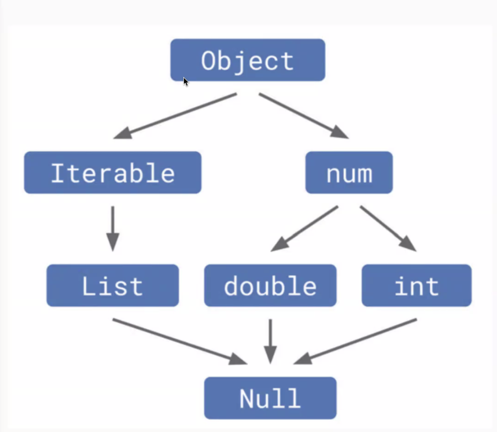
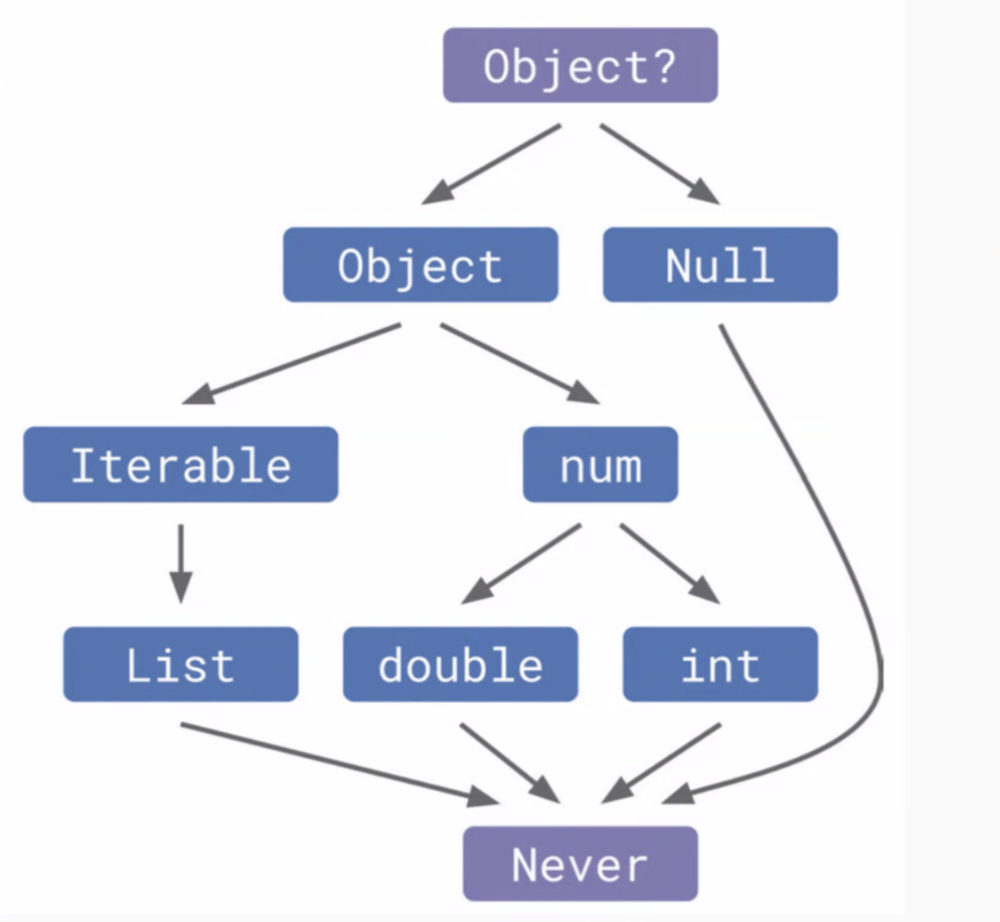

Date:240307

> ## Dart의 Null

 ### NULL이란?  
    '값이 존재하지 않는다.'  
    공백은 눈에 보이진 않지만... '공백'이라는 값이 들어가 있다.  

 ㄴ 왼쪽이 0(공백)이고 오른쪽이 null 상태.  
 null 이라는 건 값 자체가 아예 할당되지 않은 상태라고 보면 된다!  

 
    * 가비지 콜렉터 : 쓰레기 수집가. 자동으로 메모리 관리 해 줌.

---- 

### 기존 타입 시스템
- 예전 dart에는 모든 타입이 Null을 허용했었다.
  
    

### Null Safety가 적용된 타입 시스템
- 지금은 Null Safety가 적용되어 모든 타입이 null을 허용하지 않는다.  
- 아예 null 이라는 타입이 별도로 빠져있다고 보면 된다.
  
    

### Null Safety란?
- 어떤 변수나 데이터가 null 이 될 수 있음을 뜻한다.
- 데이터가 null 일 경우, 이 데이터를 가지고 어떤 동작을 하고자 하는 것을 사전에 방지하여 에러를 막을 수 있다.

### 최하위 객체  
- 기존에 Null 이 최하위 객체였다면, 지금은 Never라는 특수한 타입이 추가 되었다.
- Never은 특정 상황이 결코 발생하지 않는다는 것을 명시적으로 표현할 때 사용한다. 
  
    
  

> ### 결론  
----  

  
  - String은 문자열을 나타내는 타입으로 항상 값을 갖고 있어야 하며 Null 이 될 수 없다.
  - String?은 null 안정성을 위해 만들어진 Null Safety 타입으로써, 문자열 또는 Null 이 될 수 있다.
  
    => string 과 string? 는 다른 타입이다.  

----  
 

> ## Null 처리에 관한 기능
-  ??  : 앞의 객체가 null 일 경우 뒤에 붙은 값으로 바꾼다.
 
    ~~~
    int value = nullableValue ?? 0;
    ~~~

-  ! : nullAble인 값을 null이 아님을 보증한다.  
개발자에게 책임이 따르므로 주의해서 사용해야 함.
    ~~~
    int nullVal=10;
    int value = nullVal!;
    ~~~
    
-  ?.  :  nullable객체를 안전하게 사용하고자 할 때 쓴다.  
  null이 아니면 해당 코드를 수행하고, null이면 null을 반환한다.  

    ~~~
     int? nullableVal =10;
     print(nullableVal?.toString()); // 10 출력

     int? nullableVal =null;
     print(nullableVal?.toString()); // null 출력
    ~~~

> ### 타입을 명확하게
~~~
List<String>
List<String>? // 리스트가 nullable
List<String?> // 리스트 속 string이 nullable
List<String?>? // 리스트도, 속에 들어갈 string도 nullable
    
~~~
- null satety의 장점  
   안정성 향상, 코드 가독성 향상, 디버깅 용이, 코드 품질 향상, 캄파일 속도 개선으로 배포시간 단축
- null satety의 단점  
   러닝커브가 있음, 리팩토링 어려움, 유연성 감소, 코드가 복잡해 질 수 있음

----  

> # 인스턴스와 클래스  
> 
- 용어정리
  - 오브젝트 : 현실 세개의 모든 객체 (사물, 인간, 동물 모두)
  - 클래스 : 오브젝트를 가상 세계용으로 구체화 한 것 (붕어빵 틀).  
            사물을 코드로 옮기려면 어떻게 해야할 지 쓴 설계도.
  - 인스턴스 : 클래스를 활용 해 메모리 상에 만들어 낸 것 (붕어빵). 컴퓨터 상에 실체화 한 것.

> 클래스

   
  클래스 이름, 속성, 생성자, 함수로 된 기능을 작성  
  클래스 속에서 변수 선언은 값을 할당해주지 않아도 에러가 나지 않음 왜냐  
  속성을 작성한 영역을 field 또는 멤버변수, 전역변수 라고 한다.
  필드를 상수로 선언 할 수도 있다. 초기값 필수.
  생성자: 인스턴스 만드는 방법을 제공하는 함수 같은 놈. this : 나

  - 기능 구현 = 함수 작성  
  
> 클래스와 멤버변수의 네이밍 컨벤션(규칙)
  - 클래스명 | 명사 | 단어 첫글자는 대문자 (pascal) | (ex) Hero, String, Dialog
  - 필드 명 | 명사 | camel case | (ex) level, items, itemList
  - 메소드명 | 동사 | snack case | (ex) attack, findWeakPoint  
  
  
  
> 함수와 메서드  
 
  - 함수 : 위치 상관 없이 사용하면 최상위 함수. 단독으로 동작하고 아무곳에서나 사용 가능하다.
  - 메소드 : 클래스 안에 작성하는 함수는 메서드(메소드) 라고 한다. 클래스가 제공하는 기능으로써만 사용된다.

> 클래스 정의에 따른 효과
  -   정의한 클래스로 인스턴스를 생성 할 수 있다.(메모리에 데이터를 만든다.)
  -   기본 자료형 이외의 것을 커스텀해서 만들자. = 클래스
  -   이 클래스로 생성한 인스턴스를 넣을 수 있는 새로운 변수의 타입이 이용 가능해 진다.  
      Hero 클래스를 정의하면 Hero 타입의 변수를 선언해서 사용 가능.
      ~~~
      Hero hero = Hero('용사쿠키', 100);
      ~~~

----
> ## 정리
- 인스턴스와 클래스
  - 클래스 : 껍데기 혹은 설계도 , 인스턴스 : 설계도를 바탕으로 만든 실체  
  
- 필드와 메소드
  - 클래스에는 속성을 필드로, 동작을 메소드로 선언.
  - final이 붙은 필드는 상수 필드로서 값이 불변.  
  
- 클래스 타입
  - 클래스를 정의하면 클래스 타입의 변수 선언이 가능함
  - 어떤 클래스 타입 변수는 그 클래스의 인스턴스를 담을 수 있다.  
  
- 인스턴스 화
  - 클래스로 부터 인스턴스를 생성하는 것. Dart에서 new 키워드는 생략 가능.
  - 어떤 클래스 타입 변수에 인스턴스가 담겨 있을 때 그 인스턴스의 필드나 메소드 이용가능  
   
  
  ~~~
  Hero hero = new Hero();
  Hero hero2 = Hero();

  // int 나 string 같은 기본 자료형도 사실은 이런 형태이지만, 
  // 자주 쓰는 것이므로 생략해서 쓸 수 있게 만들어 진 것 임.
  ~~~

참고/ 변수 재할당이 없으면 final이 좋다.