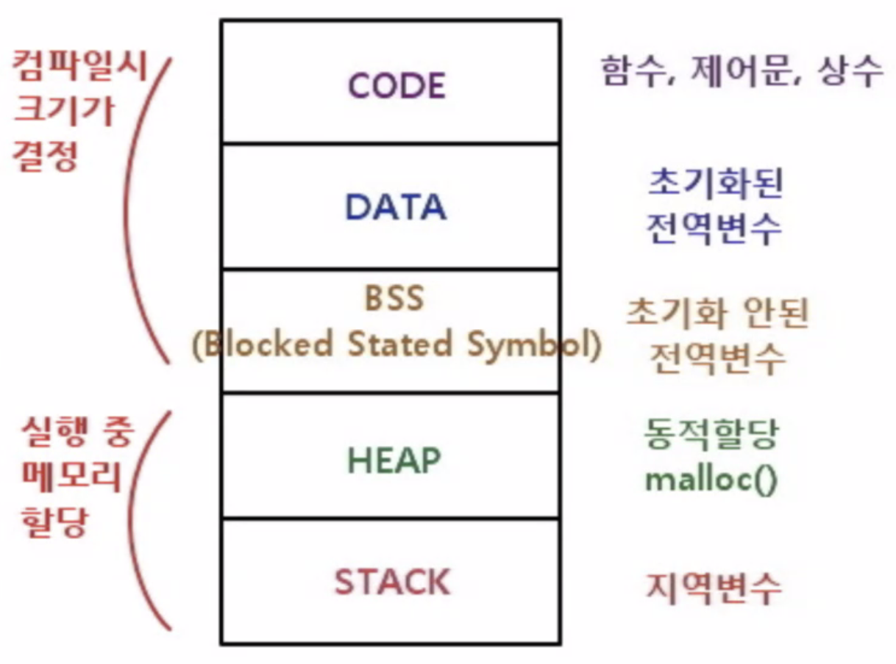
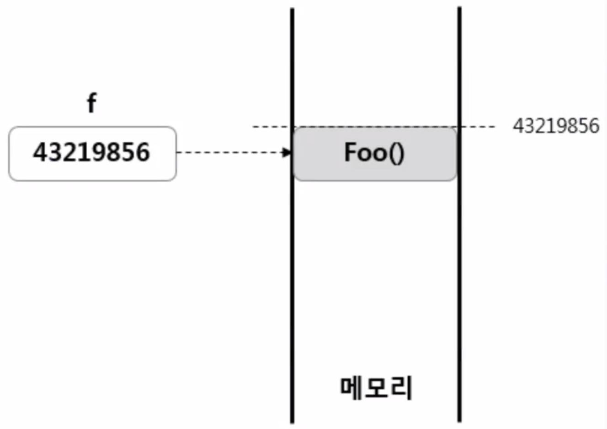

Date : 230308

----
### 레퍼런스 타입과 참조

 - 다트는 모든 타입이 레퍼런스 타입이다. 기본형, String 또한 마찬가지로 레퍼런스 타입이다.    
 
    >-  레퍼런스란 타입이란?  
   프로그래밍 언어에서 변수가 실제 데이터를 직접 포함하는 것이 아니라,   
   데이터의 위치(메모리 주소)를 가리키는 역할을 하는 타입을 의미

 

- 가상세계 = 컴퓨터 메모리 영역
- 인스턴스 = heap 영역 안에 확보된 메모리  
   
   
      

---- 
### 더 알아보기 

- 메모리?  
    메모리는 컴퓨터가 정보를 저장하고 처리하는 작은 공간이다.  
    메모리 속에는 데이터를 수납하기 좋게 칸이 아주 작게 나뉘어져 있는데, 
    제일 작은 한 칸의 단위를 bit 라고 한다. (비트는 0과 1의 값을 가짐)
    비트가 모여서 바이트가 되고, 바이트가 모여서 킬로바이트, 그다음 메가바이트, 기가바이트가 된다.
    bit < Byte < KB < MB < GB
    
 - Heap?  
   메모리 관리에 사용되는 자료구조 중 하나. 보통 동적 메모리 할당을 위한 공간으로 사용되고, 프로그램 실행 중 데이터를 저장하고 접근하는데 사용된다.  
   비유하자면, 모래알 처럼 무수히 많은 데이터들을 특별한 규칙에 따라 담아 보관하는 모래상자라고 생각하면 쉽다.
   heap 이라는 상자 속에서는 위에서 부터 중요도가 높은 순에서 낮은 순으로 차례차례 정렬이 된다.
   
 - 동적할당 : 어떤 동작을 할 때 할당되는 것. 
 - 정적할당 : 실행시 부터 이미 메모리가 할당 되는 것  
   
  ----  
 
 
 
  메모리에 저장된 각각의 데이터들은 고유한 주소를 가지며, 우리는 이 주소를 가지고 데이터를 꺼내 쓸 수 있다.
  그치만 주소로 쓰면 기억하기도 어렵고 가독성도 떨어지므로, 주소 대신 선언한 이름을 가지고 코드를 작성하면 된다.
  이것을 참조한다고 말한다.
   
   

    
    hero1 = Hero('홍길동', '200'); 
    hero2 = hero1; // hero2.hp는 200. 

    => 왜냐? hero2가 hero1이 들어있는 곳의 주소를 가져와서 들고있기 때문이다.   
    우리가 블로그 글의 링크 주소를 클릭하면 해당 블로그 글로 이동하는 맥락과 같다고 볼 수 있다.
    
   
---- 

### 다른 타입을 인자나 리턴값으로 사용하기

다른 클래스를 타입 형태로 인자나 리턴값에 넣을 수 있다.
~~~dart
class Wizard{
    String name;
    int hp;    

    Wizard({required this.name, required this.hp});

    void heal(Hero hero){  // Hero 클래스를 인자로 사용함
     hero.hp += 10;    
    }

  }
~~~
 
  - 이렇게 객체들 끼리 서로 주고받고 하면서 동작한다. => 이것이 바로 객체지향형!

### 생성자
  -   생성자는 인스턴스 생성하는 방법을 제공하는 것을 말한다.
  -   모든 클래스는 반드시 1개의 생성자를 가진다.
  -   클래스에 생성자를 만들지 않아도 기본 생성자를 가진다고 본다.
  ~~~dart
    class Wizard{
        String name;
        int hp;    

        Wizard(this.name,  this.hp);
    }
  ~~~
  
### Named Parameter

  - 클래스 생성자에서 파라미터를 중괄호로 감싸면 옵셔널이 되는데,(선택사항. 파라미터를 넣지 않아도 상관 없음) 
 중괄호 안에서 옵셔널한 파라미터는 반드시 초기값을 넣어주도록 한다.  
 필수로 들어가야만 하는 파라미터에는 'required'를 붙여줌으로써 반드시 사용하도록 명시한다.  
 'required'가 붙은 파라미터의 값으로는 null이 들어갈 수 없다.  
 
  ~~~dart
  class Sword{
    String name;
    String damage;

    Sword({required this.name, this.damage = 30});

  }
  
  =======

  Sword sword = Sword(name:'마법사', damage: 0); // 사용할 때는 변수명을 써주고 넣을 값을 기재한다.  
  Sword sword = Sword(name:'마법사');

  ~~~

### 값이 없을 수도 있는 파라미터
- 값이 없을 수도 있는 파라미터의 경우에는 타입 뒤에 ?(물음표)를 붙여준다. 초기값은 없어도 된다.
- 값이 null 이 아니면 required를 꼭 써 줘야 한다.  

 ~~~
  class Sword{
    String name;
    String? damage;

    Sword({required this.name, this.damage});

  }
  
  =======

  final sword1 = Sword(name:'마법사', damage:null);
  ~~~
   
### 오버로드

  - 같은 이름의 생성자 또는 메서드를 여러개 만들 수 있는 것.
  
  
  ~~~dart
    class Sword{
    String name;
    int hp;
    String? damage;

    Sword({this.name, this.hp = 100, this.damage});

  }
  
  =======

  final sword1 = Sword(name:'마법사', hp:80, damage:0);
  final sword2 = Sword(name:'마법사', hp:80);
  final sword3 = Sword(name:'마법사');  
  final sword4= Sword(hp:80, damage:0);
  final sword4= Sword(damage:0);
  final sword4= Sword();

  // 6개나 만들 수 있다!
  ~~~  
----
> ### 더 알아보기

- 클래스와 static    
  클래스 내부에서 static을 붙인 변수나 함수는 클래스 인스턴스를 생성하지 않아도 어디에서든 가져다 쓸 수 있다.
  클래스 입장에서는 static을 붙인 애들이 다른 영역이기 때문에 안보인다고 봐야 한다.
  static 끼리는 static만 보인다.
  이렇게 된 이유는 자바에서 온 과거의 유산이...이어져 왔다..

  그래서 탑레벨이나 순수 함수만 static을 사용할 수 있다.
  그럼에도 static을 클래스 안에서 사용하는 이유는 클래스 내부의 변수 값을 사용해야 하는 일이 생기기 때문에 필요하다.
  static 변수는 항상 메모리에 올라와있다. 근데 지금은 메모리가 많아서 굳이 안쓰려고 하지 않아도 되긴 하지만 좋은 코드를 위해서는 막 쓰진 않는게 좋다.
  옛날에는 탑레벨에서 static을 못쓰고 클래스에서 썼어야만 했기 떄문에 아무데나 넣기 보단 연관 있는 곳에 넣어주는 것이 이어져 온것.
  다트에서는 이런 제한 없이 막 쓸 수 있다.

  ---
 

클래스 내에서 함수 작성시 필드와 같은 이름의 변수가 있을 경우, 필드를 선언할 때 'this.' 를 붙여주도록 한다.  

~~~dart
    Class Hero{
        String name;

        void tellYourName(){
            String name = 'mimi';
            this.name = name;
        }
    }
~~~
 
   하지만 이것은 안티패턴이기 때문에 되도록 같은 이름을 쓰지 않도록 한다.  

    

- 파라미터로 받는 입력값은 변하지 않는 것으로 간주하고 처리해야한다.  
  더 이상 값의 변경이 일어나지 않을 경우 final을 붙이는 걸 습관화 하면 좋다.  

  
    
  ~~~dart
    int pray(final int second){
        ...(생략)
    }

    => 암묵적으로 final이 있다고 믿고 코드를 작성한다.

    ---- 
    int pray(int second){
        ...(생략)
    }
    => 일반적으로 코드를 이렇게 작성한다.
   ~~~
