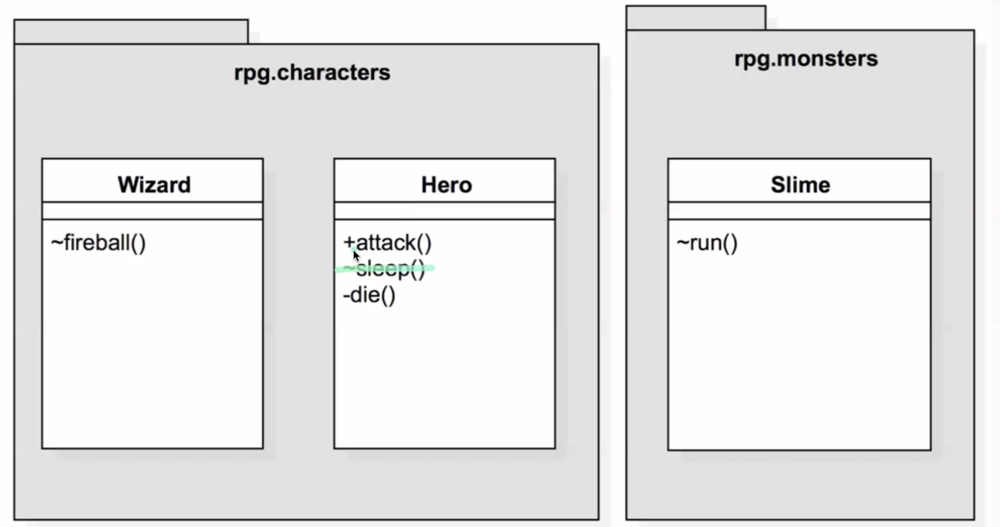
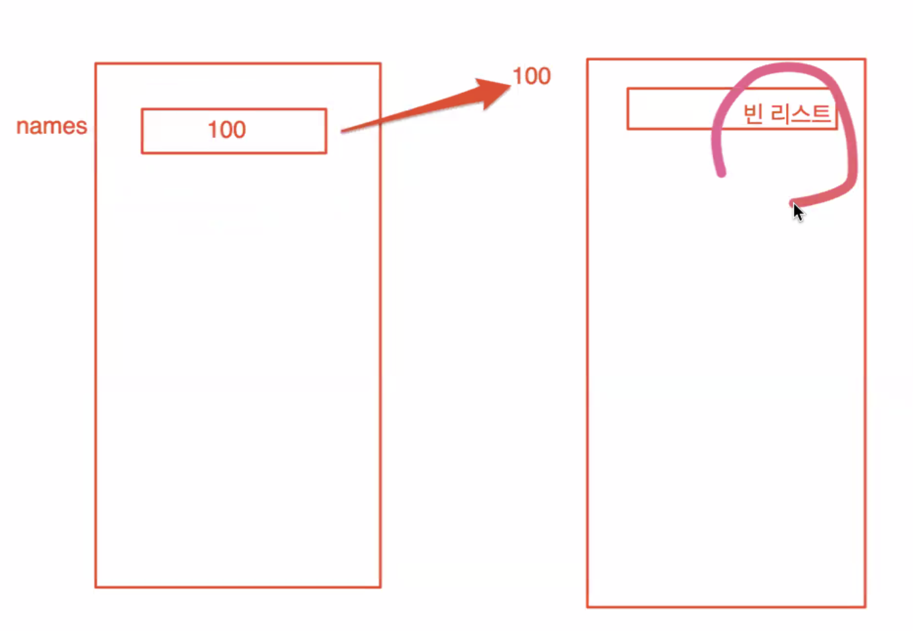
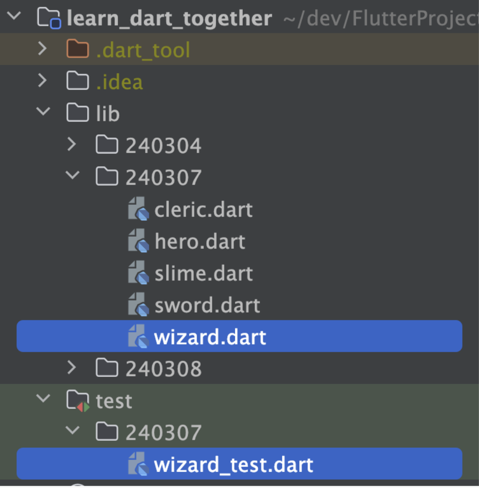

Date : 240311

## 숙제검사
Cleric Class 에서 최대 hp, 최대 mp를 숫자를 바로 넣지 않고 필드에 선언한 상수를 넣는 이유는 훗날 값이 바뀌었을 때,  
한 번에 수정이 가능하도록 하기 위해서다. 유지보수 편하게! 퇴근 빨리하게~~

## 캡슐화 encapsulation
  - 휴먼 에러를 막기 위한 노력. 다른 개발자의 꺵판을 막기 위함..! 
  - 관련된 데이터와 동작을 하나로 묶는 것. 
  - 이를 통해 클래스 내부 상태를 숨기고 외부의 직접적인 접근을 제한함으로써 객체의 불변성과 안정성을 보장 할 수 있다.
  - 캡슐화 된 객체는 독립적으로 존재하며, 인터페이스를 제공함으로써 재사용성을 높일 수 있다.
  
   
  > ### private & public 
  
  - 멤버에 대한 액세스 제어
      
      
  
  - private은 동일한 파일(라이브러리) 내에서만 접근가능
    - 1 파일 = 1 라이브러리
  - public은 모든 클래스에서 접근 가능
  
  - 
    - 설계도 : +는 퍼블릭, -는 프라이빗으로 만들라는 뜻
  
  > ### getter & setter  

  - 메소드를 경유한 필드 조작
  - getter 는 다른 곳에서 읽을 수 있도록 하는 것. 읽기 전용 프로퍼티 구현 시 사용
  - setter 는 값을 설정할 때 사용. 잘 쓰지 않는다. 쓰기 전용 프로퍼티 구현 시 사용
  - read only, write only 필드 실현
  - 필드의 이름, 클래스의 내부 설계를 자유롭게 변경가능
  - 필드로의 액세스 검사 가능
   
  
    ----  
    - 프로퍼티(property)? 객체 지향 프로그래밍에서 클래스 내부의 멤버 변수(또는 필드)를 읽고 쓸 수 있는 메서드를 일컫는 말.
    
  
   
    ~~~ dart
        
        int get hp => _hp; 
            // 저 화살표가 뭐냐면 expression body, lambda expression, 람다식, 
            // 화살표 표기법, arrow function 라고 부름.

        // 위 아래 모두 동일한 함수

        int get {
            return _hp;
        }
    ~~~  

    ----  

  - setter에서 값의 타당성 검사
    ~~~

    ~~~
    - Exception? 
    - 클래스도 접근 제어 가능. 함수 변수과 동일한 규칙으로 사용.
    - 캡슐화에 대한 생각 : 개발자의 잘못된 접근에 대한 제어 방법을 제공
    - 현실세계에서 불가능한 값이 들어가지 않도록 제어
  
- 클래스 필드에서 생성자에 프라이빗 파라미터를 named로 했을 경우 아래와 같이 쓴다.
  ~~~ dart
  // 방식 1

  class Hero{
    static int money = 100;
    String name;
    int _hp;

    Hero({
        required this.name,
        required int hp,
        this.sword,
    }) : _hp = hp; 
    
   
  }
   
  // 생성자에서 변수를 새로 만들어서 private 변수에 값을 할당 해준다.
  // 왜냐면 생성자로 private 변수에 직접 접근 할 수 없기 때문에.         

   // 방식 2 

    class Hero {
    static int money = 100;
    String name;
    int _hp;

    Hero({
        required this.name,
        required int hp,
    }) {
        this.hp = hp; // Setter를 통해 값을 할당
    }

    // Getter와 Setter
    int get hp => _hp;

    set hp(int value) {
        if (value >= 0) {
        _hp = value;
        } else {
        throw Exception('HP는 음수가 될 수 없습니다.');
        }
      }
    }
  ~~~

    이렇게 변수를 private하게 만들어 간접적으로 접근 할 수 있게 관리 하면 클래스 내부 변수에 아무렇게나 직접 접근해서 변경되는 것을 막고, 생성자나 setter 같은 특정 함수를 통해서만 변수의 값을 변경할 수 있게 된다. 이것이 바로 캡슐화.
    이 방식은 유효성 검사(타당성 검사)를 할 수 있도록 한다.
  
    

## 컬렉션
  - 데이터 구조에 따른 대표적인 컬렉션 (자료구조)  
1. List   = Array  
   - 순서대로 쌓여있는 구조 (아이템의 중복 허용)
   - 다트에는 Array가 없고 List만 있음.
   - 크기를 정해두지 않고 요소를 추가할 때 마다 크기가 커짐
  
   ~~~dart
   
   // 타입 선언을 안하면 모든 타입이 다 들어가지만, 휴먼에러가 자주 날 수 있으므로 꼭 하기!
   // 다른 것도 넣고 싶으면 클래스를 만들어서 타입으로 넣자.

   final names = <String>[]; 
   names.add('apple');

   final List<String> names2 =[];
   names2.add('apple2');
   
   // 두 코드는 같은 코드.
   // final 인데 크기가 변경되잖아? -> names는 주소값만 들고 있는 상태고, 리스트가 올라간 메모리 공간이 별도로 있기 때문에 리스트는 크기가 바뀔 수 있다. 아래 그림 참고
   ~~~
    
    
    names라는 리스트 변수는 리스트가 실제로 들어있는 메모리 공간의 주소를 참조하여 정보를 알려주기 때문에,  
    변수는 final 이지만 실제 리스트 내부는 변경이 가능하다. 그럼 뭐가 안되느냐! 이 주소값을 바꾸는게 안된다.  

    => 변수에 다른 리스트를 할당하는게 안된다는 것! 주소지 변경 불가!

    - 탐색방법
    ~~~dart
     final names = <String>['apple','pear','grape']; 
     
     // 방법 1
     for(int i = 0; i < names.length; i++){
        print(names[i]);
     }

     // 방법 2
     for(final name in names){
        print(name);
     }

     // 방법 3
     names.forEach((name){
        print(name);
     });

     // 방법 4
     names.forEach(print);
    ~~~
  
   - var VS dynamic
     - dynamic은 런타임에 타입이 결정됨. 
     - var은 컴파일 타임에 타입이 결정됨. 
     - 휴먼 에러를 막기 위해 가급적 쓰지 않는 것이 좋음.
     - 함수도 선언 할 때 리턴 타입을 붙여 주는 것이 좋음. dynamic으로 설정되기 때문에. 리턴값이 없으면 void를 붙여줄 것.  
  

2. Map
   - 키와 값의 쌍으로 이뤄진 요소를 담는 자료구조 (키의 중복 불가)
   - 키 중복 불허
   ~~~dart
   Map<String, dynamic> gildong= {'이름':'홍길동', 'id':0,'age':20}

    // Json 처럼 사용가능

   List<Map<String, dynamic>> student= [
    {'이름':'홍길동', 'id':0,'age':20},
    {'이름':'홍길동', 'id':0,'age':20}
   ];

   gildong.entries.forEach((e){
    print(e.key);
   });

   // 맵은 순서가 없어서, 매번 출력 결과 순서가 다를 수 있음.
   ~~~

3. Set
   - 중복값을 허용하지 않는 집합
   - List의 contains보다 찾는 속도가 빠름.
   - 순서가 없어서 get 메서드로 원하는 순서의 값을 찾아올 수 없다.
   - Iterator? 반복자. 요소 탐색자. 뺑뺑이 돌리기  
   ~~~dart
    Set<int> lottoSet= [1,2,3];
   ~~~

   
   ~~~dart
    class Person {
    final String name;
    final int birthYear;

    Person({required this.name, required this.birthYear});

    get age {
        final year = DateTime.parse(DateTime.now().toString()).year;
        int age = year - birthYear;
        return age;
      }
    }
    Person person = Person(name: 'hehe', birthYear: 1991);

    print('age : ${person.age}');
    ~~~
  
        

## 테스트 코드 작성 방법
   1. 테스트 하고 싶은 파일 고르기
   ~~~dart
    [ lib > 240307 > wizard.dart 파일]

    import 'hero.dart';

    class Wizard {
        String name;
        int hp;

        Wizard({
            required this.name,
            required this.hp,    
        });

        void heal(Hero hero){
            hero.hp += 10;
        }
    }
   ~~~
   2. test 디렉토리 아래 동일 위치에 _test를 붙인 파일 작성
      
      
   3. test 코드 작성  
          given > when > then 기법 사용  
          expect() 함수를 활용한 결과 검증  
   ~~~ dart
    void main(){
        test('Wizard Test', (){
            
            // given(준비)            
            final wizard = Wizard(name: '마법사', hp: 100);
            final Hero = Hero(name: '히어로', hp: 10);

            // when (실행)
            wizard.heal(hero);

            // then (검증)
            expect(hero.hp, equals(20));

        });
    }

   ~~~

   

