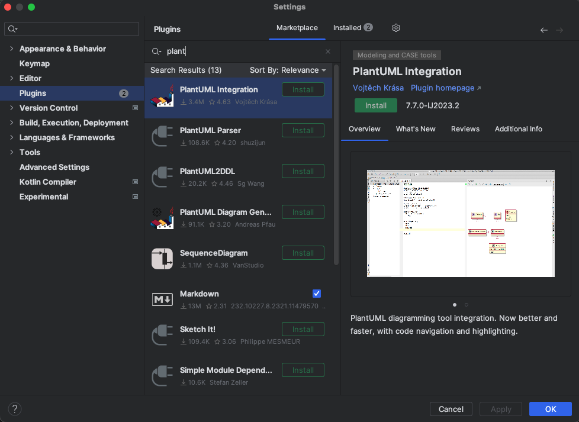
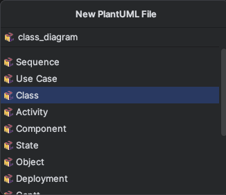
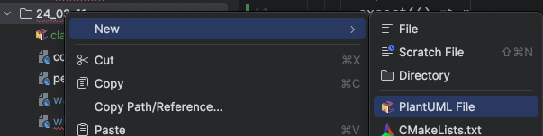
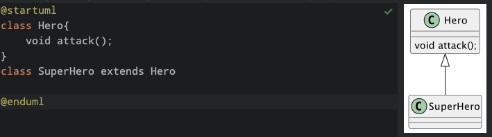
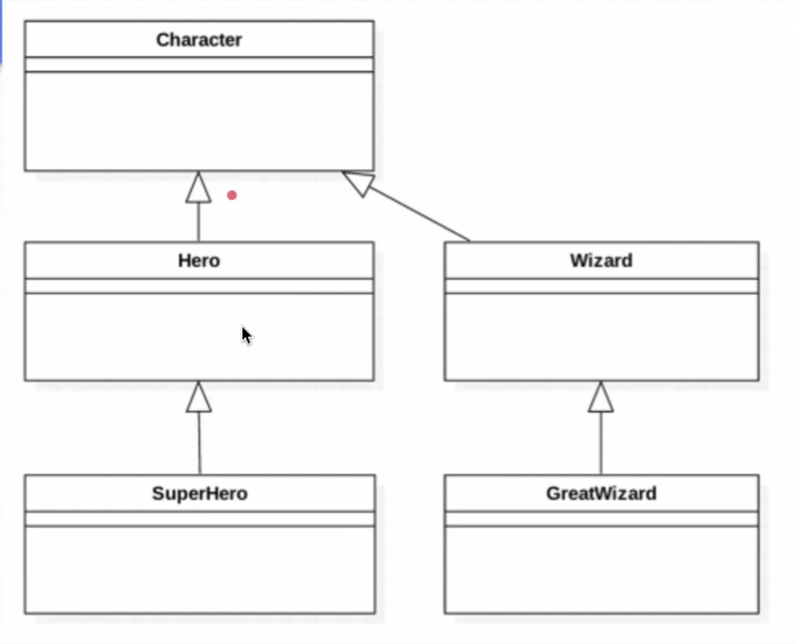

Date : 240312

## 숙제검사 
~~~dart
class Wand {
    String test; // 이렇게만 쓰면 nullable인데 초기화 할 값이 없어서 오류가 뜸
    String? test; // 이렇게 널러블 타입을 줘야 한다. 
    late String name; // 또는 널러블 타입 대신 late를 써서 늦은 초기화를 할 수 있다.
    
    // late를 무분별하게 쓰면 급한 불은 껐지만 동작시에 에러가 많을 가능성이 크니 조심할 것!
}

void main(){
    Wand wnad = wand();
    wand.name = 'gil';

    print(wand.name);
}
~~~

</br></br>

## 상속 inheritance
> 상속이란 무엇이냐   
> 이전에 만든 클래스와 닮았지만, 일부 다른 클래스를 만들 필요가 있을 경우에 사용한다.
> 기존에 있는 애를 기반으로 기능을 확장하겠다!

~~~dart
// 슈퍼히어로. hero 클래스에 생성자가 여러개 있으면 골라서 가져와서 쓰면 된다.
class SuperHero extends Hero{
  SuperHero({required super.name, required super.hp }); // 여기서 super는 Hero 클래스를 말함.
}

~~~
상속관계는 SuperHero -> Hero 로 봐야 함. Hero 클래스를 확장하는 개념이라고 생각해야한다.

[설계도 그리는 사이트](https://plantuml.com/ko/#google_vignette)

- 안드로이드 스튜디오에서 설계도 그리는 법
```
맥에서는 graphviz 를 깔아줘야 함

brew install libtool
brew link libtool
brew install graphviz
brew link --overwrite graphviz

```
1. 안드로이드 스튜디오 PlantUML 플러그인 설치  
    
2. PlantUML 파일 생성  
    
    
3. 내용 작성
    

    ~~~
    + : public
    - : private
    # : protected
    '<|.., ^.. : 실체화, 오버라이딩
    
    ~~~

----

- 다중상속은 dart에서는 금지
  - mixin으로 비슷한 구현은 가능
  
- 오버라이드 override
  - 기존 기능을 재정의
  - 오버로드 지원 하지 않음
  ~~~
  @override
  void run(){
    super.run();
    print('test');
  }
  ~~~
- 올바른 상속은 is-a 원칙에 따라 한다. A는 B다. 라는 문장이 말이 성립해야 한다.
  - 여관은 왕이다 -> X
  - 잘못된 상속을 하면 클래스 확장 시 현실세계와 모순이 생긴다.
  - 다형성을 이용할 수 없다.
  - 자식 클래스 일 수록 구체화 되고, 부모클래스 일 수록 추상적인 것으로 일반화 된다. 
    
      
  
    캐릭터는 위자드다, 그레이트 위자드는 위자드다, 캐릭터는 그레이트 위자드다 등 관계가 성립 되어야한다.


