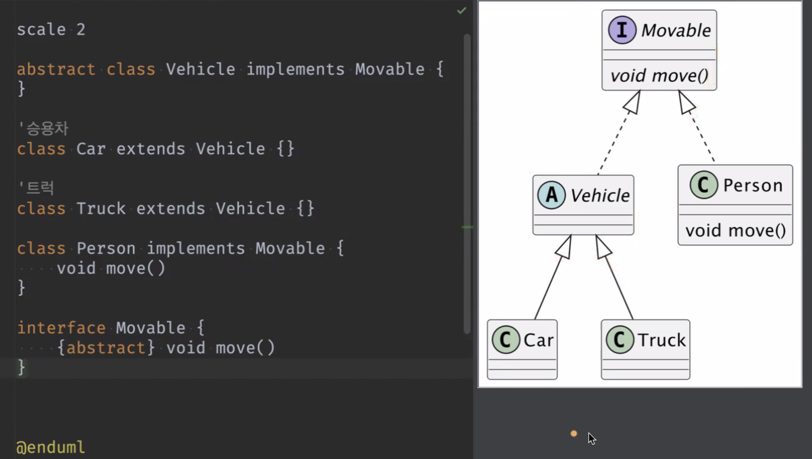

Date : 240313

## 숙제검사
- 리턴이 없고 상태가 변하지 않는 함수들은 테스트 해보지 않아도 된다.  
  프린트문만 있고 클래스 내부 속성을 변경하지 않는다면 하지 않아도 괜찮음. 변하는 값이 없기 떄문에.
- 코드정리의 중요성
  - 협업 시 띄어쓰기나 줄바꿈만 있는 불필요한 커밋을 하게 되면 누를 끼칠 수 있으니 사전에 코드 정리해서 커밋 할 것!
- 삼항연산자는 리턴 할 값이 있을 경우 사용한다. 리턴값이 없는 경우는 if 문으로 사용해야 한다.  
    - 조건분기에 따른 값 반환 -> 삼항연산자  
    - 조건분기 처리 -> if 문  
    [> 삼항연산자에 대한 공식 문서 보기](https://dart.dev/language/operators#conditional-expressions)
- 
----
## 추상 클래스와 인터페이스를 쓰는 이유?
- 휴먼 에러를 방지하기 위해 사용한다. 
- 나 뿐만 아니라 다른 개발자도 문서를 통해 규칙이나 유의할 점을 남기는 대신, 약간의 틀을 만들어 효율 좋게 안심하고 이용 할 수 있도록 하기 위함.
- 또한 다형성을 지원하여 효율성이 높아진다. 
- 다형성이란, 하나의 물건을 다양한 형태로 사용 하는 것과 비슷하다고 볼 수 있는데,
  예를 들어 고양이와 강아지 클래스는 '동물' 이라는 기본적이고 공통적인 성질을 가지므로 '동물' 클래스를 가지고 '고양이'와 '강아지' 클래스를 만들어 사용할 수 있다. 이렇게 동물 클래스 처럼 다양한 형태로 사용 되는 것을 다형성이라고 한다.

   
## 추상 클래스 (Abstract class)

- extends를 쓰는 자식 클래스가 내용이 미정의 된 함수를 반드시 오버라이드 했으면 좋겠을 때 사용한다.
- 상속의 재료로 사용되는 클래스
- 상세 부분이 미정의 된 클래스
- 인스턴스화 금지
- 다계층의 추상 상속 구조
  - uml 에서 이름이 기울어져 있는 것은 추상클래스, 추상 메소드 
  - 하나라도 추상 메소드가 있으면 추상 클래스.
- 추상클래스를 상속받고 오버라이드 안 할 경우 해당 클래스도 추상으로 만들어야 한다. 왜냐면 아직 미완전한 상태라고 보므로.
- 추상에 추상클래스를 사용해서 일반클래스를 만들게 된다.
- 상속의 이유 : 기능의 확장.
- 가장 최종적으로는 일반클래스
   
## 인터페이스 (Interface)
- 특징을 정의하여 기능만 정리해 놓은 것 => 어떤 동작을 하려고 할 때 필요한 기능들을 명시해 놓은 것 이라고 이해할 수 있겠다.
- 모든 메소드는 추상 메소드여야 한다.
- 필드를 가지지 않는다.
- 다트3부터 interface 키워드가 추가됨. 인터페이스를 부모로 두는 자식 클래스 정의에 implements를 사용한다.
- 여러 인터페이스를 상속하여 부모로 둘 수 있다.
- 인스턴스화 불가능.
- 인터페이스는 특별하게 같은 인터페이스를 구현한 클래스는 공통 메소드를 구현하고 있음을 보장한다.
- 클래스들 사이의 규칙을 정의 한다. 선언된 메소드는 반드시 구현해야 함.

  ~~~
  abstract interface class Human{
    void speak();
    void jump();
  }

  // interface는 implements를 써서 상속받는다.
  class Korean implements Human{ 
    @override
    void speak(){}
    @override

  }
    // 다중 상속의 예
   class SuwonCleaningService implements CleaningService, Store{

   }

  ~~~
    
## 추상 클래스와 인터페이스의 차이
- 추상클래스 -  상속  -  Is a 관계  -  부모 타입 구체화 및 기능 확장이 목적  
- 인터페이스 -  구현  -  Has a 관계 -  같은 기능 구현 강제가 목적  
   
----

## implements와 extends의 사용 방법 정리

  ~~~
  // 앗? 근데 이렇게 extends가 가능 해버린다. 인터페이스는 이렇게 안쓰려고 만들어진건데..?
  // 공식 문서가 이상하다...  
  
  abstract interface class Human{
    void speak();
    void jump();
  }
  class Korean extends Human{} 

  // 그렇기 때문에 우리 만의 약속을 하자!! 
  // 언젠가 공식문서처럼 바뀔 수도 있으므로 미리 리팩토링 방지를 위해...

    // 클래스
    class Person{}

    // 인터페이스 
    abstract interface class Human{}

    // 추상클래스. implements는 인터페이스만 
    abstract class Korean extends Human implements Human{}

    class Dancer extends Character implements Human{}
    //  => 캐릭터 추상클래스를 상속받고, 휴먼 인터페이스를 임플리먼트 했다. 
    // 라고 해석 할 것.

    // 인터페이스는 구현한다, 추상클래스는 상속한다 라고 표현하자.
  ~~~
    
  - uml로 본 추상클래스와 인터페이스 설계도
  
  

     
  - 내가 그려본 설계도
  

   

----
>### 더 알아보기
- 데드락이 뭘까?
  - 교착상태. 두명이서 에어팟 하나 가지고 서로 양쪽 듣고싶어서 안놓고 있는 상태.
  - dart에서는 데드락이 발생하지 않는다. 왜지? 
    - dart는 단일 스레드 모델이라 하나의 스레드에서 실행되므로, 여러 스레드 간의 경쟁/잠금으로 인한 데드락이 발생되지 않는다.
    - 또한 비동기 프로그래밍을 지원하기 때문에 입출력/네트워크 요청과 같은 블로킹 가능성이 있는 작업을 핸들링 가능하다.
    - 동시성 모델인 issolate도 있는데, 자체 메모리 공간을 가지며 물리적으로 별도의 스레드로 분리되어 실행되므로 데드락이 생기지 않는다.
  
- 경쟁 상태란? (Race Condition)
  - 공동 금고에서 여러 곳에서 동시에 돈을 넣고 빼려는 작업을 했을 때 영향을 줄 수 있는 상황. 

