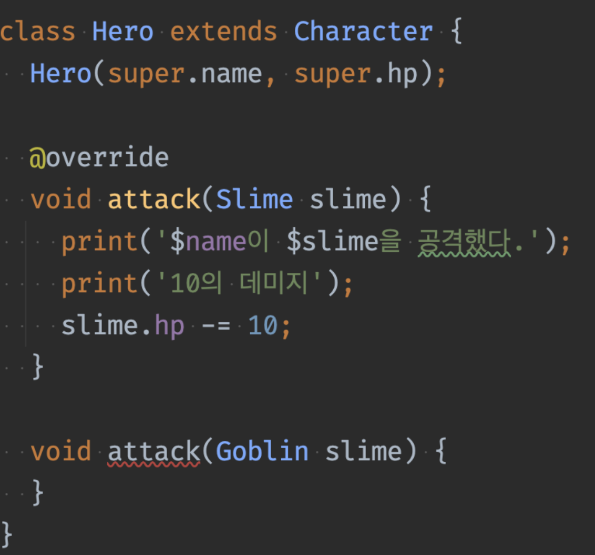

Datd : 240314

## 숙제검사
- 연습문제 4 번, 인터페이스의 getter,setter를 상속하는 방법 풀이
~~~dart
abstract class TangibleAsset extends Asset implements Thing {
  String color;
  @override
  double weight;

  TangibleAsset(
    this.color,
    this.weight, {
    required super.name,
    required super.price,
  });

  /// 타당성검사를 하지 않는다면 아래 오버라이드한 코드들은 사실상 의미가 없다. 
  /// 왜냐면 사실상 weight라는 값을 핸들링 하는 동작이 없고 단순히 쓰고 읽는 동작이 전부라서, 굳이 private으로 할 필요 없이 pubilc으로 하고 인터페이스에 구현된 getter/setter를 오버라이드 하는 대신, 변수에 오버라이드를 붙여주면 된다!

  // @override
  // set weight(double value) {
  //   _weight = value;
  // }
  //
  // @override
  // double get weight => _weight;
}
~~~
----
## 다형성 Polymorphism
- 어떤 것을 이렇게도 볼 수 있고, 저렇게도 볼 수 있는 것.
- interface 정의
- 재사용성, 강제성을 가짐
- interface나 추상클래스를 부모로 둔 클래스의 경우, 선언은 상위 개념으로, 인스턴스 생성은 하위 개념으로 한다.

  
    ~~~dart
    // 추상적인 선언 = new 상세 정의
    Thing book = Book(); 
    TangibleAsset tangibleAsset = Book(); 
    
    ~~~
    이런식으로 상위 개념을 타입으로 선언하고 인스턴스 생성을 하위 개념으로 할 수 있다.  
    이 경우 컴파일러 한테는 선언한 상위 개념의 코드만 보이게 되므로 다른 클래스로 인스턴스를 생성하더라도 선언한 개념이 타입이 되어버린다.
    - 예시
    ~~~dart
    abstrac class Monster{
        void run(){ 
            print('');
        }
    }
    Slime = Slime('A');
    Monster monster = Slime('B');
    slime.run();
    monster.run(); 
    
    // 결과는 monster의 run 이 아니라 slime의 run이 찍힌다.
    // 실체는 Slime이다. Monster는 별명.
    ~~~

- 인터페이스 다중 상속
    ~~~dart

    abstract interface class Moveable {
	void move(int seconds);
    }

    class Car implements Drawable, Moveable{}

    ~~~
   인터페이스 다중 상속을 한 클래스이더라도 상속한 인터페이스 중 하나로 선언하여 해당 클래스의 인스턴스를 만들면
  선언한 인터페이스에 해당되는 기능만 사용 가능 하다.  
  왜 그렇게 할까? 기능별로 인스턴스를 모을 수 있기 때문에 편리하게 사용하기 위해서.
  

 - 타입 캐스팅이란?   
   - 한 데이터 타입을 다른 데이터 타입으로 변환하는 것.  
   - 더 큰 개념으로 선언하는 것.
  
  ~~~dart
  Monster monster = Slime('B');
  Slime slime = monster as Slime; // 타입 캐스팅

  ~~~
 - dart는 메소드 오버로딩을 지원 하지 않음
   - 같은 메소드의 이름을 중복해서 쓰지 못한다.
   

 - 인터페이스에 꼭 메소드를 추가하지 않아도 된다. 아무것도 없어도 됨. 묶기 위한 용도 만으로 사용되기도 한다.

  
     

>### 더 알아보기
---- 

- smart cast 란?
  - 코틀린에서 사용되는 용어로, 컴파일러가 변수의 타입을 검사 후 해당 변수를 자동으로 캐스팅 하는 기능.
  - dart에서도 비슷한 기능이 있다. 아래는 그 예시.
 ~~~dart
    void process(dynamic value) {
    if (value is String) {
        print(value.length); // 여기서 value는 자동으로 String 타입으로 캐스팅
    }
  }
 ~~~