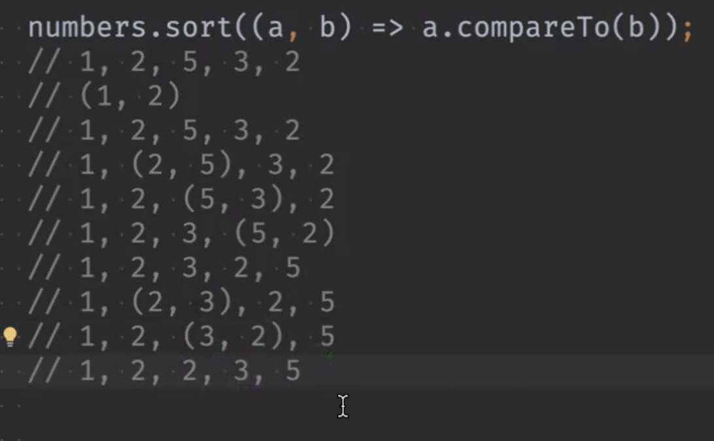

## 숙제 발표
- 추상클래스와 인터페이스 중 어느 것이던 상관이 없을 땐 인터페이스를 쓰는 것이 확장 개념에서는 좋다. 더 유연하기 때문에.
----
> ## 인스턴스 기본 조작
- 오브젝트
  - final 이 들어간 클래스는 상속하지 못한다. 
  - 암묵적으로 모든 클래스는 Object를 상속한다.
  - 따라서 Object의 모든 변수와 메서드를 조작할 수 있다.
  ~~~dart
  
  // dynamic은 불가능. 다이나믹은 없는 것도 되게 해놓은 고삐풀린 망아지. 근본이 없다.
  dynamic d = person;
  dynamc d = 10;
  dynamc d = 10.5;
  dynamc d = 'ttt;
    
  // Object는 가능하다. 근본이 있다.
  Object o = person;
  o = 10;
  0 = 10.5;
  o = 'tttt';
  ~~~
- 다이나믹과 오브젝트의 차이 
  - 다이나믹은 뭐든지 넣어도 호출이 가능하다. 그래서 불안정 하다.
  
    > dynamic과 var의 차이점?
      - var의 경우 추론된 타입이 한번 입력되고 나면 다른 타입을 저장 할 수 없다.
      - dynamic은 어떤 형식이라도 항상 입력이 가능하다.

- toString()
  - 오버라이드 하여 원하는 결과를 얻도록 수정할 수 있음
  - 객체를 표현하기 위한 용도.
  - 프린트 문에서 toString()을 안넣어도 암묵적으로 있다고 생각하고 호출해준다.
  - instans of 객체 로 표현되는 것을 자세히 하고 싶으면 해당 클래스에서 toString 함수를 재정의하여 만들어준다.
  
- == 연산자를 오버라이드 하지 않은 객체의 취급
  - set에서 remove -> 1개
  - print(h1 == h2) // false 
  
- Set 과 Map의 동작 원리
  - Set, Map 계열은 요소를 검색할 때 hashCode 를 사용하여 빠르다. List는 순차검색이라 느리다.

  - 모든 객체는 해시값을 가진다
  - 동일한 객체는 항상 같은 해시값을 가진다.
    > set이 검색이 빠른 이유?
      - 해시코드 기반으로 검색하기 때문에 빠르다.
  - 해시코드는 객체를 표현하는 방법 중 하나.  
   정리 : 해시코드는 오브젝트 클래스 안에 해시코드, toString, ==(operator) 가 있는데, 그 중 하나로써 모든 객체들이 들고있다.
   해시코드는 숫자라서 비교 검색할 때 리스트보다 빠르다. 리스트느 순차검색이라 느리다.
  - 맵도 해시코드 기반이다.
  - 오퍼레이터, toString, 해시코드는 세트로 같이 간다. 오버라이드 해서 재정의 할 때는 세개를 모두 재정의 해야 한다.
  - 동일한 객채는 항상 같은 해시값을 가진다.
  ~~~dart
     // 진짜 주소 비교 메모리 후벼 파면서 비교해야할 때 사용
     identical(h1,h2) 
     // 일반적인 개발할 때 사용
     hashcode 
  ~~~
  - 리스트에서 요소 정렬
  ~~~dart
    - sort() // 순차정렬
    - sort((a,b)=>a.compareTo(b));  
  ~~~
    이미지와 같이 리스트의 순서대로 처음과 끝을 비교하면서 정리한다.
    

- sort() 규칙을 바꾸고 싶을 떄?  

    ~~~dart
      // comparator 메소드. 실제 리스트의 값을 변경시킨다.      
      sort((a,b)=>a.compareTo(b)* -1); 

      // reversed 는 프로퍼티. getter. 실제 리스트의 값을 건들지는 않는다.
      numbers.reversed; 
      Comparable.compare('a','b'); // 같은 동작을 함
      ~~~

 -  Deep copy
         -  쌍둥이 객체를 만드는 것.  
      ~~~dart
        int num = 10;
        int num2 = num; // 얕은 복사
        
        // copyWith을 클래스에 만들면 그대로 객체를 복사 해 올 수 있다.
        Hero clone2 = Hero(name : 'mimi', hp: hero.hp);
        Hero clone = hero.copyWith();
      ~~~
       

>## 더알아보기  

  ### 객체지향 세미나 내용
    객체지향 왜 쓰는가?
        - 코드 비용, 코드 읽기/쓰기/수정/삭제 
    - 비용이 적은지, 변화 여파가 큰가 등
    - 캡슐화 : 하나의 목적을 위해 필요한 데이터나 메소드를 하나로 묶는 것
    - 개체의 상태를 숨기고 행위만 노출하는 것. '행위'만 노출 하는것이 핵심. 정보 은닉은 따라오는 것.
    - 왜 하나? 
      - 협력을 단순/유연하게 (커피를 주문하면 -> 사장이 커피를 내린다. 사장이 힘들어서 기계를 들인다. -> 비용 감소)
      - 수정의 비용 감소(다형성)
    - 무엇을 공개해야 하나?
      - 프로퍼티는 왠만하면 숨긴다. => 일반적이지만 다트 문법 상 그렇게 해주는 문법이 있다.
      - 메소드도 다른 객체와 협력에 필요한 것만 노출시키고, 내부적으로 돌아가는 메소드는 숨기는 것이 좋다.
      - 두 객체가 협력해야하는데 공개해야하는게 뭘까? 하고 생각해보고 설계할 것
      - 프로퍼티가 행위의 일부일 경우? getter/setter 가 목적 자체 일 경우 이름을 포괄적으로 정하자.
    - 추상화
      - 목적: 역할정의= 타입계층구축
      - 공통점 모아서 중복 코드 피하기
      - 방법 
        - 추상클래스 : 같은 혈통/신분 => 같은 속성, 메서드
        - 인터페이스 : 필수적인 행위
      - 상속
        - 메소드 변수 물려받되, 커스텀 가능
        - 추상클래스 상속 
          - 공통 속성 - 같은 타입 다형성
          - 기능 확장
        - 인터페이스 상속
          - 같은 동작 수행 보장 - 다형성
          - 상속이 너무 많다면 추상화를 잘못 했을 수 있음. => 구현체에서 중복된 인터페이스를 많이 받고 있을 경우 상위 클래스에서 묶을 수 있다는 말
            - 강사님 의견 : 작은 인터페이스들을 하나로 묶는 인터페이스를 만들어서 쓰면 더 유연하게 수정이 가능하다.
        - 다형성
          - 하나의 객체가 여러 타입을 가질 수 있는 것 -> 타입캐스팅
          - 목적 
            - 하나의 요소(객체, 메서드)가 다양한 형식에 속할 수 있는 것.
            - 하나의 타입에 여러 객체
            - 하나의 객체가 여러 타입 가능
            - 객체 자율성 증가
            - 구현방법
              - 오버로딩
              - 오버라이딩 : 상속 후 재정의
              - 함수형 인터페이스 
            - 클래스가 객체지향이냐?
              - 그건 아님. 구현 방법일 뿐.
              - 객체지향은 큰 패러다임이고 클래스는 방법론 중 하나
          -(+) 타입캐스팅이 비용이 더 드니 쓰면 안좋다에 대한 의견
            - 비용을 더 써서 안전하게 가냐(휴먼에러 감소), 성능이 중요하면 타입캐스팅을 줄여야 할 수도 있고.
            - 코드가 읽기 좋고 실수가 적은 코드를 위해서는 써야 할 수도 있다.
            - 안정적 vs 성능 => 상황에 따라 결정 할 것