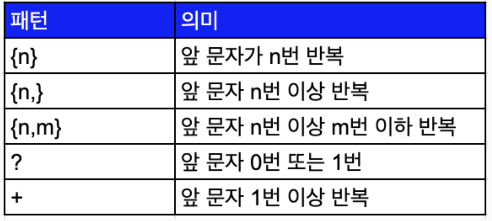
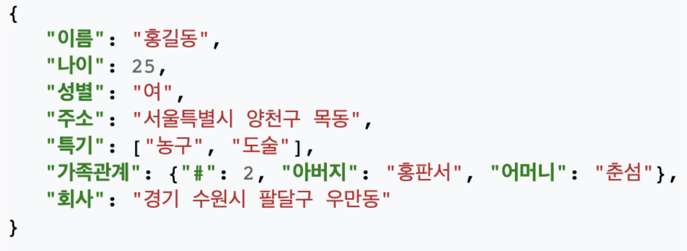
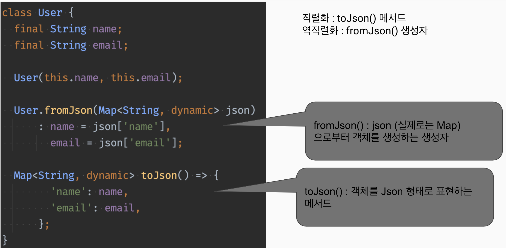

Date : 240319

## 숙제검사
- 금고 문제
~~~dart
    // class StrongBox<ITEM>{} 제네릭 속 이름은 마음대로. 보통 대문자로 표시하는 것이 가독성이 좋음.    
    
    enum KeyType{
        // 소문자가 규칙
        padlock,
        button,
        dial,
        finger,
    }

    class StrongBox<T>{
        T? _tresure;
        final KeyType _keyType;
        int _count = 0;
        int _keyCount;

        // 방법 1 생성자에서 키 카운트 값 받기
        StrongBox({required KeyType keyType}) : _keyType = keyType {
            switch(keyType){
                case KeyType.padlock:
                _keyCount = 1024;
                case KeyType.button:
                _keyCount = 1000;
                case KeyType.dial:
                _keyCount = 30000;
                case KeyType.finger:
                _keyCount = 1000000;
            }
        };

        void put(T treasure){
            _treasure = treasure;
        }

        // 방법2 get 함수에서 switch 문을 사용하여 키 카운트 값을 대조한다.
        T? get(){

            int keyCount;

            // 기본 switch 문. break는 필요 없음.
            switch(_keyType){
                case KeyType.padlock:
                _keyCount = 1024;
                case KeyType.button:
                _keyCount = 1000;
                case KeyType.dial:
                _keyCount = 30000;
                case KeyType.finger:
                _keyCount = 1000000;
            }

            // switch 문 패턴매칭 문법
            final keyCount = switch(_keyType){
                case KeyType.padlock => 1024,                
                case KeyType.button => 1000,
                case KeyType.dial => 30000,
                case KeyType.finger => 1000000,
            };

            if(_count < keyCount>){
                _count++; 
                return null;
            }

            return _treasure;
        }
    }
    
~~~

- subString(1, 2);  =>  start 포함, end 불포함. 시작번째 문자부터 마지막 번째 직전 문자까지만 뽑는다.  
  
--- 
   

>## 정규표현식 (Regular Expression)
- 특정한 규칙을 가진 문자열의 집합을 표현하는데 사용하는 형식 언어

  
~~~dart
    // 첫 글자가 영어로 시작하는  A~Z, 0~9 사이의 8자리 문자
    RegExp(r'[A-Z][A-Z0-9]').hasMatch(string);

    // 비교하고자 하는 문자와 같지 않으면 false
    RegExp(r'Dart').hasMatch('Dart'); // true
    RegExp(r'DartDart').hasMatch('Dart'); // false
    RegExp(r'dart').hasMatch('Dart'); // false

    // '.' 온점을 사용해서 임의의 문자가 들어갔다고 가정하여 비교한다.
    RegExp(r'D.rt').hasMatch('Dart'); // true

    // '*' 을 사용하면 바로 앞에 위치한 글자를 0회 이상 반복됐는지 확인
    RegExp(r'Da*t').hasMatch('Daaart'); // true
    RegExp(r'.*').hasMatch('abcd한글011'); // true
    RegExp(r'Da.*').hasMatch('Dart'); // Da로 시작하는 문자열
    RegExp(r'.*rt').hasMatch('Dart'); // rt로 끝나는 문자열

    s.split(RegExp(r'[,:]')); // 콤마나 세미콜론 두개 중의 하나로 문자열을 분리한다
    s.replaceAll(RegExp(r'[beh]'), 'X'); // b, e, h 글자를 X로 바꾼다
~~~
-  { } : 지정횟수만큼 반복  
  
      

- '[ ]' : 어느 한 문자  
     <예시> UR[LIN] : 첫번째 문자는 U, 두 번째 문자는 R, 세 번째 문자는 ‘L, I, N’ 중 하나
- [ - ] : 지정 범위 중 한 문자 
  ~~~dart
    RegExp(r'[a-z]{3}').hasMatch('url'); // true
  ~~~
- ^ : 맨 앞 | $ : 맨 뒤  
    <예시> "^j.*p$" => 맨 앞 글자가 j, 맨 뒷 문자가 p 인 문자열. 

    
>## 예외 (Exception)
- 에러 종류와 대응책
    - 문법 에러 (syntax error)
    - 실행시 에러 (런타임 에러)
    - 논리 에러 (로직 에러)
- 예외 처리는 런타임 에러에 대한 대처를 하는 것이다.
- 예외 상황들
  - 메모리부족
  - 파일 찾을 수 없음
  - 네트워크 통신 불가 등  
  
- try catch 문
  ~~~dart
    void main(){
        try{
            
            someError();
            // 여기서 에러가 나면          

        }catch(e){
            // 이 볼록에서 예외를 처리
            print('이상한 문제 발생 !');
        } finally {
            print('무조건 실행 코드');
        }
    }
  ~~~
  - rethrow 
    - 에러 처리를 미룸. 
    - 에러가 난 함수를 호출한 함수에다가 에러 처리를 미뤄버린다. 호출지에서 예외 처리 되어있으면 거기서 에러 예외 처리가 됨.
  - finally
    - 에러 여부와 상관 없이 무조건 마지막에 실행되는 구문 
  - throw 
    - 임의로 예외 발생시킬 수 있음
- 예외 클래스를 상속하여 오리지날 예외 클래스를 정의할 수 있다.  
  
    ~~~dart
    class NetworkException implements Exception{
        final String? _message;

        NetworkException([this._message]);

        @override
        String toString(){
            if(_message == null) return 'Network Exception';
            return 'NetworkException: $_message';
        }
    }
    ~~~
     
  
>## 파일 조작
-  기본 순서
   -  1. 파일을 연다
   -  2. 파일을 읽거나 쓴다
   -  3. 파일을 닫는다.
  ~~~dart

    // 파일을 쓰고 닫는다. FileMode.append 추가로 입력 하겠다는 뜻
    file.writeStringSync ('\nHello \tworld', mode: FileMode.append); 

    file.readAsStringSync();
  ~~~
      
> 💡 알아두면 좋은 정보  
   ### escape 시퀀스
    \n: 줄 바꿈(개행)  
    \t: 탭  
    \r: 캐리지 리턴  
    \\: 백슬래시 자체  
    \': 작은 따옴표  
    \": 큰 따옴표  
    \b: 백스페이스  
    \f: 폼 피드  
    \uXXXX: 유니코드 문자 (16진수)  

----
   

>## 여러가지 데이터 형식
-  CSV (comma-separated values)
   -  데이터를 콤마로 나눈 형식
    ~~~dart
    String str = "gini, mikey, nini"; // split()을 사용하면 콤마를 구분자로 처리 가능
    ~~~
    [> csv 라이브러리 활용](https://pub.dev/packages/csv)

- 프로퍼티 형식의 파일 읽기
  - 프로퍼티 클래스를 사용하여 키-값 쌍으로 읽고 쓰기가 가능
  ~~~dart
  heroName = 홍길동
  heroHp = 100
  ~~~
  [> properties 라이브러리 활용](https://pub.dev/packages/properties)

- XML 형식 (Extensible Markup Language)
  - <> 태그를 활용한 기술 방식
  - 포함관계 기술 가능
  - DOM Parser, SAX Parser 등을 통해 파서를 제작해야 함
  ~~~xml
  <note>
  <to>Tove</to>
  <heading>Reminder</heading>
  <body>blah blah blah </body>
  </note>
  ~~~
  [> xml 파서 라이브러리 활용](https://pub.dev/packages/xml_parser)

- JSON 형식 (JavaScript Object Notation) 
  - 네트워크 통신에서 가장 많이 사용
  - xml에 비해 적은 용량
  - []로 리스트, {}로 객체를 표현
  - map 형태 (key:value)
    

> 직렬화? serialization / encoding (암호화)  
- 데이터 구조나 객체 상태를 저장하고 나중에 재구성 할 수 있는 포맷으로 변환하는 과정.
- 객체를 파일의 형태 등으로 저장하거나 통신하기 쉬운 포맷으로 변환하는 과정을 의미
- 클래스 내부의 필드에 다른 클래스가 있다면 모두 직렬화 처리를 해 줘야 함.
  
  - 클래스 <-> Json 
  - 역직렬화 desirialization / decoding (복호화)
  - 직렬화 : toJson() 메서드
  - 역직렬화 : fromJson() 생성자  
  - 실제로 서버에서는 json이 String 으로 들어온다. 따라서 json으로 decode 해주어야 함 => jsonDecode() 함수 사용
  - Map을 Json 형태의 String 으로 변환 => jsonEncode()  
     
  
