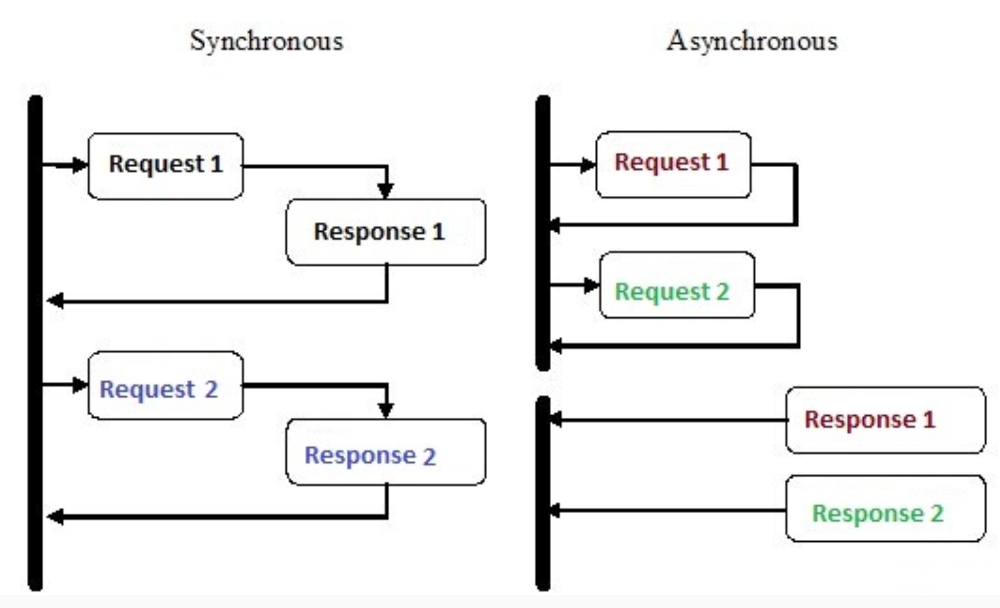
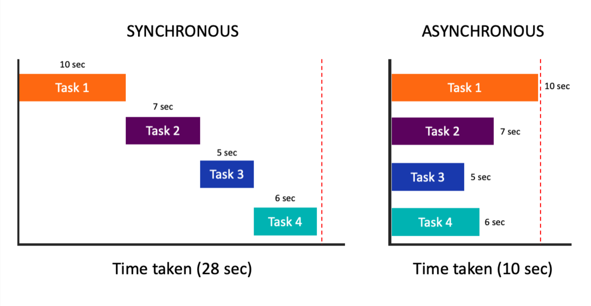
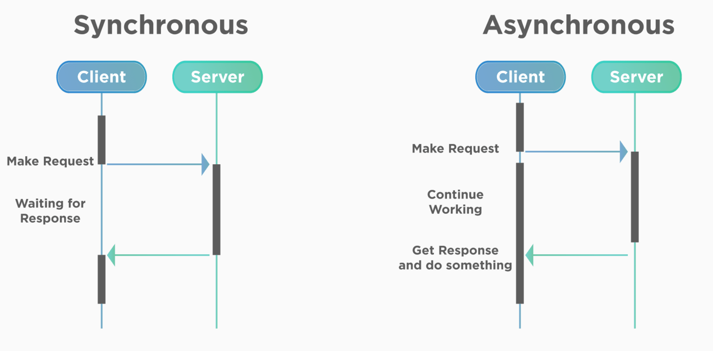
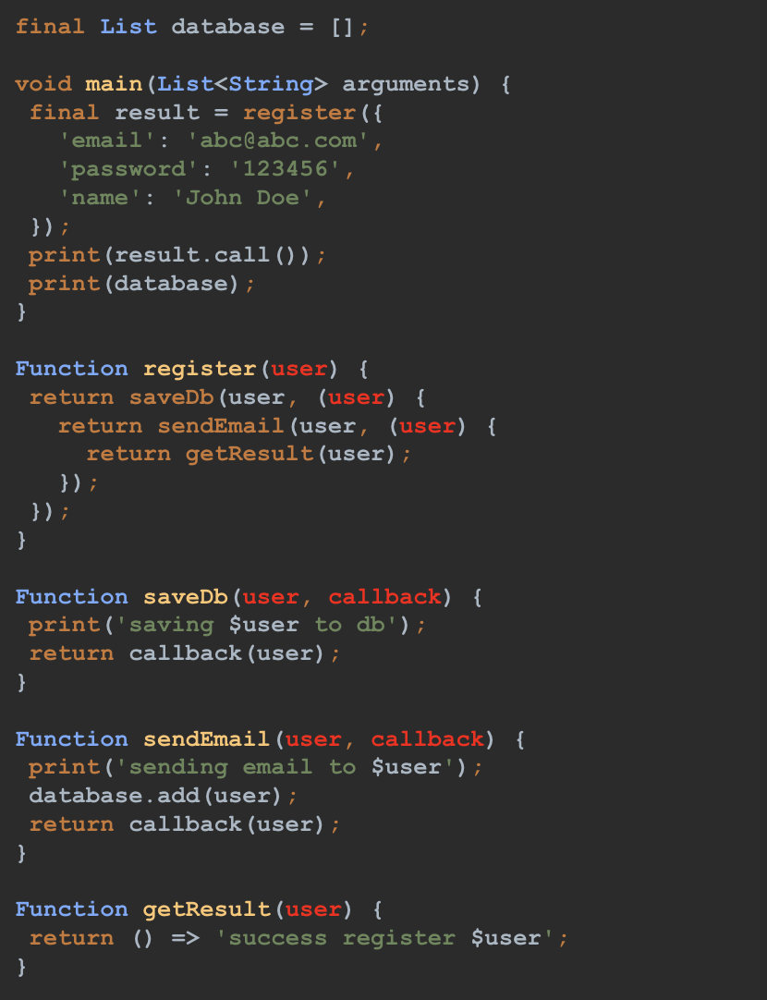
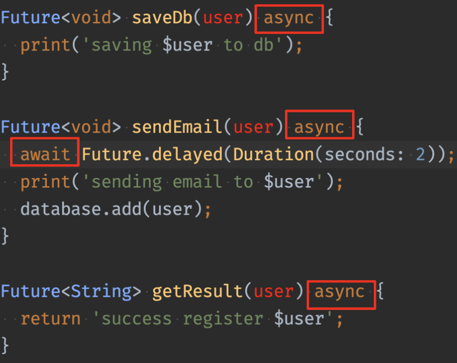
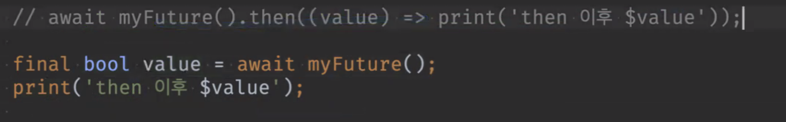
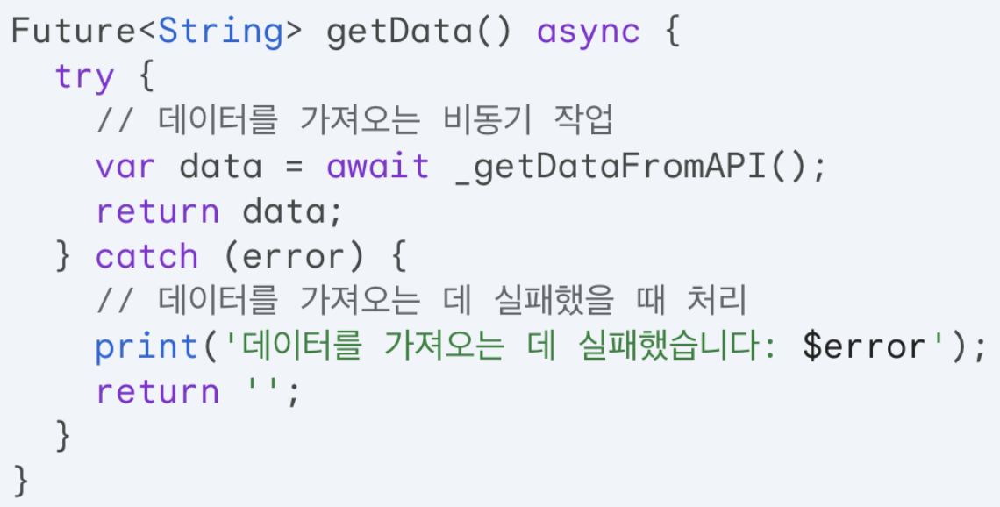
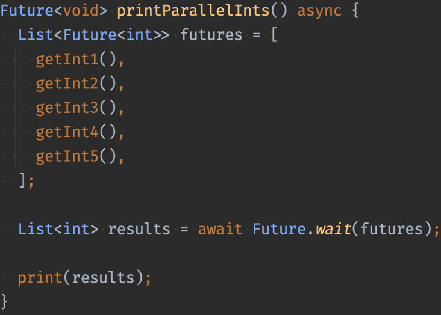
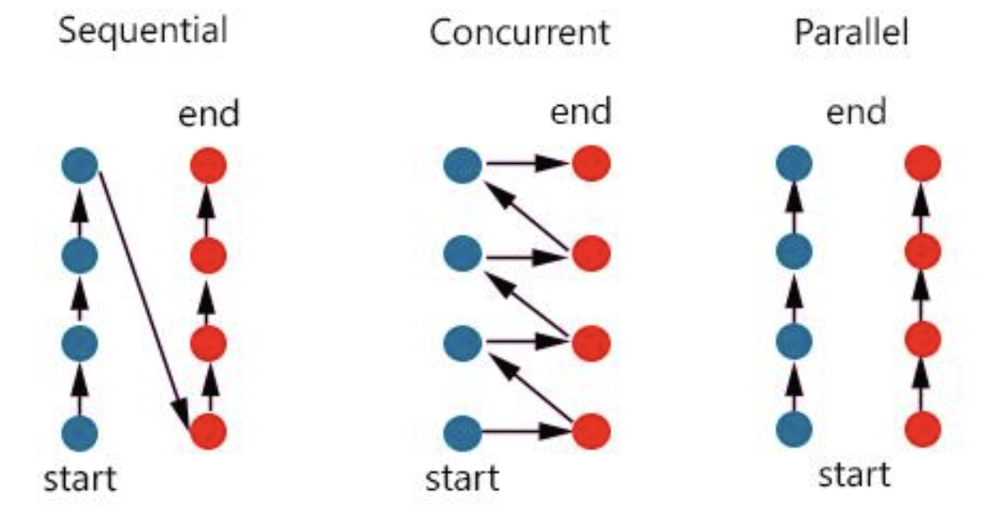

Date : 240321
## 숙제검사

- 일반적으로 함수형이 더 느릴 가능성이 크다. (람다식)
- 그래도 함수형을 선호하는 이유는 예외가 생길 가능성이 적기 때문에. 휴먼에러 방지.
- 면접관이 나를 궁금하게 만들어라. 

----
  

>## 동기 프로그래밍
>- 동기 프로그래밍 (sync)
>- 코드가 순서대로 실행된다.
>- 작업이 완료될 떄 까지 프로그램이 중단 될 수 없다.
>- 모든 작업은 이전 작업의 실행이 완료될 때 까지 기다려야 한다.  

>## 비동기 프로그래밍
>- 임의의 순서로 또는 동시에 작업이 실행될 수 있다.
>- 비동기를 처리하는 방법에는 콜백, Future, async - await 방식이 있다.
>- 비동기에서 : 날씨 주세요 + 로딩중표시 => 날씨 받고 + 로딩 종료

   

>### 콜백 함수  
    비동기는 현재 코드의 실행 결과를 받지 않고 이후 코드를 수행하는 기법이다.
    컴퓨팅 자원을 효율적으로 사용하는 기법이지만 정확한 순서를 지켜 수행해야 하는지를 고려해야 한다.  
    비동기 코드를 순서대로 실행하는 가장 일반적인 방안으로 콜백(Callback)이 있다.
    콜백은 실행 가능한 함수를 인자로 전달하여, 특정 상황이 발생할 때 호출되게 하는 방식이다.

    현실 세계에서 콜백의 예시 :
    음식을 주문하고 진동벨을 가지고 기다리면 음식이 준비되면 손님을 호출(Callback)하는 상황

- 콜백함수 작성해보기  

- 이런 콜백 함수가 많이 생기면 깊이가 너무 깊어지고 너무 복잡해져 휴먼에러가 나기 쉽다.  
  그래서 dart에서는 Future을 쓴다. 
  

> Future
  - 자바스크립트의 Promise에 대응.
  - 미래에 받아올 값을 의미. 미래에 완료되는 객체
  - 작성법
    ~~~dart
     final delay = Future.delayed(Duration(seconds:2));
    ~~~

    Future 함수는 함수 본문 앞에 async 키워드를 지정해 줘야 한다. 
    대기하고 싶은 비동기 함수를 실행할 때 await 키워드를 사용해주면 코드를 작성한 순서대로 실행된다.

    
  - await   
      Future 함수가 끝날 때 까지 다른 함수가 기다리게 하는 키워드. async함수 안에서만 가능하다. 

  -  Future의 예외처리
      ~~~dart
      // 예외 발생시키기
      await Future.error(Exception('error save db')); 

      // 에러처리
      saveDb(user).catchError((err)=>print('err'))

      saveDb(user).catchError((err)=> throw Exception('err'))

      ~~~
-  whenComplete() : 비동기 처리의 성공, 실패 여부와 관계 없이 끝나면 실행되는 함수
   ~~~dart
     saveDb(user).whenComplete(()=>print('완료!'));    
   ~~~
      
> then()
- Future 함수는 결과를 then() 함수를 통해서 받을 수 있다.  
- then() 함수로 전달되는 콜백 함수에 다음에 실행할 코드를 작성하면 된다.  
- 다음 코드가 Future라면 계속해서 then() 을 이어서 결과를 전달받을 수 있다.  
- 불필요한 인자는 _ 를 쓰는 것이 관례이다.

   ~~~dart
   saveDb(user).then((_) => sandEmail(user))
               .then((_) => getResult(user))
               .then((_) => print(value))
   ~~~
- 모든 Future 함수에는 then이 붙을 수 있음. 잘 사용되진 않음.
  
   

-  then() 사용의 문제점
   -  결과 예측 어려움
   -  체이닝 방식이 만만치 않음
   -  로직 복잡해지면 적절한 예외처리하기에 용이하지 않음  
   => 즉, async-await 문법을 써라
 -  async-await와 try-catch 조합이 훨씬 가독성이 좋음.
  
  
 -  Future.wait()  
 

    -  동시에 작업을 수행하고 모든 처리가 끝날 때 까지 기다린다. 
   제일 오래걸리는 애 시간에 맞춰서 끝나기 때문에, 여러곳에서 받아온 데이터를 합쳐 하나로 가공해야 할 때 사용하면 좋다.  왜냐면 하나 하나씩 동작이 끝날 때 까지 기다리는 것 보다 이 방식이 빠르기 때문에 더 효율적이다.

> 병렬성
- 병렬 처리는 동시에 여러가지 일을 진행하는 것이다.
- Future에 await가 없으면 동시에 여러개 실행된다.  
  
> 동시성(concurrent)
  - 동시에 실행되는 것 같아 보임
 -  음악을 틀고 유튭을 틀면 동시냐? 아니다. Concurrent다. OS에서 시간을 쪼개서 교대로 일을 하라고 하는 것
 -  동시에 두 개를 하는 것이 아니라 엄청 빠르게 이 일 저 일을 왔다갔다하면서 처리한다.
 -  하나의 프로그램 당 하나의 프로세스를 가지는 것이 일반적이고 프로세스는 한번에 한가지 일 밖에 못하는데, 스레드는 프로세스 안에서 여러 일을 하도록 하는 일꾼 역할을 한다.  
  

   
      