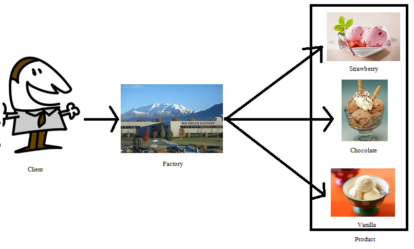
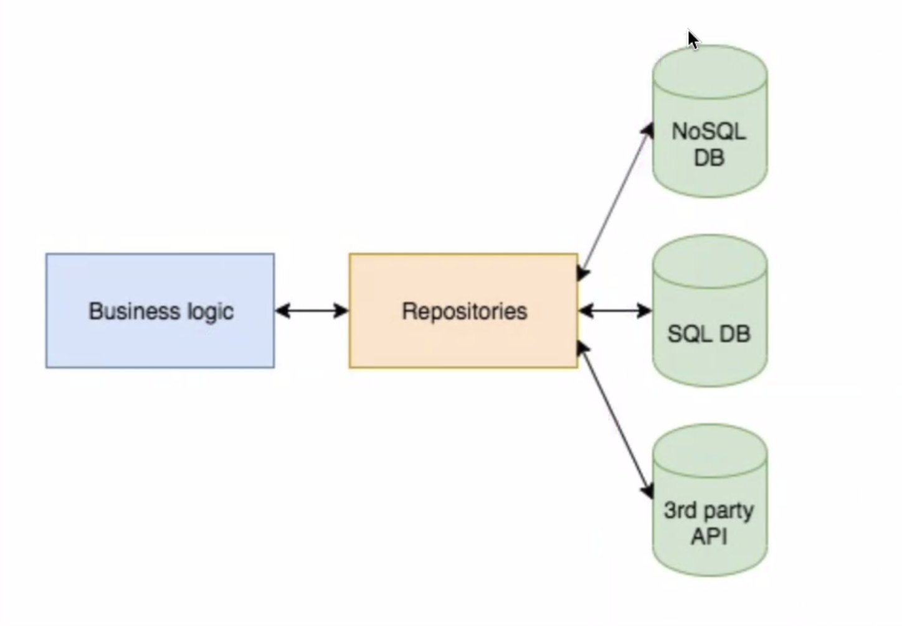

Date: 240326
## 과제 검토
~~~dart
// map, set의 동등성을 비교할 때 사용한다.
DeepCollectionEquality().equals(A, B); 

// 리스트 알맹이 동등성 비교시에는 equals()를 쓴다.
@override
  bool operator ==(Object other) =>
      identical(this, other) ||
      other is CollectionChart &&
          runtimeType == other.runtimeType &&
          collectionName == other.collectionName &&
          collectionSalePrices.equals(other.collectionSalePrices);
~~~

- xml 한글 깨짐 해결 방법
  ~~~dart
  utf8.decode(response.bodyBytes);
  ~~~
  Uint8List ? 메모리 그 자체. 데이터를 숫자로 늘어놓은 순수 데이터.

----  
   
>## Model class, Repository 개념
- 모델 클래스의 책임과 역할
  - 모델 객체 클래스의 속성에 대한 데이터를 '조회'할 수 있는 클래스
  - 별도의 기능을 가지지 않는 순수한 클래스
  - 데이터 소스를 앱에 필요한 형태로 변환하여 앱 개발을 편리하게 해 주는 역할
  ~~~dart
  // 일반 클래스
  class User{
    final String name; 
    final String email;
    
    User(this.name, this.email);
  }

  // 불변객체
  class User{
    final String name; 
    final String email;
    
    const User(this.name, this.email);

    @override
    String toString() => 

    // const를 붙인 생성자는 인스턴스 선언 시 const를 붙여서 생성할 수 있다.
    // const를 붙인 인스턴스를 여러개 만들면 재사용 하게 됨. 대신 필드 값이 똑같아야 재사용을 함. 다르면 메모리 추가됨.
    // const 객체일 경우 변수를 파라미터로 넣지 못함. 변수도 const라면 가능.

    final user1 = const User('mimi',10);
    final user2 = const User('nini',10);

    // => 해시코드를 만들면 동일한 값이 나옴.
    
    
    // immutable annotation
    @immutable // 를 붙이면 불변이 아닌 경우 에러 표시 됨.

    // factory 생성자. named 생성자 가능.
    // 이 경우는 fromJson이라는 이름을 붙인 생성자임
    factory User.fromJson(Map<String,dynamic> json){
        return User(json['name'], json['age']);
    }
    

  }
  ~~~
    - 모델 클래스 = view에 보여질 데이터를 담는 객체
   
        > 모델링 방법   
        - DDD (domain driven design)   
            - 도메인? 유사한 업무의 집합, 특정 상황(주문 결제 로그인)이나 특정 객체(유저, 손님)가 중심이 될 수 있음  
            - 모델 클래스 : 도메인을 클래스로 작성한 것  
            - 왜 클래스로 작성할까? 걍 json(map) 으로 하면 안됨? 불편하고 에러가 날 가능성이 크기 때문에 사용한다.  
        - ORM (Object relational maping)  
            - 데이터 소스가 DB인 경우 디비와 상호 보관
   
    - 새 인스턴스를 항상 생성하지 않는 생성자를 구현할 때 팩토리 키워드를 사용해라.   
     => 싱글톤 패턴을 쓰지 않으면 factory 생성자를 사용해도 새로운 인스턴스가 생성 된다.
    - 응용 예시 : factory패턴, singleton 패턴
      - 공장 : 물건을 만드는 곳
      - 팩토리 패턴 : 인스턴스를 만드는 패턴  

    - ### Factory 패턴

         

      - 아이스크림 만들어줘! > 공장 가동 > 아이스크림 종류별로 생산
      - 아이스크림 클래스를 맛 별로 인스턴스를 만들 수 있게 미리 자동화 기계를 들여놨다고 이해하면 되겠다.
        - 딸기맛 팩토리 함수, 초코맛 팩토리 함수, 메론맛 팩토리 함수... 
        - 언제든지 딸기맛 아이스크림 인스턴스를 한땀한땀 만들지 않고 편하게 생성할 수 있다.  
          => 수제 아이스크림에서 공장 아이스크림이 되는 셈!
  
    - ### 싱글톤 
      - 1개의 인스턴스만 생성되는 것을 보증하기 위한 패턴
      - 생성 여러번 시도해도 1개의 인스턴스가 공유됨
      - 캐시, 공유데이터, 처리 효율화 등에 사용되는 테크닉.
      - 차 하나를 돌려 쓴다.
      
  
    ~~~dart
    class RentCar{
        static final RentCar _instance = RentCar._internal();
        int _count =0;
        void increment(){
            _count++;
        }
        // 기본생성자. 따로 재정의를 하나도 안 했을 때 기본 생성자로 사용 가능.
        RentCar(); 
        // 프라이빗 생성자. 기본생성자는 외부에서 사용 불가.
        RentCar._원하는 이름(); 

        // 싱글톤 패턴. 내부에서 미리 생성해 놓은 객체를 반환해준다. 
        // const를 하지 않아도 동일한 객체이기 때문에 동등성비교를 하면 같다.
        // named를 써서 싱글톤임을 확실히 표시해준다. 
        factory RentCar.getInstance(){ 
            return _instance;
        }
    }
    ~~~

  
- ### repository 패턴 
    

  - 소프트웨어 개발에서 데이터 저장소에 접근하는 객체를 추상화하고, 데이터 소스와의 통신을 담당하는 객체를 캡슐화 하는 디자인 패턴.
  - 유지관리성 향상
  - 재사용성 향상
  - 테스트 용이성 향상
  - 확장성 향상
  - 데이터 액세스 추상화
  

- ### repository의 책임과 역할
    - 데이터 소스와 상호작용하여 데이터를 추가, 수정, 삭제, 조회 (CRUD) 하는 역할을 담당
    - 데이터 캡슐화
    - 데이터 추상화
    - 데이터 접근 제어
    - 예외 처리
- 소규모 프로그램에서 디비를 조작하는 레포지토리클래스의 예
    - 이 레포지토리는 실제 디비를 조작하지만, 외부에서는 알 수가 없다. => 데이터 조작 캡슐화
    - 데이터 소스를 주는 쪽에서는 가공 없이 전달받고, 앱 내에서 필요한 기능을 위한 맞춤형 데이터를 만들기 위해서는 레포지토리에서 가공한다.
    - 확장을 고려한 레포지토리 예시
      - 인터페이스 정의를 통한 추상화.
      ~~~dart
      // 인터페이스 가져와서 쓸 경우 Impl을 클래스 명에 붙인다. 사바사 컨벤션.
        class UserRepositoryImpl implements UserRepository{}
      ~~~
