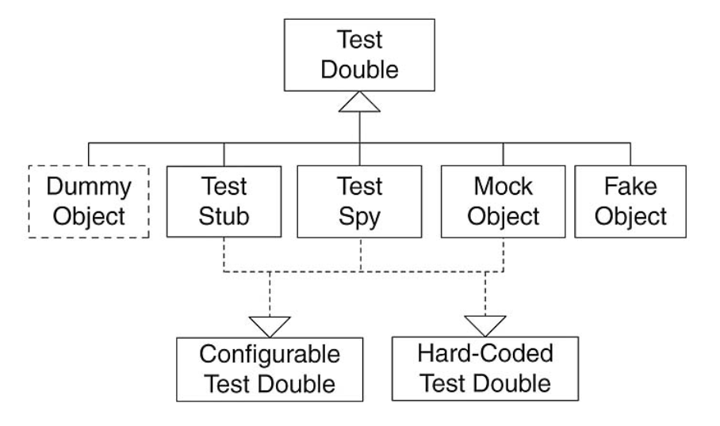
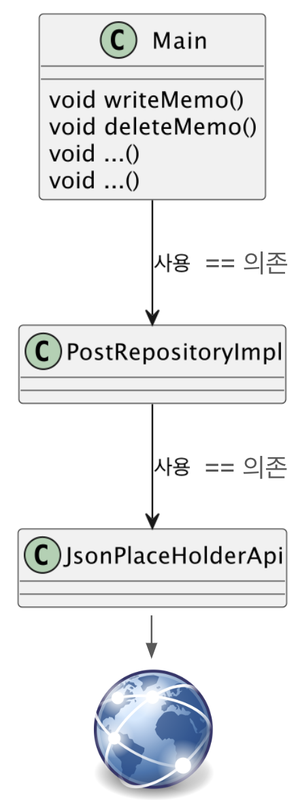

Date: 240327

## 과제 검토
- final 클래스는 상속 금지!
- 기능을 확장하고 싶을 땐 extension을 쓴다. 기존의 코드를 건드리지 않고 원하는 기능을 추가할 수 있다.
  ~~~dart
  /// String 타입에서 int 파싱이 가능하게 된다.
   extension test on String{ 
    int parseInt(){
        return int.parse(this); // 자기 자신을 던짐
    }
   }

    extension ListMapToListObj<T> on List<T>{
        
    }
  ~~~
  - 클래스 내부적으로 사용되는 기능은 프라이빗으로 막는다.
  ~~~dart
  class AlbumRepositoryImpl implements AlbumRepository{
    final Api _api = Api(); // 외부로 알릴 필요 없기 때문에 숨기기
  }
  ~~~
  - 중간에 리턴을 치면 로직이 가독성이 떨어지기 때문에 마지막에 리턴을 치는 식으로 짜면 흐름 보기가 좋다.
  ~~~dart
  List<Commnet> res = [];
    if(조건){
     res = 리스트;  // 조건 맞으면 중간에 리스트 갈아 끼고
    }
  return res; 
  ~~~
  
  ----
    
  >## Unit Test
  - 잘못된 개발의 완성 기준
    - 클래스를 만들었다고 완성이 아님. 
    - 올바른 완성 기준은 품질까지 보아야 한다. 클래스 개발은 절반 작성했더라도 실제 완성까지 4배정도의 시간이 필요할 수 있다.
  - 테스트를 통한 품질 완성
    - 수동 테스트, 단위 테스트, 통합 테스트
  - 테스트 방법론
    - 화이트 박스 테스트
      - 내부 구조와 동작에 중점을 두고 테스트
      - 코드 내부 로직, 제어 흐름, 데이터 흐름 등을 이해하고 검증할 때 사용
      - 테스트 케이스를 설계할 때 코드의 특정 부분 직접 확인
      - 주요 기법 : 구문 검사, 경로 검사, 조건/분기 검사 등
    - 블랙박스 테스트 (지금까지 작성한 테스트 코드 방법에 해당)
      - 소프트웨어 내부 구조를 무시하고 기능 테스트 하는 방법
      - 내부정보 알 필요 없이 사용자 관점에서 테스트
      - 테스트 케이스는 입력 값과 출력 값에 기반하여 설계
      - 요구 사항 충족 확인, 시스템의 기능적 및 비기능적 요구 사항을 테스트
      - 주요 기법으로는 등가 분할, 경계값 분석, 상태 전이 테스트 등
    - Unit Test 단위 테스트
      - 단위 테스트? 특정 모듈이 의도한 대로 잘 작동하는가를 테스트하는 가장 작은 단위의 테스트
      - 새로운 기능 추가 / 기존 기능 변경시 앱이 여전히 잘 동작하는지 확인
    - 단위(Unit) 테스트가 꼭 필요한 경우
      - DB
        - 스키마가 변경되는 경우
        - 모델 클래스가 변경되는 경우
      - Network
        - 예측한 데이터가 제대로 들어오는지
      - 데이터 검증
        - 예측한 데이터를 제대로 처리하고 있는지

    - 테스트 케이스
      - 동등 분할
      - 경계값 분석
      - 등등..
    - 테스트 더블
    
      - 테스트를 진행하기 어려운 경우 테스트가 가능하도록 만들어주는 객체
      - Dummy
      - Fake
      - Spy
      - Mock
      - 경계 : 모호하다. 그러므로 용어에 집착하지 말 것 => 통칭해서 Mock 이라고 하자.
    - Mock 객체 활용
      - 때때로 단위 테스트는 라이브 웹 서비스 또는 데이터베이스에서 데이터를 가져오는 클래스에 의존 할 수 있다.
      - 단점
        - 테스트 실행 속도 느려짐
        - 예기치 않은 결과 반환시 통과 테스트 실패하기 시작 할 수 있다.  
          -> 서버 점검하면 실패할 수도
        - 가능한 모든 시나리오 테스트가 어려울 수 있다. 
      - 테스트가 어려운 구조
        
        - 인터넷 이슈, 서버 이슈 => 테스트 불가능.
      - 테스트 용이성
        - 테스트를 편하게 하려면 인터페이스를 잘 써야 한다.
        - 의존성을 최대한 해소시키는 방향으로 형태를 잡아야 한다.
          - 밖에서 만들어서 가져오는 형태로
          - 클래스와 클래스 사이에서는 교체가 어렵고, 클래스-인터페이스 형태여야 교체가 가능하다.
        - 방법 1. 의존하는 클래스를 Interface 로 변경 가능 여부
        - 방법 2. 의존하는 클래스가 Mock 데이터를 주게 한다.
        - 방법 3. 변칙 클래스를 구현하기
          - 다트만 가능...
        - 좋은 Unit Test 6가지 조건 (FRIEND)
          - Fast (빠르고)
          - Reliable (믿을 수 있고)
          - Independent (독립적인)
          - Ease of Maintenance (유지 관리가 쉽고)
          - Nearly compacted code (거의 압축적인 코드)
          - Dependencies should be less (의존성이 적어야 한다)

---- 
> 오늘의 삽질
- json 파일을 읽어서 파싱하려고 할 때, 한글 때문에 에러가 나서 헤더를 달아 해결했다.
  ~~~dart
    class FakeHttpService implements CustomHttpClient {
    @override
    Future<String> get(String url) async {
      return http.Response(await _fileToBody(url), 200, headers: {
        HttpHeaders.contentTypeHeader: 'application/json; charset=utf-8',
      }).body;
    }
   }
  ~~~
  고민이 되는 점은.. CustomHttpClient의 get 함수를 string으로 반환해주는게 좋은것일까.. response.body로 해줘야하나.. 
      